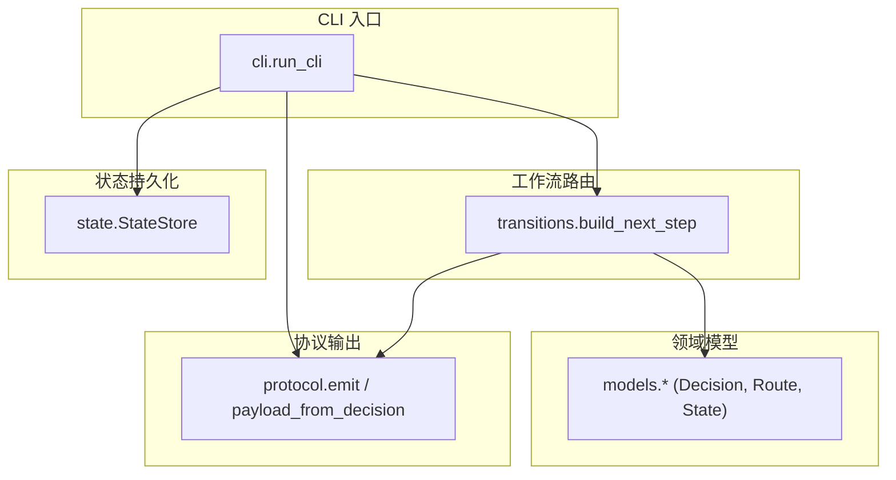
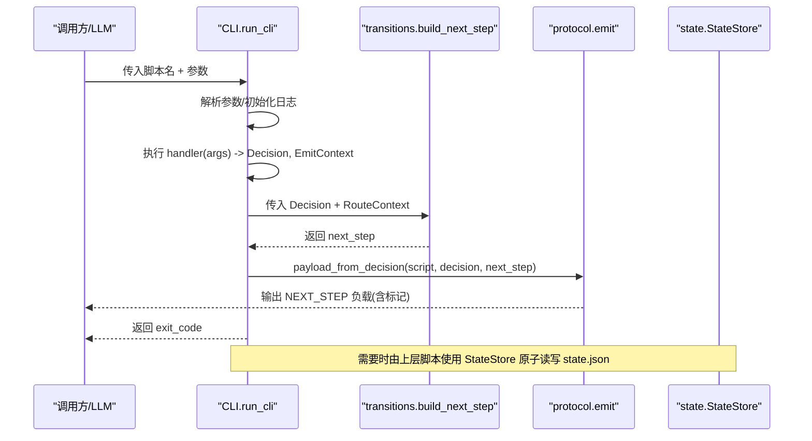
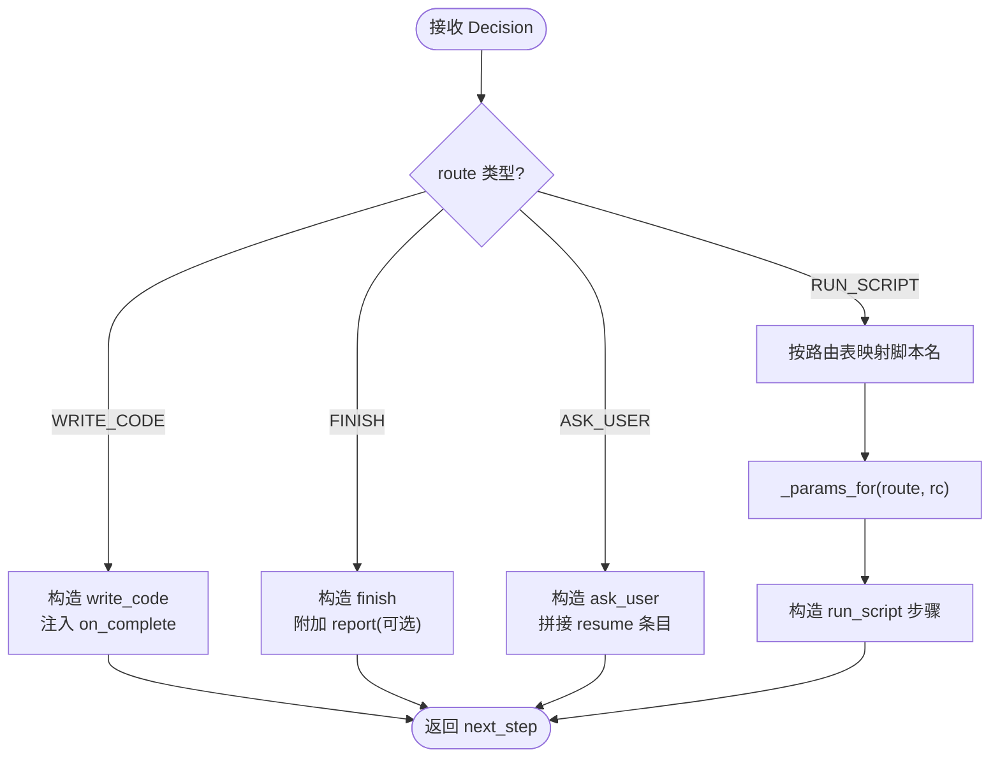
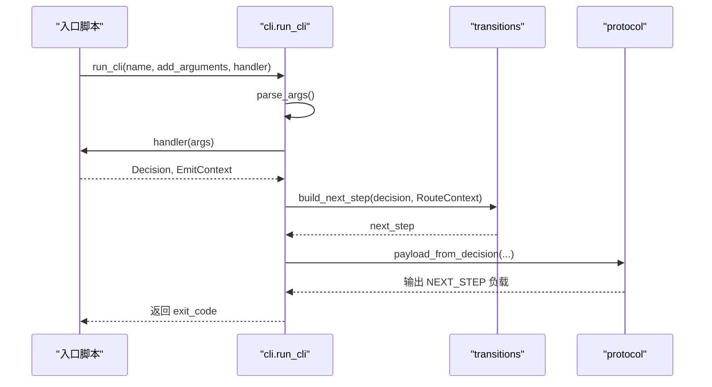
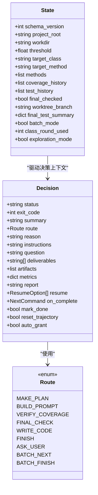
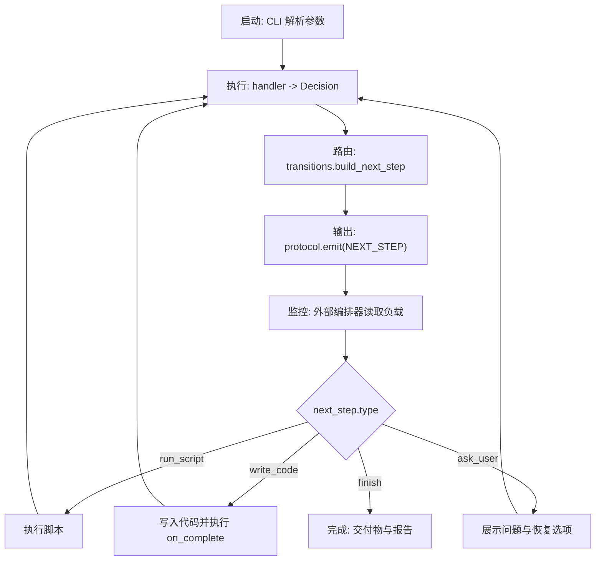
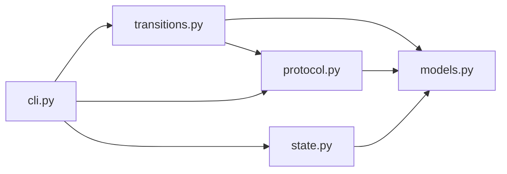

# 工作流引擎

<cite>
**本文引用的文件**
- [java-unit-test-generator/scripts/jaut/transitions.py](file://java-unit-test-generator/scripts/jaut/transitions.py)
- [batch-unit-test-generator/scripts/jaut/transitions.py](file://batch-unit-test-generator/scripts/jaut/transitions.py)
- [java-unit-test-generator/scripts/jaut/cli.py](file://java-unit-test-generator/scripts/jaut/cli.py)
- [batch-unit-test-generator/scripts/jaut/cli.py](file://batch-unit-test-generator/scripts/jaut/cli.py)
- [java-unit-test-generator/scripts/jaut/models.py](file://java-unit-test-generator/scripts/jaut/models.py)
- [batch-unit-test-generator/scripts/jaut/models.py](file://batch-unit-test-generator/scripts/jaut/models.py)
- [java-unit-test-generator/scripts/jaut/protocol.py](file://java-unit-test-generator/scripts/jaut/protocol.py)
- [batch-unit-test-generator/scripts/jaut/protocol.py](file://batch-unit-test-generator/scripts/jaut/protocol.py)
- [java-unit-test-generator/scripts/jaut/state.py](file://java-unit-test-generator/scripts/jaut/state.py)
- [batch-unit-test-generator/scripts/jaut/state.py](file://batch-unit-test-generator/scripts/jaut/state.py)
- [README.md](file://README.md)
- [AGENTS.md](file://AGENTS.md)
- [CLAUDE.md](file://CLAUDE.md)
</cite>

## 目录
1. [简介](#简介)
2. [项目结构](#项目结构)
3. [核心组件](#核心组件)
4. [架构总览](#架构总览)
5. [详细组件分析](#详细组件分析)
6. [依赖关系分析](#依赖关系分析)
7. [性能考虑](#性能考虑)
8. [故障排查指南](#故障排查指南)
9. [结论](#结论)
10. [附录](#附录)

## 简介
本工作流引擎围绕“NEXT_STEP 协议”构建，将脚本执行、状态管理、决策路由与协议输出解耦。其目标是：
- 以声明式方式编排任务（计划、提示构建、覆盖率验证、收尾检查等），并通过统一的路由机制生成下一步动作；
- 在 CLI 层提供一致的参数解析、日志初始化、异常到协议的转换与退出码约定；
- 通过类型化的模型与原子状态存储实现可恢复、可审计的工作流生命周期；
- 支持单类与批量两类场景，并在批量模式下扩展了批处理路由与预算控制。

该文档面向初学者与高级用户，既提供循序渐进的说明，也包含代码级架构图与关键流程时序图。

## 项目结构
仓库包含多个独立技能，其中两个单元测试生成技能共享同一套 jaut 引擎（已分叉演进）。本次文档聚焦于工作流引擎的核心模块：CLI、Transitions、Models、Protocol、State。

图表来源
- [java-unit-test-generator/scripts/jaut/cli.py:95-128](file://java-unit-test-generator/scripts/jaut/cli.py#L95-L128)
- [java-unit-test-generator/scripts/jaut/transitions.py:39-66](file://java-unit-test-generator/scripts/jaut/transitions.py#L39-L66)
- [java-unit-test-generator/scripts/jaut/protocol.py:46-56](file://java-unit-test-generator/scripts/jaut/protocol.py#L46-L56)
- [java-unit-test-generator/scripts/jaut/state.py:77-165](file://java-unit-test-generator/scripts/jaut/state.py#L77-L165)

章节来源
- [AGENTS.md:1-50](file://AGENTS.md#L1-L50)
- [CLAUDE.md:36-55](file://CLAUDE.md#L36-L55)

## 核心组件
- CLI 脚手架：统一参数解析、日志初始化、异常捕获与协议输出，返回进程退出码。
- 工作流路由：将 Decision.route 解析为 next_step 对象，集中处理 run_script 的目标脚本与参数注入。
- 领域模型：类型化的 Decision、Route、State、覆盖率与测试结果等数据载体。
- 协议层：构建并输出 NEXT_STEP 负载，进行轻量自检与错误兜底。
- 状态存储：原子读写 state.json，提供跨进程锁、schema 迁移与默认 workdir 解析。

章节来源
- [java-unit-test-generator/scripts/jaut/cli.py:1-129](file://java-unit-test-generator/scripts/jaut/cli.py#L1-L129)
- [java-unit-test-generator/scripts/jaut/transitions.py:1-126](file://java-unit-test-generator/scripts/jaut/transitions.py#L1-L126)
- [java-unit-test-generator/scripts/jaut/models.py:1-499](file://java-unit-test-generator/scripts/jaut/models.py#L1-L499)
- [java-unit-test-generator/scripts/jaut/protocol.py:1-105](file://java-unit-test-generator/scripts/jaut/protocol.py#L1-L105)
- [java-unit-test-generator/scripts/jaut/state.py:1-165](file://java-unit-test-generator/scripts/jaut/state.py#L1-L165)

## 架构总览
工作流从 CLI 启动，进入 handler 产生 Decision；随后 transitions 根据 route 生成 next_step；最后 protocol 将 Decision 与 next_step 组装为负载并输出。状态在需要时通过 StateStore 原子读写。

图表来源
- [java-unit-test-generator/scripts/jaut/cli.py:95-128](file://java-unit-test-generator/scripts/jaut/cli.py#L95-L128)
- [java-unit-test-generator/scripts/jaut/transitions.py:39-66](file://java-unit-test-generator/scripts/jaut/transitions.py#L39-L66)
- [java-unit-test-generator/scripts/jaut/protocol.py:46-56](file://java-unit-test-generator/scripts/jaut/protocol.py#L46-L56)
- [java-unit-test-generator/scripts/jaut/state.py:77-165](file://java-unit-test-generator/scripts/jaut/state.py#L77-L165)

## 详细组件分析

### 工作流路由与状态转换（transitions）
- 职责：将 Decision.route 转换为具体的 next_step，包括：
  - write_code：携带 instructions，并在 on_complete 中注入默认 validate_rules 命令；
  - finish：携带 deliverables 与可选 report；
  - ask_user：携带 question 与 resume 选项（补全脚本绝对路径与 --workdir）；
  - run_script：根据路由表映射到 scripts/ 下的具体脚本，并注入参数（如 --workdir、FINAL_CHECK 所需的 project-root/class/jacoco-version）。
- 关键设计：
  - 路由表集中维护，避免各入口脚本硬编码路径；
  - _params_for 对 workdir 做防御性校验，防止无效参数；
  - batch 版本额外包含 BATCH_NEXT/BATCH_FINISH 路由。

图表来源
- [java-unit-test-generator/scripts/jaut/transitions.py:39-66](file://java-unit-test-generator/scripts/jaut/transitions.py#L39-L66)
- [batch-unit-test-generator/scripts/jaut/transitions.py:41-68](file://batch-unit-test-generator/scripts/jaut/transitions.py#L41-L68)
- [java-unit-test-generator/scripts/jaut/transitions.py:107-126](file://java-unit-test-generator/scripts/jaut/transitions.py#L107-L126)

章节来源
- [java-unit-test-generator/scripts/jaut/transitions.py:1-126](file://java-unit-test-generator/scripts/jaut/transitions.py#L1-L126)
- [batch-unit-test-generator/scripts/jaut/transitions.py:1-128](file://batch-unit-test-generator/scripts/jaut/transitions.py#L1-L128)

### CLI 接口设计与执行流程
- 统一入口 run_cli：
  - 构建 argparse 并解析参数；
  - 尝试执行 handler，捕获 StepError 或通用 Exception，统一转为 Decision；
  - 初始化日志（失败不影响协议输出）；
  - 调用 transitions 生成 next_step；
  - 通过 protocol 输出负载并返回 exit_code。
- 参数解析：
  - 提供 add_common_args 添加 --workdir/--project-root；
  - resolve_workdir 与 require_workdir 用于定位工作目录。
- 错误分类：
  - StepError：可预期错误（状态缺失/参数缺失/环境缺失/操作失败），携带完整 Decision；
  - Exception：内部错误，统一转 failed + ask_user(exit 2)。

图表来源
- [java-unit-test-generator/scripts/jaut/cli.py:95-128](file://java-unit-test-generator/scripts/jaut/cli.py#L95-L128)
- [batch-unit-test-generator/scripts/jaut/cli.py:95-128](file://batch-unit-test-generator/scripts/jaut/cli.py#L95-L128)

章节来源
- [java-unit-test-generator/scripts/jaut/cli.py:1-129](file://java-unit-test-generator/scripts/jaut/cli.py#L1-L129)
- [batch-unit-test-generator/scripts/jaut/cli.py:1-129](file://batch-unit-test-generator/scripts/jaut/cli.py#L1-L129)

### 领域模型与状态管理（models + state）
- models：
  - Route：定义逻辑路由（make_plan/build_prompt/verify_coverage/final_check/write_code/finish/ask_user，批量模式新增 batch_next/batch_finish）；
  - Decision：决策产物，包含 status、exit_code、summary、route、reason、instructions/question/deliverables/artifacts/metrics/report/resume/on_complete/mark_done/reset_trajectory/auto_grant 等；
  - State：持久化状态，包含阈值、目标类/方法、覆盖率历史、测试历史、final_checked、工作树分支、批量模式字段等，并提供 to_dict/from_dict 兼容旧 schema。
- state：
  - StateStore：原子写入（临时文件+fsync+os.replace）、跨进程锁（POSIX fcntl/Windows msvcrt）、schema 迁移管道、默认 workdir 解析。

图表来源
- [java-unit-test-generator/scripts/jaut/models.py:43-71](file://java-unit-test-generator/scripts/jaut/models.py#L43-L71)
- [java-unit-test-generator/scripts/jaut/models.py:310-349](file://java-unit-test-generator/scripts/jaut/models.py#L310-L349)
- [java-unit-test-generator/scripts/jaut/models.py:347-499](file://java-unit-test-generator/scripts/jaut/models.py#L347-L499)
- [batch-unit-test-generator/scripts/jaut/models.py:43-75](file://batch-unit-test-generator/scripts/jaut/models.py#L43-L75)
- [batch-unit-test-generator/scripts/jaut/models.py:313-347](file://batch-unit-test-generator/scripts/jaut/models.py#L313-L347)
- [batch-unit-test-generator/scripts/jaut/models.py:353-517](file://batch-unit-test-generator/scripts/jaut/models.py#L353-L517)

章节来源
- [java-unit-test-generator/scripts/jaut/models.py:1-499](file://java-unit-test-generator/scripts/jaut/models.py#L1-L499)
- [batch-unit-test-generator/scripts/jaut/models.py:1-693](file://batch-unit-test-generator/scripts/jaut/models.py#L1-L693)
- [java-unit-test-generator/scripts/jaut/state.py:1-165](file://java-unit-test-generator/scripts/jaut/state.py#L1-L165)
- [batch-unit-test-generator/scripts/jaut/state.py:1-165](file://batch-unit-test-generator/scripts/jaut/state.py#L1-L165)

### 协议层（protocol）
- 职责：
  - make_next_step：构造 next_step 对象；
  - build_payload/payload_from_decision：统一字段顺序与缺省值；
  - self_check：轻量结构自检（必填键、枚举取值），仅告警不阻断；
  - emit：输出带标记的 JSON 负载，序列化失败时输出错误协议块以避免调用方无限等待。
- 关键点：
  - 严格遵循 NEXT_STEP 协议；
  - 失败兜底保证可观测性与可恢复性。

章节来源
- [java-unit-test-generator/scripts/jaut/protocol.py:1-105](file://java-unit-test-generator/scripts/jaut/protocol.py#L1-L105)
- [batch-unit-test-generator/scripts/jaut/protocol.py:1-105](file://batch-unit-test-generator/scripts/jaut/protocol.py#L1-L105)

### 工作流生命周期管理
- 启动：CLI 解析参数、初始化日志、准备 EmitContext；
- 执行：handler 产生 Decision，transitions 生成 next_step；
- 监控：协议负载包含 status、exit_code、summary、artifacts、metrics，便于外部编排器观察；
- 终止：finish 路由携带 deliverables 与 report；ask_user 提供 resume 选项；异常统一转为 failed + ask_user。

[此图为概念流程图，无需源码对应]

### 复杂任务编排示例（单类与批量）
- 单类典型循环：select_worktree → init_coverage → make_plan → build_prompt → LLM write_code → validate_rules → verify_coverage；
- 批量模式：在单类循环基础上，外层通过 batch_diff → batch_init → batch_next → batch_update → batch_finish 编排多类任务，并在 batch 路由中注入 batch_next/batch_finish。

章节来源
- [CLAUDE.md:36-55](file://CLAUDE.md#L36-L55)
- [batch-unit-test-generator/scripts/jaut/transitions.py:21-29](file://batch-unit-test-generator/scripts/jaut/transitions.py#L21-L29)

## 依赖关系分析
- CLI 依赖：config、protocol、transitions、logutil、models、state；
- Transitions 依赖：models（Decision/Route/State）、protocol（make_next_step）；
- Protocol 依赖：config、logutil、models；
- State 依赖：config、logutil、models。

图表来源
- [java-unit-test-generator/scripts/jaut/cli.py:12-22](file://java-unit-test-generator/scripts/jaut/cli.py#L12-L22)
- [java-unit-test-generator/scripts/jaut/transitions.py:9-16](file://java-unit-test-generator/scripts/jaut/transitions.py#L9-L16)
- [java-unit-test-generator/scripts/jaut/protocol.py:8-15](file://java-unit-test-generator/scripts/jaut/protocol.py#L8-L15)
- [java-unit-test-generator/scripts/jaut/state.py:7-18](file://java-unit-test-generator/scripts/jaut/state.py#L7-L18)

章节来源
- [java-unit-test-generator/scripts/jaut/cli.py:1-129](file://java-unit-test-generator/scripts/jaut/cli.py#L1-L129)
- [java-unit-test-generator/scripts/jaut/transitions.py:1-126](file://java-unit-test-generator/scripts/jaut/transitions.py#L1-L126)
- [java-unit-test-generator/scripts/jaut/protocol.py:1-105](file://java-unit-test-generator/scripts/jaut/protocol.py#L1-L105)
- [java-unit-test-generator/scripts/jaut/state.py:1-165](file://java-unit-test-generator/scripts/jaut/state.py#L1-L165)

## 性能考虑
- 并行执行：
  - 当前 CLI 与 transitions 为串行编排；若需并行，可在上层编排器对独立的类/方法并发调度，但需注意 state.json 的原子写入与锁保护；
  - 批量模式可通过外层并发多个子代理/进程，每个子进程持有独立 workdir，避免竞争。
- 资源管理：
  - 使用 StateStore.locked 确保并发安全；
  - 避免在 handler 中进行重型 I/O，尽量将耗时任务下沉到脚本层并异步化；
  - 合理使用 metrics 与 artifacts 减少重复计算与传输开销。
- 优化建议：
  - 缓存 JaCoCo 配置探测结果（State.jacoco_config_cache）；
  - 复用 Maven/Surefire/JaCoCo 进程（在脚本层实现连接池或复用）；
  - 限制日志级别与输出量，避免阻塞 stdout 与磁盘 I/O。

[本节为通用指导，不直接分析具体文件]

## 故障排查指南
- 常见错误与处理：
  - 缺少 --workdir 或 --project-root：CLI 抛出 StepError.state_error，exit_code=EXIT_STATE；
  - 脚本执行错误：StepError.exec_error，exit_code=EXIT_ERROR；
  - 内部异常：统一转为 failed + ask_user，exit_code=EXIT_ERROR；
  - 协议序列化失败：protocol.emit 输出错误协议块，避免调用方无限等待。
- 状态文件问题：
  - state.json 缺失或损坏：StateStore.load 返回 None，由调用方按状态错误流转；
  - 残留锁文件：StateStore.locked 检测超过 24 小时的锁并告警，必要时手动清理。
- 调试建议：
  - 查看 NEXT_STEP 负载中的 summary、artifacts、metrics；
  - 检查日志输出（setup_logger 失败不影响协议输出）；
  - 确认路由参数（_params_for）是否正确注入 --workdir 与 FINAL_CHECK 所需字段。

章节来源
- [java-unit-test-generator/scripts/jaut/cli.py:25-46](file://java-unit-test-generator/scripts/jaut/cli.py#L25-L46)
- [java-unit-test-generator/scripts/jaut/cli.py:89-128](file://java-unit-test-generator/scripts/jaut/cli.py#L89-L128)
- [java-unit-test-generator/scripts/jaut/protocol.py:59-105](file://java-unit-test-generator/scripts/jaut/protocol.py#L59-L105)
- [java-unit-test-generator/scripts/jaut/state.py:93-145](file://java-unit-test-generator/scripts/jaut/state.py#L93-L145)

## 结论
本工作流引擎通过 CLI、Transitions、Models、Protocol、State 的清晰分层，实现了可恢复、可观测、可扩展的任务编排。Transitions 集中管理路由与参数注入，CLI 统一异常与退出码，Protocol 保障协议一致性，State 提供原子持久化与迁移能力。对于初学者，可从单类工作流入手；对于高级用户，可基于批量模式与上层编排器实现大规模并行与资源优化。

## 附录
- 参考文档：
  - README：仓库概览；
  - AGENTS：技能组织、命令与架构要点；
  - CLAUDE：NEXT_STEP 协议、jaut 引擎说明与运行流程。

章节来源
- [README.md:1-1](file://README.md#L1-L1)
- [AGENTS.md:1-50](file://AGENTS.md#L1-L50)
- [CLAUDE.md:36-55](file://CLAUDE.md#L36-L55)