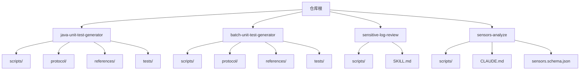
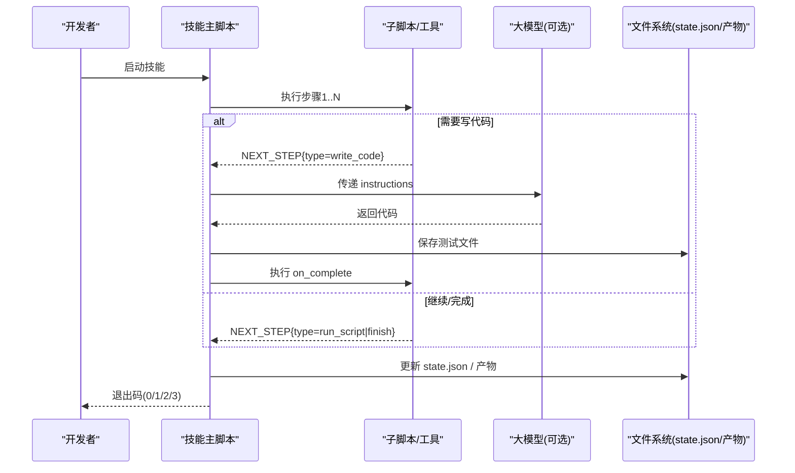
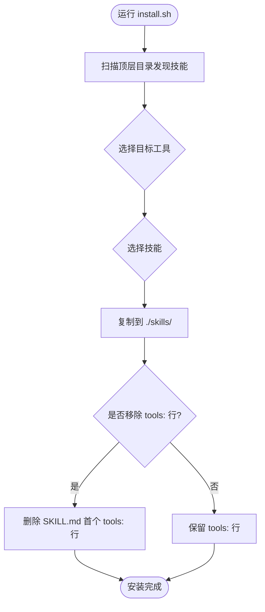
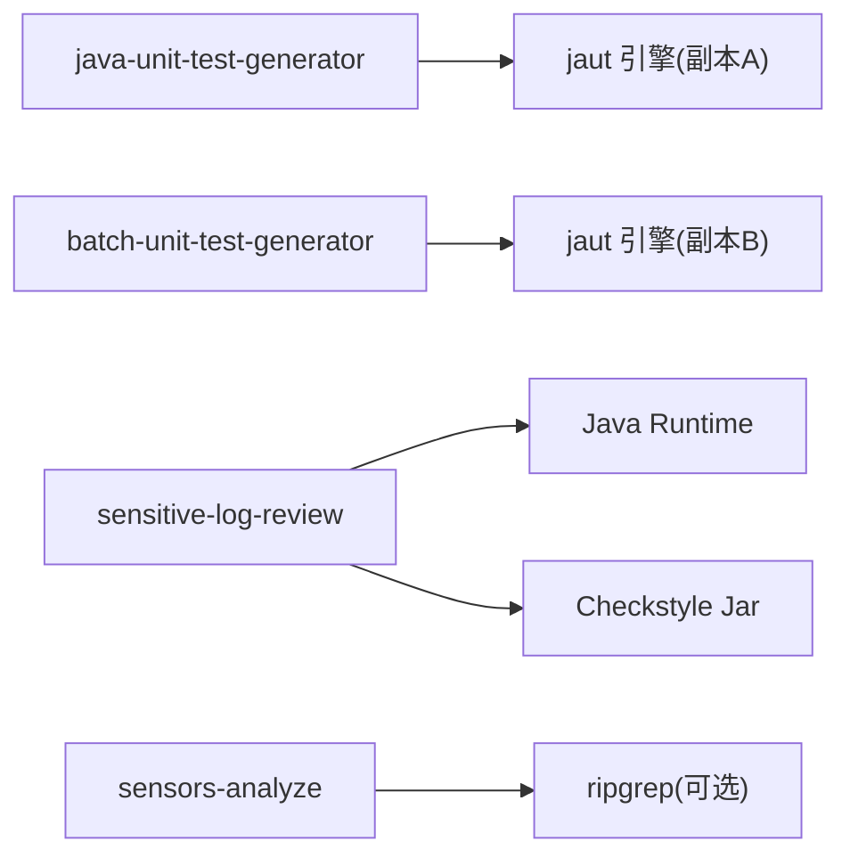

# 技能开发规范

<cite>
**本文引用的文件**
- [README.md](file://README.md)
- [CLAUDE.md](file://CLAUDE.md)
- [AGENTS.md](file://AGENTS.md)
- [install.sh](file://install.sh)
- [sensitive-log-review/SKILL.md](file://sensitive-log-review/SKILL.md)
- [sensitive-log-review/scripts/main.py](file://sensitive-log-review/scripts/main.py)
- [java-unit-test-generator/protocol/next-step.schema.json](file://java-unit-test-generator/protocol/next-step.schema.json)
- [java-unit-test-generator/scripts/select_worktree.py](file://java-unit-test-generator/scripts/select_worktree.py)
- [sensors-analyze/CLAUDE.md](file://sensors-analyze/CLAUDE.md)
- [sensors-analyze/sensors.schema.json](file://sensors-analyze/sensors.schema.json)
- [sensors-analyze/trigger-eval.json](file://sensors-analyze/trigger-eval.json)
</cite>

## 目录
1. [简介](#简介)
2. [项目结构](#项目结构)
3. [核心组件](#核心组件)
4. [架构总览](#架构总览)
5. [详细组件分析](#详细组件分析)
6. [依赖关系分析](#依赖关系分析)
7. [性能考虑](#性能考虑)
8. [故障排查指南](#故障排查指南)
9. [结论](#结论)
10. [附录](#附录)

## 简介
本规范面向“技能”（Skill）开发者，定义统一的 SKILL.md 文件格式、触发条件、执行流程与依赖声明；规定技能的目录结构与文件组织、脚本命名约定与配置文件位置；说明技能的注册与发现机制、安装流程与加载顺序；提供完整的开发模板与最佳实践（错误处理、日志记录、性能优化）；解释技能间通信与数据共享方式；给出从 0 到 1 的完整示例；并提供测试与调试方法（单元与集成）。内容兼顾初学者友好与高级用户的技术深度。

## 项目结构
仓库由多个相互独立的“技能”组成，每个顶级目录即一个自包含的技能：
- java-unit-test-generator：单类 JUnit5+Mockito 测试生成，直至 JaCoCo 行覆盖率达标
- batch-unit-test-generator：基于分支 diff 批量生成测试，委托子智能体
- sensitive-log-review：Java 变更敏感信息泄露审查，输出 HTML 报告与 CI 门禁码
- sensors-analyze：埋点盘点与校验，产出 sensors.csv 并支持版本归档

通用约定：
- 每个技能根目录含 SKILL.md（触发与工作流）、references/（规则/参考）、protocol/（协议 Schema）、scripts/（Python 驱动）、tests/（pytest 套件）
- 通过 install.sh 将技能复制到目标项目的 .<tool>/skills/<skill> 目录，并按工具类型裁剪 SKILL.md 中的 tools: 行
- 脚本使用 Python 标准库，测试依赖 pytest；每个 tests/conftest.py 将 scripts/ 加入 sys.path

**图示来源**
- [CLAUDE.md:5-14](file://CLAUDE.md#L5-L14)
- [AGENTS.md:5-14](file://AGENTS.md#L5-L14)

**章节来源**
- [CLAUDE.md:5-14](file://CLAUDE.md#L5-L14)
- [AGENTS.md:5-14](file://AGENTS.md#L5-L14)

## 核心组件
- 技能描述与触发：SKILL.md frontmatter 携带 name/description；部分技能通过 trigger-eval.json 或 CLAUDE.md 明确触发语义
- 协议与状态：NEXT_STEP 协议（JSON Schema）统一脚本间协作；state.json 持久化工作目录状态
- 编排与流水线：主脚本负责步骤编排、并行执行、产物汇总与报告生成
- 安装与发现：install.sh 扫描顶层目录、选择工具与技能、复制并裁剪元数据
- 测试与验证：pytest 套件覆盖 CLI、协议、状态机与关键路径

**章节来源**
- [CLAUDE.md:36-64](file://CLAUDE.md#L36-L64)
- [AGENTS.md:16-39](file://AGENTS.md#L16-L39)

## 架构总览
技能以“脚本驱动 + LLM 协作”的方式运行：
- 单元测试生成技能：select_worktree → init_coverage → make_plan → build_prompt → LLM write_code → validate_rules → verify_coverage（批处理版在外层循环）
- 敏感日志审查：多阶段流水线（日志扫描、@ToString、字段提取、敏感词、POJO 注释、深度分析、报告生成），可并行
- 埋点分析：LLM 产出 sensors.json → 脚本提取入口 → 定位调用点 → LLM 追踪取值 → 校验与归档

**图示来源**
- [java-unit-test-generator/protocol/next-step.schema.json:1-195](file://java-unit-test-generator/protocol/next-step.schema.json#L1-L195)
- [CLAUDE.md:38-48](file://CLAUDE.md#L38-L48)

## 详细组件分析

### SKILL.md 文件格式与语义
- frontmatter 字段：name、description（触发文本）
- 正文：快速开始、退出码契约、输出目录策略、审查/执行流程、依赖、词典/规则维护、输出格式、HTML 报告、开发与测试、注意事项
- 与脚本行为保持一致：命令参数、退出码、产物文件名需与文档同步

**章节来源**
- [sensitive-log-review/SKILL.md:1-288](file://sensitive-log-review/SKILL.md#L1-L288)

### 触发条件定义
- 显式触发：SKILL.md description 作为触发文案
- 用例驱动：sensors-analyze 通过 trigger-eval.json 定义应触发/不应触发的查询样例
- 约束说明：CLAUDE.md 中明确该技能仅用于审计/盘点现有埋点实现，不用于从零开发 SDK 等场景

**章节来源**
- [sensitive-log-review/SKILL.md:1-4](file://sensitive-log-review/SKILL.md#L1-L4)
- [sensors-analyze/trigger-eval.json:1-90](file://sensors-analyze/trigger-eval.json#L1-L90)
- [sensors-analyze/CLAUDE.md:5-13](file://sensors-analyze/CLAUDE.md#L5-L13)

### 执行流程配置
- 单元测试生成：遵循 NEXT_STEP 协议，脚本在 stdout 末尾输出被标记包裹的 JSON 块；exit code 约定 0/1/2/3；状态保存在 workdir/state.json
- 敏感日志审查：主脚本编排 8 个步骤，支持并行链路，最终生成 HTML 报告；CI 门禁基于退出码与 --fail-on 类别
- 埋点分析：五步确定性流水线，LLM 与脚本各司其职；脚本只输出 next_step 指令行与日志

**章节来源**
- [CLAUDE.md:38-59](file://CLAUDE.md#L38-L59)
- [sensitive-log-review/SKILL.md:31-57](file://sensitive-log-review/SKILL.md#L31-L57)
- [sensors-analyze/CLAUDE.md:11-49](file://sensors-analyze/CLAUDE.md#L11-L49)

### 依赖声明
- 外部依赖：Python、Git、Java Runtime（敏感日志审查）、Checkstyle jar（完整性校验）
- 内部依赖：common/ 公共模块、rules/ 规则与词典、protocol/ 协议 Schema
- 测试依赖：pytest（仅开发时）

**章节来源**
- [sensitive-log-review/SKILL.md:158-196](file://sensitive-log-review/SKILL.md#L158-L196)
- [CLAUDE.md:32-34](file://CLAUDE.md#L32-L34)

### 技能的目录结构与文件组织规范
- 根目录：SKILL.md（或 CLAUDE.md）、协议与规则
- scripts/：Python 驱动与工具，按职责拆分；公共逻辑放入 common/
- references/：人类可读的规则与参考
- protocol/：JSON Schema（如 next-step.schema.json）
- tests/：pytest 套件，conftest.py 注入 scripts 到 sys.path

**章节来源**
- [AGENTS.md:5-14](file://AGENTS.md#L5-L14)
- [sensitive-log-review/SKILL.md:167-196](file://sensitive-log-review/SKILL.md#L167-L196)

### 脚本命名约定与配置文件位置
- 脚本：snake_case 命名，单一职责；主入口 main.py 或 select_worktree.py 等
- 配置：rules/*.json、dictionary/*、pojo.config 等集中管理
- 产物：统一写入输出目录，文件名常量集中在 paths.py

**章节来源**
- [AGENTS.md:30-35](file://AGENTS.md#L30-L35)
- [sensitive-log-review/SKILL.md:58-69](file://sensitive-log-review/SKILL.md#L58-L69)
- [sensitive-log-review/SKILL.md:221-244](file://sensitive-log-review/SKILL.md#L221-L244)

### 技能的注册与发现机制、安装流程与加载顺序
- 发现：install.sh 扫描脚本所在目录下所有非隐藏、非 agents 的顶级目录为候选技能
- 选择：命令行或交互式选择目标工具与技能
- 安装：复制到 <project>/.<tool>/skills/<skill>，删除 tests/__pycache__ 等非必要文件；对 claude/opencode 移除 SKILL.md 首行 tools:
- 加载顺序：由宿主工具按 skills 目录读取；同一工具下多个技能按目录名排序加载（由宿主决定）

**图示来源**
- [install.sh:14-27](file://install.sh#L14-L27)
- [install.sh:131-204](file://install.sh#L131-L204)
- [install.sh:210-289](file://install.sh#L210-L289)

**章节来源**
- [install.sh:14-27](file://install.sh#L14-L27)
- [install.sh:131-204](file://install.sh#L131-L204)
- [install.sh:210-289](file://install.sh#L210-L289)

### 技能间的通信机制与数据共享方式
- 单元测试生成技能：通过 NEXT_STEP 协议在脚本间传递下一步动作、产物与指标；state.json 跨步骤共享上下文
- 批处理技能：外层循环调度单个类的生成，复用 jaut 引擎
- 敏感日志审查：主脚本通过中间清单文件（list/result）在各步骤间共享数据
- 埋点分析：LLM 与脚本通过 sensors.json、entry.txt、call_sites.json、sensors.csv 交换数据

**章节来源**
- [CLAUDE.md:38-51](file://CLAUDE.md#L38-L51)
- [sensitive-log-review/SKILL.md:221-244](file://sensitive-log-review/SKILL.md#L221-L244)
- [sensors-analyze/CLAUDE.md:11-49](file://sensors-analyze/CLAUDE.md#L11-L49)

### 开发模板与最佳实践
- 模板建议
  - 根目录：SKILL.md（frontmatter + 流程/退出码/输出/依赖/测试）
  - scripts/：main.py（编排）、common/（共享）、rules/（规则）、dictionary/（词典）
  - protocol/：next-step.schema.json（如需协议）
  - tests/：conftest.py + test_*.py
- 错误处理：统一错误码与修复建议；CI 门禁基于退出码与类别
- 日志记录：结构化 SUMMARY 行便于统计；verbose 模式打印命令与输出
- 性能优化：并行链路、增量扫描（changed-only）、失败文件分片与汇总

**章节来源**
- [sensitive-log-review/SKILL.md:31-57](file://sensitive-log-review/SKILL.md#L31-L57)
- [sensitive-log-review/scripts/main.py:1-22](file://sensitive-log-review/scripts/main.py#L1-L22)
- [sensitive-log-review/SKILL.md:158-196](file://sensitive-log-review/SKILL.md#L158-L196)

### 具体开发示例：创建一个完整的技能模块
- 目标：新增一个“代码风格检查”技能
- 步骤
  1) 创建目录 structure：scripts/common/, rules/, tests/
  2) 编写 SKILL.md：frontmatter name/description；快速开始；退出码；输出目录；流程；依赖；测试
  3) 实现 scripts/main.py：解析参数、调用子脚本、汇总结果、生成报告
  4) 定义协议（可选）：protocol/next-step.schema.json
  5) 编写 tests/test_main.py：覆盖 CLI、协议、失败路径
  6) 本地安装：./install.sh all <your-skill> <target-project>
  7) 运行测试：cd your-skill && python3 -m pytest tests/

**章节来源**
- [AGENTS.md:16-39](file://AGENTS.md#L16-L39)
- [install.sh:210-289](file://install.sh#L210-L289)

### 测试与调试方法
- 单元测试：pytest，聚焦 CLI、协议、状态机、关键路径与退出码
- 集成测试：端到端模拟工作流（如 select_worktree → 覆盖率验证）
- 调试技巧：verbose 模式、查看中间清单与失败文件、使用 --doctor 环境诊断

**章节来源**
- [AGENTS.md:37-39](file://AGENTS.md#L37-L39)
- [sensitive-log-review/SKILL.md:265-272](file://sensitive-log-review/SKILL.md#L265-L272)

## 依赖关系分析
- 单元测试生成技能依赖 jaut 引擎（两套副本已分化），需同时比对与测试
- 敏感日志审查依赖 Java Runtime、Checkstyle jar、Git；规则与词典驱动判定
- 埋点分析依赖 Python stdlib，可选 ripgrep；严格只读目标代码库

**图示来源**
- [CLAUDE.md:49-51](file://CLAUDE.md#L49-L51)
- [sensitive-log-review/SKILL.md:158-196](file://sensitive-log-review/SKILL.md#L158-L196)
- [sensors-analyze/CLAUDE.md:49-51](file://sensors-analyze/CLAUDE.md#L49-L51)

**章节来源**
- [CLAUDE.md:49-51](file://CLAUDE.md#L49-L51)
- [sensitive-log-review/SKILL.md:158-196](file://sensitive-log-review/SKILL.md#L158-L196)
- [sensors-analyze/CLAUDE.md:49-51](file://sensors-analyze/CLAUDE.md#L49-L51)

## 性能考虑
- 并行执行：敏感日志审查采用多链路并行，缩短整体耗时
- 增量扫描：默认仅扫描变更文件，全量扫描仅在必要时启用
- 失败隔离：失败文件分片记录，避免阻塞整体流程
- 资源控制：Checkstyle jar 完整性校验，避免重复下载与损坏风险

[本节为通用指导，无需特定文件引用]

## 故障排查指南
- 退出码契约
  - 单元测试生成：0=完成，1=继续，2=脚本错误，3=状态/协议错误
  - 敏感日志审查：0=通过，1=门禁拦截，2=执行错误
- 常见问题
  - 缺少 CodeGraph 索引：select_worktree 会中断并提示初始化
  - 规则/词典损坏：主脚本以结构化错误提示并退出码 2
  - 并行冲突：使用 --run-id 隔离输出目录
- 诊断手段
  - verbose 模式查看命令与输出
  - --doctor 环境检查
  - 查看 failed-files.list 与中间清单

**章节来源**
- [CLAUDE.md:38-48](file://CLAUDE.md#L38-L48)
- [sensitive-log-review/SKILL.md:31-57](file://sensitive-log-review/SKILL.md#L31-L57)
- [java-unit-test-generator/scripts/select_worktree.py:156-184](file://java-unit-test-generator/scripts/select_worktree.py#L156-L184)

## 结论
本规范定义了技能的标准形态：以 SKILL.md 为契约、以脚本为执行体、以协议与状态为纽带、以测试为保障。通过统一的安装与发现机制，技能可在不同工具生态中复用。遵循本规范可实现高内聚、低耦合、可观测、可回归的技能体系，支撑持续交付与质量门禁。

[本节为总结性内容，无需特定文件引用]

## 附录

### NEXT_STEP 协议要点
- 必须字段：protocol_version、script、status、exit_code、summary、artifacts、next_step
- next_step.type：run_script / write_code / ask_user / finish
- exit_code：0=完成，1=继续，2=脚本错误，3=状态/协议错误
- write_code 后必须执行 on_complete 脚本

**章节来源**
- [java-unit-test-generator/protocol/next-step.schema.json:1-195](file://java-unit-test-generator/protocol/next-step.schema.json#L1-L195)

### 埋点分析 Schema 要点
- sensors.json 必须满足 sensors.schema.json
- 范式枚举、调用链、入口函数、SDK API 必须完整
- CSV 固定列顺序，禁止动态占位符

**章节来源**
- [sensors-analyze/sensors.schema.json:1-262](file://sensors-analyze/sensors.schema.json#L1-L262)
- [sensors-analyze/CLAUDE.md:53-69](file://sensors-analyze/CLAUDE.md#L53-L69)

### 安装与使用速查
- 安装：./install.sh <claude|qwen|qoder|opencode|all> [<skill>[,<skill>...]] [<project-dir>]
- 测试：cd <skill> && python3 -m pytest tests/
- 运行：python scripts/main.py --help（各技能入口均支持 --help）

**章节来源**
- [CLAUDE.md:16-34](file://CLAUDE.md#L16-L34)
- [AGENTS.md:16-28](file://AGENTS.md#L16-L28)