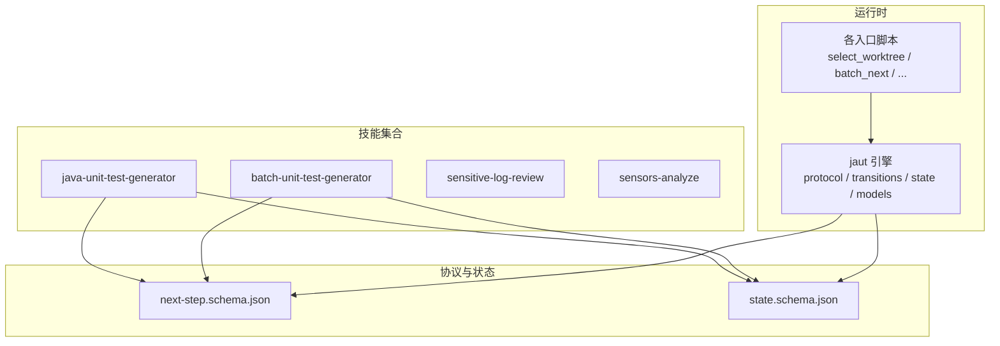
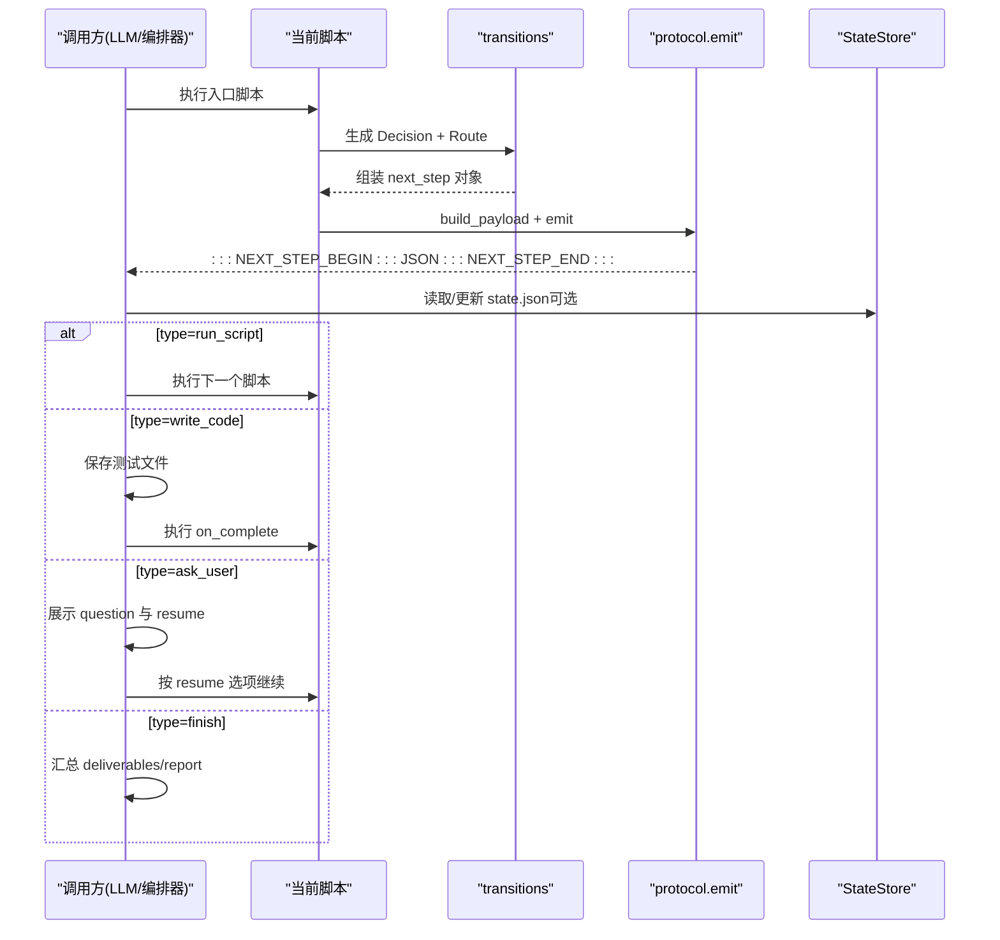
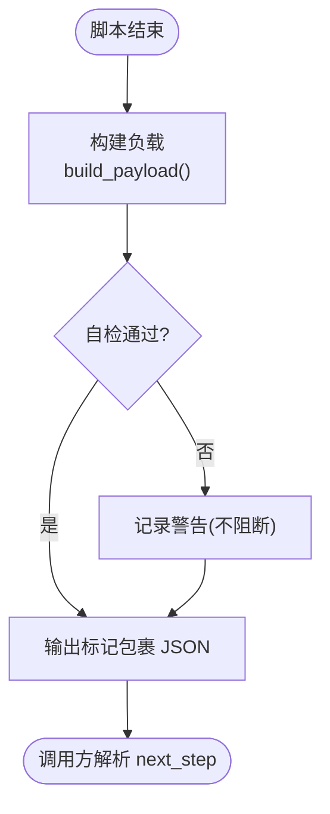
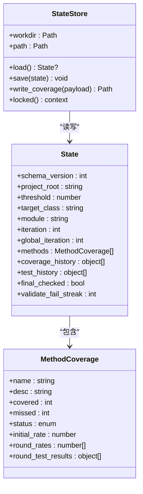
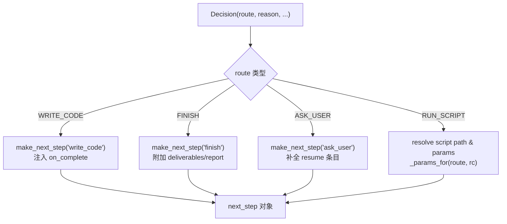
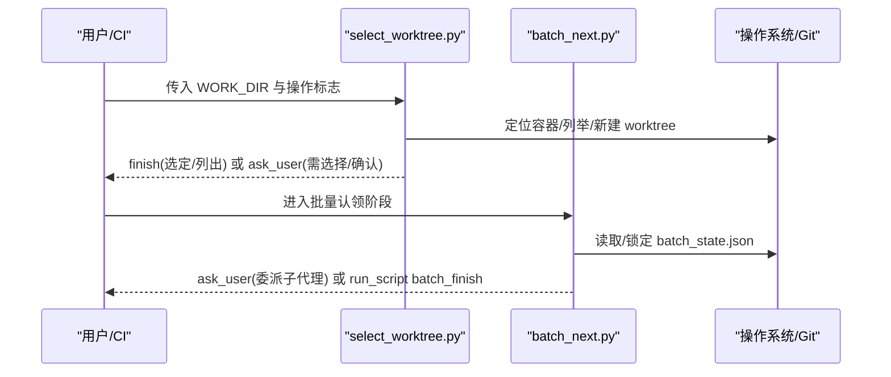
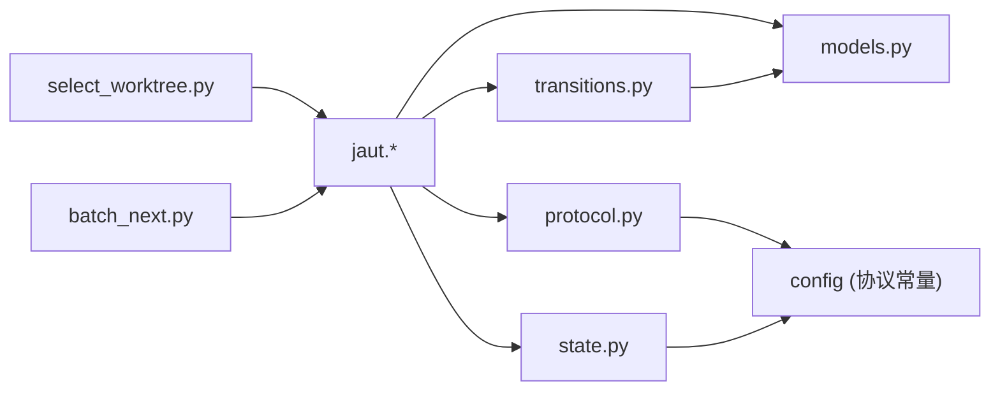

# 核心概念

<cite>
**本文引用的文件**
- [README.md](file://README.md)
- [AGENTS.md](file://AGENTS.md)
- [CLAUDE.md](file://CLAUDE.md)
- [SKILL.md](file://sensitive-log-review/SKILL.md)
- [next-step.schema.json（批量）](file://batch-unit-test-generator/protocol/next-step.schema.json)
- [next-step.schema.json（单类）](file://java-unit-test-generator/protocol/next-step.schema.json)
- [state.schema.json（批量）](file://batch-unit-test-generator/protocol/state.schema.json)
- [state.schema.json（单类）](file://java-unit-test-generator/protocol/state.schema.json)
- [protocol.py（jaut）](file://java-unit-test-generator/scripts/jaut/protocol.py)
- [transitions.py（jaut）](file://java-unit-test-generator/scripts/jaut/transitions.py)
- [state.py（jaut）](file://java-unit-test-generator/scripts/jaut/state.py)
- [models.py（jaut）](file://java-unit-test-generator/scripts/jaut/models.py)
- [select_worktree.py](file://java-unit-test-generator/scripts/select_worktree.py)
- [batch_next.py](file://batch-unit-test-generator/scripts/batch_next.py)
</cite>

## 目录
1. [简介](#简介)
2. [项目结构](#项目结构)
3. [核心组件](#核心组件)
4. [架构总览](#架构总览)
5. [详细组件分析](#详细组件分析)
6. [依赖关系分析](#依赖关系分析)
7. [性能考虑](#性能考虑)
8. [故障排查指南](#故障排查指南)
9. [结论](#结论)
10. [附录](#附录)

## 简介
本仓库包含多个“技能”（skills），每个技能独立安装到其他项目中，通过脚本与 LLM 协作完成特定任务。其中单元测试生成类技能（java-unit-test-generator、batch-unit-test-generator）采用 NEXT_STEP 协议驱动工作流，使用状态机模式管理迭代过程，并通过 state.json 持久化断点续跑信息；敏感日志审查技能（sensitive-log-review）则提供一套可插拔的扫描流水线与 CI 门禁契约。

NEXT_STEP 协议是脚本与调用方（LLM/编排器）之间的唯一契约：每个脚本在 stdout 末尾输出一个被标记包裹的 JSON 块，声明下一步动作类型（运行脚本、写代码、询问用户、结束）、原因、产物与指标等。状态机以 schema 约束的状态文档为中心，记录覆盖率轨迹、预算计数、方法级进度等，支持向后兼容的迁移机制。

## 项目结构
- 每个顶级目录是一个自包含的技能，包含 SKILL.md（触发与工作流说明）、references/（规则与参考）、protocol/（JSON Schema 约束）、scripts/（Python 驱动脚本）、tests/（pytest 套件）。
- 单元测试生成类技能共享 jaut 引擎（已复制并存在差异），负责 CLI、状态机、Maven/Surefire/JaCoCo 集成、工作树、协议与报告等。
- 敏感日志审查技能提供多阶段扫描流水线与 HTML 报告，遵循统一的退出码契约用于 CI 门禁。

图表来源
- [CLAUDE.md:36-51](file://CLAUDE.md#L36-L51)
- [AGENTS.md:41-45](file://AGENTS.md#L41-L45)

章节来源
- [CLAUDE.md:5-14](file://CLAUDE.md#L5-L14)
- [AGENTS.md:5-14](file://AGENTS.md#L5-L14)

## 核心组件
- NEXT_STEP 协议负载与 emit：统一构建负载、轻量自检、以标记包裹输出到 stdout，确保调用方可稳定解析。
- 路由与转换（transitions）：将决策（Decision）转换为具体的 next_step 对象，集中解析 run_script 的目标脚本与参数，补全 on_complete 与 resume 命令。
- 状态存储（StateStore）：原子写入 state.json，加载时进行 schema 迁移与默认值填充，保证断点续跑与向后兼容。
- 模型（models）：定义 NextCommand、Decision、ResumeOption 等纯数据结构，解耦路径解析与 I/O。
- 入口脚本：如 select_worktree.py、batch_next.py 等，封装 CLI 与领域逻辑，产出 Decision 交由 transitions 与 protocol 处理。

章节来源
- [protocol.py:1-105](file://java-unit-test-generator/scripts/jaut/protocol.py#L1-L105)
- [transitions.py:1-126](file://java-unit-test-generator/scripts/jaut/transitions.py#L1-L126)
- [state.py:1-165](file://java-unit-test-generator/scripts/jaut/state.py#L1-L165)
- [models.py:297-316](file://java-unit-test-generator/scripts/jaut/models.py#L297-L316)
- [select_worktree.py:1-200](file://java-unit-test-generator/scripts/select_worktree.py#L1-L200)
- [batch_next.py:1-178](file://batch-unit-test-generator/scripts/batch_next.py#L1-L178)

## 架构总览
NEXT_STEP 协议驱动的工作流由脚本与 LLM 交替推进：脚本执行后输出协议块，调用方根据 next_step.type 决定下一步（继续运行脚本、让 LLM 写代码、向用户提问或直接结束）。状态机通过 state.json 记录进度与度量，支持中断恢复与预算控制。

图表来源
- [protocol.py:22-105](file://java-unit-test-generator/scripts/jaut/protocol.py#L22-L105)
- [transitions.py:39-126](file://java-unit-test-generator/scripts/jaut/transitions.py#L39-L126)
- [state.py:130-165](file://java-unit-test-generator/scripts/jaut/state.py#L130-L165)

## 详细组件分析

### NEXT_STEP 协议设计与实现
- 协议负载字段：protocol_version、script、status、exit_code、summary、artifacts、metrics、next_step。
- next_step.type 枚举：run_script、write_code、ask_user、finish；不同分支携带不同必填字段（script/params、instructions/on_complete、question/resume、deliverables/report）。
- 版本管理：协议版本常量来自配置，schema 中固定为字符串常量；emit 前做轻量自检（必填键与枚举），不阻断流程但告警。
- 输出约定：stdout 末尾仅输出一个被标记包裹的 JSON 块，避免干扰解析。

图表来源
- [protocol.py:28-105](file://java-unit-test-generator/scripts/jaut/protocol.py#L28-L105)
- [next-step.schema.json（单类）:1-195](file://java-unit-test-generator/protocol/next-step.schema.json#L1-L195)

章节来源
- [next-step.schema.json（单类）:1-195](file://java-unit-test-generator/protocol/next-step.schema.json#L1-L195)
- [next-step.schema.json（批量）:1-195](file://batch-unit-test-generator/protocol/next-step.schema.json#L1-L195)
- [protocol.py:1-105](file://java-unit-test-generator/scripts/jaut/protocol.py#L1-L105)

### 状态机模式与应用
- 状态文档：state.json 由 StateStore 原子写入，包含 schema_version、project_root、threshold、target_class/module、iteration/global_iteration、methods、coverage_history、test_history、final_checked、validate_fail_streak 等。
- 迁移机制：_migrate 顺序升级旧 schema_version，缺失键由 from_dict 填充默认值，保障向后兼容。
- 工作流位置：典型循环 select_worktree → init_coverage → make_plan → build_prompt → LLM write_code → validate_rules → verify_coverage；批量场景额外包含 batch_diff → batch_init → batch_next → batch_update → batch_finish。
- 权限边界：仅允许修改 src/test/java/**，禁止改动生产代码或 state.json 手工编辑。

图表来源
- [state.py:77-165](file://java-unit-test-generator/scripts/jaut/state.py#L77-L165)
- [state.schema.json（单类）:1-151](file://java-unit-test-generator/protocol/state.schema.json#L1-L151)

章节来源
- [state.py:1-165](file://java-unit-test-generator/scripts/jaut/state.py#L1-L165)
- [state.schema.json（单类）:1-151](file://java-unit-test-generator/protocol/state.schema.json#L1-L151)
- [state.schema.json（批量）:1-161](file://batch-unit-test-generator/protocol/state.schema.json#L1-L161)
- [CLAUDE.md:36-51](file://CLAUDE.md#L36-L51)
- [AGENTS.md:41-45](file://AGENTS.md#L41-L45)

### 路由与转换（transitions）
- 路由映射：Route.MAKE_PLAN/BUILD_PROMPT/VERIFY_COVERAGE/FINAL_CHECK 对应具体脚本名，集中解析绝对路径与参数，消除硬编码。
- 指令补全：write_code 的 on_complete 默认 validate_rules.py；resume 条目自动补全 scripts/ 绝对路径与 --workdir 前缀。
- 参数校验：对 run_script 路由强制要求有效 workdir，防止无效参数传递。

图表来源
- [transitions.py:19-126](file://java-unit-test-generator/scripts/jaut/transitions.py#L19-L126)

章节来源
- [transitions.py:1-126](file://java-unit-test-generator/scripts/jaut/transitions.py#L1-L126)

### 入口脚本示例：选择工作树与批量认领
- select_worktree.py：第一步确认/新建 git worktree，支持 --list/--choice/--new/--clear-history，输出 finish 或 ask_user（含 resume 命令）。
- batch_next.py：批量认领下一类，读 batch_state.json，标记 in_progress，输出委派指令（write_code/ask_user）或 run_script batch_finish.py。

图表来源
- [select_worktree.py:1-200](file://java-unit-test-generator/scripts/select_worktree.py#L1-L200)
- [batch_next.py:1-178](file://batch-unit-test-generator/scripts/batch_next.py#L1-L178)

章节来源
- [select_worktree.py:1-200](file://java-unit-test-generator/scripts/select_worktree.py#L1-L200)
- [batch_next.py:1-178](file://batch-unit-test-generator/scripts/batch_next.py#L1-L178)

### 技能开发规范（SKILL.md）
- 前端元数据：SKILL.md frontmatter 包含 name、description（触发文本），tools 字段用于 qoder/qwen，install.sh 会为目标平台剥离。
- 职责边界：SKILL.md 描述触发条件、工作流步骤、产物与退出码契约；与脚本行为保持一致，变更时需同步更新。
- 示例：敏感日志审查技能的 SKILL.md 定义了六阶段审查流程、输出格式、词典维护原则与 CI 门禁策略。

章节来源
- [CLAUDE.md:61-65](file://CLAUDE.md#L61-L65)
- [SKILL.md:1-288](file://sensitive-log-review/SKILL.md#L1-L288)

### 协议版本管理与向后兼容性
- 协议版本：协议负载中的 protocol_version 为常量，schema 中固定为字符串常量；emit 前自检不依赖第三方 jsonschema。
- 状态迁移：state.json 的 schema_version 用于顺序迁移，_migrate 从旧版本逐步升级到当前版本，缺失键 by from_dict 填充默认值，确保旧状态文件可用。
- 冲突权威：Schema > references/UnitTestRules.md > SKILL.md > LLM 判断。

章节来源
- [protocol.py:59-71](file://java-unit-test-generator/scripts/jaut/protocol.py#L59-L71)
- [state.py:46-74](file://java-unit-test-generator/scripts/jaut/state.py#L46-L74)
- [CLAUDE.md:36-51](file://CLAUDE.md#L36-L51)
- [AGENTS.md:41-45](file://AGENTS.md#L41-L45)

### 错误处理与调试最佳实践
- 协议序列化失败：emit 捕获异常并输出最小错误协议块，避免调用方无限等待。
- 状态文件损坏或缺失：StateStore.load 返回 None，由调用方按状态错误流转；锁文件检测残留并提示。
- 退出码契约：
  - NEXT_STEP：0=完成，1=继续，2=脚本错误，3=状态/协议错误。
  - 敏感日志审查：0=通过，1=门禁拦截，2=执行错误。
- 调试建议：查看 stdout 协议块与日志；检查 state.json 与 coverage.json；必要时 reset-claim 复位僵死状态。

章节来源
- [protocol.py:74-105](file://java-unit-test-generator/scripts/jaut/protocol.py#L74-L105)
- [state.py:93-129](file://java-unit-test-generator/scripts/jaut/state.py#L93-L129)
- [CLAUDE.md:36-51](file://CLAUDE.md#L36-L51)
- [SKILL.md:31-57](file://sensitive-log-review/SKILL.md#L31-L57)

## 依赖关系分析
- 脚本依赖 jaut 包（config、cli、logutil、models、state、protocol、transitions）。
- transitions 依赖 models 的 Decision/NextCommand/ResumeOption，以及 _ROUTE_SCRIPT 映射。
- protocol 依赖 config 的协议版本与枚举常量，logutil 用于日志。
- state 依赖 config 的文件名常量与 models.State.from_dict 进行迁移与默认值填充。

图表来源
- [select_worktree.py:40-53](file://java-unit-test-generator/scripts/select_worktree.py#L40-L53)
- [batch_next.py:34-42](file://batch-unit-test-generator/scripts/batch_next.py#L34-L42)
- [transitions.py:11-16](file://java-unit-test-generator/scripts/jaut/transitions.py#L11-L16)
- [protocol.py:10-15](file://java-unit-test-generator/scripts/jaut/protocol.py#L10-L15)
- [state.py:9-18](file://java-unit-test-generator/scripts/jaut/state.py#L9-L18)

章节来源
- [select_worktree.py:40-53](file://java-unit-test-generator/scripts/select_worktree.py#L40-L53)
- [batch_next.py:34-42](file://batch-unit-test-generator/scripts/batch_next.py#L34-L42)
- [transitions.py:11-16](file://java-unit-test-generator/scripts/jaut/transitions.py#L11-L16)
- [protocol.py:10-15](file://java-unit-test-generator/scripts/jaut/protocol.py#L10-L15)
- [state.py:9-18](file://java-unit-test-generator/scripts/jaut/state.py#L9-L18)

## 性能考虑
- 原子写入与锁：state.json 与 batch_state.json 使用临时文件 + os.replace 与文件锁，避免并发竞争与半截状态。
- 增量预算与轮次：state.json 记录 iteration/global_iteration、method_round_bonus/global_round_bonus、class_round_used，支撑无提升升级与连续失败升级判定，减少无效迭代。
- 产物隔离：worktree 隔离主工作区，避免污染与冲突；批量模式下 per-class 子目录进一步隔离。

[本节为通用指导，不直接分析具体文件]

## 故障排查指南
- 协议解析失败：检查 stdout 是否包含 :::NEXT_STEP_BEGIN:::/:::NEXT_STEP_END::: 包裹的 JSON；查看 protocol.emit 的警告日志。
- 状态文件问题：确认 state.json 是否存在且可读；如有残留 .lock 文件超过阈值，按提示清理；必要时重置 in_progress。
- 退出码含义：
  - NEXT_STEP：0=完成，1=继续，2=脚本错误，3=状态/协议错误。
  - 敏感日志审查：0=通过，1=门禁拦截，2=执行错误。
- 常见修复：
  - 调整覆盖率门槛或排除模式。
  - 重新选择/新建 worktree。
  - 复位批量认领状态（--reset-claim）。
  - 检查 rules/dictionary 配置与外部依赖（Java/Git/Checkstyle jar）。

章节来源
- [protocol.py:74-105](file://java-unit-test-generator/scripts/jaut/protocol.py#L74-L105)
- [state.py:93-129](file://java-unit-test-generator/scripts/jaut/state.py#L93-L129)
- [batch_next.py:71-81](file://batch-unit-test-generator/scripts/batch_next.py#L71-L81)
- [SKILL.md:31-57](file://sensitive-log-review/SKILL.md#L31-L57)

## 结论
NEXT_STEP 协议与状态机模式构成了 ping-skills 单元测试生成技能的核心骨架：协议提供稳定的通信契约，状态机提供可恢复、可度量的迭代控制，transitions 集中路由与参数补全，入口脚本封装领域逻辑。配合严格的退出码契约与 schema 约束，系统可在复杂工程环境中可靠地驱动 LLM 与脚本协作，达成覆盖率目标与质量门禁。

[本节为总结性内容，不直接分析具体文件]

## 附录
- 快速开始：
  - 单元测试生成：select_worktree → init_coverage → make_plan → build_prompt → LLM write_code → validate_rules → verify_coverage。
  - 批量模式：batch_diff → batch_init → batch_next → batch_update → batch_finish。
- 关键路径参考：
  - 协议负载构建与输出：[protocol.py:28-105](file://java-unit-test-generator/scripts/jaut/protocol.py#L28-L105)
  - 路由与指令补全：[transitions.py:39-126](file://java-unit-test-generator/scripts/jaut/transitions.py#L39-L126)
  - 状态迁移与原子写入：[state.py:46-165](file://java-unit-test-generator/scripts/jaut/state.py#L46-L165)
  - 入口脚本示例：[select_worktree.py:1-200](file://java-unit-test-generator/scripts/select_worktree.py#L1-L200)、[batch_next.py:1-178](file://batch-unit-test-generator/scripts/batch_next.py#L1-L178)

[本节为补充信息，不直接分析具体文件]