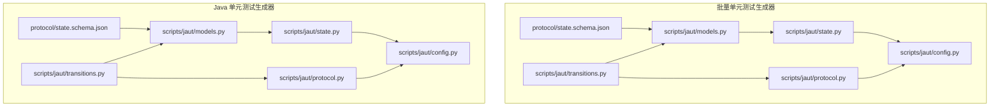
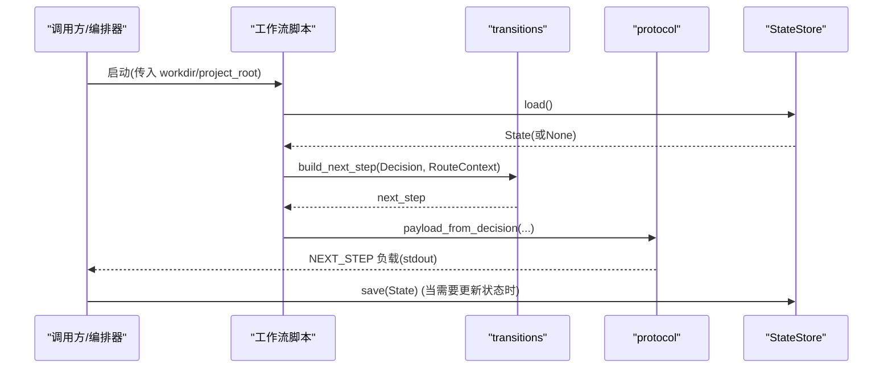
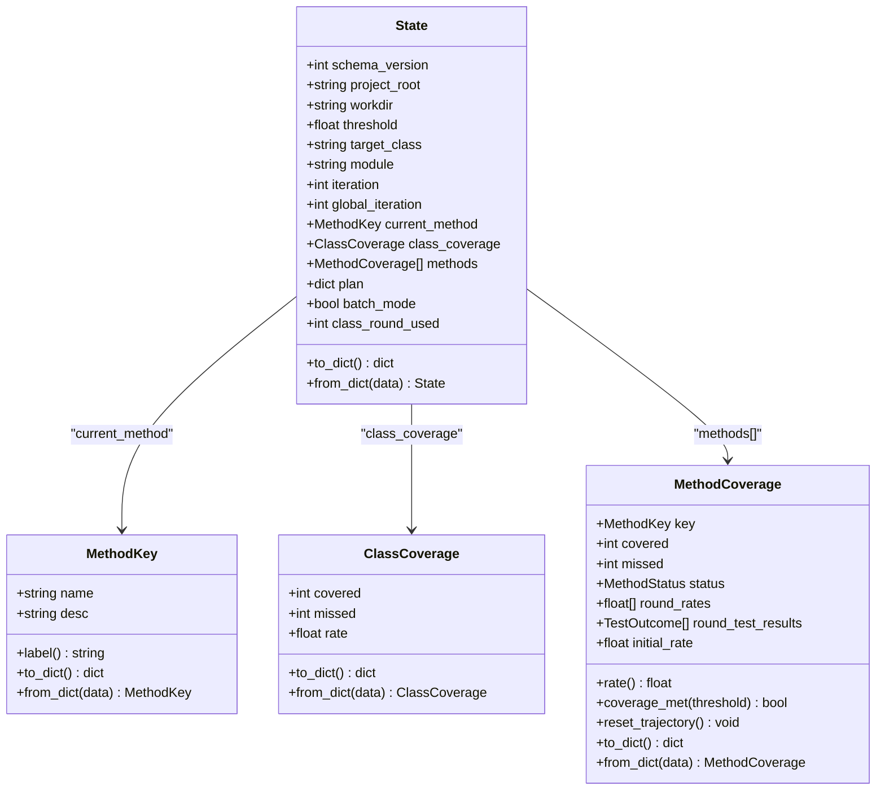
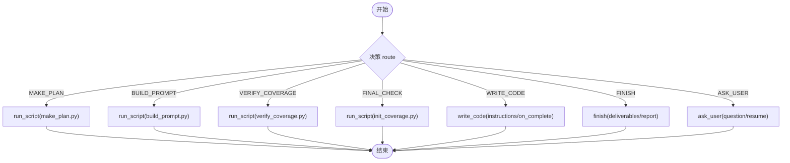
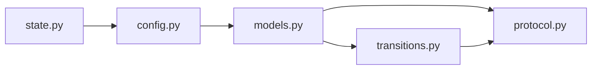
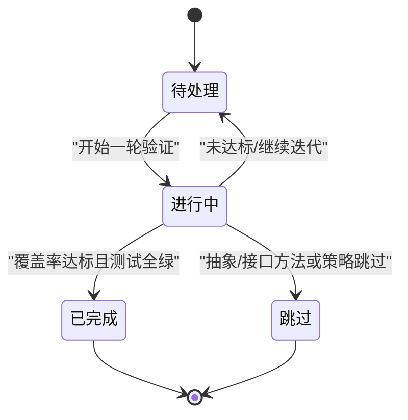
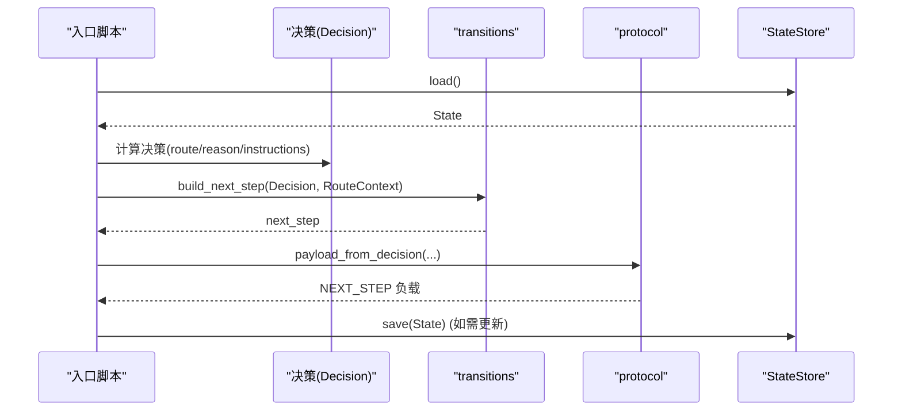

# 状态机模式

<cite>
**本文引用的文件**
- [state.schema.json（批量）](file://batch-unit-test-generator/protocol/state.schema.json)
- [state.schema.json（Java）](file://java-unit-test-generator/protocol/state.schema.json)
- [models.py（批量）](file://batch-unit-test-generator/scripts/jaut/models.py)
- [models.py（Java）](file://java-unit-test-generator/scripts/jaut/models.py)
- [state.py（批量）](file://batch-unit-test-generator/scripts/jaut/state.py)
- [state.py（Java）](file://java-unit-test-generator/scripts/jaut/state.py)
- [transitions.py（批量）](file://batch-unit-test-generator/scripts/jaut/transitions.py)
- [transitions.py（Java）](file://java-unit-test-generator/scripts/jaut/transitions.py)
- [config.py（批量）](file://batch-unit-test-generator/scripts/jaut/config.py)
- [config.py（Java）](file://java-unit-test-generator/scripts/jaut/config.py)
- [protocol.py（批量）](file://batch-unit-test-generator/scripts/jaut/protocol.py)
- [protocol.py（Java）](file://java-unit-test-generator/scripts/jaut/protocol.py)
- [test_state.py（Java）](file://java-unit-test-generator/tests/test_state.py)
</cite>

## 目录
1. [简介](#简介)
2. [项目结构](#项目结构)
3. [核心组件](#核心组件)
4. [架构总览](#架构总览)
5. [详细组件分析](#详细组件分析)
6. [依赖关系分析](#依赖关系分析)
7. [性能与并发考量](#性能与并发考量)
8. [故障恢复与一致性](#故障恢复与一致性)
9. [结论](#结论)
10. [附录：状态转换图与工作流示例](#附录：状态转换图与工作流示例)

## 简介
本文件围绕“状态机模式”在该仓库中的落地进行系统化说明，聚焦以下目标：
- 解释状态机在测试生成工作流中的应用原理：状态定义、转换规则、持久化机制。
- 深入解析 state.schema.json 的结构设计：字段含义、转换条件、验证规则。
- 阐述状态机生命周期管理：初始化、状态更新、清理过程。
- 提供状态转换图，展示不同工作流中的状态流转路径。
- 给出状态检查与更新的代码级参考路径，便于快速定位实现。
- 说明状态同步机制与并发安全考虑。
- 提供故障恢复与状态一致性保证策略。

## 项目结构
该仓库包含两套技能实现：批量单元测试生成器与 Java 单元测试生成器。两者共享相似的状态机思想，但各自维护独立的协议与脚本目录。

图表来源
- [state.schema.json（批量）:1-161](file://batch-unit-test-generator/protocol/state.schema.json#L1-L161)
- [state.schema.json（Java）:1-151](file://java-unit-test-generator/protocol/state.schema.json#L1-L151)
- [models.py（批量）:1-693](file://batch-unit-test-generator/scripts/jaut/models.py#L1-L693)
- [models.py（Java）:1-499](file://java-unit-test-generator/scripts/jaut/models.py#L1-L499)
- [state.py（批量）:1-165](file://batch-unit-test-generator/scripts/jaut/state.py#L1-L165)
- [state.py（Java）:1-165](file://java-unit-test-generator/scripts/jaut/state.py#L1-L165)
- [transitions.py（批量）:1-128](file://batch-unit-test-generator/scripts/jaut/transitions.py#L1-L128)
- [transitions.py（Java）:1-126](file://java-unit-test-generator/scripts/jaut/transitions.py#L1-L126)
- [config.py（批量）:1-181](file://batch-unit-test-generator/scripts/jaut/config.py#L1-L181)
- [config.py（Java）:1-172](file://java-unit-test-generator/scripts/jaut/config.py#L1-L172)
- [protocol.py（批量）:1-105](file://batch-unit-test-generator/scripts/jaut/protocol.py#L1-L105)
- [protocol.py（Java）:1-105](file://java-unit-test-generator/scripts/jaut/protocol.py#L1-L105)

章节来源
- [state.schema.json（批量）:1-161](file://batch-unit-test-generator/protocol/state.schema.json#L1-L161)
- [state.schema.json（Java）:1-151](file://java-unit-test-generator/protocol/state.schema.json#L1-L151)
- [models.py（批量）:1-693](file://batch-unit-test-generator/scripts/jaut/models.py#L1-L693)
- [models.py（Java）:1-499](file://java-unit-test-generator/scripts/jaut/models.py#L1-L499)
- [state.py（批量）:1-165](file://batch-unit-test-generator/scripts/jaut/state.py#L1-L165)
- [state.py（Java）:1-165](file://java-unit-test-generator/scripts/jaut/state.py#L1-L165)
- [transitions.py（批量）:1-128](file://batch-unit-test-generator/scripts/jaut/transitions.py#L1-L128)
- [transitions.py（Java）:1-126](file://java-unit-test-generator/scripts/jaut/transitions.py#L1-L126)
- [config.py（批量）:1-181](file://batch-unit-test-generator/scripts/jaut/config.py#L1-L181)
- [config.py（Java）:1-172](file://java-unit-test-generator/scripts/jaut/config.py#L1-L172)
- [protocol.py（批量）:1-105](file://batch-unit-test-generator/scripts/jaut/protocol.py#L1-L105)
- [protocol.py（Java）:1-105](file://java-unit-test-generator/scripts/jaut/protocol.py#L1-L105)

## 核心组件
- 状态模型 State：类型化的状态载体，负责序列化/反序列化、默认值填充、向后兼容。
- 方法覆盖率 MethodCoverage：记录单个方法的覆盖数据、轨迹与测试结果历史。
- 类覆盖率 ClassCoverage：聚合类级覆盖统计。
- 决策 Decision：工作流决策产物，携带路由、原因、指令、交付物等。
- 路由 transitions：将决策转换为具体 next_step（run_script/write_code/ask_user/finish）。
- 存储 StateStore：原子读写 state.json，跨进程锁保护，支持迁移管道。
- 协议 protocol：NEXT_STEP 负载构建与输出，确保调用方与脚本间契约一致。
- 配置 config：阈值、预算、超时、协议枚举等单一事实源。

章节来源
- [models.py（批量）:35-76](file://batch-unit-test-generator/scripts/jaut/models.py#L35-L76)
- [models.py（Java）:35-72](file://java-unit-test-generator/scripts/jaut/models.py#L35-L72)
- [models.py（批量）:123-205](file://batch-unit-test-generator/scripts/jaut/models.py#L123-L205)
- [models.py（Java）:119-201](file://java-unit-test-generator/scripts/jaut/models.py#L119-L201)
- [models.py（批量）:309-348](file://batch-unit-test-generator/scripts/jaut/models.py#L309-L348)
- [models.py（Java）:309-342](file://java-unit-test-generator/scripts/jaut/models.py#L309-L342)
- [transitions.py（批量）:41-68](file://batch-unit-test-generator/scripts/jaut/transitions.py#L41-L68)
- [transitions.py（Java）:39-66](file://java-unit-test-generator/scripts/jaut/transitions.py#L39-L66)
- [state.py（批量）:77-165](file://batch-unit-test-generator/scripts/jaut/state.py#L77-L165)
- [state.py（Java）:77-165](file://java-unit-test-generator/scripts/jaut/state.py#L77-L165)
- [protocol.py（批量）:22-105](file://batch-unit-test-generator/scripts/jaut/protocol.py#L22-L105)
- [protocol.py（Java）:22-105](file://java-unit-test-generator/scripts/jaut/protocol.py#L22-L105)
- [config.py（批量）:35-79](file://batch-unit-test-generator/scripts/jaut/config.py#L35-L79)
- [config.py（Java）:35-99](file://java-unit-test-generator/scripts/jaut/config.py#L35-L99)

## 架构总览
状态机以“状态 + 决策 + 路由 + 协议 + 存储”为核心，形成闭环：
- 入口脚本读取 state.json，构造 State。
- 业务逻辑产出 Decision（含 route）。
- transitions 将 Decision 转为 next_step（run_script/write_code/ask_user/finish）。
- protocol 将结果封装为 NEXT_STEP 负载并输出。
- 调用方根据 next_step 执行后续动作，必要时更新 state.json（通过 StateStore 原子写入）。

图表来源
- [transitions.py（Java）:39-66](file://java-unit-test-generator/scripts/jaut/transitions.py#L39-L66)
- [protocol.py（Java）:46-56](file://java-unit-test-generator/scripts/jaut/protocol.py#L46-L56)
- [state.py（Java）:130-156](file://java-unit-test-generator/scripts/jaut/state.py#L130-L156)

章节来源
- [transitions.py（Java）:39-66](file://java-unit-test-generator/scripts/jaut/transitions.py#L39-L66)
- [protocol.py（Java）:46-56](file://java-unit-test-generator/scripts/jaut/protocol.py#L46-L56)
- [state.py（Java）:130-156](file://java-unit-test-generator/scripts/jaut/state.py#L130-L156)

## 详细组件分析

### 状态模型与 schema 设计
- state.schema.json 定义了 state.json 的必填字段、类型、取值范围与描述，包括：
  - 基础信息：schema_version、project_root、workdir、threshold、target_class、module 等。
  - 覆盖率：class_coverage、methods（每个方法含 name/desc/covered/missed/status/round_rates/initial_rate 等）。
  - 迭代与预算：iteration、global_iteration、method_round_bonus、global_round_bonus、validate_fail_streak。
  - 终验与报告：final_checked、final_check_fail_streak、final_test_summary。
  - 其他：coverage_excludes、mvn_log、git_baseline、plan、jacoco_config_cache、batch_mode/class_round_used/exploration_mode（批量专用）。
- 从 Schema 到 Python 模型的映射由 models.State.from_dict 完成，缺失键填充默认值，保证向后兼容。

图表来源
- [state.schema.json（批量）:18-111](file://batch-unit-test-generator/protocol/state.schema.json#L18-L111)
- [state.schema.json（Java）:18-101](file://java-unit-test-generator/protocol/state.schema.json#L18-L101)
- [models.py（批量）:353-517](file://batch-unit-test-generator/scripts/jaut/models.py#L353-L517)
- [models.py（Java）:347-499](file://java-unit-test-generator/scripts/jaut/models.py#L347-L499)

章节来源
- [state.schema.json（批量）:18-111](file://batch-unit-test-generator/protocol/state.schema.json#L18-L111)
- [state.schema.json（Java）:18-101](file://java-unit-test-generator/protocol/state.schema.json#L18-L101)
- [models.py（批量）:353-517](file://batch-unit-test-generator/scripts/jaut/models.py#L353-L517)
- [models.py（Java）:347-499](file://java-unit-test-generator/scripts/jaut/models.py#L347-L499)

### 状态机生命周期管理
- 初始化：
  - 入口脚本创建或加载 state.json；若不存在则按默认值构造 State（如 threshold=80.0、module="." 等）。
  - 使用 default_workdir 确定工作目录，准备 coverage.json、mvn.log 等辅助文件。
- 运行中更新：
  - 每轮执行后记录覆盖率与测试结果轨迹（round_rates、round_test_results），更新 iteration/global_iteration。
  - 根据决策标记方法状态（pending/done/skipped），必要时重置轨迹（升级后继续）。
- 清理与收尾：
  - finish 路由时写入 final_test_summary、final_checked 等，供报告使用。
  - 清理临时文件与锁文件，确保无残留。

章节来源
- [state.py（Java）:38-41](file://java-unit-test-generator/scripts/jaut/state.py#L38-L41)
- [state.py（Java）:130-165](file://java-unit-test-generator/scripts/jaut/state.py#L130-L165)
- [models.py（Java）:415-456](file://java-unit-test-generator/scripts/jaut/models.py#L415-L456)

### 状态转换规则与路由
- 决策产物 Decision 包含 route（MAKE_PLAN/BUILD_PROMPT/VERIFY_COVERAGE/FINAL_CHECK/WRITE_CODE/FINISH/ASK_USER）。
- transitions.build_next_step 将 route 解析为 next_step：
  - run_script：组装脚本绝对路径与参数（如 --workdir、--project-root、--class）。
  - write_code：附带 instructions 与 on_complete（默认 validate_rules.py）。
  - ask_user：附带 question 与 resume 选项（可恢复命令）。
  - finish：附带 deliverables 与 report。
- 路由参数校验：_params_for 对 workdir 做防御性检查，避免无效参数。

图表来源
- [transitions.py（Java）:22-27](file://java-unit-test-generator/scripts/jaut/transitions.py#L22-L27)
- [transitions.py（Java）:39-66](file://java-unit-test-generator/scripts/jaut/transitions.py#L39-L66)
- [transitions.py（Java）:107-125](file://java-unit-test-generator/scripts/jaut/transitions.py#L107-L125)

章节来源
- [transitions.py（Java）:22-27](file://java-unit-test-generator/scripts/jaut/transitions.py#L22-L27)
- [transitions.py（Java）:39-66](file://java-unit-test-generator/scripts/jaut/transitions.py#L39-L66)
- [transitions.py（Java）:107-125](file://java-unit-test-generator/scripts/jaut/transitions.py#L107-L125)

### 状态检查与更新逻辑（代码级参考）
- 状态检查：
  - 覆盖率达标判定：MethodCoverage.coverage_met(threshold)，抽象/接口方法视为达标。
  - 测试绿态判定：TestResult.is_green(uncleaned_dirs=False)。
  - 连续失败/无提升升级：依据配置 NO_IMPROVEMENT_ROUNDS、TEST_FAIL_STREAK_ROUNDS 等。
- 状态更新：
  - StateStore.save 原子写入 state.json（临时文件 + fsync + os.replace）。
  - State.to_dict/from_dict 负责字段序列化与默认值填充。
  - 批量模式下额外字段 batch_mode/class_round_used/exploration_mode 参与升级与自动继续。

章节来源
- [models.py（Java）:141-147](file://java-unit-test-generator/scripts/jaut/models.py#L141-L147)
- [models.py（Java）:254-277](file://java-unit-test-generator/scripts/jaut/models.py#L254-L277)
- [config.py（Java）:71-99](file://java-unit-test-generator/scripts/jaut/config.py#L71-L99)
- [state.py（Java）:147-156](file://java-unit-test-generator/scripts/jaut/state.py#L147-L156)
- [models.py（批量）:409-412](file://batch-unit-test-generator/scripts/jaut/models.py#L409-L412)

### 协议与输出
- protocol.make_next_step/build_payload/payload_from_decision 统一构建 NEXT_STEP 负载。
- emit 在 stdout 输出标记包裹的 JSON 块，并在序列化失败时降级输出错误协议，避免调用方无限等待。
- self_check 轻量校验必填键与枚举取值，仅告警不阻断。

章节来源
- [protocol.py（Java）:22-56](file://java-unit-test-generator/scripts/jaut/protocol.py#L22-L56)
- [protocol.py（Java）:59-105](file://java-unit-test-generator/scripts/jaut/protocol.py#L59-L105)

## 依赖关系分析
- 低耦合高内聚：
  - models 仅依赖 config，禁止反向依赖上层模块。
  - transitions 依赖 models 与 protocol，集中处理路由解析。
  - state 模块独立负责持久化与迁移。
- 外部依赖：
  - 文件系统：state.json、coverage.json、mvn.log。
  - 操作系统：POSIX fcntl.flock / Windows msvcrt.locking 用于跨进程锁。
  - Maven/JaCoCo：通过脚本执行与日志解析间接依赖。

图表来源
- [config.py（Java）:1-172](file://java-unit-test-generator/scripts/jaut/config.py#L1-L172)
- [models.py（Java）:1-499](file://java-unit-test-generator/scripts/jaut/models.py#L1-L499)
- [transitions.py（Java）:1-126](file://java-unit-test-generator/scripts/jaut/transitions.py#L1-L126)
- [protocol.py（Java）:1-105](file://java-unit-test-generator/scripts/jaut/protocol.py#L1-L105)
- [state.py（Java）:1-165](file://java-unit-test-generator/scripts/jaut/state.py#L1-L165)

章节来源
- [config.py（Java）:1-172](file://java-unit-test-generator/scripts/jaut/config.py#L1-L172)
- [models.py（Java）:1-499](file://java-unit-test-generator/scripts/jaut/models.py#L1-L499)
- [transitions.py（Java）:1-126](file://java-unit-test-generator/scripts/jaut/transitions.py#L1-L126)
- [protocol.py（Java）:1-105](file://java-unit-test-generator/scripts/jaut/protocol.py#L1-L105)
- [state.py（Java）:1-165](file://java-unit-test-generator/scripts/jaut/state.py#L1-L165)

## 性能与并发考量
- 原子写入：
  - 使用临时文件 + fsync + os.replace 保证 state.json 的原子性，避免半截状态破坏断点续跑。
- 跨进程锁：
  - 通过 .lock 文件与平台相关 flock/locking 实现独占访问，load → 修改 → save 全程受保护。
- 迁移管道：
  - _migrate 顺序升级 schema_version，便于独立测试每个迁移函数，降低升级风险。
- 内存与 I/O：
  - 覆盖率与测试结果轨迹按需追加，避免过大状态膨胀。
  - 可选字段仅在赋值时写出，减少 state.json 体积。

章节来源
- [state.py（Java）:93-128](file://java-unit-test-generator/scripts/jaut/state.py#L93-L128)
- [state.py（Java）:147-156](file://java-unit-test-generator/scripts/jaut/state.py#L147-L156)
- [state.py（Java）:55-74](file://java-unit-test-generator/scripts/jaut/state.py#L55-L74)

## 故障恢复与一致性
- 容错加载：
  - load 对缺失文件或损坏 JSON 返回 None，由调用方按状态错误流转。
  - from_dict 对缺失键填充默认值，兼容旧版本 state.json。
- 异常降级：
  - protocol.emit 在序列化失败时输出错误协议块，避免调用方无限等待。
- 锁残留检测：
  - locked 上下文管理器检测超过 24 小时的残留锁文件并告警，提示手动清理。
- 一致性保证：
  - 原子写入 + 跨进程锁确保多进程并发下的状态一致性。
  - 迁移管道确保 schema 演进过程中的兼容性。

章节来源
- [state.py（Java）:130-145](file://java-unit-test-generator/scripts/jaut/state.py#L130-L145)
- [protocol.py（Java）:74-105](file://java-unit-test-generator/scripts/jaut/protocol.py#L74-L105)
- [state.py（Java）:103-114](file://java-unit-test-generator/scripts/jaut/state.py#L103-L114)

## 结论
该项目的状态机模式以“强类型模型 + 声明式路由 + 原子持久化 + 协议契约”为核心，实现了稳健的测试生成工作流控制。通过 schema 约束、迁移管道与并发锁，保证了状态的一致性与可演进性。对于初学者，可从 State 与 transitions 入手理解整体流程；对于高级用户，可关注迁移策略、预算升级与批量模式的扩展点。

## 附录：状态转换图与工作流示例

### 方法级状态流转

[此图为概念性流程图，不直接映射具体源码文件]

### 工作流路由序列

图表来源
- [transitions.py（Java）:39-66](file://java-unit-test-generator/scripts/jaut/transitions.py#L39-L66)
- [protocol.py（Java）:46-56](file://java-unit-test-generator/scripts/jaut/protocol.py#L46-L56)
- [state.py（Java）:130-156](file://java-unit-test-generator/scripts/jaut/state.py#L130-L156)

章节来源
- [transitions.py（Java）:39-66](file://java-unit-test-generator/scripts/jaut/transitions.py#L39-L66)
- [protocol.py（Java）:46-56](file://java-unit-test-generator/scripts/jaut/protocol.py#L46-L56)
- [state.py（Java）:130-156](file://java-unit-test-generator/scripts/jaut/state.py#L130-L156)