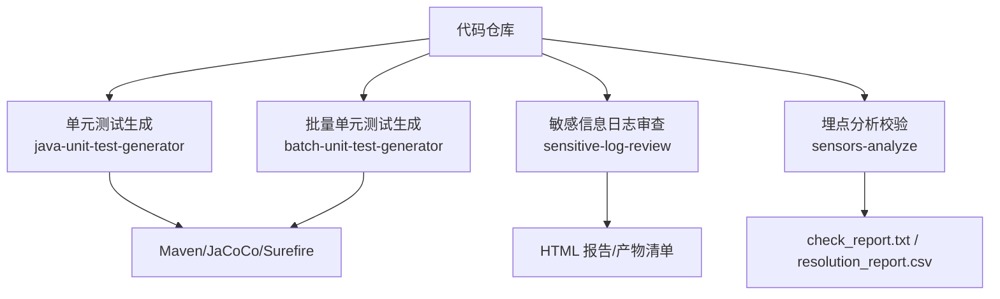
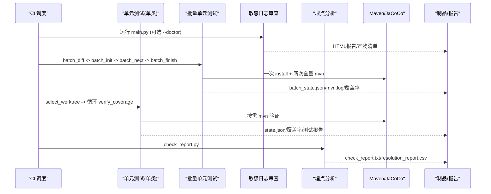
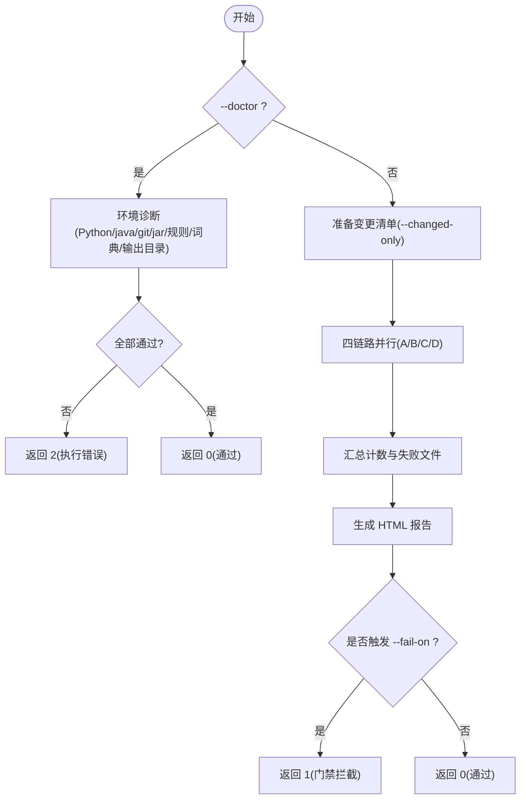
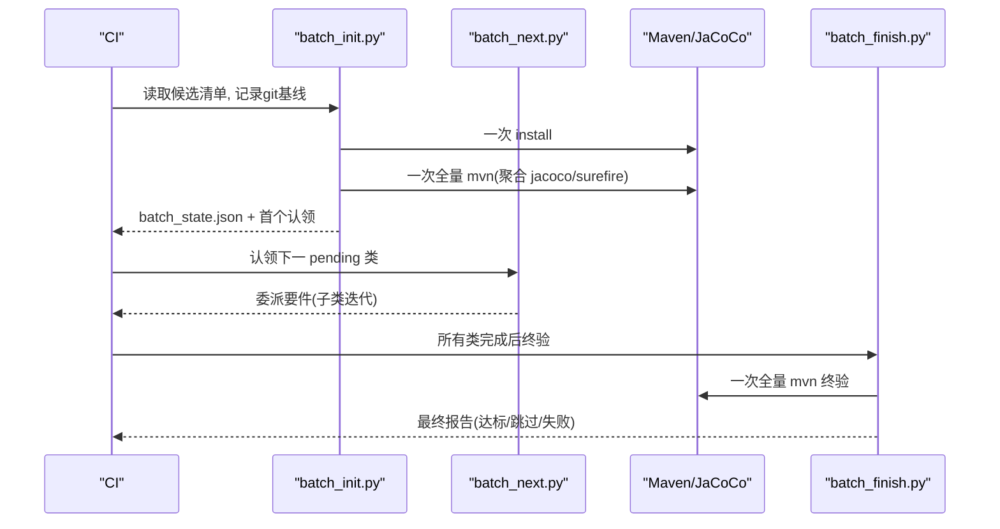
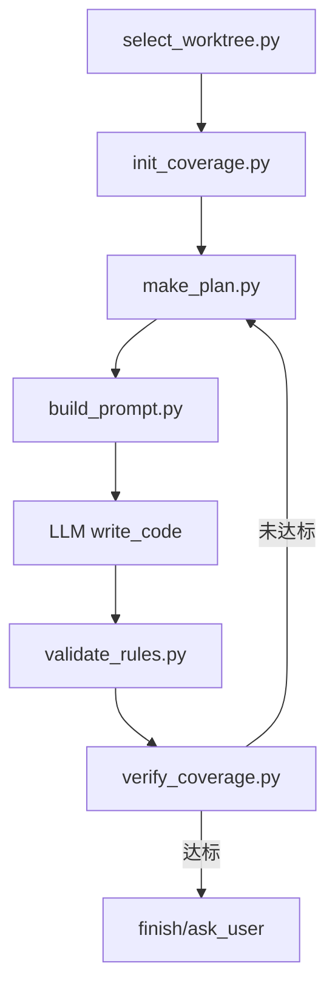
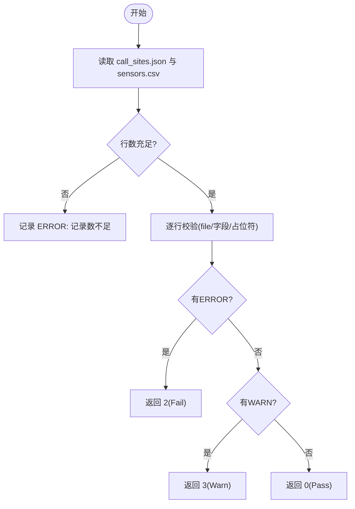
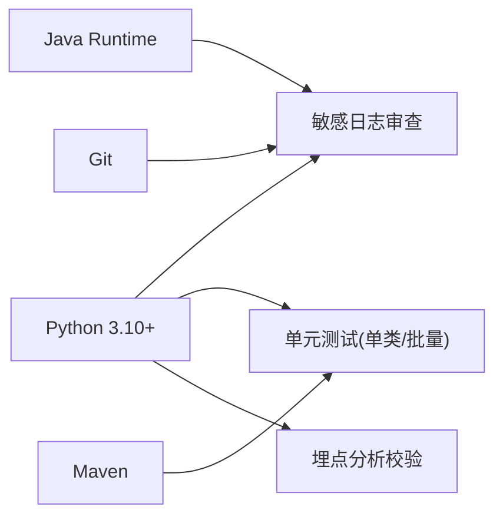

# CI/CD 流水线集成

<cite>
**本文引用的文件**
- [README.md](file://README.md)
- [AGENTS.md](file://AGENTS.md)
- [CLAUDE.md](file://CLAUDE.md)
- [install.sh](file://install.sh)
- [sensitive-log-review/scripts/main.py](file://sensitive-log-review/scripts/main.py)
- [sensitive-log-review/SKILL.md](file://sensitive-log-review/SKILL.md)
- [java-unit-test-generator/scripts/select_worktree.py](file://java-unit-test-generator/scripts/select_worktree.py)
- [batch-unit-test-generator/scripts/batch_init.py](file://batch-unit-test-generator/scripts/batch_init.py)
- [batch-unit-test-generator/SKILL.md](file://batch-unit-test-generator/SKILL.md)
- [java-unit-test-generator/SKILL.md](file://java-unit-test-generator/SKILL.md)
- [sensors-analyze/scripts/check_report.py](file://sensors-analyze/scripts/check_report.py)
</cite>

## 目录
1. [简介](#简介)
2. [项目结构](#项目结构)
3. [核心组件](#核心组件)
4. [架构总览](#架构总览)
5. [详细组件分析](#详细组件分析)
6. [依赖关系分析](#依赖关系分析)
7. [性能与并行优化](#性能与并行优化)
8. [故障排除指南](#故障排除指南)
9. [结论](#结论)
10. [附录：CI 配置模板](#附录ci-配置模板)

## 简介
本指南面向在 Jenkins、GitHub Actions、GitLab CI 等主流持续集成平台中集成 ping-skills 的四个能力域：单元测试生成（单类/批量）、敏感信息日志审查、埋点分析。文档提供可落地的流水线步骤、并行策略、缓存与依赖管理、质量门禁与报告归档，以及常见失败排查方法，帮助团队将工具无缝接入现有 DevOps 流程。

## 项目结构
仓库包含四个独立 skill，每个 skill 自包含脚本、协议与测试，适合按模块拆分到不同 job 或 stage 并行执行：
- java-unit-test-generator：为单个 Java 类生成 JUnit5+Mockito 测试，驱动 NEXT_STEP 协议，基于 JaCoCo 覆盖率门槛迭代
- batch-unit-test-generator：对分支差异涉及的多个类批量生成测试，一次 install + 一次全量 mvn 产出基线，逐类委派迭代
- sensitive-log-review：审计 Java 变更中的敏感信息泄露风险，输出 HTML 报告与 CI 门禁退出码
- sensors-analyze：盘点埋点调用点并校验 CSV 与 JSON 一致性，输出校验报告与结构化退出码

**章节来源**
- [AGENTS.md:5-14](file://AGENTS.md#L5-L14)
- [CLAUDE.md:5-14](file://CLAUDE.md#L5-L14)

## 核心组件
- 单元测试生成（单类）
  - 入口脚本：select_worktree.py（选择/新建 git worktree），后续由 make_plan/build_prompt/validate_rules/verify_coverage 循环驱动
  - 关键约束：仅允许修改 src/test/java/**；Maven 超时默认 1800 秒；NEXT_STEP 协议 exit_code 约定：0=完成，1=继续，2=执行错误，3=状态/协议错误
- 批量单元测试生成
  - 入口脚本：batch_init.py（一次 install + 一次全量 mvn 产出基线 state.json 与 batch_state.json），随后 batch_next 认领委派子代理
  - 关键约束：类间串行、原子认领；mvn install 仅一次、全量 mvn 仅两次（基线与终验）
- 敏感信息日志审查
  - 入口脚本：main.py（四链路并行 P1-6，目标全流程 <60s），输出 HTML 报告与多类产物清单
  - 关键约束：退出码 0=通过，1=触发门禁（--fail-on 类别），2=执行错误；支持 --doctor 环境诊断与 --run-id 并行隔离
- 埋点分析校验
  - 入口脚本：check_report.py（校验 call_sites.json 与 sensors.csv 一致性），输出 check_report.txt 与可选 resolution_report.csv
  - 关键约束：退出码 0=PASS，1=执行异常，2=FAIL（结构性错误），3=WARN（需人工复核）

**章节来源**
- [java-unit-test-generator/SKILL.md:25-37](file://java-unit-test-generator/SKILL.md#L25-L37)
- [batch-unit-test-generator/SKILL.md:23-68](file://batch-unit-test-generator/SKILL.md#L23-L68)
- [sensitive-log-review/SKILL.md:31-68](file://sensitive-log-review/SKILL.md#L31-L68)
- [sensors-analyze/scripts/check_report.py:1-18](file://sensors-analyze/scripts/check_report.py#L1-L18)

## 架构总览
下图展示各 skill 在 CI 中的典型执行流与产物：

**图表来源**
- [batch-unit-test-generator/scripts/batch_init.py:105-159](file://batch-unit-test-generator/scripts/batch_init.py#L105-L159)
- [sensitive-log-review/scripts/main.py:777-786](file://sensitive-log-review/scripts/main.py#L777-L786)
- [sensors-analyze/scripts/check_report.py:69-145](file://sensors-analyze/scripts/check_report.py#L69-L145)

## 详细组件分析

### 敏感信息日志审查（sensitive-log-review）
- 执行模型：四链路并行（A/B/C/D），汇总后生成 HTML 报告；支持 --changed-only 与 --full-scan
- 门禁契约：--fail-on 指定计数项（violation/sensitive/unqualified/tostring/tostring_sensitive/analyze/miss_comments/low），默认 violation,sensitive；--strict-mode 可将解析失败文件视为执行错误
- 并行与隔离：--run-id 用于 CI 并行隔离输出目录；--doctor 仅做环境检查（Python/java/git/jar SHA256/规则与词典/输出目录可写性）
- 产物：log-print-ok/violation.list、@ToString 缺失清单、敏感字段结果、POJO 注释问题、深度分析结果、HTML 报告

**图表来源**
- [sensitive-log-review/scripts/main.py:705-729](file://sensitive-log-review/scripts/main.py#L705-L729)
- [sensitive-log-review/scripts/main.py:777-800](file://sensitive-log-review/scripts/main.py#L777-L800)

**章节来源**
- [sensitive-log-review/SKILL.md:31-68](file://sensitive-log-review/SKILL.md#L31-L68)
- [sensitive-log-review/scripts/main.py:112-144](file://sensitive-log-review/scripts/main.py#L112-L144)
- [sensitive-log-review/scripts/main.py:300-322](file://sensitive-log-review/scripts/main.py#L300-L322)
- [sensitive-log-review/scripts/main.py:582-702](file://sensitive-log-review/scripts/main.py#L582-L702)

### 批量单元测试生成（batch-unit-test-generator）
- 基线阶段：读取候选清单 → 记录 git 基线 → 一次 install → 清理旧报告 → 一次全量 mvn → 聚合 jacoco/surefire → 为每个确认类生成 state.json → 排序并生成 batch_state.json
- 委派阶段：batch_next 原子认领下一 pending 类，子代理按 make_plan→build_prompt→write_code→validate_rules→verify_coverage 循环迭代
- 终验阶段：所有类 done/skipped 后，一次全量 mvn 终验，不达标类 recheck 重入队，最终输出 finish 报告
- 关键参数：--classes all|top:N|FQCN,...；--threshold；--coverage-exclude；--jacoco-version；--workdir

**图表来源**
- [batch-unit-test-generator/scripts/batch_init.py:105-159](file://batch-unit-test-generator/scripts/batch_init.py#L105-L159)
- [batch-unit-test-generator/SKILL.md:23-68](file://batch-unit-test-generator/SKILL.md#L23-L68)

**章节来源**
- [batch-unit-test-generator/scripts/batch_init.py:62-159](file://batch-unit-test-generator/scripts/batch_init.py#L62-L159)
- [batch-unit-test-generator/SKILL.md:131-179](file://batch-unit-test-generator/SKILL.md#L131-L179)

### 单类单元测试生成（java-unit-test-generator）
- 工作树选择：select_worktree.py 负责查找/新建/清理历史 worktree，要求工程根存在 .codegraph 索引，否则中断并提示初始化
- 迭代流程：select_worktree → init_coverage → make_plan → build_prompt → LLM write_code → validate_rules → verify_coverage
- 关键约束：仅允许修改 src/test/java/**；Maven 超时默认 1800 秒；NEXT_STEP 协议 exit_code 约定

**图表来源**
- [java-unit-test-generator/scripts/select_worktree.py:156-184](file://java-unit-test-generator/scripts/select_worktree.py#L156-L184)
- [java-unit-test-generator/SKILL.md:11-23](file://java-unit-test-generator/SKILL.md#L11-L23)

**章节来源**
- [java-unit-test-generator/scripts/select_worktree.py:187-218](file://java-unit-test-generator/scripts/select_worktree.py#L187-L218)
- [java-unit-test-generator/SKILL.md:25-37](file://java-unit-test-generator/SKILL.md#L25-L37)

### 埋点分析校验（sensors-analyze）
- 校验规则：CSV 行数不足、file 格式非法或未匹配 call_sites.json、必填字段为空、字段值含动态占位符
- 输出：check_report.txt（PASS/WARN/FAIL 及统计），可选 resolution_report.csv（空字段追踪）
- 退出码：0=PASS，1=执行异常，2=FAIL，3=WARN

**图表来源**
- [sensors-analyze/scripts/check_report.py:69-145](file://sensors-analyze/scripts/check_report.py#L69-L145)
- [sensors-analyze/scripts/check_report.py:226-245](file://sensors-analyze/scripts/check_report.py#L226-L245)

**章节来源**
- [sensors-analyze/scripts/check_report.py:1-18](file://sensors-analyze/scripts/check_report.py#L1-L18)
- [sensors-analyze/scripts/check_report.py:69-145](file://sensors-analyze/scripts/check_report.py#L69-L145)

## 依赖关系分析
- 外部依赖
  - Python 3.10+（敏感日志审查与环境诊断）
  - Java Runtime（敏感日志审查运行 Checkstyle）
  - Git（获取变更、分支校验）
  - Maven（单元测试生成与覆盖率收集）
  - pytest（仅开发测试需要）
- 内部依赖
  - 协议与规则：next-step.schema.json/state.schema.json、UnitTestRules.md、sensitive-field-rules.json、pojo.config
  - 词典与字典：sensitive-core/extended、whitelist/blacklist、en_US-large/whitelist
  - 产物路径：统一输出目录策略，支持环境变量与 run-id 隔离

**图表来源**
- [sensitive-log-review/SKILL.md:158-166](file://sensitive-log-review/SKILL.md#L158-L166)
- [AGENTS.md:16-28](file://AGENTS.md#L16-L28)

**章节来源**
- [sensitive-log-review/SKILL.md:158-166](file://sensitive-log-review/SKILL.md#L158-L166)
- [AGENTS.md:16-28](file://AGENTS.md#L16-L28)

## 性能与并行优化
- 敏感日志审查
  - 四链路并行（P1-6），目标全流程 <60s；--changed-only 仅扫描变更文件提升速度
  - 使用 --run-id 实现 CI 并行隔离输出目录
- 单元测试生成
  - 批量模式：一次 install + 一次全量 mvn 产出基线，减少重复构建；类间串行但可跨批次并行
  - 覆盖率排除：显式 --coverage-exclude + Lombok/MapStruct 启发式排除，降低无效计算
  - Maven 超时：JAVA_UT_MVN_TIMEOUT 控制长时间执行；后台轮询与进度输出避免超时误判
- 缓存与依赖管理
  - Maven 本地仓库缓存（~/.m2/repository）在各平台缓存键中使用分支/commit 粒度
  - 产物缓存：batch_state.json/state.json 支持断点续跑，避免重复工作
  - 规则与词典：保持版本头更新，结合 SHA256 校验（Checkstyle jar）确保一致性

[本节为通用指导，无需具体文件引用]

## 故障排除指南
- 敏感日志审查
  - 环境检查：使用 --doctor 逐项检查 Python/java/git/jar 可用性、规则与词典完整性、输出目录可写性
  - 常见错误：分支名无效(E003)、输出目录不可写(E006)、jar SHA256 不一致(E007)
  - 严格模式：--strict-mode 将解析失败文件视为执行错误，便于快速定位问题
- 单元测试生成
  - 工作树问题：缺少 .codegraph 索引时任务中止，需先执行 codegraph init
  - Maven 失败：查看 mvn.log 与 surefire 报告；必要时调整 JAVA_UT_MVN_TIMEOUT 或覆盖率排除
  - 升级穿透：连续失败/无提升/预算耗尽时自动升级为 ask_user，提供继续/跳过/调整门槛/终止选项
- 埋点分析校验
  - 结构性错误：CSV 行数不足、file 格式非法、动态占位符 → 返回 2
  - 人工复核：必填字段为空 → 返回 3，并生成 resolution_report.csv 辅助定位

**章节来源**
- [sensitive-log-review/scripts/main.py:582-702](file://sensitive-log-review/scripts/main.py#L582-L702)
- [sensitive-log-review/SKILL.md:31-68](file://sensitive-log-review/SKILL.md#L31-L68)
- [java-unit-test-generator/scripts/select_worktree.py:156-184](file://java-unit-test-generator/scripts/select_worktree.py#L156-L184)
- [batch-unit-test-generator/SKILL.md:177-214](file://batch-unit-test-generator/SKILL.md#L177-L214)
- [sensors-analyze/scripts/check_report.py:226-245](file://sensors-analyze/scripts/check_report.py#L226-L245)

## 结论
通过将四个 skill 拆分为独立 job/stage，并结合并行执行、缓存与依赖管理、质量门禁与报告归档，可在 Jenkins/GitHub Actions/GitLab CI 中高效集成 ping-skills。建议：
- 将敏感日志审查作为 PR 合并前门禁，使用 --changed-only 与 --run-id 提升并发度
- 批量单元测试生成在 nightly 或大 PR 场景执行，利用一次 install + 一次全量 mvn 优化耗时
- 埋点分析校验纳入发布前质量门禁，依据退出码阻断不合格变更
- 使用 --doctor 与环境检查脚本提前发现环境问题，减少流水线失败

[本节为总结性内容，无需具体文件引用]

## 附录：CI 配置模板

以下为各平台的示例片段（以命令行为准，具体语法按平台 Job/Stage 组织）：

- GitHub Actions
  - 安装依赖：setup-python(3.10+)、setup-java、setup-maven、checkout
  - 敏感日志审查：python scripts/main.py -o ./review-output --branch ${{ github.base_ref }} --fail-on violation,sensitive
  - 批量单元测试：python scripts/batch_init.py --project-root . --classes all --threshold 80
  - 埋点分析：python scripts/check_report.py --sites call_sites.json --csv sensors.csv --out check_report.txt

- GitLab CI
  - stages: test, quality, report
  - jobs:
    - sensitive_log_review: script: python scripts/main.py --doctor && python scripts/main.py -o ./review-output --branch $CI_MERGE_REQUEST_SOURCE_BRANCH_NAME
    - batch_unit_test: script: python scripts/batch_init.py --project-root . --classes top:50 --threshold 80
    - sensors_check: script: python scripts/check_report.py --sites call_sites.json --csv sensors.csv

- Jenkins Pipeline
  - stages:
    - stage('Sensitive Review') { steps { sh 'python scripts/main.py --doctor' } }
    - stage('Batch Unit Test') { steps { sh 'python scripts/batch_init.py --project-root . --classes all --threshold 80' } }
    - stage('Sensors Check') { steps { sh 'python scripts/check_report.py --sites call_sites.json --csv sensors.csv' } }

注意：
- 缓存 Maven 本地仓库与 Python 包目录以提升构建速度
- 使用 artifacts/publishers 上传 HTML 报告与 check_report.txt
- 使用 environment 变量注入 JAVA_UT_MVN_TIMEOUT、SLR_OUTPUT_DIR 等

[本节为通用模板，无需具体文件引用]