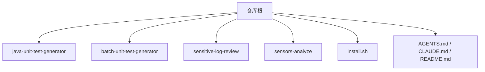
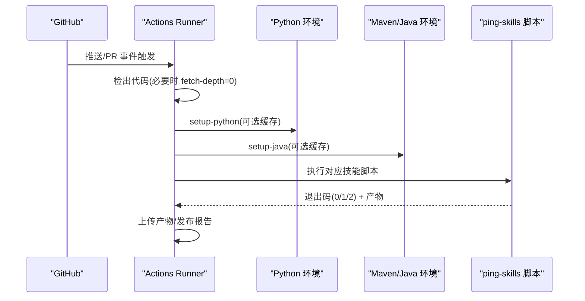
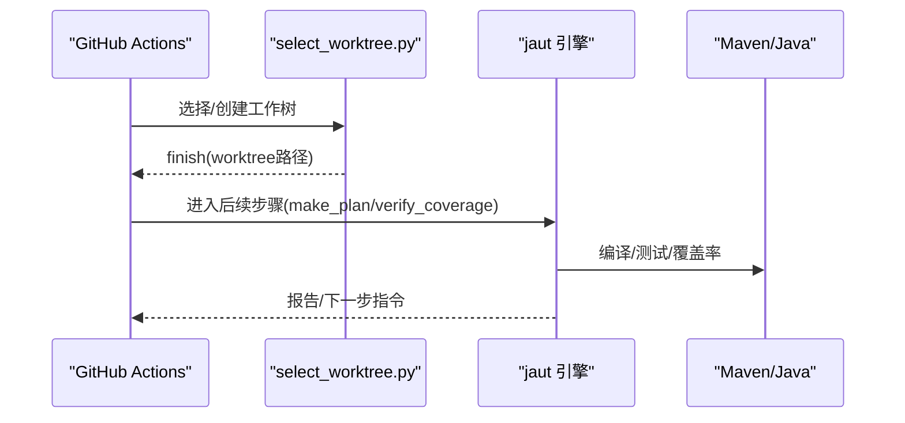
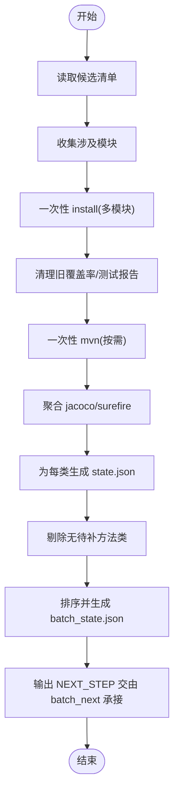
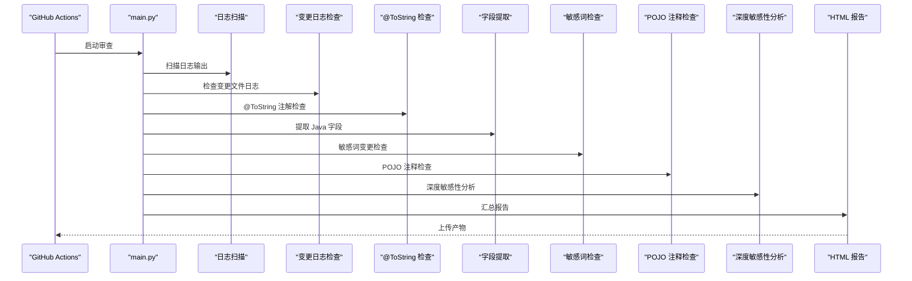
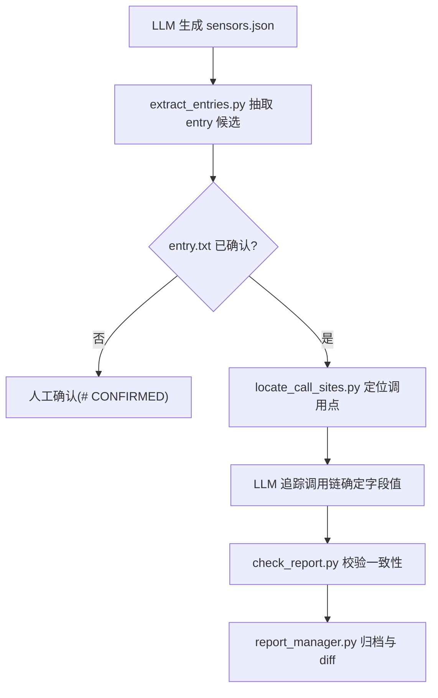
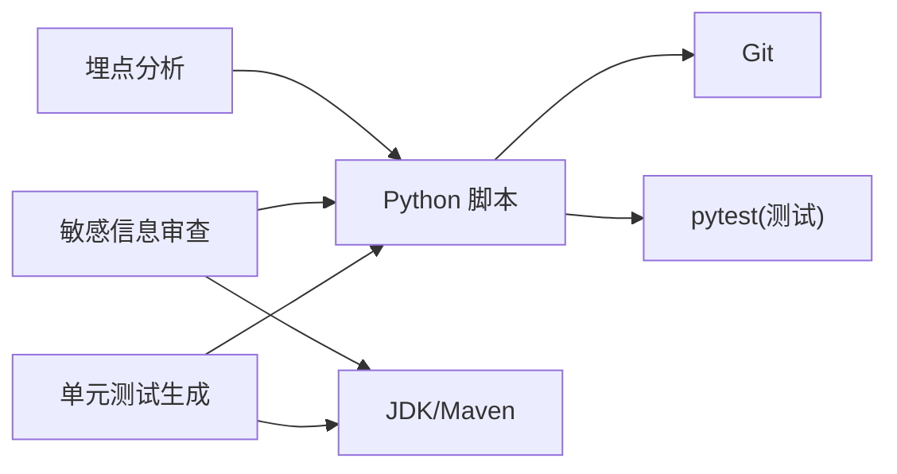

# GitHub Actions 集成

<cite>
**本文引用的文件**
- [README.md](file://README.md)
- [AGENTS.md](file://AGENTS.md)
- [CLAUDE.md](file://CLAUDE.md)
- [install.sh](file://install.sh)
- [sensitive-log-review/README.md](file://sensitive-log-review/README.md)
- [sensitive-log-review/scripts/main.py](file://sensitive-log-review/scripts/main.py)
- [batch-unit-test-generator/scripts/batch_init.py](file://batch-unit-test-generator/scripts/batch_init.py)
- [java-unit-test-generator/scripts/select_worktree.py](file://java-unit-test-generator/scripts/select_worktree.py)
- [java-unit-test-generator/protocol/next-step.schema.json](file://java-unit-test-generator/protocol/next-step.schema.json)
- [batch-unit-test-generator/protocol/next-step.schema.json](file://batch-unit-test-generator/protocol/next-step.schema.json)
- [sensors-analyze/CLAUDE.md](file://sensors-analyze/CLAUDE.md)
</cite>

## 目录
1. [简介](#简介)
2. [项目结构](#项目结构)
3. [核心组件](#核心组件)
4. [架构总览](#架构总览)
5. [详细组件分析](#详细组件分析)
6. [依赖关系分析](#依赖关系分析)
7. [性能考虑](#性能考虑)
8. [故障排查指南](#故障排查指南)
9. [结论](#结论)
10. [附录](#附录)

## 简介
本文件面向希望在 GitHub Actions 中集成 ping-skills 的开发者，提供端到端的 CI/CD 流水线配置与最佳实践。仓库包含四个独立技能：单元测试生成（单类与批量）、敏感信息日志审查、埋点分析等。每个技能自带 Python 脚本与测试套件，可在 GitHub Actions 中以最小依赖运行，并通过退出码契约实现门禁控制。

## 项目结构
- 根级说明文档定义了技能集合、命令约定与开发规范；各技能自包含 scripts、tests、references、protocol 等目录。
- 安装脚本 install.sh 可将技能复制到目标项目的工具目录，便于在 CI 或本地使用。
- 敏感信息日志审查提供完整的 README 与示例 GitHub Actions 片段，可直接复用。

**章节来源**
- [AGENTS.md:1-50](file://AGENTS.md#L1-L50)
- [CLAUDE.md:1-65](file://CLAUDE.md#L1-L65)
- [install.sh:1-289](file://install.sh#L1-L289)

## 核心组件
- 单元测试生成（单类）：通过 select_worktree 选择工作树，后续流程由 jaut 引擎驱动，产出测试并校验覆盖率。
- 单元测试生成（批量）：基于分支差异批量识别待补测类，执行一次 Maven 构建聚合覆盖率，逐类委派子代理完成补测。
- 敏感信息日志审查：对 Java 变更进行多维度扫描，输出 HTML 报告与门禁判定（退出码 0/1/2）。
- 埋点分析：LLM 与 Python 脚本协作，抽取调用点、验证一致性并归档结果。

**章节来源**
- [AGENTS.md:1-50](file://AGENTS.md#L1-L50)
- [CLAUDE.md:1-65](file://CLAUDE.md#L1-L65)

## 架构总览
下图展示四类任务在 GitHub Actions 中的典型编排：触发条件、环境准备、缓存策略、任务执行与产物上传。

[此图为概念性流程图，不直接映射具体源码文件]

## 详细组件分析

### 单元测试生成（单类）
- 入口脚本：select_worktree.py 负责工作树选择/新建，确保隔离与可恢复。
- 协议约束：NEXT_STEP 协议定义 run_script/write_code/ask_user/finish 等状态机，非 select_worktree 的 finish 需携带 report。
- CI 建议：
  - 使用 actions/setup-java 配置 JDK，actions/setup-python 配置 Python。
  - 如需完整历史以计算 diff，checkout 时设置 fetch-depth: 0。
  - 将工作树产物作为 artifact 上传，便于人工复核。

**图表来源**
- [java-unit-test-generator/scripts/select_worktree.py:1-200](file://java-unit-test-generator/scripts/select_worktree.py#L1-L200)
- [java-unit-test-generator/protocol/next-step.schema.json:175-194](file://java-unit-test-generator/protocol/next-step.schema.json#L175-L194)

**章节来源**
- [java-unit-test-generator/scripts/select_worktree.py:1-200](file://java-unit-test-generator/scripts/select_worktree.py#L1-L200)
- [java-unit-test-generator/protocol/next-step.schema.json:175-194](file://java-unit-test-generator/protocol/next-step.schema.json#L175-L194)

### 单元测试生成（批量）
- 基线阶段：batch_init.py 读取候选清单，记录 git 基线，一次性 install 与 mvn 构建，聚合 jacoco/surefire 报告，为每个确认类生成 state.json，剔除无待补方法类后排序并生成 batch_state.json。
- 多模块支持：自动检测多模块，仅对涉及模块执行 install/mvn，减少构建时间。
- CI 建议：
  - 缓存 Maven 仓库与本地构建产物，显著缩短首次与增量构建时间。
  - 使用矩阵策略并行处理不同模块或不同 Java 版本。
  - 将 install.log、mvn.log 与覆盖率报告作为 artifact 保留。

**图表来源**
- [batch-unit-test-generator/scripts/batch_init.py:1-200](file://batch-unit-test-generator/scripts/batch_init.py#L1-L200)

**章节来源**
- [batch-unit-test-generator/scripts/batch_init.py:1-200](file://batch-unit-test-generator/scripts/batch_init.py#L1-L200)
- [batch-unit-test-generator/protocol/next-step.schema.json:113-194](file://batch-unit-test-generator/protocol/next-step.schema.json#L113-L194)

### 敏感信息日志审查
- 功能：对 Java 变更进行日志输出合规、@ToString 注解、字段命名、敏感词与 POJO 注释检查，最终生成 HTML 报告与门禁判定。
- 退出码：0 通过，1 触发门禁，2 执行错误。
- CI 示例：仓库 README 提供了可直接复用的 GitHub Actions 片段，包括 Python/Java 环境设置、环境变量、产物上传等。
- 建议：
  - 使用 --run-id 隔离并行构建产物。
  - 使用 --fail-on 精确控制门禁类别。
  - 若需要对比特定分支，传入 --branch 或使用 github.base_ref。

**图表来源**
- [sensitive-log-review/scripts/main.py:1-200](file://sensitive-log-review/scripts/main.py#L1-L200)
- [sensitive-log-review/README.md:205-237](file://sensitive-log-review/README.md#L205-L237)

**章节来源**
- [sensitive-log-review/scripts/main.py:1-200](file://sensitive-log-review/scripts/main.py#L1-L200)
- [sensitive-log-review/README.md:205-237](file://sensitive-log-review/README.md#L205-L237)

### 埋点分析
- 流程：LLM 产出 sensors.json → 脚本抽取 entry 候选 → 定位调用点 → LLM 追踪确定字段值 → 脚本校验一致性并归档。
- 约束：只读分析，CSV 不得包含动态占位符；entry.txt 需人工确认标记后方可继续。
- CI 建议：
  - 将 sensors.json、call_sites.json、sensors.csv 与校验报告作为 artifact。
  - 对 CSV 进行 diff 比较，避免漂移。

**图表来源**
- [sensors-analyze/CLAUDE.md:1-73](file://sensors-analyze/CLAUDE.md#L1-L73)

**章节来源**
- [sensors-analyze/CLAUDE.md:1-73](file://sensors-analyze/CLAUDE.md#L1-L73)

## 依赖关系分析
- Python 脚本依赖：unittest 生成与敏感审查均基于 Python 标准库；测试套件依赖 pytest。
- Java/Maven：单元测试生成需要 Maven 与 JDK；敏感审查仅在 POJO 注释检查阶段调用 Checkstyle jar。
- Git：所有技能均依赖 Git 获取变更与分支信息；敏感审查默认对比目标分支，需要完整历史时设置 fetch-depth: 0。

[此图为概念性依赖图，不直接映射具体源码文件]

**章节来源**
- [AGENTS.md:16-40](file://AGENTS.md#L16-L40)
- [sensitive-log-review/README.md:57-67](file://sensitive-log-review/README.md#L57-L67)

## 性能考虑
- 缓存策略
  - Maven 仓库缓存：使用 actions/cache 缓存 ~/.m2/repository，键名包含 OS、Java 版本与 pom.xml 哈希。
  - 本地构建缓存：缓存 target/ 与 surefire-reports/jacoco 目录，减少重复编译与报告生成。
  - Python 依赖缓存：若引入第三方包（如 jsonschema），缓存 pip cache 目录；当前脚本主要使用标准库，无需额外依赖。
- 矩阵构建
  - 多 Java 版本：使用 strategy.matrix.java 指定多个 JDK，分别执行单元测试生成与覆盖率聚合。
  - 多模块：按模块拆分 job，并行执行 install/mvn，降低整体耗时。
- 增量构建
  - 单元测试生成：优先使用 worktree 与 state.json 断点续跑，避免重复工作。
  - 敏感信息审查：默认 changed-only 模式仅扫描变更文件，显著提升速度。

[本节为通用指导，不直接分析具体文件]

## 故障排查指南
- 退出码契约
  - 单元测试生成：遵循 NEXT_STEP 协议，exit 0 完成，exit 1 继续，exit 2 脚本错误，exit 3 状态/协议错误。
  - 敏感信息审查：0 通过，1 门禁拦截，2 执行错误。
- 常见问题
  - 不是 git 仓库：确保 -r/--root 指向包含 .git 的仓库根目录。
  - 找不到 java 命令：安装 JRE/JDK 并确保 PATH 正确。
  - 变更检查无结果：检查 --branch 与 fetch-depth; 必要时使用 --full-scan。
  - run-id 非法字符：仅允许字母数字及 ._ -，且首字符必须为字母或数字。
  - Checkstyle jar SHA256 校验失败：从可信源重新获取或同步更新基线。
- CI 排障
  - 使用 --doctor 进行环境诊断。
  - 查看 failed-files.list 与 HTML 报告定位问题。
  - 严格模式下存在失败文件即退出码 2。

**章节来源**
- [sensitive-log-review/README.md:167-174](file://sensitive-log-review/README.md#L167-L174)
- [sensitive-log-review/README.md:369-482](file://sensitive-log-review/README.md#L369-L482)
- [CLAUDE.md:38-47](file://CLAUDE.md#L38-L47)

## 结论
通过将 ping-skills 集成到 GitHub Actions，可以在 PR/推送时自动化执行单元测试生成、敏感信息审查与埋点分析，形成质量门禁与可追溯产物。结合矩阵构建与缓存策略，可显著提升构建效率；利用退出码契约与报告上传，可实现稳定的 CI 治理与问题定位。

[本节为总结性内容，不直接分析具体文件]

## 附录

### 推荐的工作流模板要点
- 触发条件
  - push：仅对 main/develop 分支触发关键门禁。
  - pull_request：对所有分支触发，限制并发与超时。
- 环境准备
  - setup-java：指定 distribution 与 java-version，启用缓存。
  - setup-python：指定 python-version，启用 pip cache（如有第三方依赖）。
- 任务编排
  - 单元测试生成：先选择/创建工作树，再执行 make_plan/verify_coverage，上传 state.json 与报告。
  - 敏感信息审查：设置 PYTHONIOENCODING=utf-8，使用 --run-id 隔离产物，上传 HTML 报告。
  - 埋点分析：保存 sensors.json、call_sites.json、sensors.csv 与校验报告。
- 通知机制
  - 使用 on.failure 发送 Slack/邮件通知。
  - 在 post 阶段统一归档产物，便于回溯。

[本节为通用指导，不直接分析具体文件]