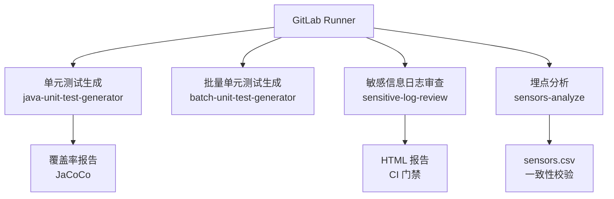
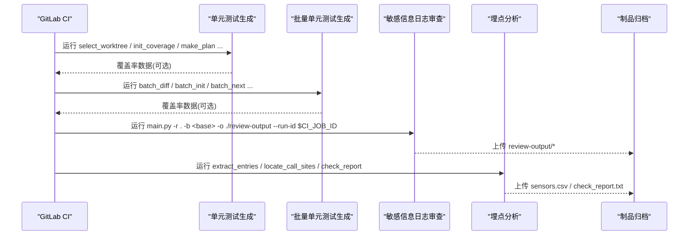
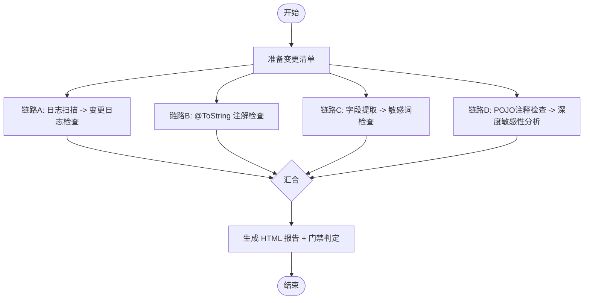
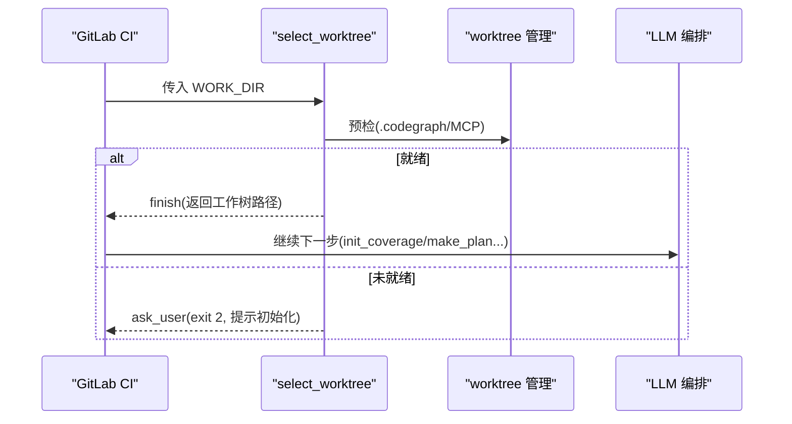
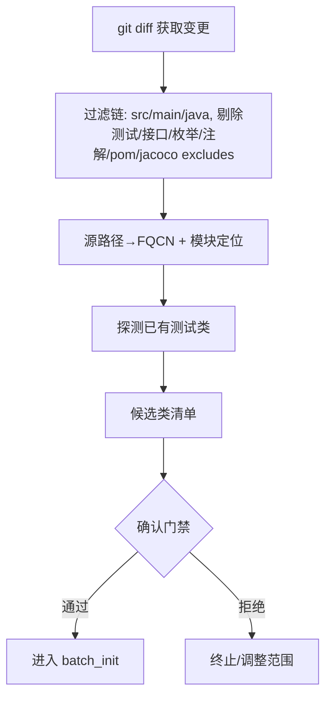
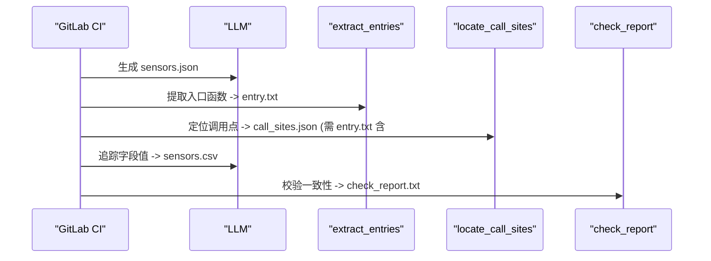
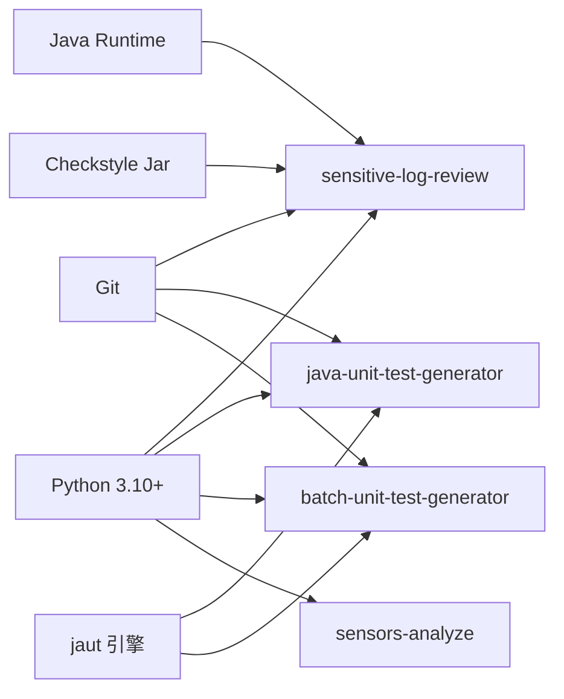

# GitLab CI 集成

<cite>
**本文引用的文件**
- [README.md](file://README.md)
- [AGENTS.md](file://AGENTS.md)
- [CLAUDE.md](file://CLAUDE.md)
- [install.sh](file://install.sh)
- [sensitive-log-review/README.md](file://sensitive-log-review/README.md)
- [sensitive-log-review/SKILL.md](file://sensitive-log-review/SKILL.md)
- [sensitive-log-review/scripts/main.py](file://sensitive-log-review/scripts/main.py)
- [java-unit-test-generator/scripts/select_worktree.py](file://java-unit-test-generator/scripts/select_worktree.py)
- [batch-unit-test-generator/scripts/batch_diff.py](file://batch-unit-test-generator/scripts/batch_diff.py)
- [sensors-analyze/CLAUDE.md](file://sensors-analyze/CLAUDE.md)
</cite>

## 目录
1. [简介](#简介)
2. [项目结构](#项目结构)
3. [核心组件](#核心组件)
4. [架构总览](#架构总览)
5. [详细组件分析](#详细组件分析)
6. [依赖关系分析](#依赖关系分析)
7. [性能与缓存优化](#性能与缓存优化)
8. [故障排除指南](#故障排除指南)
9. [结论](#结论)
10. [附录：GitLab CI 配置模板](#附录gitlab-ci-配置模板)

## 简介
本指南面向在 GitLab CI/CD 中集成 ping-skills 的工程师，覆盖以下目标：
- 在 .gitlab-ci.yml 中定义多阶段流水线（测试、审查、报告），自动化执行单元测试生成、敏感信息审查和埋点分析。
- 使用 GitLab 缓存机制优化构建性能，合理配置 Docker 镜像与环境变量。
- 集成代码质量门禁、覆盖率报告和合规性检查。
- 安全地管理管道变量，提供故障排除与调试技巧。
- 确保团队能在 GitLab 平台上高效集成这些工具到 DevOps 流程。

## 项目结构
仓库由四个独立的“技能”组成，每个技能自包含脚本、规则与单测，适合以独立 Job 或 Stage 的方式接入 CI：
- java-unit-test-generator：为单个 Java 类迭代生成 JUnit5+Mockito 测试，直至达到 JaCoCo 覆盖率阈值。
- batch-unit-test-generator：基于分支差异批量生成测试，支持批处理编排。
- sensitive-log-review：对 Java 变更进行敏感信息日志审查，输出 HTML 报告与 CI 门禁退出码。
- sensors-analyze：盘点与校验埋点调用，产出 sensors.csv 并做一致性校验。

**章节来源**
- [AGENTS.md:5-14](file://AGENTS.md#L5-L14)
- [CLAUDE.md:5-14](file://CLAUDE.md#L5-L14)

## 核心组件
- 单元测试生成器（单类/批量）：通过工作树隔离、协议驱动与 Maven/JaCoCo 集成，实现可恢复、可中断的测试生成流程。
- 敏感信息日志审查：多链路并行扫描，统一产物与门禁退出码，支持并行 run-id 隔离与 HTML 报告。
- 埋点分析：LLM 与 Python 脚本协作，抽取入口函数、定位调用点、校验 CSV 一致性。

关键行为要点：
- 单元测试生成遵循 NEXT_STEP 协议，状态持久化于 state.json，支持 resume。
- 敏感信息审查默认仅扫描变更文件，可通过 --full-scan 切换全量；支持 --fail-on 自定义门禁类别。
- 埋点分析要求 entry.txt 人工确认后再执行后续步骤，保证质量门控。

**章节来源**
- [CLAUDE.md:38-59](file://CLAUDE.md#L38-L59)
- [sensitive-log-review/SKILL.md:31-56](file://sensitive-log-review/SKILL.md#L31-L56)
- [sensors-analyze/CLAUDE.md:11-21](file://sensors-analyze/CLAUDE.md#L11-L21)

## 架构总览
下图展示 GitLab CI 中各 Skill 的编排关系与产物流向：

**图表来源**
- [java-unit-test-generator/scripts/select_worktree.py:1-47](file://java-unit-test-generator/scripts/select_worktree.py#L1-L47)
- [batch-unit-test-generator/scripts/batch_diff.py:1-17](file://batch-unit-test-generator/scripts/batch_diff.py#L1-L17)
- [sensitive-log-review/scripts/main.py:1-22](file://sensitive-log-review/scripts/main.py#L1-L22)
- [sensors-analyze/CLAUDE.md:23-47](file://sensors-analyze/CLAUDE.md#L23-L47)

## 详细组件分析

### 敏感信息日志审查（sensitive-log-review）
- 编排层主脚本将八步组织为四条并行链路，最终汇总生成 HTML 报告与门禁判定。
- 默认 changed-only 模式对比目标分支，仅扫描变更 Java 文件；支持 --full-scan。
- 退出码契约：0=通过，1=触发门禁，2=执行错误；--fail-on 可自定义拦截类别。
- 并行隔离：--run-id 用于 CI 并行场景，避免产物互相覆盖。

**图表来源**
- [sensitive-log-review/scripts/main.py:1-22](file://sensitive-log-review/scripts/main.py#L1-L22)
- [sensitive-log-review/SKILL.md:70-157](file://sensitive-log-review/SKILL.md#L70-L157)

**章节来源**
- [sensitive-log-review/README.md:20-55](file://sensitive-log-review/README.md#L20-L55)
- [sensitive-log-review/SKILL.md:31-68](file://sensitive-log-review/SKILL.md#L31-L68)
- [sensitive-log-review/scripts/main.py:83-180](file://sensitive-log-review/scripts/main.py#L83-L180)

### 单元测试生成（java-unit-test-generator）
- 第一步选择/新建 git worktree，隔离用户工作区与生成过程。
- 前置条件：工程根需存在 .codegraph 索引且 MCP 已连接，否则中止并提示初始化。
- 协议驱动：NEXT_STEP 协议控制流程，state.json 持久化，支持 resume。

**图表来源**
- [java-unit-test-generator/scripts/select_worktree.py:1-47](file://java-unit-test-generator/scripts/select_worktree.py#L1-L47)
- [java-unit-test-generator/scripts/select_worktree.py:162-200](file://java-unit-test-generator/scripts/select_worktree.py#L162-L200)

**章节来源**
- [java-unit-test-generator/scripts/select_worktree.py:1-47](file://java-unit-test-generator/scripts/select_worktree.py#L1-L47)
- [CLAUDE.md:38-51](file://CLAUDE.md#L38-L51)

### 批量单元测试生成（batch-unit-test-generator）
- 差异分析阶段：基于 git diff 过滤出候选类，解析 pom.xml 中的 jacoco excludes，探测已有测试类，触发确认门禁。
- 支持 --project-root 指定工作树，便于 CI 复用同一仓库的不同分支/工作树。

**图表来源**
- [batch-unit-test-generator/scripts/batch_diff.py:1-17](file://batch-unit-test-generator/scripts/batch_diff.py#L1-L17)
- [batch-unit-test-generator/scripts/batch_diff.py:46-193](file://batch-unit-test-generator/scripts/batch_diff.py#L46-L193)

**章节来源**
- [batch-unit-test-generator/scripts/batch_diff.py:1-17](file://batch-unit-test-generator/scripts/batch_diff.py#L1-L17)
- [batch-unit-test-generator/scripts/batch_diff.py:148-193](file://batch-unit-test-generator/scripts/batch_diff.py#L148-L193)

### 埋点分析（sensors-analyze）
- 五步工作流：LLM 产出 sensors.json → 提取入口函数 → 定位调用点 → LLM 追踪字段值 → 校验一致性。
- 关键约束：只读目标代码库；CSV 不允许动态占位符；entry.txt 必须有人工 # CONFIRMED 标记。

**图表来源**
- [sensors-analyze/CLAUDE.md:11-21](file://sensors-analyze/CLAUDE.md#L11-L21)
- [sensors-analyze/CLAUDE.md:23-47](file://sensors-analyze/CLAUDE.md#L23-L47)

**章节来源**
- [sensors-analyze/CLAUDE.md:11-21](file://sensors-analyze/CLAUDE.md#L11-L21)
- [sensors-analyze/CLAUDE.md:53-70](file://sensors-analyze/CLAUDE.md#L53-L70)

## 依赖关系分析
- 外部依赖
  - Python 3.10+（所有脚本）
  - Java Runtime（敏感信息审查的 Checkstyle）
  - Git（变更计算）
  - pytest（仅开发/测试）
- 内部依赖
  - 单元测试生成：jaut 引擎（两套副本，存在差异）
  - 敏感信息审查：common 包、词典与规则文件、Checkstyle jar
  - 埋点分析：scripts 与 schema/json/csv 产物

**图表来源**
- [sensitive-log-review/README.md:57-67](file://sensitive-log-review/README.md#L57-L67)
- [CLAUDE.md:49-51](file://CLAUDE.md#L49-L51)

**章节来源**
- [sensitive-log-review/README.md:57-67](file://sensitive-log-review/README.md#L57-L67)
- [CLAUDE.md:49-51](file://CLAUDE.md#L49-L51)

## 性能与缓存优化
- 缓存策略
  - Maven 本地仓库：~/.m2/repository（单元测试生成）
  - Python 包缓存：~/.cache/pip（若引入第三方依赖）
  - Git 对象缓存：利用 GitLab 提供的 cache 键按分支/作业 ID 区分
- 增量扫描
  - 敏感信息审查默认 changed-only，显著减少扫描范围
  - 批量单元测试生成基于 git diff 过滤候选类，避免全量扫描
- 并行执行
  - 敏感信息审查内部四链路并行
  - CI 层面不同 Skill 可并发执行（注意资源限制）

建议：
- 在 stages 中拆分 Job，充分利用并发
- 使用 artifacts 传递中间产物（如 coverage、report）
- 使用 cache 键包含分支名与作业 ID，避免污染

[本节为通用指导，不直接分析具体文件]

## 故障排除指南
- 环境变量编码
  - Windows 下设置 PYTHONIOENCODING=utf-8，避免中文乱码
- 非 Git 仓库
  - 显式传 -r/--root 指向仓库根；CI 中确保 fetch-depth 足够以支持 git diff
- Java 命令缺失
  - 安装 JRE/JDK 并确保 PATH；敏感信息审查的步骤6依赖 Java
- 变更检查无结果
  - 指定正确的 --branch；CI 中拉取完整历史或使用 origin/<base>
- 门禁失败排查
  - 查看控制台末尾的门禁计数行；打开 HTML 报告与产物清单定位问题
  - 误报走白名单豁免流程；漏报追加词典或规则
- 严格模式
  - 开启 --strict-mode 以在存在失败文件时以退出码 2 结束

**章节来源**
- [sensitive-log-review/README.md:361-483](file://sensitive-log-review/README.md#L361-L483)
- [sensitive-log-review/SKILL.md:31-56](file://sensitive-log-review/SKILL.md#L31-L56)

## 结论
通过在 GitLab CI 中分阶段编排 ping-skills，可实现：
- 自动化的单元测试生成与覆盖率达标
- 严格的敏感信息日志审查与合规门禁
- 可靠的埋点盘点与一致性校验
结合缓存、并行与制品归档，可在保证质量的同时提升流水线效率。

[本节为总结性内容，不直接分析具体文件]

## 附录：GitLab CI 配置模板
以下为可直接参考的 .gitlab-ci.yml 片段思路（请根据实际项目路径与变量替换）：

- 定义 stages：test、review、report
- test 阶段
  - 单元测试生成：选择/创建工作树，执行覆盖率收集，上传覆盖率产物
  - 批量单元测试生成：差异分析、批量生成、覆盖率收集
- review 阶段
  - 敏感信息日志审查：运行 main.py，输出 HTML 报告与门禁退出码
- report 阶段
  - 埋点分析：抽取入口、定位调用点、校验一致性，上传 sensors.csv 与报告
- 缓存与制品
  - 缓存 Maven 仓库、Python 缓存
  - 归档 review-output、coverage、sensors.csv、check_report.txt

示例要点（概念性说明）：
- 使用 variables 定义 BASE_BRANCH、RUN_ID、OUTPUT_DIR 等
- 使用 cache 键包含 branch 与 job id，避免跨分支污染
- 使用 artifacts.when: always 确保报告始终归档
- 使用 rules 或 only/except 控制 MR 与分支触发

[本节为概念性模板说明，不直接分析具体文件]