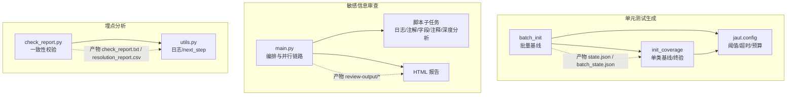
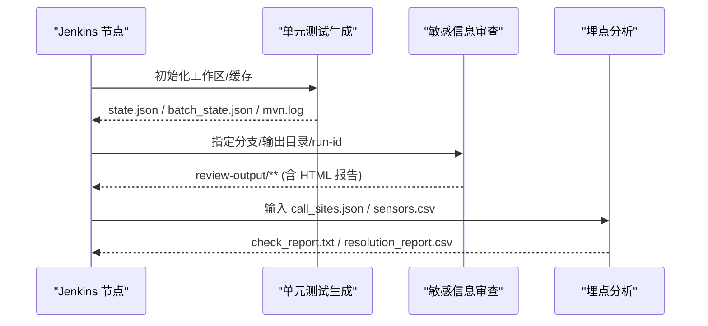
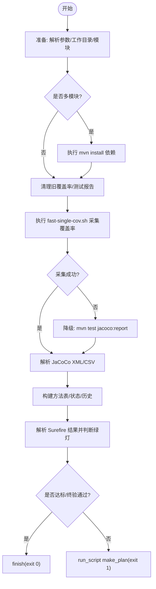
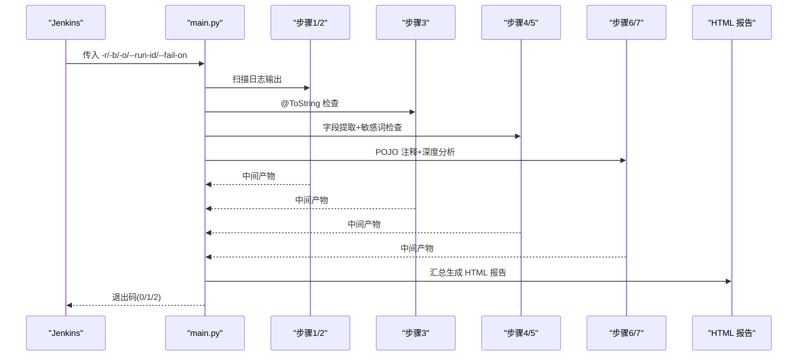
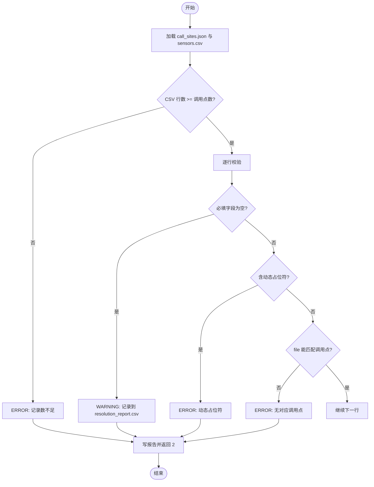
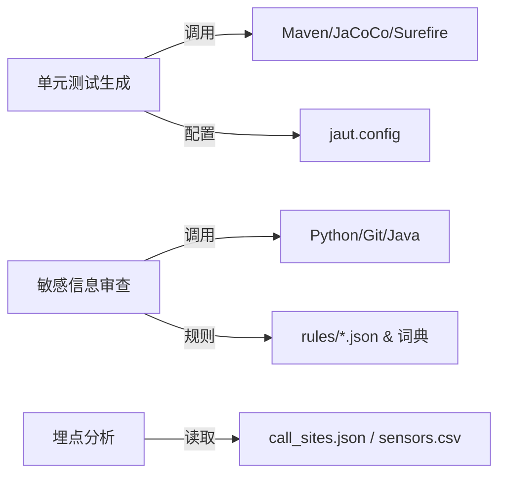

# Jenkins 流水线集成

<cite>
**本文引用的文件**
- [README.md](file://README.md)
- [install.sh](file://install.sh)
- [sensitive-log-review/SKILL.md](file://sensitive-log-review/SKILL.md)
- [sensitive-log-review/scripts/main.py](file://sensitive-log-review/scripts/main.py)
- [sensitive-log-review/README.md](file://sensitive-log-review/README.md)
- [batch-unit-test-generator/scripts/batch_init.py](file://batch-unit-test-generator/scripts/batch_init.py)
- [java-unit-test-generator/scripts/init_coverage.py](file://java-unit-test-generator/scripts/init_coverage.py)
- [batch-unit-test-generator/scripts/jaut/config.py](file://batch-unit-test-generator/scripts/jaut/config.py)
- [java-unit-test-generator/scripts/jaut/config.py](file://java-unit-test-generator/scripts/jaut/config.py)
- [sensors-analyze/scripts/check_report.py](file://sensors-analyze/scripts/check_report.py)
- [sensors-analyze/scripts/utils.py](file://sensors-analyze/scripts/utils.py)
</cite>

## 目录
1. [简介](#简介)
2. [项目结构](#项目结构)
3. [核心组件](#核心组件)
4. [架构总览](#架构总览)
5. [详细组件分析](#详细组件分析)
6. [依赖关系分析](#依赖关系分析)
7. [性能与并行优化](#性能与并行优化)
8. [Jenkins 流水线示例与最佳实践](#jenkins-流水线示例与最佳实践)
9. [故障排除指南](#故障排除指南)
10. [结论](#结论)

## 简介
本指南面向在 Jenkins 平台上集成 ping-skills 工具链的工程师，覆盖单元测试生成、敏感信息审查和埋点分析三大能力。文档提供：
- 构建环境准备、依赖安装、Maven 缓存策略
- 各工具的命令调用方式、参数与退出码契约
- 并行执行与产物归档建议
- 代码质量检查、覆盖率报告与合规性检查步骤
- 常见失败原因与排障方法

## 项目结构
仓库包含三个主要工具域：
- 单元测试生成（批量与单类）：基于 Maven + JaCoCo + Surefire，支持多模块、工作树隔离、状态持久化与预算控制
- 敏感信息日志审查：Python 编排的多阶段扫描与 HTML 报告，支持变更范围扫描与门禁
- 埋点分析校验：对上报数据与调用点一致性进行校验，输出结构化报告

图表来源
- [batch-unit-test-generator/scripts/batch_init.py:1-24](file://batch-unit-test-generator/scripts/batch_init.py#L1-L24)
- [java-unit-test-generator/scripts/init_coverage.py:1-35](file://java-unit-test-generator/scripts/init_coverage.py#L1-L35)
- [batch-unit-test-generator/scripts/jaut/config.py:1-181](file://batch-unit-test-generator/scripts/jaut/config.py#L1-L181)
- [java-unit-test-generator/scripts/jaut/config.py:1-172](file://java-unit-test-generator/scripts/jaut/config.py#L1-L172)
- [sensitive-log-review/scripts/main.py:1-22](file://sensitive-log-review/scripts/main.py#L1-L22)
- [sensors-analyze/scripts/check_report.py:1-18](file://sensors-analyze/scripts/check_report.py#L1-L18)
- [sensors-analyze/scripts/utils.py:1-51](file://sensors-analyze/scripts/utils.py#L1-L51)

章节来源
- [README.md:1-1](file://README.md#L1-L1)
- [install.sh:1-289](file://install.sh#L1-L289)

## 核心组件
- 单元测试生成
  - 批量基线：一次 install + 一次 mvn，聚合 JaCoCo/Surefire，为每个目标类生成 state.json 并排序委派后续认领
  - 单类基线/终验：fast-single-cov 采集覆盖率，解析 surefire 结果，依据门槛与测试绿灯决策下一步
  - 配置中心：阈值、JaCoCo 版本、超时、预算、工作树命名等集中管理
- 敏感信息审查
  - 四链路并行：日志扫描→变更日志检查；@ToString 检查；字段提取→敏感词检查；POJO 注释→深度分析；最终生成 HTML 报告
  - 退出码契约：0 通过、1 触发门禁、2 执行错误；支持 --doctor 环境诊断
- 埋点分析
  - 校验 CSV 与 call_sites.json 的一致性，检测动态占位符与空字段，输出 PASS/WARN/FAIL 及人工复核报表

章节来源
- [batch-unit-test-generator/scripts/batch_init.py:1-24](file://batch-unit-test-generator/scripts/batch_init.py#L1-L24)
- [java-unit-test-generator/scripts/init_coverage.py:1-35](file://java-unit-test-generator/scripts/init_coverage.py#L1-L35)
- [batch-unit-test-generator/scripts/jaut/config.py:1-181](file://batch-unit-test-generator/scripts/jaut/config.py#L1-L181)
- [java-unit-test-generator/scripts/jaut/config.py:1-172](file://java-unit-test-generator/scripts/jaut/config.py#L1-L172)
- [sensitive-log-review/scripts/main.py:1-22](file://sensitive-log-review/scripts/main.py#L1-L22)
- [sensors-analyze/scripts/check_report.py:1-18](file://sensors-analyze/scripts/check_report.py#L1-L18)

## 架构总览
下图展示 Jenkins 中三类任务的典型执行流与产物流转：

图表来源
- [batch-unit-test-generator/scripts/batch_init.py:114-159](file://batch-unit-test-generator/scripts/batch_init.py#L114-L159)
- [java-unit-test-generator/scripts/init_coverage.py:193-236](file://java-unit-test-generator/scripts/init_coverage.py#L193-L236)
- [sensitive-log-review/scripts/main.py:770-800](file://sensitive-log-review/scripts/main.py#L770-L800)
- [sensors-analyze/scripts/check_report.py:69-93](file://sensors-analyze/scripts/check_report.py#L69-L93)

## 详细组件分析

### 单元测试生成（批量与单类）
- 批量基线（batch_init）
  - 读取候选清单，记录 git 基线，按需 install，清理旧报告，执行一次 mvn，聚合 jacoco/surefire，为每个类生成 state.json 与 coverage.json，生成 batch_state.json 并委派首个类由 batch_next 处理
  - 关键路径：依赖安装、mvn 执行、覆盖率解析、方法表构建、大类拆分与分组
- 单类基线/终验（init_coverage）
  - 解析目标类与模块，自动创建桩测试类确保覆盖率可采集，清理旧报告后执行 fast-single-cov.sh，若失败则降级到 mvn test jacoco:report
  - 解析 surefire 结果，计算绿灯与达标判定，写入 state.json 与 coverage.json，进入 make_plan 或 finish
- 配置项（jaut.config）
  - 覆盖率阈值、JaCoCo 版本、Maven 超时、进度报告间隔、工作树命名规则、批量预算、默认分支探测顺序等

图表来源
- [java-unit-test-generator/scripts/init_coverage.py:193-236](file://java-unit-test-generator/scripts/init_coverage.py#L193-L236)
- [java-unit-test-generator/scripts/init_coverage.py:238-341](file://java-unit-test-generator/scripts/init_coverage.py#L238-L341)
- [batch-unit-test-generator/scripts/batch_init.py:114-159](file://batch-unit-test-generator/scripts/batch_init.py#L114-L159)
- [batch-unit-test-generator/scripts/jaut/config.py:81-118](file://batch-unit-test-generator/scripts/jaut/config.py#L81-L118)
- [java-unit-test-generator/scripts/jaut/config.py:101-131](file://java-unit-test-generator/scripts/jaut/config.py#L101-L131)

章节来源
- [batch-unit-test-generator/scripts/batch_init.py:1-24](file://batch-unit-test-generator/scripts/batch_init.py#L1-L24)
- [java-unit-test-generator/scripts/init_coverage.py:1-35](file://java-unit-test-generator/scripts/init_coverage.py#L1-L35)
- [batch-unit-test-generator/scripts/jaut/config.py:1-181](file://batch-unit-test-generator/scripts/jaut/config.py#L1-L181)
- [java-unit-test-generator/scripts/jaut/config.py:1-172](file://java-unit-test-generator/scripts/jaut/config.py#L1-L172)

### 敏感信息日志审查
- 编排流程（main.py）
  - 四链路并行：A(日志扫描→变更日志检查)、B(@ToString 检查)、C(字段提取→敏感词检查)、D(POJO 注释→深度分析)，汇总后生成 HTML 报告
  - 变更清单准备：仅变更模式时计算 changed-java.files 与 changed-pojo.files
  - 产物：log-print-ok.list、log-print-violation.list、miss-tostring-annotation.list、sensitive.results、unqualified.results、pojo-changed.list、pojo-miss-comments.txt、analyze-sensitize.result、failed-files.list、HTML 报告
- 退出码与门禁
  - 0 通过、1 触发门禁（默认 violation,sensitive）、2 执行错误
  - 支持 --doctor 环境诊断（Python/java/git/Checkstyle jar/规则与词典/输出目录）
- CI 集成参考
  - README 提供 Jenkins Declarative Pipeline 片段，演示如何设置环境变量、运行 main.py、归档产物

图表来源
- [sensitive-log-review/scripts/main.py:187-269](file://sensitive-log-review/scripts/main.py#L187-L269)
- [sensitive-log-review/scripts/main.py:300-322](file://sensitive-log-review/scripts/main.py#L300-L322)
- [sensitive-log-review/scripts/main.py:353-505](file://sensitive-log-review/scripts/main.py#L353-L505)
- [sensitive-log-review/README.md:175-203](file://sensitive-log-review/README.md#L175-L203)

章节来源
- [sensitive-log-review/scripts/main.py:1-22](file://sensitive-log-review/scripts/main.py#L1-L22)
- [sensitive-log-review/SKILL.md:31-57](file://sensitive-log-review/SKILL.md#L31-L57)
- [sensitive-log-review/README.md:167-203](file://sensitive-log-review/README.md#L167-L203)

### 埋点分析校验
- 校验规则
  - ERROR（导致 FAIL）：CSV 行数不足、file 无法匹配调用点、字段含动态占位符
  - WARNING（不影响 PASS/FAIL）：必填非空字段为空，输出 resolution_report.csv 供人工复核
- 退出码：0 PASS、1 执行异常、2 FAIL、3 WARN
- 辅助工具：utils.py 统一日志与 next_step 输出

图表来源
- [sensors-analyze/scripts/check_report.py:69-145](file://sensors-analyze/scripts/check_report.py#L69-L145)
- [sensors-analyze/scripts/check_report.py:148-247](file://sensors-analyze/scripts/check_report.py#L148-L247)
- [sensors-analyze/scripts/utils.py:16-51](file://sensors-analyze/scripts/utils.py#L16-L51)

章节来源
- [sensors-analyze/scripts/check_report.py:1-18](file://sensors-analyze/scripts/check_report.py#L1-L18)
- [sensors-analyze/scripts/utils.py:1-51](file://sensors-analyze/scripts/utils.py#L1-L51)

## 依赖关系分析
- 单元测试生成
  - 依赖 Maven、Java、JaCoCo、Surefire；通过 jaut.config 统一管理阈值、超时、预算与工作树策略
  - 批量与单类共享 maven/jacoco/surefire/report 等模块
- 敏感信息审查
  - Python 3.10+、Git、Java Runtime（用于 Checkstyle），内部规则与词典文件
  - 使用 ThreadPoolExecutor 实现四链路并行
- 埋点分析
  - Python，依赖 JSON/CSV 解析，可选 ripgrep（utils.check_rg_available）

图表来源
- [batch-unit-test-generator/scripts/jaut/config.py:81-118](file://batch-unit-test-generator/scripts/jaut/config.py#L81-L118)
- [java-unit-test-generator/scripts/jaut/config.py:101-131](file://java-unit-test-generator/scripts/jaut/config.py#L101-L131)
- [sensitive-log-review/scripts/main.py:777-780](file://sensitive-log-review/scripts/main.py#L777-L780)
- [sensors-analyze/scripts/check_report.py:69-93](file://sensors-analyze/scripts/check_report.py#L69-L93)

章节来源
- [batch-unit-test-generator/scripts/jaut/config.py:1-181](file://batch-unit-test-generator/scripts/jaut/config.py#L1-L181)
- [java-unit-test-generator/scripts/jaut/config.py:1-172](file://java-unit-test-generator/scripts/jaut/config.py#L1-L172)
- [sensitive-log-review/scripts/main.py:777-780](file://sensitive-log-review/scripts/main.py#L777-L780)
- [sensors-analyze/scripts/check_report.py:69-93](file://sensors-analyze/scripts/check_report.py#L69-L93)

## 性能与并行优化
- 单元测试生成
  - 批量基线仅一次 install 与一次 mvn，减少重复开销
  - 使用 fast-single-cov.sh 提升单类覆盖率采集速度，失败时自动降级
  - 通过 JAVA_UT_MVN_TIMEOUT 控制 Maven 超时，避免长时间阻塞
- 敏感信息审查
  - 四链路并行（ThreadPoolExecutor max_workers=4），显著缩短端到端时间
  - 变更范围扫描（changed-only）降低扫描规模
- 埋点分析
  - 结构化校验快速定位问题，必要时输出人工复核报表

[本节为通用性能建议，不直接分析具体文件]

## Jenkins 流水线示例与最佳实践
以下示例为概念性说明，实际命令与参数请根据仓库中的脚本与文档调整。

- 构建环境准备
  - 安装 Java、Maven、Python、Git；配置 Maven 本地仓库缓存（~/.m2/repository）
  - 如需安装 skill 到项目，可使用仓库提供的安装脚本以将工具复制到项目目录
- 单元测试生成
  - 批量基线：在项目根执行批量初始化，产出 state.json 与 batch_state.json，随后按批次委派后续步骤
  - 单类基线/终验：针对目标类执行基线或终验，依据阈值与测试绿灯决定下一步
  - 缓存策略：缓存 Maven 依赖与 JaCoco 报告目录，减少重复构建
- 敏感信息审查
  - 在 PR/MR 阶段执行，指定目标分支与输出目录，使用 --run-id 隔离并行构建产物
  - 归档 review-output 下的 HTML 报告与中间产物
- 埋点分析
  - 在数据产出后执行一致性校验，归档 check_report.txt 与 resolution_report.csv
- 代码质量与合规
  - 结合 Checkstyle、SonarQube 等工具，将审查结果纳入质量门禁
  - 覆盖率报告由 JaCoCo 生成，可在 Jenkins 中发布趋势图

注意：上述步骤的命令与参数请以各工具脚本的实际入口为准，并遵循其退出码契约进行门禁判定。

[本节为通用实践指导，不直接分析具体文件]

## 故障排除指南
- 单元测试生成
  - mvn 失败：查看 mvn.log，确认依赖安装与测试编译；必要时增加 JAVA_UT_MVN_TIMEOUT
  - 覆盖率报告缺失：确认 fast-single-cov.sh 成功或已降级到 mvn test jacoco:report；检查 JaCoCo 插件与 XML 输出
  - 目标类未找到：检查 FQCN 与源文件位置；如为方法模式，确认方法名存在
- 敏感信息审查
  - 退出码 2：检查 Python/java/git 可用性、规则与词典文件完整性、输出目录权限；使用 --doctor 诊断
  - 退出码 1：查看 HTML 报告与违规清单，修复日志输出、@ToString 注解、敏感字段与注释问题
  - 并行冲突：使用 --run-id 隔离不同构建的产物目录
- 埋点分析
  - 退出码 2：修正 CSV 行数不足、file 格式或动态占位符问题
  - 退出码 3：根据 resolution_report.csv 补充缺失字段

章节来源
- [java-unit-test-generator/scripts/init_coverage.py:193-236](file://java-unit-test-generator/scripts/init_coverage.py#L193-L236)
- [sensitive-log-review/scripts/main.py:582-702](file://sensitive-log-review/scripts/main.py#L582-L702)
- [sensitive-log-review/README.md:167-203](file://sensitive-log-review/README.md#L167-L203)
- [sensors-analyze/scripts/check_report.py:148-247](file://sensors-analyze/scripts/check_report.py#L148-L247)

## 结论
通过将单元测试生成、敏感信息审查与埋点分析整合进 Jenkins 流水线，可实现：
- 自动化覆盖率基线与持续改进
- 安全合规前置检查与可视化报告
- 数据上报一致性与质量门禁
配合合理的缓存、并行与产物归档策略，团队可在现有 Jenkins 环境中高效落地这些能力，持续提升代码质量与安全水位。

[本节为总结性内容，不直接分析具体文件]