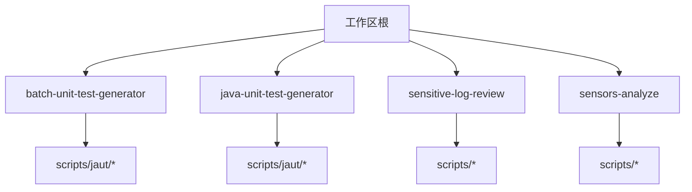
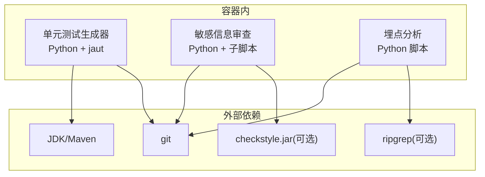
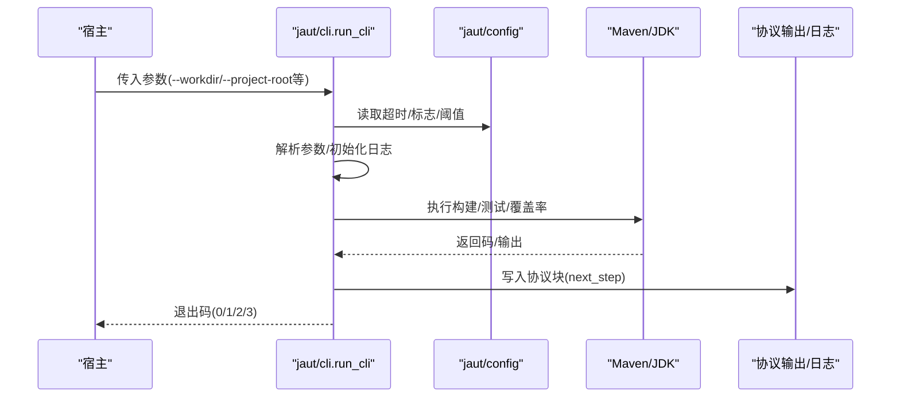
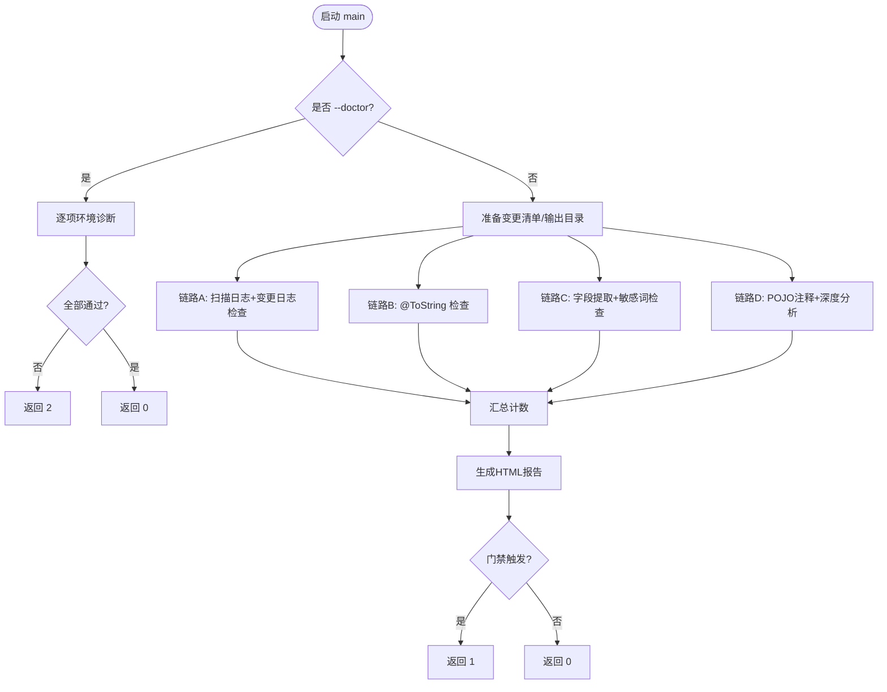
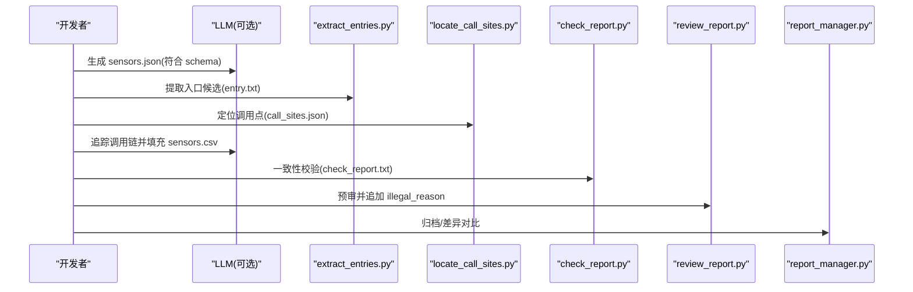
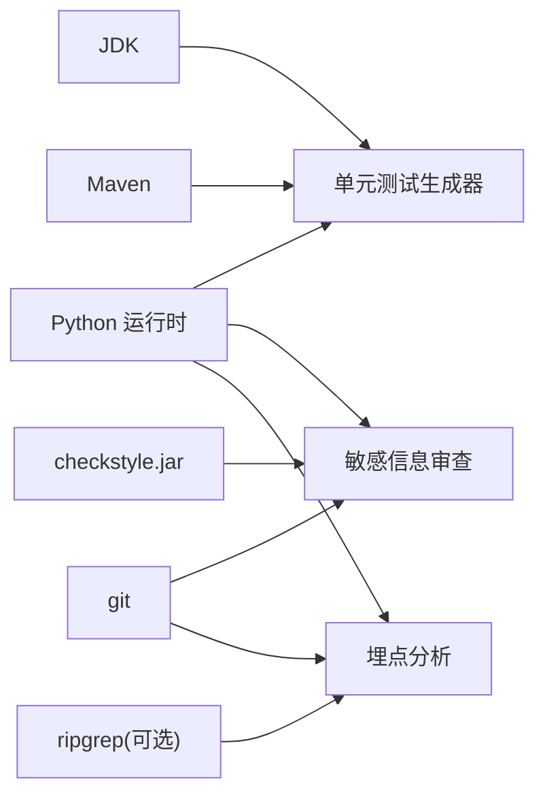

# Docker 容器化

<cite>
**本文引用的文件**
- [README.md](file://README.md)
- [install.sh](file://install.sh)
- [batch-unit-test-generator/scripts/jaut/config.py](file://batch-unit-test-generator/scripts/jaut/config.py)
- [batch-unit-test-generator/scripts/jaut/cli.py](file://batch-unit-test-generator/scripts/jaut/cli.py)
- [sensitive-log-review/scripts/main.py](file://sensitive-log-review/scripts/main.py)
- [sensitive-log-review/scripts/common/__init__.py](file://sensitive-log-review/scripts/common/__init__.py)
- [sensors-analyze/CLAUDE.md](file://sensors-analyze/CLAUDE.md)
</cite>

## 目录
1. [简介](#简介)
2. [项目结构](#项目结构)
3. [核心组件](#核心组件)
4. [架构总览](#架构总览)
5. [详细组件分析](#详细组件分析)
6. [依赖关系分析](#依赖关系分析)
7. [性能与镜像优化](#性能与镜像优化)
8. [故障排查指南](#故障排查指南)
9. [结论](#结论)
10. [附录：构建与运行脚本示例](#附录构建与运行脚本示例)

## 简介
本方案为 ping-skills 提供完整的 Docker 容器化指南，覆盖多阶段构建、基础镜像选择（Python、Java/Maven）、依赖安装优化、镜像体积优化、环境变量配置、文件权限与网络访问、健康检查、日志输出、资源限制，以及开发/测试/生产差异化构建。同时给出各技能工具在容器中的运行方式：单元测试生成器、敏感信息审查工具、埋点分析工具。

## 项目结构
仓库包含三个主要技能目录：
- batch-unit-test-generator / java-unit-test-generator：基于 Python 的 Java 单元测试生成与覆盖率提升工具，依赖 Maven 与 JDK。
- sensitive-log-review：基于 Python 的敏感信息与日志合规审查工具，依赖 git、可选 checkstyle jar。
- sensors-analyze：基于 Python 的埋点审计工具，仅使用标准库，可选 ripgrep。

**章节来源**
- [README.md:1-1](file://README.md#L1-L1)

## 核心组件
- 单元测试生成器（batch/java）：通过 CLI 统一入口解析参数、初始化日志、执行步骤并输出协议块；Maven 超时与行为由配置模块集中管理。
- 敏感信息审查工具：编排层并行执行多个子步骤，生成 HTML 报告与环境诊断；支持 --doctor 模式进行环境自检。
- 埋点分析工具：以脚本流水线为主，读取目标代码库，产出中间产物并进行一致性校验与归档。

关键职责映射：
- 参数解析与协议输出：batch-unit-test-generator/scripts/jaut/cli.py
- 运行时配置与超时控制：batch-unit-test-generator/scripts/jaut/config.py
- 审查编排与报告生成：sensitive-log-review/scripts/main.py
- 公共能力包说明：sensitive-log-review/scripts/common/__init__.py
- 埋点工具流程说明：sensors-analyze/CLAUDE.md

**章节来源**
- [batch-unit-test-generator/scripts/jaut/cli.py:1-129](file://batch-unit-test-generator/scripts/jaut/cli.py#L1-L129)
- [batch-unit-test-generator/scripts/jaut/config.py:1-181](file://batch-unit-test-generator/scripts/jaut/config.py#L1-L181)
- [sensitive-log-review/scripts/main.py:1-800](file://sensitive-log-review/scripts/main.py#L1-L800)
- [sensitive-log-review/scripts/common/__init__.py:1-11](file://sensitive-log-review/scripts/common/__init__.py#L1-L11)
- [sensors-analyze/CLAUDE.md:1-73](file://sensors-analyze/CLAUDE.md#L1-L73)

## 架构总览
下图展示三类技能在容器中的运行关系与外部依赖。

**图表来源**
- [batch-unit-test-generator/scripts/jaut/config.py:80-130](file://batch-unit-test-generator/scripts/jaut/config.py#L80-L130)
- [sensitive-log-review/scripts/main.py:537-702](file://sensitive-log-review/scripts/main.py#L537-L702)
- [sensors-analyze/CLAUDE.md:49-52](file://sensors-analyze/CLAUDE.md#L49-L52)

## 详细组件分析

### 单元测试生成器（batch/java）
- 统一 CLI 入口负责参数解析、日志初始化、异常到协议块的转换与退出码约定。
- 配置模块集中定义 Maven 超时、进度输出、always flags、预算与阈值等。

**图表来源**
- [batch-unit-test-generator/scripts/jaut/cli.py:63-129](file://batch-unit-test-generator/scripts/jaut/cli.py#L63-L129)
- [batch-unit-test-generator/scripts/jaut/config.py:80-130](file://batch-unit-test-generator/scripts/jaut/config.py#L80-L130)

**章节来源**
- [batch-unit-test-generator/scripts/jaut/cli.py:1-129](file://batch-unit-test-generator/scripts/jaut/cli.py#L1-L129)
- [batch-unit-test-generator/scripts/jaut/config.py:1-181](file://batch-unit-test-generator/scripts/jaut/config.py#L1-L181)

### 敏感信息审查工具
- 编排层将任务分为四条链路并行执行，汇总计数并生成 HTML 报告。
- 提供 --doctor 模式对运行环境进行逐项检查（Python、java、git、checkstyle jar、规则/词典文件、输出目录可写性、编码）。

**图表来源**
- [sensitive-log-review/scripts/main.py:187-300](file://sensitive-log-review/scripts/main.py#L187-L300)
- [sensitive-log-review/scripts/main.py:353-505](file://sensitive-log-review/scripts/main.py#L353-L505)
- [sensitive-log-review/scripts/main.py:582-702](file://sensitive-log-review/scripts/main.py#L582-L702)

**章节来源**
- [sensitive-log-review/scripts/main.py:1-800](file://sensitive-log-review/scripts/main.py#L1-L800)
- [sensitive-log-review/scripts/common/__init__.py:1-11](file://sensitive-log-review/scripts/common/__init__.py#L1-L11)

### 埋点分析工具
- 以脚本流水线为主，依赖 JSON Schema 校验、正则提取、调用点定位、CSV 校验与归档。
- 强调只读分析、无第三方依赖、人工确认节点与版本漂移对比。

**图表来源**
- [sensors-analyze/CLAUDE.md:11-47](file://sensors-analyze/CLAUDE.md#L11-L47)
- [sensors-analyze/CLAUDE.md:53-69](file://sensors-analyze/CLAUDE.md#L53-L69)

**章节来源**
- [sensors-analyze/CLAUDE.md:1-73](file://sensors-analyze/CLAUDE.md#L1-L73)

## 依赖关系分析
- Python 运行时：所有技能均为 Python 脚本，无需额外依赖或仅需标准库。
- Java/Maven：单元测试生成器需要 JDK 与 Maven，用于编译、运行测试与生成覆盖率。
- Git：审查与埋点工具均依赖 git 获取变更与仓库信息。
- 可选工具：
  - checkstyle.jar：敏感信息审查工具用于注解检查与规则校验。
  - ripgrep：埋点分析工具优先使用 rg 加速 grep，回退到纯 Python 实现。

**图表来源**
- [batch-unit-test-generator/scripts/jaut/config.py:80-130](file://batch-unit-test-generator/scripts/jaut/config.py#L80-L130)
- [sensitive-log-review/scripts/main.py:537-702](file://sensitive-log-review/scripts/main.py#L537-L702)
- [sensors-analyze/CLAUDE.md:49-52](file://sensors-analyze/CLAUDE.md#L49-L52)

**章节来源**
- [batch-unit-test-generator/scripts/jaut/config.py:80-130](file://batch-unit-test-generator/scripts/jaut/config.py#L80-L130)
- [sensitive-log-review/scripts/main.py:537-702](file://sensitive-log-review/scripts/main.py#L537-L702)
- [sensors-analyze/CLAUDE.md:49-52](file://sensors-analyze/CLAUDE.md#L49-L52)

## 性能与镜像优化
- 多阶段构建
  - 构建阶段：安装 JDK/Maven、缓存 Maven 本地仓库、下载依赖。
  - 运行阶段：仅复制必要脚本与运行时，剔除构建缓存与临时文件。
- 基础镜像选择
  - Python 镜像：选用 slim 或 distroless 变体以减少体积。
  - Java/Maven 镜像：选用带 JDK 的精简镜像，并在构建阶段缓存 .m2。
- 依赖安装优化
  - 分层缓存：先复制 requirements/脚本再安装依赖，利用 Docker 层缓存。
  - 单用户运行：避免 root 权限，减少权限相关开销。
- 镜像大小优化策略
  - 删除 apt/pip 缓存、文档、man 页。
  - 合并 RUN 指令，减少层数。
  - 使用 .dockerignore 排除 tests、__pycache__、*.log 等。
- 健康检查
  - 单元测试生成器：执行一次轻量命令（如 mvn -version）并返回 0。
  - 敏感信息审查：执行 --doctor 并期望 0。
  - 埋点分析：执行一个空输入的快速校验命令。
- 日志输出
  - 统一输出到 stdout/stderr，便于容器日志收集。
  - 单元测试生成器内部日志写入 workdir/logs 子目录。
- 资源限制
  - 建议设置 CPU/内存限制，防止 Maven 构建占用过高资源。
  - 针对大仓库，合理设置超时与线程数。

[本节为通用指导，不直接分析具体文件]

## 故障排查指南
- 单元测试生成器
  - 常见错误：Maven 不可用、超时、测试失败导致无覆盖率。
  - 处理：检查 JAVA_HOME、PATH、Maven 版本；调整 JAVA_UT_MVN_TIMEOUT；查看 logs 子目录。
- 敏感信息审查
  - 常见错误：git 不可用、checkstyle jar 缺失或校验失败、输出目录不可写。
  - 处理：使用 --doctor 逐项检查；确保 checkstyle.jar 与 sha256 一致；挂载可写输出目录。
- 埋点分析
  - 常见错误：缺少 entry.txt 的 CONFIRMED 标记、rg 不可用导致性能下降。
  - 处理：人工确认 entry.txt；安装 rg 或接受回退实现。

**章节来源**
- [batch-unit-test-generator/scripts/jaut/config.py:80-130](file://batch-unit-test-generator/scripts/jaut/config.py#L80-L130)
- [sensitive-log-review/scripts/main.py:537-702](file://sensitive-log-review/scripts/main.py#L537-L702)
- [sensors-analyze/CLAUDE.md:49-69](file://sensors-analyze/CLAUDE.md#L49-L69)

## 结论
本方案为 ping-skills 提供了统一的容器化路径：以多阶段构建为基础，结合不同技能的依赖特性，实现最小化镜像、稳定运行与可观测性。通过环境变量、健康检查、日志与资源限制的配置，可在开发、测试与生产环境中保持一致的行为与质量。

[本节为总结，不直接分析具体文件]

## 附录：构建与运行脚本示例

### 基础镜像与多阶段构建要点
- 构建阶段
  - 安装 JDK/Maven，缓存 .m2 目录。
  - 复制 Python 脚本与依赖，安装依赖（如有）。
- 运行阶段
  - 仅复制必要脚本与运行时。
  - 设置非 root 用户，挂载数据卷到工作目录。
- 环境变量
  - JAVA_UT_MVN_TIMEOUT：覆盖 Maven 超时。
  - PYTHONIOENCODING：Windows 下建议 utf-8。
  - 其他工具变量按需注入。

[本节为通用指导，不直接分析具体文件]

### 开发环境
- 镜像：包含 JDK/Maven 与 Python 的完整镜像。
- 挂载：源码与工作目录，启用增量构建缓存。
- 调试：开启 verbose 输出，保留中间产物。

[本节为通用指导，不直接分析具体文件]

### 测试环境
- 镜像：精简版，仅含运行所需依赖。
- 健康检查：单元测试生成器执行 mvn -version；敏感信息审查执行 --doctor。
- 资源限制：CPU/内存上限，避免 CI 抖动。

[本节为通用指导，不直接分析具体文件]

### 生产环境
- 镜像：最小化运行镜像，移除构建缓存与调试信息。
- 安全：非 root 用户，只读文件系统（除输出目录）。
- 日志：stdout/stderr 输出，外部日志系统采集。

[本节为通用指导，不直接分析具体文件]

### 运行各技能工具的容器化方式
- 单元测试生成器
  - 入口：python scripts/jaut/cli.py ...
  - 参数：--workdir 或 --project-root；超时由 JAVA_UT_MVN_TIMEOUT 控制。
  - 输出：协议块与日志（logs 子目录）。
- 敏感信息审查
  - 入口：python scripts/main.py -r <repo> -b <branch> -o <out>
  - 诊断：python scripts/main.py --doctor
  - 产物：HTML 报告与中间文件。
- 埋点分析
  - 入口：按 CLAUDE.md 的步骤依次执行 extract_entries.py、locate_call_sites.py、check_report.py、review_report.py、report_manager.py。
  - 约束：只读分析，entry.txt 需 CONFIRMED 标记。

**章节来源**
- [batch-unit-test-generator/scripts/jaut/cli.py:63-129](file://batch-unit-test-generator/scripts/jaut/cli.py#L63-L129)
- [batch-unit-test-generator/scripts/jaut/config.py:80-130](file://batch-unit-test-generator/scripts/jaut/config.py#L80-L130)
- [sensitive-log-review/scripts/main.py:705-729](file://sensitive-log-review/scripts/main.py#L705-L729)
- [sensors-analyze/CLAUDE.md:23-47](file://sensors-analyze/CLAUDE.md#L23-L47)

### 安装与集成脚本
- install.sh 提供交互式安装 skill 到目标工具目录的能力，支持多选与清理非必要文件。
- 可用于将技能复制到 CI 或本地环境，便于后续容器化复用。

**章节来源**
- [install.sh:1-289](file://install.sh#L1-L289)