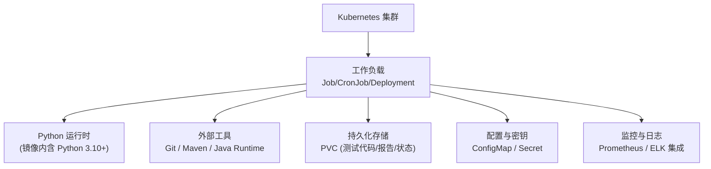
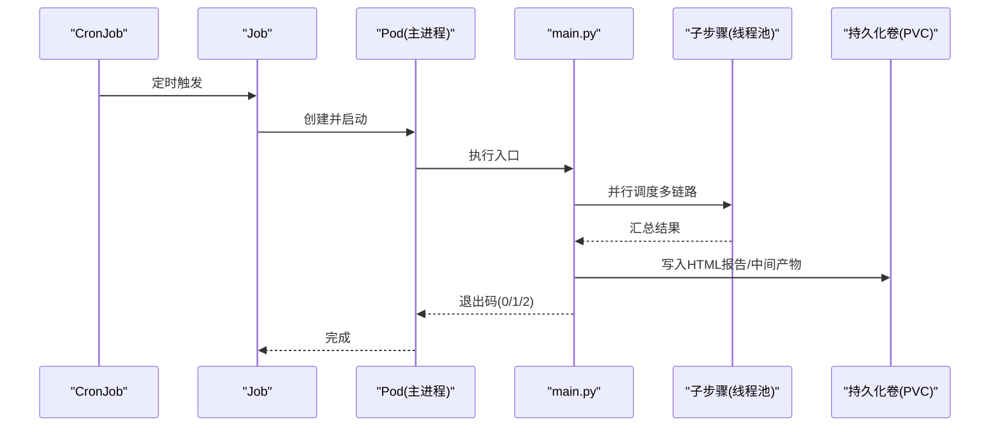
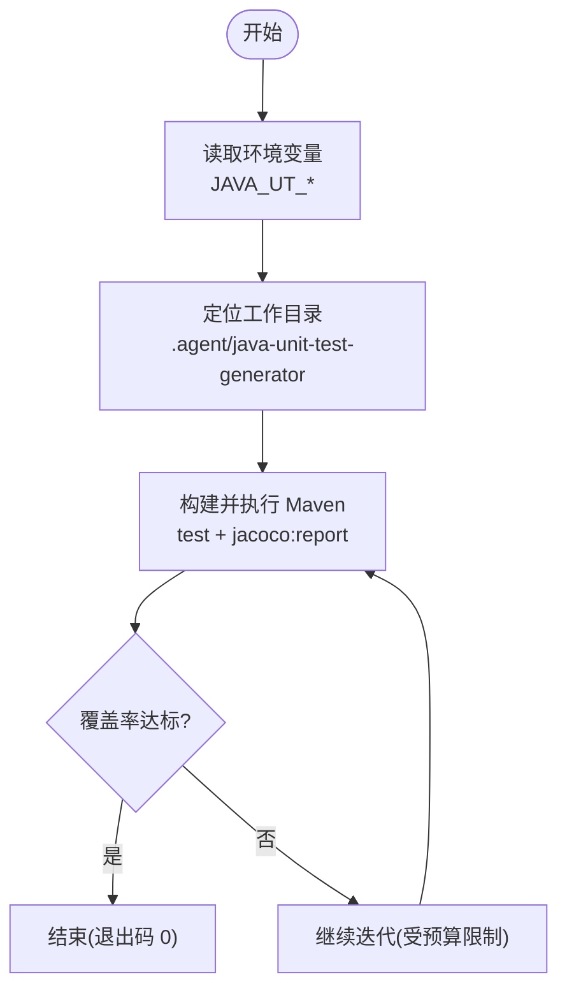
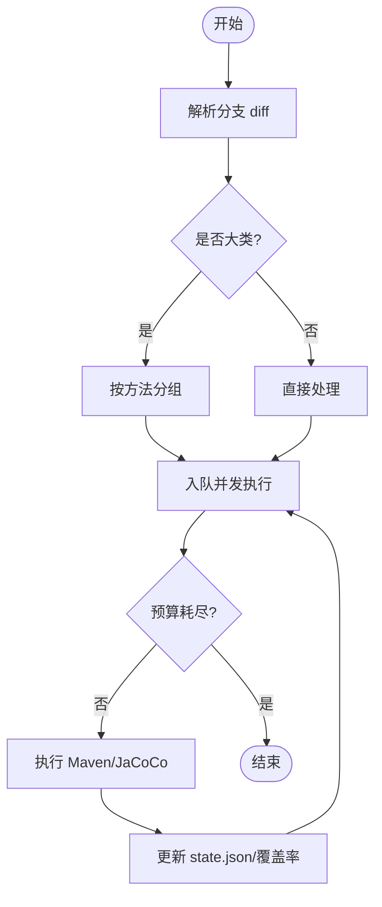
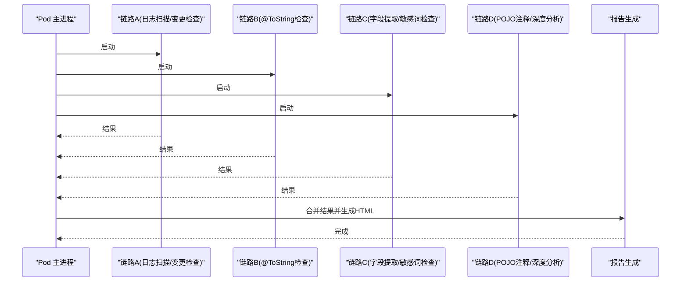
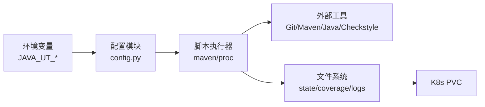

# Kubernetes 部署

<cite>
**本文引用的文件**
- [README.md](file://README.md)
- [CLAUDE.md](file://CLAUDE.md)
- [AGENTS.md](file://AGENTS.md)
- [install.sh](file://install.sh)
- [java-unit-test-generator/scripts/jaut/config.py](file://java-unit-test-generator/scripts/jaut/config.py)
- [batch-unit-test-generator/scripts/jaut/config.py](file://batch-unit-test-generator/scripts/jaut/config.py)
- [sensitive-log-review/scripts/main.py](file://sensitive-log-review/scripts/main.py)
- [sensitive-log-review/scripts/common/paths.py](file://sensitive-log-review/scripts/common/paths.py)
- [java-unit-test-generator/tests/test_maven.py](file://java-unit-test-generator/tests/test_maven.py)
- [batch-unit-test-generator/tests/test_maven.py](file://batch-unit-test-generator/tests/test_maven.py)
</cite>

## 目录
1. [简介](#简介)
2. [项目结构](#项目结构)
3. [核心组件](#核心组件)
4. [架构总览](#架构总览)
5. [详细组件分析](#详细组件分析)
6. [依赖关系分析](#依赖关系分析)
7. [性能与资源规划](#性能与资源规划)
8. [故障排查指南](#故障排查指南)
9. [结论](#结论)
10. [附录：Kubernetes 清单与配置建议](#附录kubernetes-清单与配置建议)

## 简介
本方案为 ping-skills 仓库中的四个“技能”在 Kubernetes 环境下的完整部署与运行指导。该仓库不包含传统 Web 应用，而是由 Python 脚本驱动的工作流（单元测试生成、批量测试生成、敏感日志审查、埋点分析）。因此，Kubernetes 部署以 Job/CronJob/Deployment + ConfigMap/Secret/PVC/HPA 为主，结合持久化存储保存生成的测试代码与报告，并通过外部编排或 Ingress（可选）暴露结果查看能力。

## 项目结构
- 四个独立技能目录：java-unit-test-generator、batch-unit-test-generator、sensitive-log-review、sensors-analyze
- 每个技能包含 scripts/（Python 驱动）、tests/（pytest）、references/ 与 protocol/（规则与协议）
- 安装脚本 install.sh 用于将技能安装到目标项目
- 所有脚本基于 Python 标准库；Java/Maven/Git 等工具通过容器镜像提供

**章节来源**
- [CLAUDE.md:5-14](file://CLAUDE.md#L5-L14)
- [AGENTS.md:5-14](file://AGENTS.md#L5-L14)

## 核心组件
- 单元测试生成器（单类）：java-unit-test-generator
- 批量单元测试生成器：batch-unit-test-generator
- 敏感日志审查：sensitive-log-review
- 埋点分析：sensors-analyze

这些组件均为 Python 脚本驱动，通过命令行参数与环境变量控制行为，输出产物写入持久化卷，便于后续归档与展示。

**章节来源**
- [CLAUDE.md:5-14](file://CLAUDE.md#L5-L14)
- [AGENTS.md:5-14](file://AGENTS.md#L5-L14)

## 架构总览
下图展示了典型的一次“敏感日志审查”任务在 K8s 中的执行流程：CronJob 触发 Job，Job 启动 Pod 执行 Python 主脚本，并行调用多个子步骤，产出 HTML 报告与中间产物，并写入 PVC。

**图表来源**
- [sensitive-log-review/scripts/main.py:187-200](file://sensitive-log-review/scripts/main.py#L187-L200)
- [sensitive-log-review/scripts/main.py:770-789](file://sensitive-log-review/scripts/main.py#L770-L789)

**章节来源**
- [sensitive-log-review/scripts/main.py:187-200](file://sensitive-log-review/scripts/main.py#L187-L200)
- [sensitive-log-review/scripts/main.py:770-789](file://sensitive-log-review/scripts/main.py#L770-L789)

## 详细组件分析

### 单元测试生成器（单类）
- 职责：对单个 Java 类迭代生成 JUnit5+Mockito 测试，直至 JaCoCo 行覆盖率达标
- 关键配置项（环境变量覆盖）：
  - JAVA_UT_MVN_TIMEOUT：Maven 执行超时秒数
  - JAVA_UT_METHOD_ROUND_BUDGET：单方法轮次上限
  - JAVA_UT_GLOBAL_ROUND_BUDGET：全局轮次上限
- 工作目录约定：<project-root>/.agent/java-unit-test-generator/
- 输出：state.json、coverage.json、mvn.log、logs/

**图表来源**
- [java-unit-test-generator/scripts/jaut/config.py:75-108](file://java-unit-test-generator/scripts/jaut/config.py#L75-L108)
- [java-unit-test-generator/tests/test_maven.py:450-466](file://java-unit-test-generator/tests/test_maven.py#L450-L466)

**章节来源**
- [java-unit-test-generator/scripts/jaut/config.py:75-108](file://java-unit-test-generator/scripts/jaut/config.py#L75-L108)
- [java-unit-test-generator/tests/test_maven.py:450-466](file://java-unit-test-generator/tests/test_maven.py#L450-L466)

### 批量单元测试生成器
- 职责：对分支 diff 中的多个类批量执行单元测试生成，内部使用 worktree 隔离与并发策略
- 新增/差异配置项：
  - JAVA_UT_BATCH_CLASS_ROUND_BUDGET：类级总预算
  - LARGE_CLASS_DIFF_THRESHOLD、METHOD_GROUP_SIZE 等大类拆分策略
- 工作目录约定：<project-root>/.agent/batch-unit-test-generator/classes/...

**图表来源**
- [batch-unit-test-generator/scripts/jaut/config.py:141-168](file://batch-unit-test-generator/scripts/jaut/config.py#L141-L168)
- [batch-unit-test-generator/tests/test_maven.py:364-382](file://batch-unit-test-generator/tests/test_maven.py#L364-L382)

**章节来源**
- [batch-unit-test-generator/scripts/jaut/config.py:141-168](file://batch-unit-test-generator/scripts/jaut/config.py#L141-L168)
- [batch-unit-test-generator/tests/test_maven.py:364-382](file://batch-unit-test-generator/tests/test_maven.py#L364-L382)

### 敏感日志审查
- 职责：扫描 Java 变更/全量代码，检查日志中敏感信息泄露、@ToString 注解问题、POJO 注释与字段敏感性等，输出 HTML 报告
- 并行模型：四链路并行（线程池），最终汇合生成报告
- 输出：HTML 报告、失败分片、统计摘要等

**图表来源**
- [sensitive-log-review/scripts/main.py:777-789](file://sensitive-log-review/scripts/main.py#L777-L789)

**章节来源**
- [sensitive-log-review/scripts/main.py:777-789](file://sensitive-log-review/scripts/main.py#L777-L789)

### 埋点分析（sensors-analyze）
- 职责：盘点/验证埋点调用，输出 sensors.csv 等
- 特点：LLM/Python 混合流水线，脚本打印 next_step 行，日志通过 --log 输出

**章节来源**
- [CLAUDE.md:57-59](file://CLAUDE.md#L57-L59)

## 依赖关系分析
- 运行时依赖
  - Python 3.10+（脚本类型标注语法要求）
  - Git（获取变更、worktree）
  - Maven + Java Runtime（编译、测试、JaCoCo 覆盖率）
  - Checkstyle（敏感日志审查的 POJO 注释检查）
- 配置依赖
  - 环境变量：JAVA_UT_*（超时、预算、阈值等）
  - 工作目录：.agent/<skill>/ 下的 state.json、coverage.json、logs/
- 输出依赖
  - 持久化卷：存放 state、覆盖率、报告、日志等

**图表来源**
- [java-unit-test-generator/scripts/jaut/config.py:75-108](file://java-unit-test-generator/scripts/jaut/config.py#L75-L108)
- [batch-unit-test-generator/scripts/jaut/config.py:141-168](file://batch-unit-test-generator/scripts/jaut/config.py#L141-L168)
- [sensitive-log-review/scripts/common/paths.py:44-68](file://sensitive-log-review/scripts/common/paths.py#L44-L68)

**章节来源**
- [java-unit-test-generator/scripts/jaut/config.py:75-108](file://java-unit-test-generator/scripts/jaut/config.py#L75-L108)
- [batch-unit-test-generator/scripts/jaut/config.py:141-168](file://batch-unit-test-generator/scripts/jaut/config.py#L141-L168)
- [sensitive-log-review/scripts/common/paths.py:44-68](file://sensitive-log-review/scripts/common/paths.py#L44-L68)

## 性能与资源规划
- 资源请求与限制
  - CPU：根据并发度设置 requests=1~2，limits=2~4；批量任务可更高
  - 内存：Maven/JaCoCo 较耗内存，建议 requests=2Gi，limits=4Gi
  - 磁盘：PVC 至少 10Gi，视项目规模与报告数量扩展
- 水平自动扩缩容（HPA）
  - 适用于 Deployment（如常驻服务或 API 网关）；对于 Job/CronJob 不适用
  - 若封装为长驻服务（例如提交任务的 API），可按 CPU/内存利用率配置 HPA
- 健康检查探针
  - LivenessProbe：针对长驻服务；批处理 Job 无需 liveness
  - ReadinessProbe：确保依赖就绪（Git/Maven/网络）
  - StartupProbe：给 Maven 初始化留出足够时间
- 并发与超时
  - 通过 JAVA_UT_* 环境变量控制超时与预算
  - 敏感日志审查默认使用线程池并行四链路，注意 Pod 资源上限

[本节为通用指导，不直接分析具体文件]

## 故障排查指南
- 常见错误与退出码
  - 单元测试生成器：EXIT_OK=0、EXIT_CONTINUE=1、EXIT_ERROR=2、EXIT_STATE=3
  - 敏感日志审查：0=通过，1=触发门禁，2=执行错误
- 排查要点
  - 检查环境变量是否正确注入（JAVA_UT_*）
  - 检查工作目录权限与路径（.agent/ 与 output-dir）
  - 查看 mvn.log 与 logs/ 下日志
  - 确认 Git/Maven/Java 版本满足要求
  - 检查 PVC 空间与挂载点

**章节来源**
- [java-unit-test-generator/scripts/jaut/config.py:44-48](file://java-unit-test-generator/scripts/jaut/config.py#L44-L48)
- [batch-unit-test-generator/scripts/jaut/config.py:44-48](file://batch-unit-test-generator/scripts/jaut/config.py#L44-L48)
- [sensitive-log-review/scripts/main.py:15-22](file://sensitive-log-review/scripts/main.py#L15-L22)

## 结论
ping-skills 的四个技能均以 Python 脚本为核心，适合以 K8s Job/CronJob 方式运行，配合 PVC 持久化产物，通过 ConfigMap/Secret 管理配置与密钥。对于需要对外暴露的场景，可将任务提交与结果查询封装为轻量服务，再结合 Ingress、HPA、探针与监控告警形成完整的生产级方案。

[本节为总结性内容，不直接分析具体文件]

## 附录：Kubernetes 清单与配置建议

说明：以下为清单模板与配置建议，需结合实际命名空间、镜像仓库、存储类与网络策略调整。

- 基础镜像
  - 基础镜像：python:3.10-slim 或企业镜像
  - 预装工具：git、maven、openjdk（版本与目标项目一致）
  - 将各技能脚本与 references/protocol/ 打包进镜像或通过 ConfigMap 挂载

- ConfigMap
  - 名称：skills-config
  - 键值：
    - JAVA_UT_MVN_TIMEOUT
    - JAVA_UT_METHOD_ROUND_BUDGET
    - JAVA_UT_GLOBAL_ROUND_BUDGET
    - JAVA_UT_BATCH_CLASS_ROUND_BUDGET
    - 其他业务开关（如 fail-on 类别）

- Secret
  - 名称：skills-secrets
  - 键值：
    - git-ssh-key 或 token
    - maven-settings.xml（含认证）
    - checkstyle.jar（如需）

- PersistentVolumeClaim（PVC）
  - 名称：skills-data
  - 容量：按需（建议 10Gi 起）
  - 访问模式：ReadWriteOnce 或 ReadWriteMany（取决于是否多副本共享）
  - 挂载路径：/data/skills（统一输出目录）

- Job（示例：单次敏感日志审查）
  - 容器命令：python scripts/main.py --repo /data/repo --branch main -o /data/output
  - 环境变量：从 ConfigMap/Secret 注入
  - 卷挂载：
    - repo：Git 仓库（可通过 initContainer 克隆）
    - data：PVC 挂载 /data
  - 资源：requests/limits 参考“性能与资源规划”
  - 探针：Job 无需 liveness/readiness，但可设置 startup probe 延长启动时间
  - 重试：backoffLimit 与 activeDeadlineSeconds 控制失败重试与时限

- CronJob（示例：定时批量单元测试生成）
  - schedule：按团队节奏（如每日凌晨）
  - 同 Job 配置，增加 concurrencyPolicy 与 successfulJobsHistoryLimit

- Deployment（可选：任务提交与结果查询服务）
  - 若需对外暴露，可封装一个轻量 HTTP 服务（FastAPI/Flask）
  - Service：ClusterIP 暴露内部端口
  - Ingress：暴露 /api 与 /reports 路径
  - HPA：基于 CPU/内存利用率自动扩缩
  - 探针：liveness/readiness/startup 均启用

- 监控与日志
  - Prometheus：
    - 应用侧：导出 metrics（如任务耗时、成功率、覆盖率指标）
    - 节点/集群：kube-state-metrics、node-exporter
  - 日志收集：
    - 容器 stdout/stderr 经 fluentd/filebeat 采集至 ES/Kibana
    - 结构化日志（JSON）便于检索
  - 告警：
    - Prometheus Alertmanager 配置规则（任务失败率、超时、覆盖率不达标）
    - 通知渠道：邮件、钉钉、企业微信等

- 并发与分布式执行
  - 批处理任务：使用 Job 并行度（parallelism）+ 队列（如 Redis/Kafka）实现分布式执行
  - 敏感日志审查：已在脚本内使用线程池并行四链路，Pod 资源需匹配
  - 单元测试生成：按类/方法粒度拆分任务，结合队列与 Worker 池

- 版本管理与 Helm Chart
  - 将上述资源组织为 Helm Chart：
    - templates/job.yaml、templates/cronjob.yaml、templates/deployment.yaml
    - values.yaml 管理镜像、资源、存储类、环境变量
    - charts/ 依赖 common chart（如 ingress、cert-manager）
  - 版本策略：
    - Chart 版本语义化（major.minor.patch）
    - 发布前运行 helm lint 与 dry-run
    - 使用 CI/CD 流水线自动化构建与发布

- 安全与合规
  - 最小权限：ServiceAccount 仅授予必要 RBAC
  - 密钥管理：Secret 加密存储，避免明文
  - 网络策略：限制 Pod 出站访问（仅允许 Git/Maven 仓库）

[本节为通用实践建议，不直接分析具体文件]