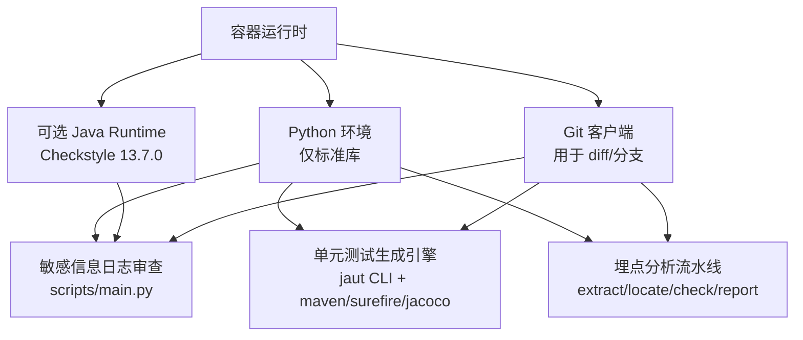
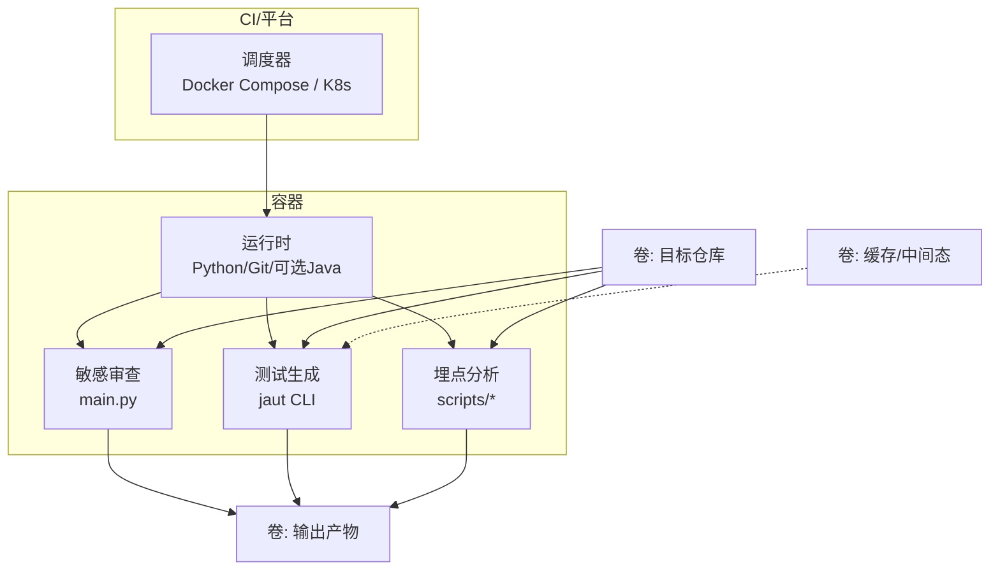
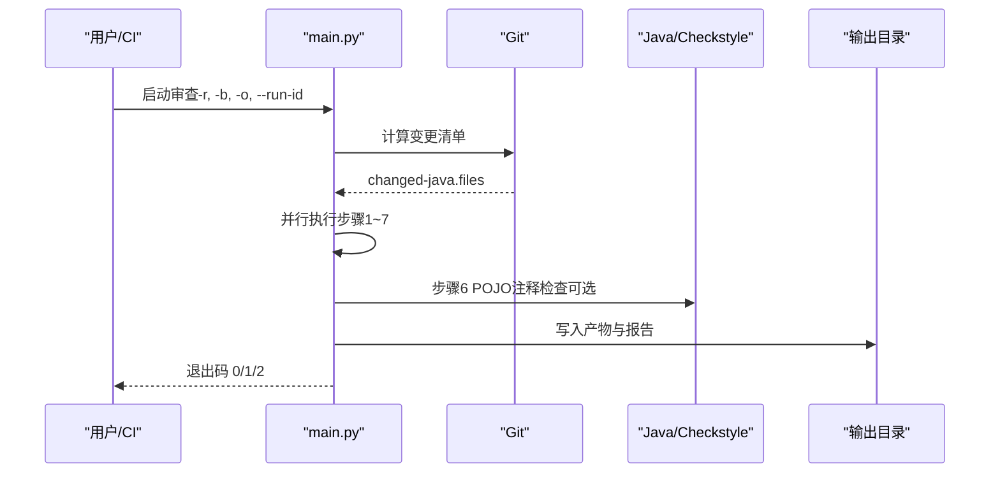
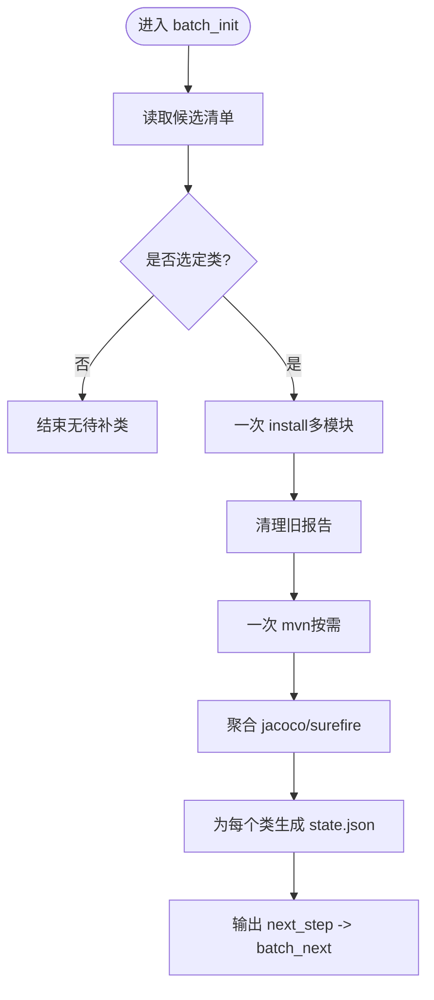
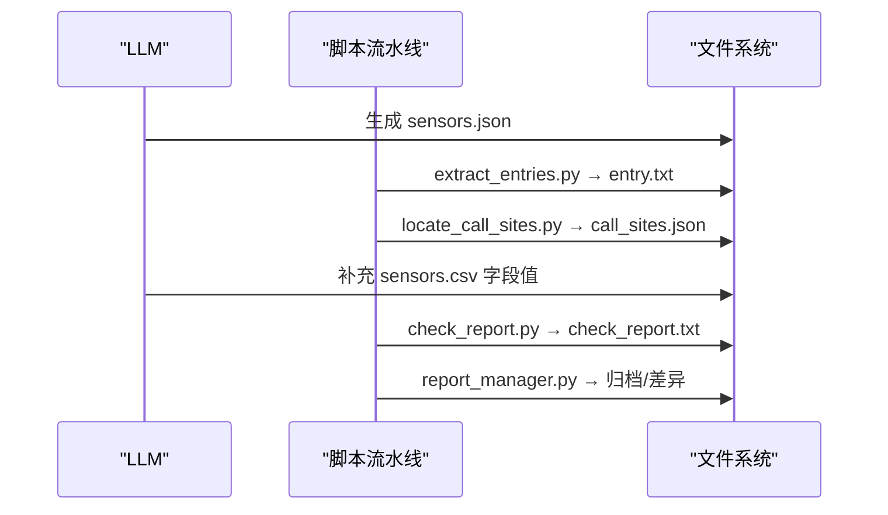
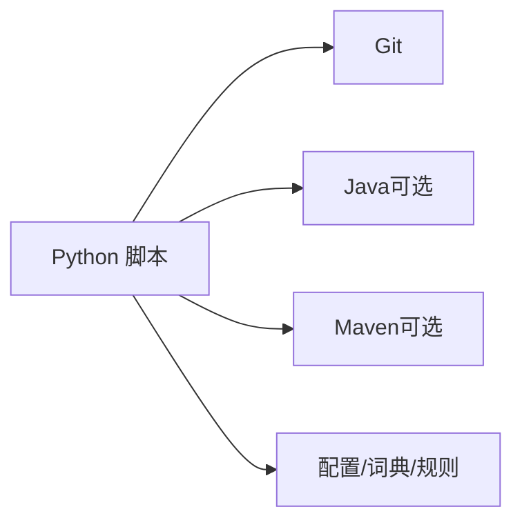

# 容器化部署

<cite>
**本文引用的文件**
- [README.md](file://README.md)
- [AGENTS.md](file://AGENTS.md)
- [CLAUDE.md](file://CLAUDE.md)
- [sensitive-log-review/README.md](file://sensitive-log-review/README.md)
- [sensitive-log-review/scripts/main.py](file://sensitive-log-review/scripts/main.py)
- [java-unit-test-generator/scripts/jaut/cli.py](file://java-unit-test-generator/scripts/jaut/cli.py)
- [batch-unit-test-generator/scripts/batch_init.py](file://batch-unit-test-generator/scripts/batch_init.py)
- [sensors-analyze/CLAUDE.md](file://sensors-analyze/CLAUDE.md)
- [.gitignore](file://.gitignore)
</cite>

## 目录
1. [简介](#简介)
2. [项目结构](#项目结构)
3. [核心组件](#核心组件)
4. [架构总览](#架构总览)
5. [详细组件分析](#详细组件分析)
6. [依赖关系分析](#依赖关系分析)
7. [性能与资源建议](#性能与资源建议)
8. [故障排查指南](#故障排查指南)
9. [结论](#结论)
10. [附录：镜像构建与编排清单](#附录镜像构建与编排清单)

## 简介
本方案为 ping-skills 仓库中的四个“技能”提供云原生容器化部署指导，覆盖 Docker 多阶段构建、镜像体积优化与安全基线；使用 Docker Compose 编排多个工具协同运行；提供 Kubernetes Deployment、Service、ConfigMap 等清单模板；说明在容器中处理 Python/Java 进程管理、文件权限与网络配置的最佳实践；并给出内存/CPU 限制、存储卷挂载、监控与日志收集的配置建议，确保在 CI/CD 与生产环境中稳定运行。

## 项目结构
该仓库由四个相互独立的“技能”组成，每个技能包含脚本、规则/词典、测试与文档。它们不是传统意义上的应用，而是被安装到目标项目中运行的可执行能力集合。因此容器化目标是“以最小镜像运行各技能的脚本”，而非打包成服务。

**图表来源**
- [sensitive-log-review/README.md:59-66](file://sensitive-log-review/README.md#L59-L66)
- [CLAUDE.md:36-55](file://CLAUDE.md#L36-L55)
- [sensors-analyze/CLAUDE.md:23-51](file://sensors-analyze/CLAUDE.md#L23-L51)

**章节来源**
- [AGENTS.md:5-14](file://AGENTS.md#L5-L14)
- [CLAUDE.md:5-14](file://CLAUDE.md#L5-L14)

## 核心组件
- 敏感信息日志审查：Python 编排器调用若干子扫描器，依赖 Git 获取变更，依赖 Java 运行 Checkstyle 进行 POJO 注释检查。输出 HTML 报告与门禁退出码。
- 单元测试生成（单类/批量）：基于 jaut 引擎驱动 Maven/Surefire/JaCoCo，通过 NEXT_STEP 协议与 LLM 协作生成测试代码，状态持久化在 workdir。
- 埋点分析：Python 脚本流水线对目标工程进行埋点盘点与校验，输出 CSV 与检查报告。

这些组件的共同特点是：
- 运行时依赖极少（Python 标准库），便于构建极小镜像。
- 需要外部工具：Git、可选的 Java（仅审查模块）、Maven（仅测试生成）。
- 输入输出以文件系统为主（JSON/CSV/HTML/报告），适合通过卷挂载或临时目录交换数据。

**章节来源**
- [sensitive-log-review/README.md:59-66](file://sensitive-log-review/README.md#L59-L66)
- [CLAUDE.md:36-55](file://CLAUDE.md#L36-L55)
- [sensors-analyze/CLAUDE.md:23-51](file://sensors-analyze/CLAUDE.md#L23-L51)

## 架构总览
下图展示容器内外的职责边界与数据流：容器负责运行 Python 脚本与必要的系统工具；外部通过卷挂载提供目标代码仓库、产物输出与配置；CI/平台负责调度与资源限制。

[此图为概念性架构图，不直接映射具体源码文件]

## 详细组件分析

### 敏感信息日志审查（sensitive-log-review）
- 入口与流程：主脚本作为编排层，按四条并行链路执行步骤1~8，最终汇总生成 HTML 报告与门禁判定。关键步骤失败返回退出码 2，命中门禁返回 1，正常通过返回 0。
- 环境与依赖：Python 3.10+、Git 2.0+、可选 Java（用于 Checkstyle）。默认仅扫描变更文件以提升速度。
- 输出与隔离：支持 --output-dir 与 --run-id 实现并行隔离；产物包括各类 .list/.results/.fields 与 HTML 报告。

**图表来源**
- [sensitive-log-review/scripts/main.py:1-22](file://sensitive-log-review/scripts/main.py#L1-L22)
- [sensitive-log-review/README.md:30-53](file://sensitive-log-review/README.md#L30-L53)
- [sensitive-log-review/README.md:113-124](file://sensitive-log-review/README.md#L113-L124)

**章节来源**
- [sensitive-log-review/scripts/main.py:1-22](file://sensitive-log-review/scripts/main.py#L1-L22)
- [sensitive-log-review/README.md:59-66](file://sensitive-log-review/README.md#L59-L66)
- [sensitive-log-review/README.md:113-124](file://sensitive-log-review/README.md#L113-L124)
- [sensitive-log-review/README.md:167-174](file://sensitive-log-review/README.md#L167-L174)

### 单元测试生成（java-unit-test-generator / batch-unit-test-generator）
- 统一 CLI：jaut 提供 run_cli 脚手架，规范化参数解析、日志初始化、异常转协议块与 next_step 输出，保证不同入口行为一致。
- 批量基线：batch_init 一次性 install 与 mvn，聚合 JaCoCo/Surefire 报告，为每个候选类生成 state.json，后续由 batch_next 逐类委派。
- 协议与状态：遵循 NEXT_STEP 协议，状态保存在 workdir/state.json，支持断点续跑。

**图表来源**
- [java-unit-test-generator/scripts/jaut/cli.py:95-129](file://java-unit-test-generator/scripts/jaut/cli.py#L95-L129)
- [batch-unit-test-generator/scripts/batch_init.py:1-24](file://batch-unit-test-generator/scripts/batch_init.py#L1-L24)
- [batch-unit-test-generator/scripts/batch_init.py:114-159](file://batch-unit-test-generator/scripts/batch_init.py#L114-L159)

**章节来源**
- [java-unit-test-generator/scripts/jaut/cli.py:1-129](file://java-unit-test-generator/scripts/jaut/cli.py#L1-L129)
- [batch-unit-test-generator/scripts/batch_init.py:1-24](file://batch-unit-test-generator/scripts/batch_init.py#L1-L24)
- [batch-unit-test-generator/scripts/batch_init.py:114-159](file://batch-unit-test-generator/scripts/batch_init.py#L114-L159)

### 埋点分析（sensors-analyze）
- 流水线：LLM 产出 sensors.json → 脚本提取候选 → 定位调用点 → LLM 追踪字段值 → 脚本校验一致性并归档。
- 约束：只读目标工程、无第三方依赖、CSV 必须为具体值、entry.txt 需人工确认标记。

**图表来源**
- [sensors-analyze/CLAUDE.md:11-21](file://sensors-analyze/CLAUDE.md#L11-L21)
- [sensors-analyze/CLAUDE.md:23-51](file://sensors-analyze/CLAUDE.md#L23-L51)

**章节来源**
- [sensors-analyze/CLAUDE.md:11-21](file://sensors-analyze/CLAUDE.md#L11-L21)
- [sensors-analyze/CLAUDE.md:23-51](file://sensors-analyze/CLAUDE.md#L23-L51)

## 依赖关系分析
- Python 依赖：仅标准库（测试阶段才需要 pytest）。
- 外部工具：
  - Git：所有技能均可能用到（diff、分支、工作树）。
  - Java：仅敏感信息审查（Checkstyle jar）需要。
  - Maven：仅单元测试生成需要（构建与覆盖率）。
- 配置文件与词典：敏感审查的规则与词典位于 scripts/rules 与 scripts/dictionary，应随镜像一并分发或通过 ConfigMap/卷挂载。

**图表来源**
- [sensitive-log-review/README.md:59-66](file://sensitive-log-review/README.md#L59-L66)
- [CLAUDE.md:36-55](file://CLAUDE.md#L36-L55)
- [sensors-analyze/CLAUDE.md:23-51](file://sensors-analyze/CLAUDE.md#L23-L51)

**章节来源**
- [sensitive-log-review/README.md:59-66](file://sensitive-log-review/README.md#L59-L66)
- [CLAUDE.md:36-55](file://CLAUDE.md#L36-L55)

## 性能与资源建议
- CPU 与内存
  - 敏感审查：轻量 Python 任务，建议 requests.cpu=0.5-1，requests.memory=256Mi-512Mi。
  - 单元测试生成：涉及 Maven/JaCoCo，建议 requests.cpu=1-2，requests.memory=1Gi-2Gi（视项目规模调整）。
  - 埋点分析：Python 脚本为主，建议 requests.cpu=0.5-1，requests.memory=256Mi-512Mi。
- I/O 与缓存
  - 将 Maven 本地仓库、JaCoCo 中间结果、Surefire 报告等放入共享卷或 Pod 级空目录卷，减少重复下载与构建时间。
  - 敏感审查的输出目录与 run-id 隔离，避免并发冲突。
- 网络
  - 若拉取远程依赖（Maven Central），建议在私有镜像仓库或代理环境下运行，降低超时风险。
- 并行度
  - 敏感审查内部已多线程并行；Kubernetes 层面可按队列并发多个 Job，注意控制并发数以避免资源争用。

[本节为通用建议，不直接分析具体文件]

## 故障排查指南
- 环境变量编码：Windows 下设置 PYTHONIOENCODING=utf-8，避免中文乱码。
- 非 Git 仓库：传入 -r 指向仓库根；CI 中确保 fetch-depth 足够或完整历史。
- 找不到 java：安装 JRE/JDK 并确保 PATH；敏感审查步骤6失败仅警告。
- 变更结果为空：检查 --branch 基准与浅克隆历史；必要时使用 --full-scan。
- 门禁失败：查看控制台末尾计数项与 HTML 报告，定位具体违规明细。
- failedFiles 告警：打开 failed-files.list 定位原因；严格模式 --strict-mode 可将失败文件视为错误。

**章节来源**
- [sensitive-log-review/README.md:68-85](file://sensitive-log-review/README.md#L68-L85)
- [sensitive-log-review/README.md:369-395](file://sensitive-log-review/README.md#L369-L395)
- [sensitive-log-review/README.md:418-482](file://sensitive-log-review/README.md#L418-L482)

## 结论
ping-skills 的四个技能均为“脚本型能力”，非常适合以极简容器镜像运行。通过多阶段构建与最小基础镜像，可以显著减小镜像体积；通过 Docker Compose 与 Kubernetes 编排，可实现多技能协同与弹性扩展；结合合理的资源限制、卷挂载与日志策略，可在云原生环境中稳定高效地运行。

## 附录：镜像构建与编排清单

### Docker 镜像构建指南（多阶段构建与体积优化）
- 基础镜像选择
  - Python 阶段：使用 slim/alpine 变体，仅安装必要系统包（如 git、ca-certificates）。
  - Java 阶段：仅在需要 Java 的镜像中包含 JRE（敏感审查），或使用独立镜像。
- 多阶段构建建议
  - 阶段1（构建/准备）：复制脚本与规则/词典，预校验依赖可用性（--doctor）。
  - 阶段2（运行）：仅拷贝必要文件与解释器，移除构建期文件。
- 安全最佳实践
  - 以非 root 用户运行容器。
  - 固定基础镜像版本与 Python 版本，锁定依赖（如有 pip 依赖）。
  - 最小化暴露端口（本仓库无需暴露端口）。
  - 使用只读根文件系统，仅挂载必要目录为读写。
- 示例思路（文字描述）
  - 第一阶段：FROM python:slim，安装 git，COPY scripts 与 rules/dictionary，RUN 一次 --doctor 验证环境。
  - 第二阶段：FROM python:slim，COPY --from=0 仅拷贝运行所需文件，设置 ENTRYPOINT 为对应脚本。

[本节为通用构建指导，不直接分析具体文件]

### Docker Compose 编排示例（协调多工具）
- 服务划分
  - sensitive-review：运行敏感信息审查，挂载目标仓库与输出目录。
  - test-gen：运行单元测试生成，挂载目标仓库、Maven 缓存与输出。
  - sensors：运行埋点分析，挂载目标仓库与输出。
- 共享配置
  - 使用 volumes 挂载仓库与输出目录。
  - 使用 environment 注入分支、输出目录、run-id 等参数。
- 典型流程
  - 先运行 sensitive-review 门禁；通过后触发 test-gen；最后运行 sensors 分析。

[本节为编排概念，不直接分析具体文件]

### Kubernetes 部署清单要点
- ConfigMap
  - 存放敏感审查的规则与词典（rules/、dictionary/），以便集中管理与热更新。
- Deployment
  - 针对每个技能定义一个 Deployment/Job，设置 resources.requests/limits 与 liveness/readiness（如需长驻服务）。
  - 使用 volumeMounts 挂载仓库与输出目录；使用 emptyDir 缓存 Maven/JaCoCo 中间产物。
- Service
  - 本仓库无 HTTP 服务，通常不需要 Service；若集成到 Web UI，再暴露 Service。
- 资源限制
  - 参考“性能与资源建议”设置 CPU/Memory 请求与限制。
- 日志与监控
  - 将 stdout/stderr 输出到容器日志；将结构化报告（HTML/CSV）写入卷供采集。
  - 可通过 sidecar 或 DaemonSet 收集日志；指标可通过 Prometheus Exporter 暴露（如自定义脚本导出）。

[本节为部署概念，不直接分析具体文件]

### 容器内进程管理、权限与网络
- 进程管理
  - Python 脚本为主，建议使用 systemd 或容器 init 进程（如 tini）管理生命周期。
  - 对于需要 Java/Maven 的任务，确保 PATH 正确，并以非 root 用户执行。
- 文件权限
  - 输出目录与缓存目录需对运行用户可写；使用 chown 或指定 UID/GID。
  - 避免以 root 运行，降低安全风险。
- 网络配置
  - 仅当访问外部网络（Maven 仓库、Git 远端）时需要出站网络；CI/平台侧控制网络策略。
  - 若使用代理，通过环境变量配置 HTTP_PROXY/HTTPS_PROXY。

[本节为通用实践，不直接分析具体文件]

### 监控与日志收集
- 日志
  - 脚本标准输出/错误输出到容器日志；敏感审查与测试生成会产生大量日志，建议滚动与保留策略。
  - 产物（HTML/CSV）写入卷，供下游系统抓取。
- 指标
  - 可扩展为导出关键指标（通过率、耗时、失败分类计数）到指标后端。
- 告警
  - 基于退出码与报告内容设置告警阈值（如门禁失败率、failedFiles 比例）。

[本节为通用实践，不直接分析具体文件]