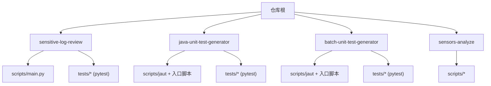
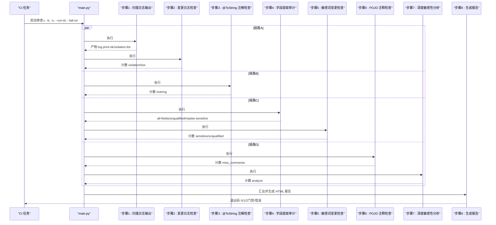
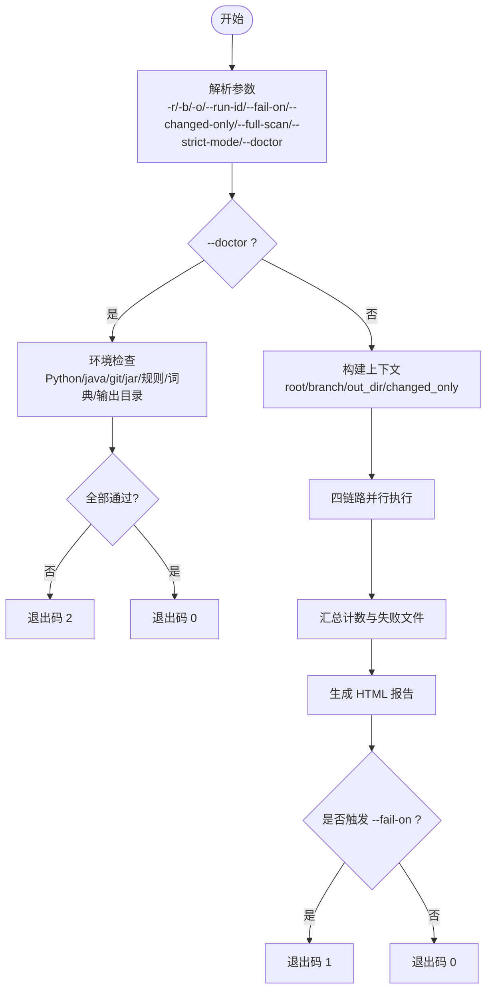
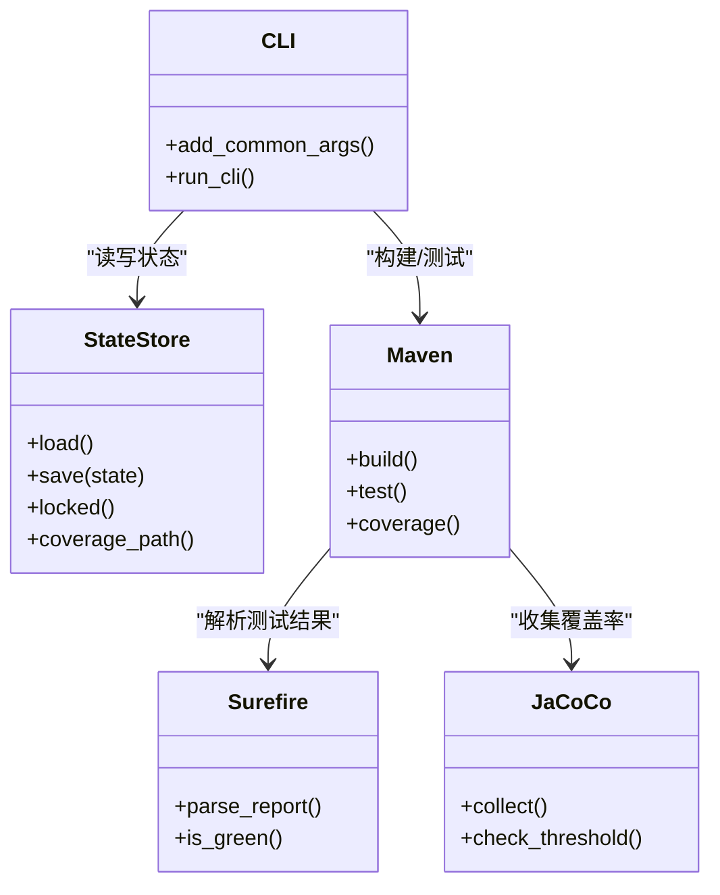
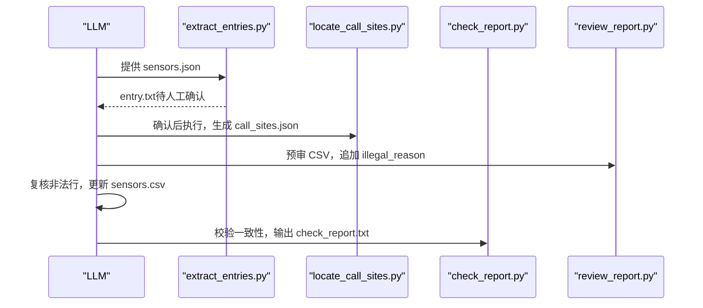
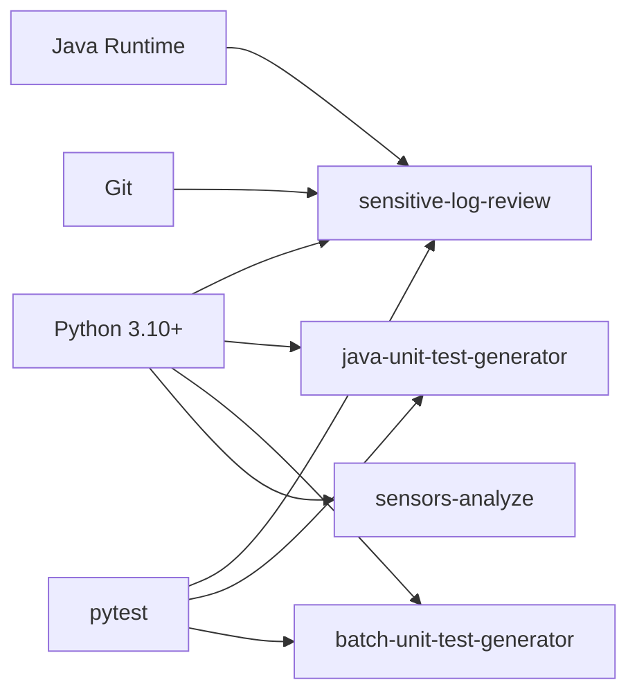

# CI/CD 流水线集成

<cite>
**本文引用的文件**
- [README.md](file://README.md)
- [CLAUDE.md](file://CLAUDE.md)
- [AGENTS.md](file://AGENTS.md)
- [install.sh](file://install.sh)
- [sensitive-log-review/README.md](file://sensitive-log-review/README.md)
- [sensitive-log-review/SKILL.md](file://sensitive-log-review/SKILL.md)
- [sensitive-log-review/scripts/main.py](file://sensitive-log-review/scripts/main.py)
- [java-unit-test-generator/tests/conftest.py](file://java-unit-test-generator/tests/conftest.py)
- [batch-unit-test-generator/tests/conftest.py](file://batch-unit-test-generator/tests/conftest.py)
- [sensitive-log-review/tests/conftest.py](file://sensitive-log-review/tests/conftest.py)
</cite>

## 目录
1. [简介](#简介)
2. [项目结构](#项目结构)
3. [核心组件](#核心组件)
4. [架构总览](#架构总览)
5. [详细组件分析](#详细组件分析)
6. [依赖分析](#依赖分析)
7. [性能考虑](#性能考虑)
8. [故障诊断指南](#故障诊断指南)
9. [结论](#结论)
10. [附录：各平台流水线示例与最佳实践](#附录：各平台流水线示例与最佳实践)

## 简介
本指南面向在 Jenkins、GitHub Actions、GitLab CI、Azure DevOps 等 CI/CD 平台中集成 ping-skills 工具，覆盖构建、测试、代码质量检查、并行执行、缓存优化、结果收集、质量门禁、环境变量与依赖管理、容器化部署、性能优化与故障诊断。ping-skills 包含多个独立 skill（如敏感日志审查、单元测试生成、埋点分析等），每个 skill 自包含脚本与测试套件，适合以“按 skill 并行”的方式接入流水线。

## 项目结构
- 根级说明文档定义了技能集合、运行方式与约定；每个 skill 目录下包含 scripts、tests、references/protocol 等。
- 测试统一通过 pytest 在每个 skill 的 tests 目录内执行；conftest.py 将 scripts 加入 sys.path 以便导入公共模块。
- install.sh 用于将 skill 安装到目标项目的 .<tool>/skills 目录，并清理非必要文件。

**章节来源**
- [CLAUDE.md:5-14](file://CLAUDE.md#L5-L14)
- [AGENTS.md:5-14](file://AGENTS.md#L5-L14)
- [java-unit-test-generator/tests/conftest.py:1-11](file://java-unit-test-generator/tests/conftest.py#L1-L11)
- [batch-unit-test-generator/tests/conftest.py:1-11](file://batch-unit-test-generator/tests/conftest.py#L1-L11)
- [sensitive-log-review/tests/conftest.py:1-9](file://sensitive-log-review/tests/conftest.py#L1-L9)

## 核心组件
- 敏感日志审查（sensitive-log-review）：编排脚本 main.py 驱动多步骤流水线，输出 HTML 报告与门禁判定，支持 --run-id 并行隔离与 --fail-on 自定义门禁类别。
- 单元测试生成（java/batch unit-test generator）：基于 jaut 引擎与 NEXT_STEP 协议，迭代生成 JUnit5+Mockito 测试直至覆盖率达标。
- 埋点分析（sensors-analyze）：LLM 与 Python 协作，产出 sensors.csv 并校验一致性。

**章节来源**
- [CLAUDE.md:36-59](file://CLAUDE.md#L36-L59)
- [sensitive-log-review/SKILL.md:31-57](file://sensitive-log-review/SKILL.md#L31-L57)
- [sensitive-log-review/README.md:175-234](file://sensitive-log-review/README.md#L175-L234)

## 架构总览
敏感日志审查主流程由 main.py 编排，四链路并行执行后汇总生成报告与门禁判定。

**图表来源**
- [sensitive-log-review/scripts/main.py:1-22](file://sensitive-log-review/scripts/main.py#L1-L22)
- [sensitive-log-review/scripts/main.py:187-200](file://sensitive-log-review/scripts/main.py#L187-L200)

**章节来源**
- [sensitive-log-review/scripts/main.py:1-22](file://sensitive-log-review/scripts/main.py#L1-L22)
- [sensitive-log-review/SKILL.md:70-157](file://sensitive-log-review/SKILL.md#L70-L157)

## 详细组件分析

### 敏感日志审查（sensitive-log-review）
- 编排层：main.py 负责参数解析、并行调度、子脚本调用、结果聚合与报告生成。
- 并行策略：使用线程池将四条链路并行执行，缩短整体耗时。
- 输出目录：支持 -o/--output-dir、SLR_OUTPUT_DIR、临时目录三级优先级；--run-id 追加隔离子目录。
- 门禁契约：退出码 0/1/2；--fail-on 控制触发项（violation/sensitive/unqualified/tostring/analyze/miss_comments/low）。
- 环境诊断：--doctor 仅检查环境不执行审查，便于首次部署与排障。

**图表来源**
- [sensitive-log-review/scripts/main.py:83-95](file://sensitive-log-review/scripts/main.py#L83-L95)
- [sensitive-log-review/scripts/main.py:112-130](file://sensitive-log-review/scripts/main.py#L112-L130)
- [sensitive-log-review/scripts/main.py:147-180](file://sensitive-log-review/scripts/main.py#L147-L180)
- [sensitive-log-review/SKILL.md:58-69](file://sensitive-log-review/SKILL.md#L58-L69)
- [sensitive-log-review/README.md:167-174](file://sensitive-log-review/README.md#L167-L174)

**章节来源**
- [sensitive-log-review/scripts/main.py:83-95](file://sensitive-log-review/scripts/main.py#L83-L95)
- [sensitive-log-review/scripts/main.py:112-130](file://sensitive-log-review/scripts/main.py#L112-L130)
- [sensitive-log-review/scripts/main.py:147-180](file://sensitive-log-review/scripts/main.py#L147-L180)
- [sensitive-log-review/SKILL.md:31-57](file://sensitive-log-review/SKILL.md#L31-L57)
- [sensitive-log-review/README.md:167-174](file://sensitive-log-review/README.md#L167-L174)

### 单元测试生成（java/batch unit-test generator）
- 引擎：jaut（两套副本已分化），提供 CLI、状态机、Maven/Surefire/JaCoCo 集成、工作区管理等能力。
- 协议：NEXT_STEP 协议驱动 LLM 与脚本协作，状态持久化于 state.json，支持断点续跑。
- 边界：仅允许修改 src/test/java/**，禁止改动生产代码与配置。

**图表来源**
- [java-unit-test-generator/tests/conftest.py:1-11](file://java-unit-test-generator/tests/conftest.py#L1-L11)
- [batch-unit-test-generator/tests/conftest.py:1-11](file://batch-unit-test-generator/tests/conftest.py#L1-L11)
- [CLAUDE.md:36-51](file://CLAUDE.md#L36-L51)

**章节来源**
- [CLAUDE.md:36-51](file://CLAUDE.md#L36-L51)
- [java-unit-test-generator/tests/conftest.py:1-11](file://java-unit-test-generator/tests/conftest.py#L1-L11)
- [batch-unit-test-generator/tests/conftest.py:1-11](file://batch-unit-test-generator/tests/conftest.py#L1-L11)

### 埋点分析（sensors-analyze）
- 工作流：LLM 产出 sensors.json → 脚本抽取候选入口 → 定位调用点 → LLM 追踪字段值 → 脚本校验一致性。
- 约束：只读目标代码库；CSV 无动态占位符；entry.txt 需人工确认标记后方可继续。

**图表来源**
- [sensors-analyze/CLAUDE.md:11-47](file://sensors-analyze/CLAUDE.md#L11-L47)
- [sensors-analyze/CLAUDE.md:53-69](file://sensors-analyze/CLAUDE.md#L53-L69)

**章节来源**
- [sensors-analyze/CLAUDE.md:11-47](file://sensors-analyze/CLAUDE.md#L11-L47)
- [sensors-analyze/CLAUDE.md:53-69](file://sensors-analyze/CLAUDE.md#L53-L69)

## 依赖分析
- 运行时依赖
  - Python 3.10+（所有脚本）
  - Java Runtime（敏感日志审查的 Checkstyle）
  - Git（变更计算）
  - pytest（仅测试）
- 内部依赖
  - 每个 skill 的 tests/conftest.py 将 scripts 加入 sys.path，确保 common 包可导入。
  - 单元测试生成 skill 共享 jaut 引擎（两份副本已分化，需分别维护与验证）。

**图表来源**
- [sensitive-log-review/README.md:57-67](file://sensitive-log-review/README.md#L57-L67)
- [AGENTS.md:16-28](file://AGENTS.md#L16-L28)
- [java-unit-test-generator/tests/conftest.py:1-11](file://java-unit-test-generator/tests/conftest.py#L1-L11)
- [batch-unit-test-generator/tests/conftest.py:1-11](file://batch-unit-test-generator/tests/conftest.py#L1-L11)
- [sensitive-log-review/tests/conftest.py:1-9](file://sensitive-log-review/tests/conftest.py#L1-L9)

**章节来源**
- [sensitive-log-review/README.md:57-67](file://sensitive-log-review/README.md#L57-L67)
- [AGENTS.md:16-28](file://AGENTS.md#L16-L28)

## 性能考虑
- 并行执行
  - 敏感日志审查默认四链路并行，显著降低端到端时间。
  - CI 中可将不同 skill 作为独立 job 并行执行。
- 增量扫描
  - 敏感日志审查默认 --changed-only，仅扫描变更 Java 文件；必要时回退 --full-scan。
- 缓存优化
  - 缓存 Python 依赖（若引入第三方包）、Maven 仓库、Checkstyle jar、git 对象。
  - 使用平台缓存机制（actions/cache、cache:paths）加速重复构建。
- 资源限制
  - 合理设置 runner 规格与超时；对大仓库启用浅克隆或按需 fetch-depth。
- 报告体积
  - HTML 报告长列表折叠；CI 中按需归档产物，避免过大工件影响传输。

[本节为通用指导，无需特定文件引用]

## 故障诊断指南
- 环境诊断
  - 使用 --doctor 快速检查 Python/java/git/jar/规则/词典/输出目录等，逐项标记 OK/FAIL/WARN。
- 常见错误
  - 非 git 仓库：显式传入 -r 指向仓库根。
  - 找不到 java：安装 JRE/JDK 并确保 PATH。
  - run-id 非法字符：仅允许字母数字及 ._-，且首字符必须为字母数字。
  - jar SHA256 校验失败：重新获取可信 jar 或同步基线。
- 失败文件
  - failed-files.list 记录读取/解析失败的文件；默认不计入门禁，严格模式 --strict-mode 下存在失败文件即退出码 2。
- 日志与产物
  - 控制台末尾统计与 HTML 报告定位问题；查看对应 .list/.results 明细。

**章节来源**
- [sensitive-log-review/README.md:361-483](file://sensitive-log-review/README.md#L361-L483)
- [sensitive-log-review/SKILL.md:51-69](file://sensitive-log-review/SKILL.md#L51-L69)

## 结论
通过将每个 skill 作为独立单元接入 CI/CD，结合并行执行、增量扫描、缓存与标准化产物归档，可在保证质量门禁的同时显著提升流水线效率。敏感日志审查提供完善的退出码契约与环境诊断能力，便于在不同平台稳定集成。

[本节为总结性内容，无需特定文件引用]

## 附录：各平台流水线示例与最佳实践

### 通用环境变量与依赖
- 必需环境
  - Python 3.10+
  - Java Runtime（敏感日志审查）
  - Git
- 推荐变量
  - PYTHONIOENCODING=utf-8（Windows 防乱码）
  - SLR_OUTPUT_DIR（指定输出目录）
  - RUN_ID（CI 并行隔离，合法字符集见上）

**章节来源**
- [sensitive-log-review/README.md:57-84](file://sensitive-log-review/README.md#L57-L84)
- [sensitive-log-review/SKILL.md:58-69](file://sensitive-log-review/SKILL.md#L58-L69)

### Jenkins（声明式流水线片段要点）
- 阶段建议
  - 检出代码（fetch-depth 足够以支持 diff）
  - 设置 Python/Java 环境
  - 运行敏感日志审查（-r . -b origin/<base> -o ./review-output --run-id "${BUILD_TAG}" --fail-on violation,sensitive）
  - 归档 review-output 产物
  - 根据退出码决定门禁通过与否（0=通过，1/2=失败）
- 并行
  - 将不同 skill 放入 parallel 块，减少总时长。

**章节来源**
- [sensitive-log-review/README.md:175-203](file://sensitive-log-review/README.md#L175-L203)

### GitHub Actions（YAML 片段要点）
- jobs
  - sensitive-log-review：ubuntu 最新镜像，setup-python 3.11，setup-java temurin 17，checkout 完整历史，运行审查，上传 artifact。
- 缓存
  - actions/cache 缓存 Python/Maven/Checkstyle jar。
- 并发隔离
  - 使用 github.run_id 作为 --run-id。

**章节来源**
- [sensitive-log-review/README.md:205-234](file://sensitive-log-review/README.md#L205-L234)

### GitLab CI（YAML 片段要点）
- stages
  - test、quality、report
- variables
  - PYTHONIOENCODING、SLR_OUTPUT_DIR、RUN_ID
- cache
  - paths: pip、maven、jar
- artifacts
  - 归档 review-output

[本节为概念性示例，未直接映射具体源码文件]

### Azure DevOps（YAML 片段要点）
- tasks
  - UsePythonVersion、JavaToolInstaller、Command-line 执行审查
- variables
  - 同上
- artifacts
  - PublishBuildArtifacts 上传产物

[本节为概念性示例，未直接映射具体源码文件]

### 单元测试生成（java/batch）
- 前置条件
  - Java 环境、Maven、Git
- 典型步骤
  - 选择 worktree/target class
  - 初始化覆盖率
  - 生成提示词与 LLM 写代码
  - 规则校验与覆盖率验证
  - 循环直到阈值达成或达到上限
- 并行
  - batch 模式可对多个类并行处理（注意锁与状态隔离）。

**章节来源**
- [CLAUDE.md:36-51](file://CLAUDE.md#L36-L51)

### 埋点分析（sensors-analyze）
- 典型步骤
  - LLM 产出 sensors.json
  - extract_entries 生成 entry.txt（需 # CONFIRMED）
  - locate_call_sites 生成 call_sites.json
  - review_report 预审并标注 illegal_reason
  - check_report 校验一致性
- 并行
  - 可按业务域拆分多个实例并行执行，避免互相干扰。

**章节来源**
- [sensors-analyze/CLAUDE.md:11-47](file://sensors-analyze/CLAUDE.md#L11-L47)
- [sensors-analyze/CLAUDE.md:53-69](file://sensors-analyze/CLAUDE.md#L53-L69)

### 容器化部署最佳实践
- 基础镜像
  - python:3.11-slim（含系统依赖）
  - 安装 JDK（仅敏感日志审查需要）
  - 安装 Git
- 复制范围
  - 仅复制必要 skill 目录与脚本，剔除 tests/__pycache__ 等
- 缓存
  - 挂载 /root/.m2、pip cache、jar 目录
- 执行
  - 以非 root 用户运行，限制权限与资源

[本节为通用指导，无需特定文件引用]

### 结果收集与质量门禁
- 产物
  - HTML 报告、中间清单文件、失败文件列表
- 门禁
  - 依赖退出码 0/1/2；--fail-on 控制触发项
- 可视化
  - 将 HTML 报告发布为构建产物；在平台 UI 中展示关键指标

**章节来源**
- [sensitive-log-review/README.md:339-358](file://sensitive-log-review/README.md#L339-L358)
- [sensitive-log-review/SKILL.md:31-57](file://sensitive-log-review/SKILL.md#L31-L57)