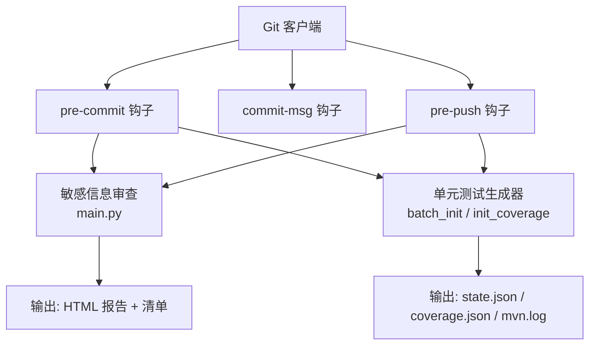
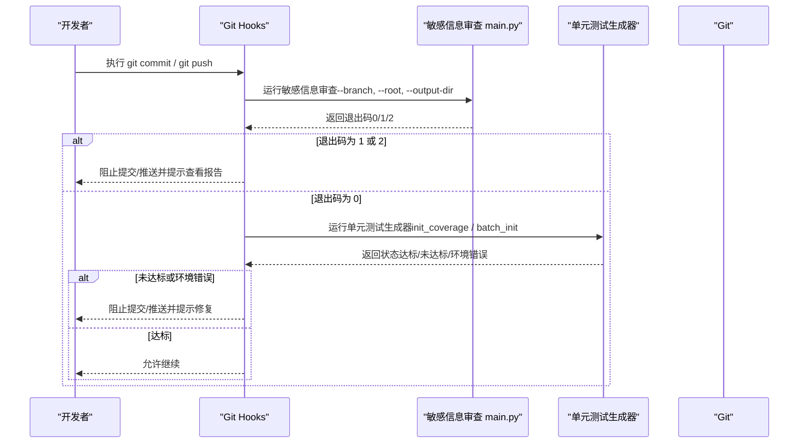
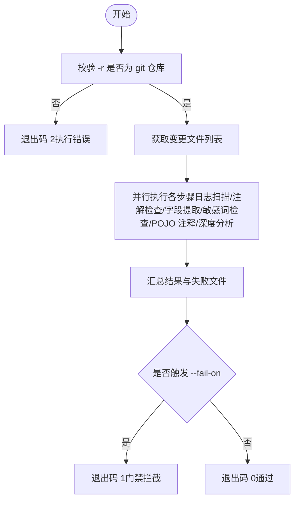
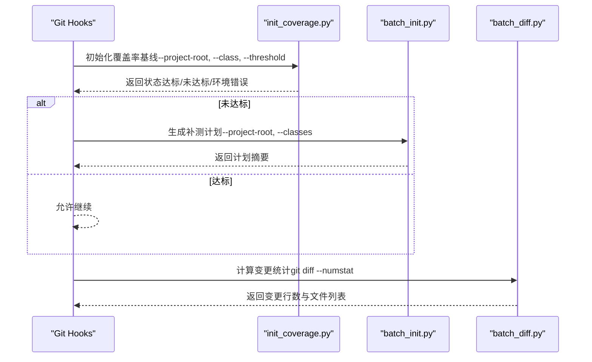
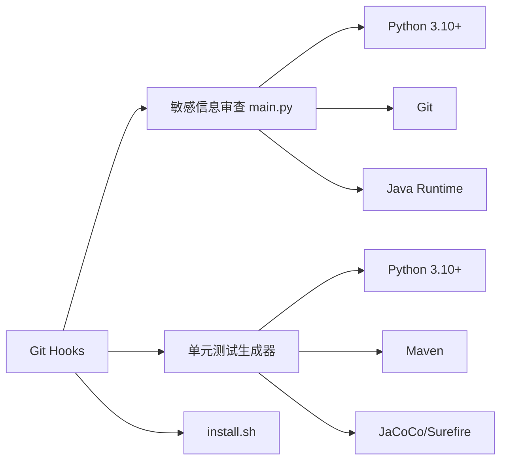

# Git Hooks 集成

<cite>
**本文引用的文件**
- [install.sh](file://install.sh)
- [sensitive-log-review/README.md](file://sensitive-log-review/README.md)
- [sensitive-log-review/scripts/main.py](file://sensitive-log-review/scripts/main.py)
- [sensitive-log-review/scripts/common/git_utils.py](file://sensitive-log-review/scripts/common/git_utils.py)
- [batch-unit-test-generator/scripts/batch_init.py](file://batch-unit-test-generator/scripts/batch_init.py)
- [java-unit-test-generator/scripts/init_coverage.py](file://java-unit-test-generator/scripts/init_coverage.py)
- [batch-unit-test-generator/scripts/batch_diff.py](file://batch-unit-test-generator/scripts/batch_diff.py)
- [sensitive-log-review/tests/test_integration.py](file://sensitive-log-review/tests/test_integration.py)
</cite>

## 目录
1. [简介](#简介)
2. [项目结构](#项目结构)
3. [核心组件](#核心组件)
4. [架构总览](#架构总览)
5. [详细组件分析](#详细组件分析)
6. [依赖关系分析](#依赖关系分析)
7. [性能考虑](#性能考虑)
8. [故障排查指南](#故障排查指南)
9. [结论](#结论)
10. [附录](#附录)

## 简介
本指南面向 ping-skills 仓库，提供一套可落地的 Git Hooks 集成方案，将“单元测试生成器”与“敏感信息审查工具”嵌入到代码提交流程中。重点覆盖：
- pre-commit：在提交前执行轻量检查（如敏感日志扫描、基础规则校验）
- commit-msg：校验提交消息格式（可选）
- pre-push：在推送前执行更严格的门禁（如覆盖率基线、全量或增量审查）
- 错误处理：钩子失败时正确阻止提交或推送
- 工作流适配：Git Flow、GitHub Flow 下的参数与分支策略
- 常见问题：权限、路径、依赖缺失等问题的定位与解决

## 项目结构
ping-skills 包含多个独立 Skill，其中与本指南直接相关的有：
- sensitive-log-review：敏感信息日志审查工具，提供主脚本 main.py，支持变更检测、HTML 报告、门禁退出码
- batch-unit-test-generator：批量单元测试生成器，提供 batch_init、batch_diff 等脚本，用于多模块覆盖率基线与补测计划
- java-unit-test-generator：单类单元测试生成器，提供 init_coverage 等脚本，用于建立覆盖率基线与门槛判定
- install.sh：Skill 安装脚本，可将上述工具复制到目标项目的 .qoder/skills 下，便于统一调用

图表来源
- [sensitive-log-review/scripts/main.py:1-22](file://sensitive-log-review/scripts/main.py#L1-L22)
- [batch-unit-test-generator/scripts/batch_init.py:1-24](file://batch-unit-test-generator/scripts/batch_init.py#L1-L24)
- [java-unit-test-generator/scripts/init_coverage.py:1-35](file://java-unit-test-generator/scripts/init_coverage.py#L1-L35)

章节来源
- [install.sh:1-289](file://install.sh#L1-L289)
- [sensitive-log-review/README.md:1-120](file://sensitive-log-review/README.md#L1-L120)

## 核心组件
- 敏感信息审查工具（sensitive-log-review）
  - 入口脚本：scripts/main.py
  - 关键能力：变更检测、日志违规扫描、敏感字段识别、POJO 注释检查、HTML 报告、门禁退出码
  - 退出码契约：0 通过；1 触发门禁；2 执行错误
- 单元测试生成器（batch-unit-test-generator / java-unit-test-generator）
  - 批量模式：scripts/batch_init.py（多模块基线、聚合覆盖率、生成补测计划）
  - 单类模式：scripts/init_coverage.py（覆盖率基线、门槛判定、终验）
  - 差异分析：scripts/batch_diff.py（基于 git diff 的变更统计）
- 安装脚本（install.sh）
  - 将 Skill 复制到目标项目的 .qoder/skills 目录，便于统一管理与调用

章节来源
- [sensitive-log-review/scripts/main.py:1-22](file://sensitive-log-review/scripts/main.py#L1-L22)
- [batch-unit-test-generator/scripts/batch_init.py:1-24](file://batch-unit-test-generator/scripts/batch_init.py#L1-L24)
- [java-unit-test-generator/scripts/init_coverage.py:1-35](file://java-unit-test-generator/scripts/init_coverage.py#L1-L35)
- [batch-unit-test-generator/scripts/batch_diff.py:255-277](file://batch-unit-test-generator/scripts/batch_diff.py#L255-L277)
- [install.sh:144-204](file://install.sh#L144-L204)

## 架构总览
下图展示了 Git Hooks 与各工具的交互关系及数据流向：

图表来源
- [sensitive-log-review/scripts/main.py:15-22](file://sensitive-log-review/scripts/main.py#L15-L22)
- [java-unit-test-generator/scripts/init_coverage.py:19-35](file://java-unit-test-generator/scripts/init_coverage.py#L19-L35)
- [batch-unit-test-generator/scripts/batch_init.py:16-24](file://batch-unit-test-generator/scripts/batch_init.py#L16-L24)

## 详细组件分析

### 敏感信息审查工具（sensitive-log-review）
- 功能要点
  - 默认仅扫描相对目标分支的变更 Java 文件，支持全量扫描
  - 产出 HTML 报告与多种清单文件，便于定位问题
  - 支持 --doctor 环境诊断，快速定位环境问题
  - 退出码契约明确，适合 CI/Git Hooks 门禁
- 常用参数
  - -r/--root：项目根目录（必须是 git 仓库）
  - -b/--branch：对比基准分支（如 master、develop、origin/master）
  - -o/--output-dir：产物输出目录（CI 场景推荐）
  - --fail-on：门禁计数项（默认 violation,sensitive）
  - --changed-only/--full-scan：变更扫描或全量扫描
  - --run-id：并行隔离标识（CI 场景）
  - --doctor：环境诊断模式
- 典型用法
  - 仓库根目录下执行：python scripts/main.py -r . -b master -o ./review-output
  - CI 并行隔离：python scripts/main.py -r . -b origin/master -o ./review-output --run-id build-1024

图表来源
- [sensitive-log-review/scripts/main.py:15-22](file://sensitive-log-review/scripts/main.py#L15-L22)
- [sensitive-log-review/scripts/common/git_utils.py:57-69](file://sensitive-log-review/scripts/common/git_utils.py#L57-L69)

章节来源
- [sensitive-log-review/README.md:127-175](file://sensitive-log-review/README.md#L127-L175)
- [sensitive-log-review/scripts/main.py:1-200](file://sensitive-log-review/scripts/main.py#L1-L200)
- [sensitive-log-review/scripts/common/git_utils.py:57-82](file://sensitive-log-review/scripts/common/git_utils.py#L57-L82)

### 单元测试生成器（批量与单类）
- 批量模式（batch-unit-test-generator）
  - batch_init：多模块基线构建、聚合覆盖率、生成补测计划
  - batch_diff：基于 git diff 的变更统计，辅助筛选候选类
- 单类模式（java-unit-test-generator）
  - init_coverage：建立覆盖率基线、门槛判定、终验模式
- 典型参数
  - --project-root：项目根目录
  - --class：目标类（FQCN 或源文件路径）
  - --method：限定单方法（可选）
  - --threshold：覆盖率门槛（默认 80%）
  - --final-check：全量终验模式
  - --coverage-exclude：覆盖率排除模式（fnmatch）
- 典型用法
  - 单类基线：python scripts/init_coverage.py -r . --class com.example.User --threshold 80
  - 批量基线：python scripts/batch_init.py --project-root . --classes all --threshold 80

图表来源
- [java-unit-test-generator/scripts/init_coverage.py:19-35](file://java-unit-test-generator/scripts/init_coverage.py#L19-L35)
- [batch-unit-test-generator/scripts/batch_init.py:16-24](file://batch-unit-test-generator/scripts/batch_init.py#L16-L24)
- [batch-unit-test-generator/scripts/batch_diff.py:255-277](file://batch-unit-test-generator/scripts/batch_diff.py#L255-L277)

章节来源
- [java-unit-test-generator/scripts/init_coverage.py:1-200](file://java-unit-test-generator/scripts/init_coverage.py#L1-L200)
- [batch-unit-test-generator/scripts/batch_init.py:1-200](file://batch-unit-test-generator/scripts/batch_init.py#L1-L200)
- [batch-unit-test-generator/scripts/batch_diff.py:255-277](file://batch-unit-test-generator/scripts/batch_diff.py#L255-L277)

### Git Hooks 配置示例
以下为常见钩子脚本的编写思路与参数传递方式（以 shell 为例），请根据实际项目路径调整：

- pre-commit
  - 目的：提交前执行敏感信息审查（轻量、快速）
  - 建议参数：-r . -b master -o ./review-output --fail-on violation,sensitive
  - 行为：若退出码非 0，阻止提交并提示查看报告
- commit-msg
  - 目的：校验提交消息格式（可选）
  - 建议逻辑：正则匹配提交消息，不符合则拒绝
- pre-push
  - 目的：推送前执行更严格门禁（敏感信息审查 + 单元测试生成器）
  - 建议参数：
    - 敏感信息审查：-r . -b origin/${TARGET_BRANCH} -o ./review-output --fail-on violation,sensitive
    - 单元测试生成器：init_coverage 或 batch_init，依据项目规模选择
  - 行为：任一环节失败则阻止推送

注意：
- 钩子脚本需具备可执行权限（chmod +x .git/hooks/*）
- 路径建议使用绝对路径或相对于仓库根的路径，避免在不同工作区执行时出错
- 环境变量 PYTHONIOENCODING=utf-8 建议在钩子中设置，避免中文乱码

章节来源
- [sensitive-log-review/README.md:127-175](file://sensitive-log-review/README.md#L127-L175)
- [sensitive-log-review/tests/test_integration.py:43-50](file://sensitive-log-review/tests/test_integration.py#L43-L50)

### 不同工作流中的使用建议
- Git Flow
  - feature 分支开发：pre-commit 执行敏感信息审查（-b develop 或 -b master）
  - release 分支合并前：pre-push 执行完整门禁（含单元测试生成器）
  - 参数建议：-b origin/develop 或 -b origin/master，确保对比基准正确
- GitHub Flow
  - 主分支保护：pre-push 执行完整门禁，确保主分支质量
  - 特性分支：pre-commit 执行轻量检查，减少噪音
  - 参数建议：-b origin/main 或 -b origin/master，依据主分支名调整

章节来源
- [sensitive-log-review/README.md:175-235](file://sensitive-log-review/README.md#L175-L235)

## 依赖关系分析
- 敏感信息审查工具依赖
  - Python 3.10+
  - Git（用于变更检测）
  - Java Runtime（用于 POJO 注释检查）
  - 规则与词典文件（scripts/rules、scripts/dictionary）
- 单元测试生成器依赖
  - Python 3.10+
  - Maven（用于构建与覆盖率采集）
  - JaCoCo/Surefire（覆盖率与测试报告）
- 安装脚本依赖
  - Bash
  - 目标项目存在 .qoder/skills 目录（由脚本创建）

图表来源
- [sensitive-log-review/README.md:57-112](file://sensitive-log-review/README.md#L57-L112)
- [batch-unit-test-generator/scripts/batch_init.py:114-154](file://batch-unit-test-generator/scripts/batch_init.py#L114-L154)
- [java-unit-test-generator/scripts/init_coverage.py:193-200](file://java-unit-test-generator/scripts/init_coverage.py#L193-L200)

章节来源
- [sensitive-log-review/README.md:57-112](file://sensitive-log-review/README.md#L57-L112)
- [batch-unit-test-generator/scripts/batch_init.py:114-154](file://batch-unit-test-generator/scripts/batch_init.py#L114-L154)
- [java-unit-test-generator/scripts/init_coverage.py:193-200](file://java-unit-test-generator/scripts/init_coverage.py#L193-L200)

## 性能考虑
- 变更扫描优先：默认 --changed-only 模式，仅扫描变更文件，提升速度
- 并行执行：敏感信息审查内部采用多线程并行链路，缩短整体耗时
- 缓存与清理：单元测试生成器在执行前清理旧报告，避免历史数据干扰
- CI 并行隔离：使用 --run-id 隔离不同流水线的产物，避免冲突

章节来源
- [sensitive-log-review/scripts/main.py:1-22](file://sensitive-log-review/scripts/main.py#L1-L22)
- [sensitive-log-review/README.md:113-124](file://sensitive-log-review/README.md#L113-L124)

## 故障排查指南
- 控制台中文输出乱码
  - 现象：Windows 下运行时中文显示为乱码
  - 解决：设置 PYTHONIOENCODING=utf-8
- 报错“不是 git 仓库”
  - 现象：退出码 2，提示非 git 仓库
  - 解决：显式传入 -r <仓库根目录>
- 找不到 java 命令
  - 现象：POJO 注释检查失败
  - 解决：安装 JRE/JDK 并确保 PATH 中包含 java
- 变更检查无结果
  - 现象：变更文件数为 0
  - 解决：使用 --branch 指定正确基准分支，或使用 --full-scan
- 误报处理
  - 流程：确认误报后加入白名单，递增版本头后重新验证
- 漏报处理
  - 流程：追加敏感词或规则，重新运行验证
- run-id 非法字符错误
  - 现象：退出码 2，提示非法 run-id
  - 解决：清洗 CI 变量后再传入
- jar SHA256 校验告警
  - 现象：Checkstyle jar 完整性校验失败
  - 解决：从可信源重新获取 jar，或同步更新基线值
- failedFiles 警告
  - 含义：部分文件读取/解析失败，结果可能不完整
  - 处理：查看 failed-files.list，修复后重新运行；CI 中可使用 --strict-mode 严格拦截

章节来源
- [sensitive-log-review/README.md:361-483](file://sensitive-log-review/README.md#L361-L483)
- [sensitive-log-review/tests/test_integration.py:129-147](file://sensitive-log-review/tests/test_integration.py#L129-L147)

## 结论
通过将敏感信息审查工具与单元测试生成器集成到 Git Hooks 中，可以在代码提交流程中实现自动化质量门禁。建议：
- pre-commit 执行轻量检查（敏感信息审查）
- pre-push 执行完整门禁（敏感信息审查 + 单元测试生成器）
- 针对不同工作流调整参数与分支策略
- 完善错误处理与故障排查机制，确保钩子失败时能正确阻止提交或推送

## 附录
- 安装 Skill 到目标项目
  - 使用 install.sh 将 Skill 复制到 .qoder/skills 目录，便于统一管理
- 常用命令参考
  - 敏感信息审查：python scripts/main.py -r . -b master -o ./review-output
  - 单元测试生成器：python scripts/init_coverage.py -r . --class com.example.User --threshold 80

章节来源
- [install.sh:210-289](file://install.sh#L210-L289)
- [sensitive-log-review/README.md:485-497](file://sensitive-log-review/README.md#L485-L497)