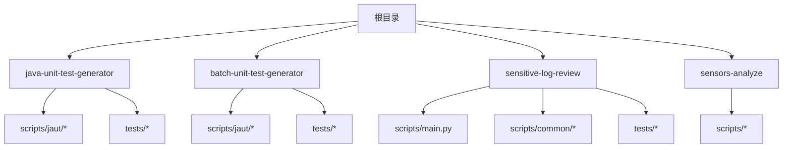
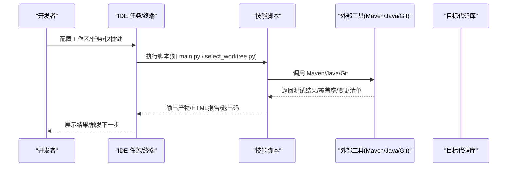
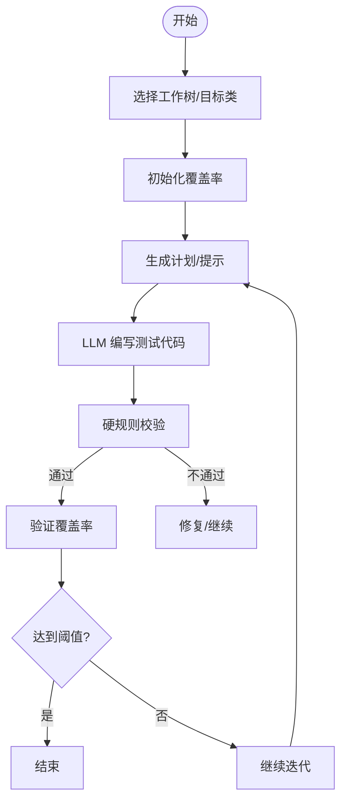
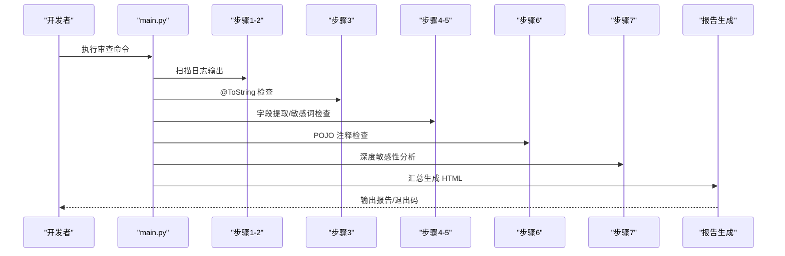
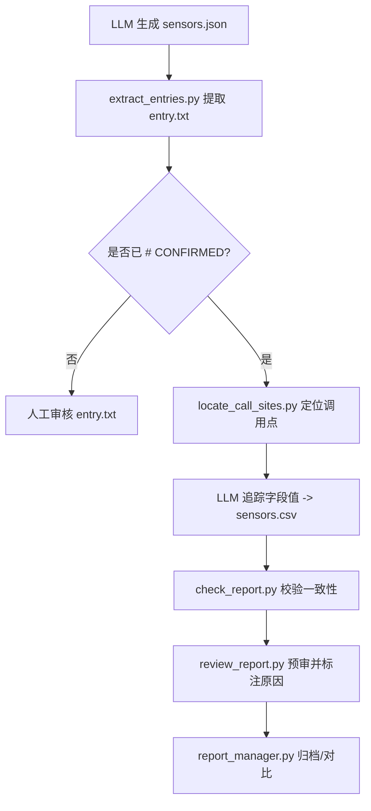
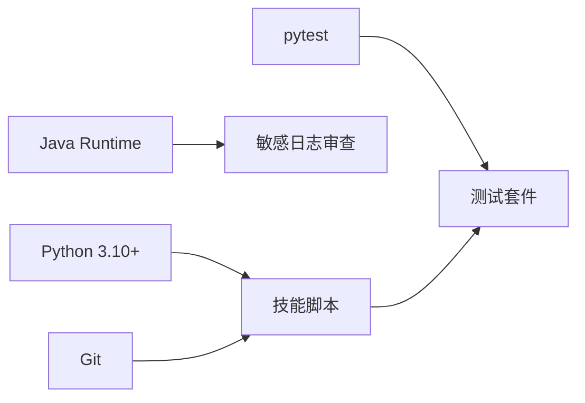

# IDE 集成配置

<cite>
**本文引用的文件**
- [README.md](file://README.md)
- [CLAUDE.md](file://CLAUDE.md)
- [AGENTS.md](file://AGENTS.md)
- [install.sh](file://install.sh)
- [sensitive-log-review/SKILL.md](file://sensitive-log-review/SKILL.md)
- [sensors-analyze/CLAUDE.md](file://sensors-analyze/CLAUDE.md)
- [sensitive-log-review/scripts/main.py](file://sensitive-log-review/scripts/main.py)
- [java-unit-test-generator/scripts/jaut/config.py](file://java-unit-test-generator/scripts/jaut/config.py)
- [batch-unit-test-generator/scripts/validate_rules.py](file://batch-unit-test-generator/scripts/validate_rules.py)
- [java-unit-test-generator/tests/conftest.py](file://java-unit-test-generator/tests/conftest.py)
- [sensitive-log-review/tests/conftest.py](file://sensitive-log-review/tests/conftest.py)
</cite>

## 目录
1. [简介](#简介)
2. [项目结构](#项目结构)
3. [核心组件](#核心组件)
4. [架构总览](#架构总览)
5. [详细组件分析](#详细组件分析)
6. [依赖关系分析](#依赖关系分析)
7. [性能与运行特性](#性能与运行特性)
8. [IDE 集成指南](#ide-集成指南)
9. [故障排除](#故障排除)
10. [结论](#结论)

## 简介
本指南面向在 VS Code、IntelliJ IDEA、Eclipse 等主流 IDE 中集成和使用 ping-skills 的工程师。ping-skills 是四个“技能”集合：单元测试生成（单类/批量）、敏感日志审查、埋点分析。它们以 Python 脚本驱动，配合协议与规则文件工作，测试使用 pytest。本文提供插件安装、工作区配置、触发方式、快捷键绑定、任务配置、调试设置、格式化与静态分析集成、跨平台差异与常见问题排查。

## 项目结构
仓库包含多个独立技能目录，每个技能自包含：
- SKILL.md / CLAUDE.md：触发条件与工作流说明
- scripts/：Python 驱动脚本（主入口与子步骤）
- tests/：pytest 用例（conftest.py 将 scripts 加入 sys.path）
- references/、protocol/：规则与协议定义

**图表来源**
- [CLAUDE.md:5-14](file://CLAUDE.md#L5-L14)
- [AGENTS.md:5-14](file://AGENTS.md#L5-L14)

**章节来源**
- [CLAUDE.md:5-14](file://CLAUDE.md#L5-L14)
- [AGENTS.md:5-14](file://AGENTS.md#L5-L14)

## 核心组件
- 单元测试生成（单类/批量）：基于 NEXT_STEP 协议驱动 LLM 与脚本协作，产出 JUnit5+Mockito 测试并校验覆盖率阈值。
- 敏感日志审查：多阶段扫描与报告生成，支持 CI 门禁退出码契约。
- 埋点分析：LLM 与脚本协作，输出 sensors.csv 并校验一致性。

这些组件均以 Python 脚本为主，测试使用 pytest；无全局构建器，需在各自技能目录下执行命令。

**章节来源**
- [CLAUDE.md:16-34](file://CLAUDE.md#L16-L34)
- [AGENTS.md:16-28](file://AGENTS.md#L16-L28)

## 架构总览
各技能遵循“脚本驱动 + 协议/规则 + 测试验证”的模式。单元测试生成使用 NEXT_STEP 协议进行状态流转；敏感日志审查通过多步骤流水线汇总结果；埋点分析采用 LLM 与脚本分工的确定性流程。

**图表来源**
- [sensitive-log-review/scripts/main.py:1-22](file://sensitive-log-review/scripts/main.py#L1-L22)
- [CLAUDE.md:36-59](file://CLAUDE.md#L36-L59)

## 详细组件分析

### 单元测试生成（单类/批量）
- 协议与状态：NEXT_STEP 协议定义 run_script/write_code/ask_user/finish 等步骤；状态保存在 state.json，工作目录位于 .agent/<skill-name>/。
- 迭代与预算：支持轮次上限、失败连续轮数、覆盖率阈值等策略，可通过环境变量覆盖。
- 工程集成：脚本会调用 Maven/Surefire/JaCoCo，仅允许修改 src/test/java/** 下的测试文件。

**图表来源**
- [CLAUDE.md:38-47](file://CLAUDE.md#L38-L47)
- [java-unit-test-generator/scripts/jaut/config.py:14-27](file://java-unit-test-generator/scripts/jaut/config.py#L14-L27)
- [java-unit-test-generator/scripts/jaut/config.py:51-99](file://java-unit-test-generator/scripts/jaut/config.py#L51-L99)

**章节来源**
- [CLAUDE.md:38-51](file://CLAUDE.md#L38-L51)
- [java-unit-test-generator/scripts/jaut/config.py:14-27](file://java-unit-test-generator/scripts/jaut/config.py#L14-L27)
- [java-unit-test-generator/scripts/jaut/config.py:51-99](file://java-unit-test-generator/scripts/jaut/config.py#L51-L99)
- [batch-unit-test-generator/scripts/validate_rules.py:56-84](file://batch-unit-test-generator/scripts/validate_rules.py#L56-L84)

### 敏感日志审查
- 多阶段流水线：日志扫描、@ToString 检查、字段提取、敏感词检查、POJO 注释检查、深度敏感性分析、报告生成。
- 退出码契约：0 通过、1 门禁拦截、2 执行错误；支持 --fail-on 自定义门禁类别。
- 输出策略：统一输出目录，跨平台自动解析；CI 场景可用 --run-id 隔离并行产物。

**图表来源**
- [sensitive-log-review/scripts/main.py:1-22](file://sensitive-log-review/scripts/main.py#L1-L22)
- [sensitive-log-review/SKILL.md:70-157](file://sensitive-log-review/SKILL.md#L70-L157)

**章节来源**
- [sensitive-log-review/SKILL.md:31-68](file://sensitive-log-review/SKILL.md#L31-L68)
- [sensitive-log-review/SKILL.md:70-157](file://sensitive-log-review/SKILL.md#L70-L157)
- [sensitive-log-review/scripts/main.py:1-22](file://sensitive-log-review/scripts/main.py#L1-L22)

### 埋点分析（sensors-analyze）
- 五步流程：LLM 产出 sensors.json → 提取候选 → 定位调用点 → LLM 追踪字段值 → 校验报告。
- 约束：只读分析目标代码；CSV 必须为具体值；entry.txt 需人工确认标记。

**图表来源**
- [sensors-analyze/CLAUDE.md:11-47](file://sensors-analyze/CLAUDE.md#L11-L47)
- [sensors-analyze/CLAUDE.md:53-73](file://sensors-analyze/CLAUDE.md#L53-L73)

**章节来源**
- [sensors-analyze/CLAUDE.md:11-47](file://sensors-analyze/CLAUDE.md#L11-L47)
- [sensors-analyze/CLAUDE.md:53-73](file://sensors-analyze/CLAUDE.md#L53-L73)

## 依赖关系分析
- 运行时依赖：Python 3.10+、Git、Java Runtime（敏感日志审查需要 Checkstyle）。
- 测试依赖：pytest（仅在开发时用于运行测试套件）。
- 工作区路径：每个技能的 tests/conftest.py 会将 scripts 目录加入 sys.path，确保模块导入正确。

**图表来源**
- [sensitive-log-review/SKILL.md:158-165](file://sensitive-log-review/SKILL.md#L158-L165)
- [AGENTS.md:16-28](file://AGENTS.md#L16-L28)
- [sensitive-log-review/tests/conftest.py:1-9](file://sensitive-log-review/tests/conftest.py#L1-L9)

**章节来源**
- [sensitive-log-review/SKILL.md:158-165](file://sensitive-log-review/SKILL.md#L158-L165)
- [AGENTS.md:16-28](file://AGENTS.md#L16-L28)
- [sensitive-log-review/tests/conftest.py:1-9](file://sensitive-log-review/tests/conftest.py#L1-L9)

## 性能与运行特性
- 单元测试生成：支持超时控制、进度报告、工作树隔离；默认忽略测试失败以保证覆盖率报告产出，由 Surefire 做唯一判定。
- 敏感日志审查：多链路并行处理，目标全流程 <60s；支持严格模式统计失败文件。
- 埋点分析：脚本仅使用标准库，避免第三方依赖；优先使用 ripgrep 提升搜索性能。

**章节来源**
- [java-unit-test-generator/scripts/jaut/config.py:104-118](file://java-unit-test-generator/scripts/jaut/config.py#L104-L118)
- [sensitive-log-review/scripts/main.py:1-22](file://sensitive-log-review/scripts/main.py#L1-L22)
- [sensors-analyze/CLAUDE.md:49-51](file://sensors-analyze/CLAUDE.md#L49-L51)

## IDE 集成指南

### 通用准备
- 安装 Python 3.10+、Git、Java Runtime（敏感日志审查需要）。
- 在项目根或目标项目下安装技能：使用 install.sh 将技能复制到目标项目的 .<tool>/skills 目录，并按需清理非必要文件。
- 在每个技能目录下运行 pytest 验证环境：python -m pytest tests/。

**章节来源**
- [CLAUDE.md:16-34](file://CLAUDE.md#L16-L34)
- [AGENTS.md:16-28](file://AGENTS.md#L16-L28)
- [install.sh:144-204](file://install.sh#L144-L204)

### VS Code 集成

#### 插件建议
- Python：启用 Pylance、Linting（可选 flake8/black 等）、Testing（pytest 支持）。
- GitLens：便于查看变更与分支信息。
- 可选：Markdown Preview Enhanced（阅读 SKILL.md）。

#### 工作区配置
- 打开目标项目根目录，确保 Python 解释器指向 Python 3.10+。
- 在 VS Code 的任务面板中添加以下任务（示例）：
  - 运行敏感日志审查：command=python, args=[scripts/main.py, --help]，cwd=${workspaceFolder}/sensitive-log-review。
  - 运行单元测试生成（单类）：command=python, args=[scripts/select_worktree.py, --help]，cwd=${workspaceFolder}/java-unit-test-generator。
  - 运行批量单元测试生成：command=python, args=[scripts/batch_init.py, --help]，cwd=${workspaceFolder}/batch-unit-test-generator。
  - 运行埋点分析步骤：command=python, args=[scripts/extract_entries.py, --help]，cwd=${workspaceFolder}/sensors-analyze。
- 将上述任务绑定到快捷键（例如 Ctrl+Shift+P 后选择“运行任务”），或在 tasks.json 中配置 keybindings。

#### 调试设置
- 创建 launch.json，添加 Python 调试配置：
  - name: "Sensitive Log Review", program: "${workspaceFolder}/sensitive-log-review/scripts/main.py", args: ["--help"], cwd: "${workspaceFolder}/sensitive-log-review"。
  - name: "Unit Test Generator", program: "${workspaceFolder}/java-unit-test-generator/scripts/select_worktree.py", args: ["--help"], cwd: "${workspaceFolder}/java-unit-test-generator"。
  - name: "Batch Unit Test Generator", program: "${workspaceFolder}/batch-unit-test-generator/scripts/batch_init.py", args: ["--help"], cwd: "${workspaceFolder}/batch-unit-test-generator"。
  - name: "Sensors Analyze Extract", program: "${workspaceFolder}/sensors-analyze/scripts/extract_entries.py", args: ["--help"], cwd: "${workspaceFolder}/sensors-analyze"。
- 在断点处调试脚本参数与环境变量（如 JAVA_UT_MVN_TIMEOUT、SLR_OUTPUT_DIR）。

#### 测试运行
- 在 VS Code 测试侧边栏中选择 pytest，过滤 tests/ 目录运行单个文件或用例。
- 若导入失败，确认 conftest.py 已将 scripts 加入 sys.path（已在各技能 tests/conftest.py 中配置）。

**章节来源**
- [sensitive-log-review/tests/conftest.py:1-9](file://sensitive-log-review/tests/conftest.py#L1-L9)
- [AGENTS.md:16-28](file://AGENTS.md#L16-L28)

### IntelliJ IDEA 集成

#### 插件建议
- Python Community Edition（或 Ultimate 自带 Python 支持）。
- GitToolBox 或 GitHub Integration。
- 可选：Checkstyle/SpotBugs（与敏感日志审查的 Checkstyle 互补）。

#### 工作区配置
- 设置 Python 解释器为 3.10+，并在 Project Structure 中添加每个技能的 scripts/ 为 Source Root（以便导入 common 包）。
- 在 Run/Debug Configurations 中添加 Python Script：
  - 指定 Working directory 为对应技能目录。
  - 添加 Program arguments（如 --help 或实际参数）。
- 在 External Tools 中注册常用命令（如 python scripts/main.py --doctor）。

#### 测试运行
- 使用内置 pytest runner，选择 tests/ 目录运行。
- 若导入失败，确认 PYTHONPATH 包含 scripts/ 或通过 conftest.py 自动注入。

**章节来源**
- [sensitive-log-review/tests/conftest.py:1-9](file://sensitive-log-review/tests/conftest.py#L1-L9)
- [AGENTS.md:16-28](file://AGENTS.md#L16-L28)

### Eclipse 集成

#### 插件建议
- PyDev（Python 支持）。
- Subversion/Git 插件（Eclipse EGit）。

#### 工作区配置
- 在 PyDev 中创建 Python 项目，添加每个技能的 scripts/ 到 Build Path。
- 配置 Run Configuration：
  - Module name 或 Script path 指向对应脚本。
  - Working directory 设置为技能目录。
  - 添加 Arguments 与 Environment Variables（如 JAVA_UT_MVN_TIMEOUT）。

#### 测试运行
- 使用 PyTest Runner 运行 tests/ 目录。
- 若导入失败，确认 scripts/ 已加入 PYTHONPATH。

**章节来源**
- [AGENTS.md:16-28](file://AGENTS.md#L16-L28)

### 触发方式与快捷键
- 敏感日志审查：在 sensitive-log-review 目录下执行 python scripts/main.py --help 查看参数；可绑定为 IDE 任务或外部工具。
- 单元测试生成：在 java-unit-test-generator 或 batch-unit-test-generator 目录下执行相应脚本（如 select_worktree.py、batch_init.py）查看帮助。
- 埋点分析：在 sensors-analyze 目录下执行 extract_entries.py、locate_call_sites.py 等脚本查看帮助。

**章节来源**
- [CLAUDE.md:16-34](file://CLAUDE.md#L16-L34)
- [AGENTS.md:16-28](file://AGENTS.md#L16-L28)

### 任务配置与调试
- 任务：在 IDE 的任务管理器中为每个技能添加任务，指定工作目录与参数。
- 调试：使用 IDE 的 Python 调试器，在脚本入口处设置断点，逐步执行并观察输出与退出码。
- 环境变量：通过 IDE 的运行配置注入环境变量（如 JAVA_UT_MVN_TIMEOUT、SLR_OUTPUT_DIR）。

**章节来源**
- [java-unit-test-generator/scripts/jaut/config.py:104-130](file://java-unit-test-generator/scripts/jaut/config.py#L104-L130)
- [sensitive-log-review/SKILL.md:58-68](file://sensitive-log-review/SKILL.md#L58-L68)

### 与代码格式化/静态分析集成
- 格式化：建议使用 Python 官方推荐工具（如 black、isort），在 IDE 中配置保存时自动格式化。
- 静态分析：可使用 flake8/pylint 进行基础检查；敏感日志审查本身包含 Checkstyle 集成（Java 部分）。
- 注意：仓库未配置统一 linter/formatter，保持与现有风格一致即可。

**章节来源**
- [AGENTS.md:30-35](file://AGENTS.md#L30-L35)

### 不同操作系统注意事项
- Windows：输出目录自动解析至 %LOCALAPPDATA%\Temp\sensitive-log-review；无需 WSL。
- macOS/Linux：输出目录使用系统临时目录；确保 Python/Git/Java 路径正确。
- 权限：确保对目标项目目录有读写权限，尤其是写入 .agent 与输出目录。

**章节来源**
- [sensitive-log-review/SKILL.md:58-68](file://sensitive-log-review/SKILL.md#L58-L68)

## 故障排除

### 常见环境问题
- Python 版本过低：升级至 3.10+。
- Git 未安装或不可用：安装 Git 并确保在 PATH 中。
- Java 未安装或 Checkstyle jar 校验失败：安装 Java Runtime 并检查 checkstyle jar 完整性。
- 导入失败：确认 tests/conftest.py 已将 scripts 加入 sys.path，或在 IDE 中配置 PYTHONPATH。

**章节来源**
- [sensitive-log-review/SKILL.md:158-165](file://sensitive-log-review/SKILL.md#L158-L165)
- [sensitive-log-review/tests/conftest.py:1-9](file://sensitive-log-review/tests/conftest.py#L1-L9)

### 脚本退出码问题
- 单元测试生成：退出码 0=完成，1=继续，2=脚本错误，3=状态/协议错误。
- 敏感日志审查：退出码 0=通过，1=门禁拦截，2=执行错误。
- 埋点分析：遵循 next_step 指令与脚本输出日志。

**章节来源**
- [CLAUDE.md:38-47](file://CLAUDE.md#L38-L47)
- [sensitive-log-review/SKILL.md:31-56](file://sensitive-log-review/SKILL.md#L31-L56)

### 工作区与路径问题
- 工作目录不正确：确保在对应技能目录下执行脚本，或在 IDE 任务中设置 Working Directory。
- 输出目录冲突：使用 -o/--output-dir 指定输出目录，或使用 --run-id 隔离并行产物。

**章节来源**
- [sensitive-log-review/SKILL.md:58-68](file://sensitive-log-review/SKILL.md#L58-L68)

### 覆盖率与测试失败
- 单元测试生成：默认忽略测试失败以保证覆盖率报告产出，由 Surefire 判定；调整 JAVA_UT_MVN_TIMEOUT 等环境变量优化超时。
- 覆盖率阈值：根据 SKILL.md 与 config.py 中的默认阈值与预算进行调整。

**章节来源**
- [java-unit-test-generator/scripts/jaut/config.py:104-130](file://java-unit-test-generator/scripts/jaut/config.py#L104-L130)
- [CLAUDE.md:38-47](file://CLAUDE.md#L38-L47)

## 结论
通过在 IDE 中配置任务、调试器与快捷键，可以高效地集成和使用 ping-skills 的各项能力。建议在团队内统一工作区配置与脚本参数，结合 CI 门禁与报告输出，实现自动化质量保障。遇到问题时，优先检查环境依赖、退出码与输出目录策略，并参考各技能的 SKILL.md 与 CLAUDE.md 获取详细指引。