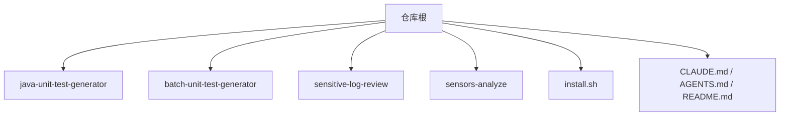
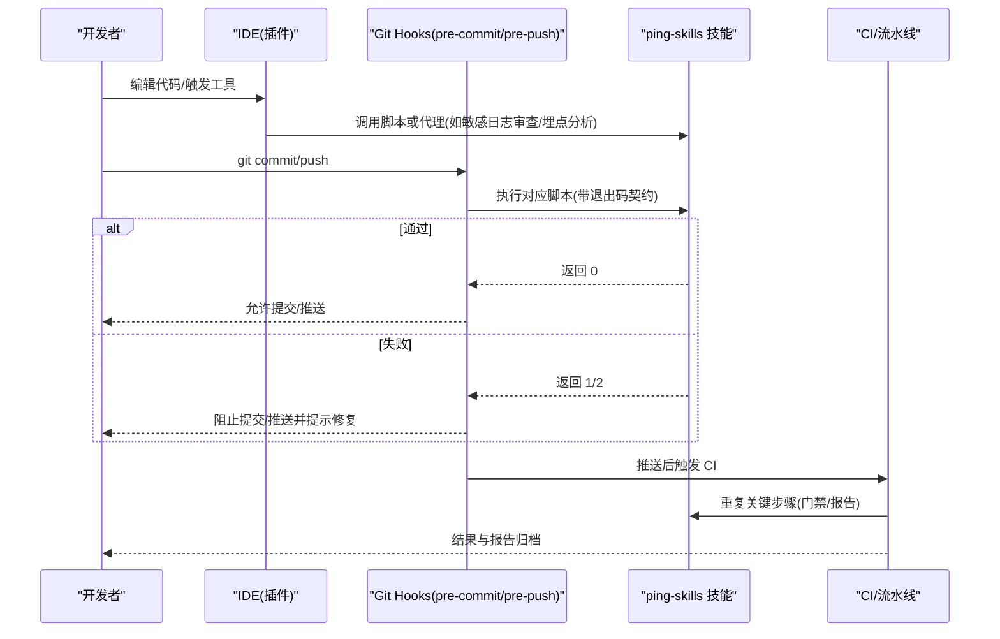
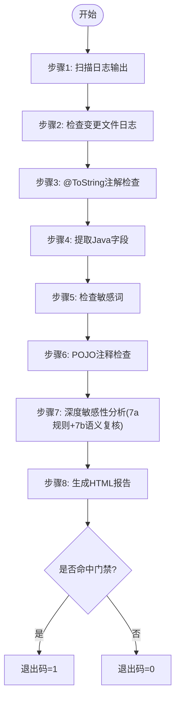
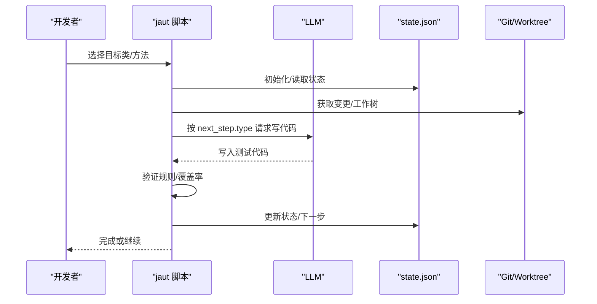
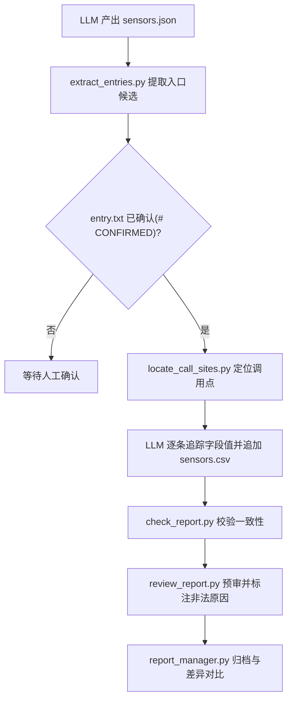
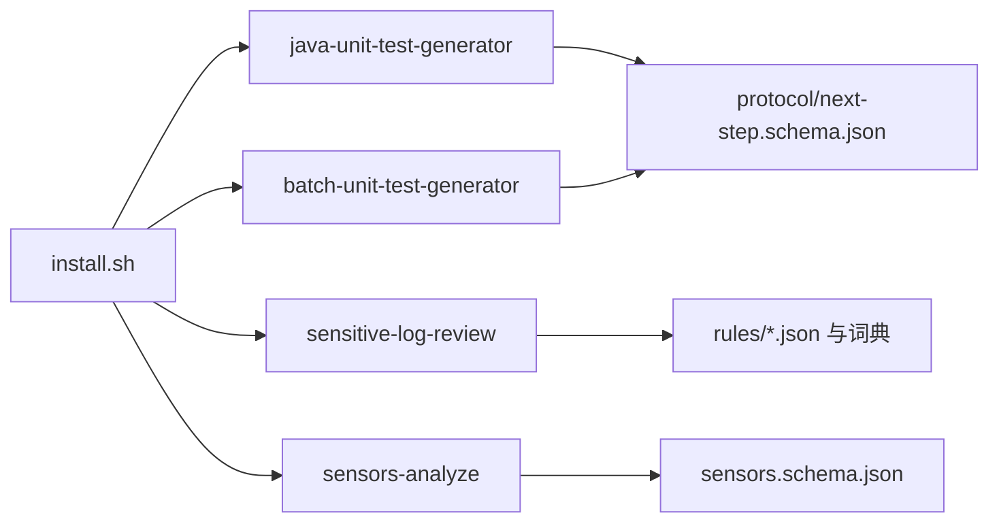
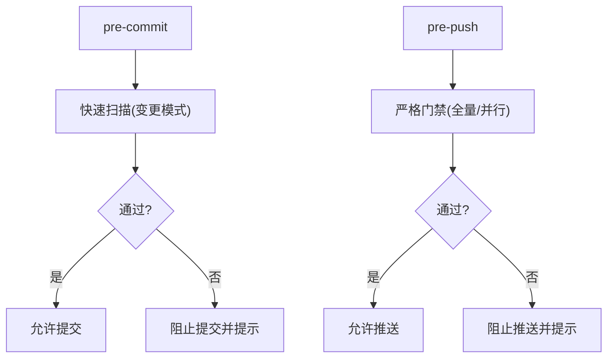

# 开发工作流集成

<cite>
**本文引用的文件**
- [README.md](file://README.md)
- [CLAUDE.md](file://CLAUDE.md)
- [AGENTS.md](file://AGENTS.md)
- [install.sh](file://install.sh)
- [sensitive-log-review/SKILL.md](file://sensitive-log-review/SKILL.md)
- [sensitive-log-review/scripts/main.py](file://sensitive-log-review/scripts/main.py)
- [sensitive-log-review/scripts/rules/sensitive-field-rules.json](file://sensitive-log-review/scripts/rules/sensitive-field-rules.json)
- [sensors-analyze/CLAUDE.md](file://sensors-analyze/CLAUDE.md)
- [sensors-analyze/sensors.schema.json](file://sensors-analyze/sensors.schema.json)
- [java-unit-test-generator/protocol/next-step.schema.json](file://java-unit-test-generator/protocol/next-step.schema.json)
- [batch-unit-test-generator/protocol/next-step.schema.json](file://batch-unit-test-generator/protocol/next-step.schema.json)
</cite>

## 目录
1. [简介](#简介)
2. [项目结构](#项目结构)
3. [核心组件](#核心组件)
4. [架构总览](#架构总览)
5. [详细组件分析](#详细组件分析)
6. [依赖关系分析](#依赖关系分析)
7. [性能与效率建议](#性能与效率建议)
8. [故障排查指南](#故障排查指南)
9. [结论](#结论)
10. [附录：Git Hooks、IDE 与团队协作实践](#附录git-hookside-与团队协作实践)

## 简介
本指南面向使用 ping-skills 的团队，目标是把仓库中的四个“技能”（agent skills）无缝集成到日常开发流程中：本地 Git Hooks（pre-commit/pre-push）、IDE（VS Code、IntelliJ IDEA）工具调用、代码审查与分支管理、发布流水线，以及团队统一配置与知识共享。通过安装脚本与标准化退出码契约，使工具在开发者提交前自动运行，在 CI 中作为质量门禁，最终形成“本地先验 + 远程复核”的闭环。

## 项目结构
仓库由四个独立技能组成，每个技能自包含文档、脚本与测试；根目录提供统一的安装脚本与规范说明。

**图表来源**
- [CLAUDE.md:5-14](file://CLAUDE.md#L5-L14)
- [AGENTS.md:5-14](file://AGENTS.md#L5-L14)
- [install.sh:1-20](file://install.sh#L1-L20)

**章节来源**
- [CLAUDE.md:5-14](file://CLAUDE.md#L5-L14)
- [AGENTS.md:5-14](file://AGENTS.md#L5-L14)
- [install.sh:1-20](file://install.sh#L1-L20)

## 核心组件
- 单元测试生成器（单类/批量）：基于 NEXT_STEP 协议驱动 LLM 与脚本协作，产出 JUnit5+Mockito 测试并校验 JaCoCo 覆盖率阈值。
- 敏感日志审查：对 Java 变更进行多阶段扫描（日志输出、@ToString、字段敏感性、POJO 注释），输出 HTML 报告与 CI 门禁退出码。
- 埋点分析：LLM 与 Python 协同梳理埋点实现，产出可审计的 CSV 清单与一致性检查报告。
- 安装与分发：install.sh 将技能复制到目标项目的 .claude/.qwen/.qoder/.opencode 目录，并按目标工具清理无关内容。

**章节来源**
- [CLAUDE.md:16-64](file://CLAUDE.md#L16-L64)
- [AGENTS.md:16-28](file://AGENTS.md#L16-L28)
- [install.sh:144-204](file://install.sh#L144-L204)

## 架构总览
下图展示“本地提交 → IDE 辅助 → 远程审查/CI”的整体工作流，以及各技能在其中的角色。

**图表来源**
- [sensitive-log-review/SKILL.md:31-49](file://sensitive-log-review/SKILL.md#L31-L49)
- [sensitive-log-review/scripts/main.py:15-21](file://sensitive-log-review/scripts/main.py#L15-L21)
- [CLAUDE.md:38-47](file://CLAUDE.md#L38-L47)

## 详细组件分析

### 敏感日志审查（sensitive-log-review）
- 入口与编排：scripts/main.py 编排多链路并行步骤，汇总统计并生成 HTML 报告。
- 退出码契约：0=通过，1=命中门禁（默认 violation,sensitive），2=执行错误。
- 规则与词典：rules/sensitive-field-rules.json 定义敏感类别与级别；词典分层优先级保障准确性与可维护性。
- 典型集成点：pre-commit 仅做快速变更扫描；pre-push 做更严格门禁；CI 固定输出目录与 run-id 以支持并行。

**图表来源**
- [sensitive-log-review/scripts/main.py:1-22](file://sensitive-log-review/scripts/main.py#L1-L22)
- [sensitive-log-review/SKILL.md:70-157](file://sensitive-log-review/SKILL.md#L70-L157)
- [sensitive-log-review/scripts/rules/sensitive-field-rules.json:1-45](file://sensitive-log-review/scripts/rules/sensitive-field-rules.json#L1-L45)

**章节来源**
- [sensitive-log-review/SKILL.md:31-49](file://sensitive-log-review/SKILL.md#L31-L49)
- [sensitive-log-review/scripts/main.py:15-21](file://sensitive-log-review/scripts/main.py#L15-L21)
- [sensitive-log-review/scripts/rules/sensitive-field-rules.json:1-45](file://sensitive-log-review/scripts/rules/sensitive-field-rules.json#L1-L45)

### 单元测试生成器（java-unit-test-generator / batch-unit-test-generator）
- 协议驱动：NEXT_STEP 协议规定脚本与 LLM 的交互边界，状态持久化于 state.json，工作树隔离。
- 能力范围：单类生成与批量处理（从分支 diff 抽取类列表）。
- 约束：仅允许修改 src/test/java/**，禁止改动生产代码与构建配置。

**图表来源**
- [CLAUDE.md:38-47](file://CLAUDE.md#L38-L47)
- [java-unit-test-generator/protocol/next-step.schema.json](file://java-unit-test-generator/protocol/next-step.schema.json)
- [batch-unit-test-generator/protocol/next-step.schema.json](file://batch-unit-test-generator/protocol/next-step.schema.json)

**章节来源**
- [CLAUDE.md:38-47](file://CLAUDE.md#L38-L47)

### 埋点分析（sensors-analyze）
- 五步流水线：LLM 产出 sensors.json → 脚本提取入口 → 定位调用点 → LLM 追踪取值 → 脚本校验一致性。
- 强约束：只读目标代码库；CSV 不得含动态占位符；entry.txt 需人工确认标记后方可继续。

**图表来源**
- [sensors-analyze/CLAUDE.md:11-47](file://sensors-analyze/CLAUDE.md#L11-L47)
- [sensors-analyze/sensors.schema.json:1-200](file://sensors-analyze/sensors.schema.json#L1-L200)

**章节来源**
- [sensors-analyze/CLAUDE.md:11-47](file://sensors-analyze/CLAUDE.md#L11-L47)
- [sensors-analyze/sensors.schema.json:1-200](file://sensors-analyze/sensors.schema.json#L1-L200)

## 依赖关系分析
- 技能间解耦：每个技能独立维护脚本、规则与测试；通过 install.sh 分发到目标项目。
- 外部依赖：Python 3、Git、Java Runtime（敏感日志审查需要 Checkstyle jar）；单元测试生成器依赖 Maven/Surefire/JaCoCo。
- 协议与配置：NEXT_STEP 协议、JSON Schema、规则与词典文件构成稳定的接口契约。

**图表来源**
- [install.sh:144-204](file://install.sh#L144-L204)
- [sensitive-log-review/scripts/rules/sensitive-field-rules.json:1-45](file://sensitive-log-review/scripts/rules/sensitive-field-rules.json#L1-L45)
- [java-unit-test-generator/protocol/next-step.schema.json](file://java-unit-test-generator/protocol/next-step.schema.json)
- [batch-unit-test-generator/protocol/next-step.schema.json](file://batch-unit-test-generator/protocol/next-step.schema.json)
- [sensors-analyze/sensors.schema.json:1-200](file://sensors-analyze/sensors.schema.json#L1-L200)

**章节来源**
- [install.sh:144-204](file://install.sh#L144-L204)

## 性能与效率建议
- 本地 pre-commit 使用“变更模式”快速扫描，避免全量耗时；pre-push 再执行更严格的门禁。
- 利用敏感日志审查的 --run-id 在 CI 并行场景隔离产物目录，避免冲突。
- 单元测试生成器优先针对变更类或高频问题类，结合覆盖率阈值控制迭代次数。
- 埋点分析仅在新增/重构埋点相关代码时触发，避免对无关变更造成干扰。

[本节为通用建议，不直接分析具体文件]

## 故障排查指南
- 退出码含义：
  - 敏感日志审查：0=通过，1=命中门禁，2=执行错误（环境/参数/依赖问题）。
  - 单元测试生成器：遵循 NEXT_STEP 协议退出码（0=完成，1=继续，2=脚本错误，3=状态/协议错误）。
- 常见问题定位：
  - 环境变量与路径：确保输出目录可写，Git 仓库根正确，Java/Python/Git 可用。
  - 规则与词典：检查 rules/*.json 与词典版本头，必要时调整白名单/黑名单。
  - 权限与依赖：Checkstyle jar 完整性校验、Maven 网络与缓存、ripgrep 可用性（埋点分析可选）。
- 调试手段：
  - 启用 verbose 输出，查看子命令与中间产物。
  - 使用 --doctor 进行环境自检（敏感日志审查）。
  - 逐步执行各步骤脚本，缩小问题范围。

**章节来源**
- [sensitive-log-review/SKILL.md:31-56](file://sensitive-log-review/SKILL.md#L31-L56)
- [CLAUDE.md:38-47](file://CLAUDE.md#L38-L47)

## 结论
通过将 ping-skills 的技能嵌入 Git Hooks、IDE 与 CI，团队可以在提交前自动发现敏感信息泄露、缺失注解与不规范命名等问题，并在评审与发布阶段持续收敛风险。标准化的退出码与产物格式使得工具链易于扩展与维护，配合统一配置与知识共享，能显著提升整体研发效率与质量。

[本节为总结性内容，不直接分析具体文件]

## 附录：Git Hooks、IDE 与团队协作实践

### Git Hooks 集成方案
- pre-commit
  - 目标：快速检查变更文件，避免明显违规进入暂存区。
  - 推荐动作：
    - 敏感日志审查：仅扫描变更文件（--changed-only），超时保护与失败文件记录。
    - 单元测试生成器：若变更涉及被测类，触发最小化计划与首轮生成。
  - 失败策略：返回非零退出码阻止提交，并打印修复建议。
- pre-push
  - 目标：在推送前执行更严格的质量门禁。
  - 推荐动作：
    - 敏感日志审查：开启更严格门禁类别（如 low），生成 HTML 报告并上传制品。
    - 单元测试生成器：批量模式覆盖分支 diff 中的多个类，确保覆盖率达标。
    - 埋点分析：若变更涉及埋点，执行完整流水线并归档 CSV。
  - 失败策略：阻断推送，要求修复后再试。

**图表来源**
- [sensitive-log-review/SKILL.md:31-49](file://sensitive-log-review/SKILL.md#L31-L49)
- [sensitive-log-review/scripts/main.py:15-21](file://sensitive-log-review/scripts/main.py#L15-L21)

**章节来源**
- [sensitive-log-review/SKILL.md:31-49](file://sensitive-log-review/SKILL.md#L31-L49)
- [sensitive-log-review/scripts/main.py:15-21](file://sensitive-log-review/scripts/main.py#L15-L21)

### IDE 工具调用配置
- VS Code
  - 安装对应工具的扩展（如 Claude/Qwen/Qoder/OpenCode 等），并通过 install.sh 将技能复制到项目 .<tool>/skills。
  - 在任务/命令面板中绑定常用脚本（如敏感日志审查、埋点分析），设置快捷键与参数模板。
  - 使用终端集成运行 pytest 与脚本，便于快速验证。
- IntelliJ IDEA
  - 配置外部工具：指向 scripts/main.py 等入口，传入 --repo/-o/--branch 等参数。
  - 创建 Run Configuration：预设工作目录为项目根，输出重定向到指定目录，便于查看报告。
  - 结合插件（如 Terminal、HTTP Client）执行脚本与查看结果。

[本节为通用实践，不直接分析具体文件]

### 与现有开发流程的集成
- 代码审查
  - PR/MR 描述中附带工具输出摘要（如敏感日志审查的 SUMMARY 行、埋点分析的 PASS/FAIL）。
  - 评审关注点：规则与词典变更、退出码变化、产物格式变更。
- 分支管理
  - 特性分支：pre-commit 轻量检查；合并主分支前执行 pre-push 严格门禁。
  - 发布分支：CI 中固化规则与词典版本，确保可复现。
- 发布流程
  - 将 HTML 报告与 CSV 作为制品归档，保留 run-id 以便追溯。
  - 发布前校验：所有门禁通过，无未决的低置信告警。

[本节为通用实践，不直接分析具体文件]

### 本地自动化与团队最佳实践
- 统一配置管理
  - 将规则与词典纳入版本控制，变更需评审；词典维护遵循分层优先级与版本头递增。
  - 使用 install.sh 的“all”或指定工具选项，保证多工具环境下的一致性。
- 版本控制与知识共享
  - 保持 SKILL.md/README.md 与脚本行为同步；PR 中附 CLI 输出截图或示例。
  - 建立团队知识库：常见问题、退出码含义、产物解读与修复指引。
- 提升效率
  - 在 IDE 中预设常用命令与工作目录，减少重复输入。
  - 利用并行与增量扫描，缩短反馈时间。

**章节来源**
- [sensitive-log-review/SKILL.md:198-212](file://sensitive-log-review/SKILL.md#L198-L212)
- [AGENTS.md:47-49](file://AGENTS.md#L47-L49)
- [install.sh:274-289](file://install.sh#L274-L289)