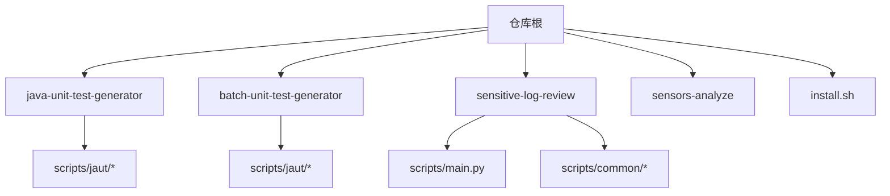
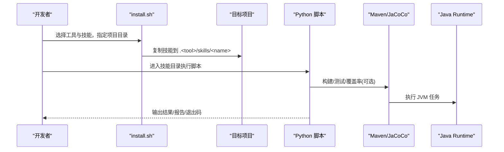
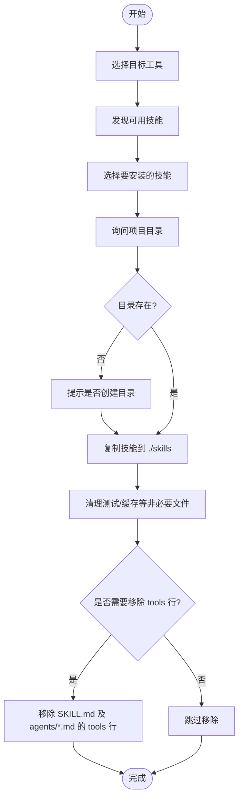
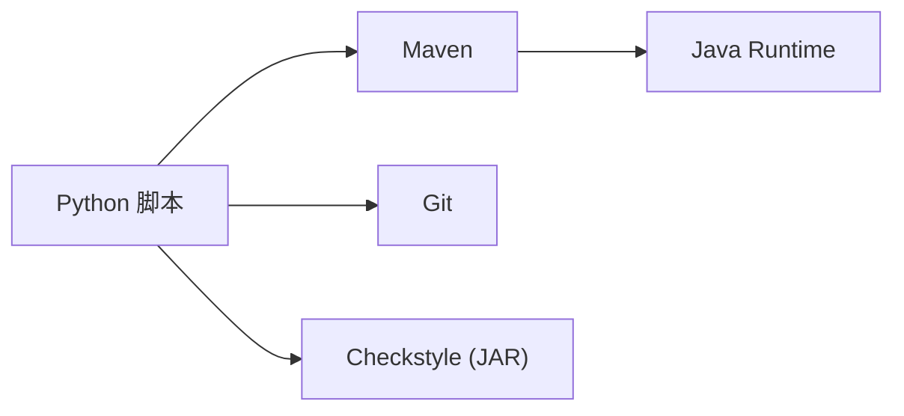

# 环境安装与配置

<cite>
**本文引用的文件**
- [install.sh](file://install.sh)
- [CLAUDE.md](file://CLAUDE.md)
- [sensitive-log-review/SKILL.md](file://sensitive-log-review/SKILL.md)
- [sensitive-log-review/README.md](file://sensitive-log-review/README.md)
- [java-unit-test-generator/scripts/jaut/config.py](file://java-unit-test-generator/scripts/jaut/config.py)
- [batch-unit-test-generator/scripts/jaut/config.py](file://batch-unit-test-generator/scripts/jaut/config.py)
- [java-unit-test-generator/scripts/jaut/maven.py](file://java-unit-test-generator/scripts/jaut/maven.py)
- [batch-unit-test-generator/scripts/jaut/maven.py](file://batch-unit-test-generator/scripts/jaut/maven.py)
</cite>

## 目录
1. [简介](#简介)
2. [项目结构](#项目结构)
3. [核心组件](#核心组件)
4. [架构总览](#架构总览)
5. [详细组件分析](#详细组件分析)
6. [依赖关系分析](#依赖关系分析)
7. [性能注意事项](#性能注意事项)
8. [故障排查指南](#故障排查指南)
9. [结论](#结论)
10. [附录](#附录)

## 简介
本指南面向首次搭建 ping-skills 开发环境的开发者，目标是快速、稳定地安装并配置运行所需的环境与工具。项目包含多个“技能”（skills），通过统一的安装脚本将技能复制到目标项目的隐藏目录中，并按不同 AI 工具进行适配。技能主要基于 Python 脚本，部分模块涉及 Java/Maven/JaCoCo 执行链路，因此需要同时准备 Python、Java、Maven、Git 等基础依赖。

## 项目结构
仓库根目录包含多个独立技能目录，每个技能提供：
- SKILL.md：技能说明与使用契约
- scripts/：Python 驱动脚本与共享逻辑
- tests/：pytest 测试套件（仅开发需要）
- protocol/references：协议与规则文档

图表来源
- [CLAUDE.md:5-14](file://CLAUDE.md#L5-L14)
- [sensitive-log-review/SKILL.md:158-196](file://sensitive-log-review/SKILL.md#L158-L196)

章节来源
- [CLAUDE.md:5-14](file://CLAUDE.md#L5-L14)

## 核心组件
- 安装器 install.sh：自动发现并复制技能到目标项目的隐藏目录，按目标 AI 工具清理冗余文件与元数据行。
- 单元测试生成技能（java-unit-test-generator、batch-unit-test-generator）：基于 Python + Maven + JaCoCo，驱动 JUnit5+Mockito 测试生成与覆盖率达标闭环。
- 敏感日志审查技能（sensitive-log-review）：Python 脚本流水线，结合 Checkstyle 对 Java 变更进行敏感信息扫描与报告生成。
- 埋点分析技能（sensors-analyze）：LLM/Python 混合流水线，用于盘点与验证埋点调用。

章节来源
- [CLAUDE.md:16-34](file://CLAUDE.md#L16-L34)
- [sensitive-log-review/SKILL.md:158-196](file://sensitive-log-review/SKILL.md#L158-L196)

## 架构总览
整体流程分为“环境准备 → 安装技能 → 运行与验证”。其中单元测试生成类技能在运行时依赖 Maven 与 JaCoCo；敏感日志审查依赖 Python 与 Java Runtime（用于 Checkstyle）。

图表来源
- [install.sh:144-204](file://install.sh#L144-L204)
- [java-unit-test-generator/scripts/jaut/maven.py:288-316](file://java-unit-test-generator/scripts/jaut/maven.py#L288-L316)
- [batch-unit-test-generator/scripts/jaut/maven.py:288-316](file://batch-unit-test-generator/scripts/jaut/maven.py#L288-L316)

## 详细组件分析

### 系统要求与依赖
- Python 3.10+：所有脚本均基于 Python 实现，并使用类型标注语法。
- Java Runtime：用于运行 Checkstyle（敏感日志审查）以及 Maven 构建的 Java 任务。
- Git 2.0+：获取代码变更、工作树操作等。
- pytest：仅开发和运行单测时需要。
- Maven：单元测试生成技能在执行测试与覆盖率时通过 Maven 调用。

章节来源
- [sensitive-log-review/README.md:57-85](file://sensitive-log-review/README.md#L57-L85)
- [sensitive-log-review/SKILL.md:158-166](file://sensitive-log-review/SKILL.md#L158-L166)
- [CLAUDE.md:16-34](file://CLAUDE.md#L16-L34)

### 环境变量与关键配置
- JAVA_UT_MVN_TIMEOUT：覆盖 Maven 执行超时秒数，默认值由配置模块提供，非法值回退默认。
- JAVA_UT_METHOD_ROUND_BUDGET / JAVA_UT_GLOBAL_ROUND_BUDGET：控制单元测试生成的迭代轮次预算。
- SLR_OUTPUT_DIR：敏感日志审查的输出目录优先级高于命令行参数。
- PYTHONIOENCODING（Windows）：建议设置为 utf-8 以避免控制台中文乱码。

章节来源
- [java-unit-test-generator/scripts/jaut/config.py:75-131](file://java-unit-test-generator/scripts/jaut/config.py#L75-L131)
- [batch-unit-test-generator/scripts/jaut/config.py:71-158](file://batch-unit-test-generator/scripts/jaut/config.py#L71-L158)
- [sensitive-log-review/SKILL.md:58-68](file://sensitive-log-review/SKILL.md#L58-L68)
- [sensitive-log-review/README.md:68-83](file://sensitive-log-review/README.md#L68-L83)

### 自动化安装步骤（install.sh）
- 支持交互式或命令行参数选择目标 AI 工具（claude/qwen/qoder/opencode/all）与要安装的 skill。
- 将技能复制到目标项目的 .<tool>/skills/<name>，并将 agents 目录复制到 .<tool>/agents。
- 自动删除测试缓存与非必要文件，并根据目标工具决定是否保留 SKILL.md 中的 tools 行。
- 支持创建不存在的目标目录，并转换为绝对路径。

图表来源
- [install.sh:144-204](file://install.sh#L144-L204)
- [install.sh:210-289](file://install.sh#L210-L289)

章节来源
- [install.sh:144-204](file://install.sh#L144-L204)
- [install.sh:210-289](file://install.sh#L210-L289)

### 手动安装各技能模块
- 进入目标项目根目录，为每个需要的技能创建对应隐藏目录结构：
  - <project>/.<tool>/skills/<skill-name>
  - <project>/.<tool>/agents（如技能包含 agents 目录）
- 将对应技能的目录内容复制到上述路径。
- 根据目标 AI 工具决定是否保留 SKILL.md 中的 tools 行（qoder/qwen 保留，claude/opencode 需移除）。
- 删除 tests、__pycache__、.pytest_cache、test.log 等非必要文件。

章节来源
- [install.sh:144-204](file://install.sh#L144-L204)

### 操作系统差异与注意事项
- Linux/macOS：
  - 确保 PATH 中包含 Python、Git、Maven 可执行路径。
  - 如需设置 JAVA_HOME，请指向 JDK 安装目录。
  - 可通过 export 设置 PYTHONIOENCODING=utf-8（非必须，但推荐）。
- Windows：
  - 建议设置 PYTHONIOENCODING=utf-8 避免控制台中文乱码。
  - 确保 Python、Git、Maven 已加入系统 PATH。
  - 输出目录策略会自动解析到系统临时目录，无需手动创建。

章节来源
- [sensitive-log-review/README.md:68-83](file://sensitive-log-review/README.md#L68-L83)
- [sensitive-log-review/SKILL.md:58-68](file://sensitive-log-review/SKILL.md#L58-L68)

### 依赖验证方法
- Python：
  - 运行 python --version，确认版本 ≥ 3.10。
  - 在技能目录下运行 python -m pytest tests/ 以验证测试套件。
- Git：
  - 运行 git --version，确认版本 ≥ 2.0。
- Java/Maven：
  - 运行 java -version 与 mvn -version，确认可执行。
  - 单元测试生成技能会调用 resolve_tool("mvn")，若不可用则返回 None 并失败。
- 敏感日志审查：
  - 运行 python scripts/main.py --doctor -r . 进行环境诊断，检查 Python/java/git/jar 校验、规则与词典文件、输出目录等。

章节来源
- [CLAUDE.md:16-34](file://CLAUDE.md#L16-L34)
- [java-unit-test-generator/scripts/jaut/maven.py:288-316](file://java-unit-test-generator/scripts/jaut/maven.py#L288-L316)
- [batch-unit-test-generator/scripts/jaut/maven.py:288-316](file://batch-unit-test-generator/scripts/jaut/maven.py#L288-L316)
- [sensitive-log-review/SKILL.md:27-29](file://sensitive-log-review/SKILL.md#L27-L29)

### 常见安装问题与解决方案
- 找不到 mvn：
  - 确认 Maven 已安装且 PATH 正确；单元测试生成技能在未找到 mvn 时会返回 None，导致后续构建失败。
- Python 版本过低：
  - 升级至 Python 3.10+，否则类型标注与脚本可能无法正常运行。
- 中文乱码（Windows）：
  - 设置 PYTHONIOENCODING=utf-8。
- 输出目录权限不足：
  - 使用 -o/--output-dir 指定有写入权限的目录；或使用 SLR_OUTPUT_DIR 环境变量。
- 技能重复安装冲突：
  - install.sh 会在目标已存在同名技能时提示覆盖；谨慎选择覆盖或删除旧版本后重新安装。

章节来源
- [java-unit-test-generator/scripts/jaut/maven.py:288-316](file://java-unit-test-generator/scripts/jaut/maven.py#L288-L316)
- [batch-unit-test-generator/scripts/jaut/maven.py:288-316](file://batch-unit-test-generator/scripts/jaut/maven.py#L288-L316)
- [sensitive-log-review/README.md:68-83](file://sensitive-log-review/README.md#L68-L83)
- [install.sh:161-173](file://install.sh#L161-L173)

## 依赖关系分析
- 单元测试生成技能依赖：
  - Python：脚本驱动与状态管理
  - Maven：构建与测试执行
  - JaCoCo：覆盖率收集（pom 未配置时使用完整坐标挂载）
  - Git：工作树与变更检测
- 敏感日志审查技能依赖：
  - Python：主流程编排与各子脚本
  - Java Runtime：运行 Checkstyle
  - Git：获取变更文件清单
  - pytest：仅开发与测试阶段

图表来源
- [java-unit-test-generator/scripts/jaut/maven.py:288-316](file://java-unit-test-generator/scripts/jaut/maven.py#L288-L316)
- [batch-unit-test-generator/scripts/jaut/maven.py:288-316](file://batch-unit-test-generator/scripts/jaut/maven.py#L288-L316)
- [sensitive-log-review/SKILL.md:158-196](file://sensitive-log-review/SKILL.md#L158-L196)

章节来源
- [java-unit-test-generator/scripts/jaut/maven.py:288-316](file://java-unit-test-generator/scripts/jaut/maven.py#L288-L316)
- [batch-unit-test-generator/scripts/jaut/maven.py:288-316](file://batch-unit-test-generator/scripts/jaut/maven.py#L288-L316)
- [sensitive-log-review/SKILL.md:158-196](file://sensitive-log-review/SKILL.md#L158-L196)

## 性能注意事项
- Maven 超时与进度：
  - 可通过 JAVA_UT_MVN_TIMEOUT 调整超时；脚本内置进度输出间隔，防止误判进程无响应。
- 批量处理预算：
  - 批量单元测试生成支持类级预算与环境变量覆盖，避免长时间占用资源。
- 并行执行：
  - 敏感日志审查采用多链路并行（步骤1-7），目标全流程耗时较短；CI 场景可使用 --run-id 隔离并行产物。

章节来源
- [java-unit-test-generator/scripts/jaut/config.py:101-131](file://java-unit-test-generator/scripts/jaut/config.py#L101-L131)
- [batch-unit-test-generator/scripts/jaut/config.py:141-168](file://batch-unit-test-generator/scripts/jaut/config.py#L141-L168)
- [sensitive-log-review/SKILL.md:58-68](file://sensitive-log-review/SKILL.md#L58-L68)

## 故障排查指南
- 单元测试生成失败：
  - 检查 mvn 是否可用；查看 mvn.log 与进度文件；确认 JAVA_UT_MVN_TIMEOUT 是否合理。
- 敏感日志审查失败：
  - 使用 --doctor 模式逐项检查环境与依赖；确认输出目录权限与路径；核对规则与词典文件完整性。
- 编码问题：
  - Windows 下设置 PYTHONIOENCODING=utf-8；脚本统一使用 errors='replace' 解码，避免漏扫含乱码行的敏感日志。

章节来源
- [java-unit-test-generator/scripts/jaut/config.py:101-131](file://java-unit-test-generator/scripts/jaut/config.py#L101-L131)
- [sensitive-log-review/SKILL.md:27-29](file://sensitive-log-review/SKILL.md#L27-L29)
- [sensitive-log-review/README.md:68-83](file://sensitive-log-review/README.md#L68-L83)

## 结论
通过本指南，您可以快速完成 ping-skills 的环境准备与技能安装。建议使用 install.sh 进行自动化安装，并结合各技能提供的 --doctor 与测试套件进行依赖验证。对于 Java/Maven 相关任务，确保 PATH 与 JAVA_HOME 配置正确；对于 Windows 用户，注意编码设置。遇到问题时，优先参考各技能的退出码契约与错误提示进行定位与修复。

## 附录
- 常用命令参考：
  - 安装技能：./install.sh <tool> [<skill>[,<skill>...]] [<project-dir>]
  - 运行单测：cd <skill> && python -m pytest tests/
  - 环境诊断：python scripts/main.py --doctor -r .

章节来源
- [CLAUDE.md:16-34](file://CLAUDE.md#L16-L34)
- [sensitive-log-review/SKILL.md:27-29](file://sensitive-log-review/SKILL.md#L27-L29)