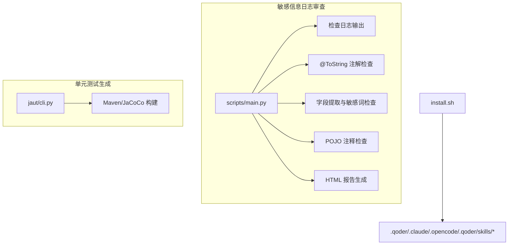
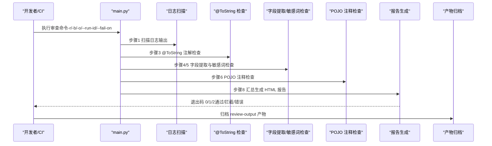
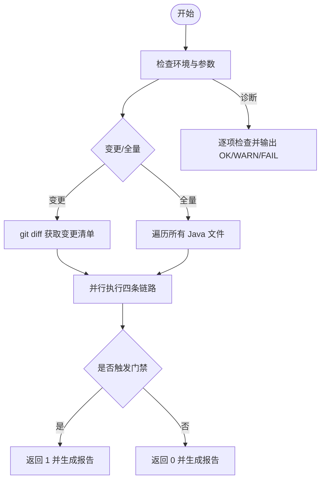
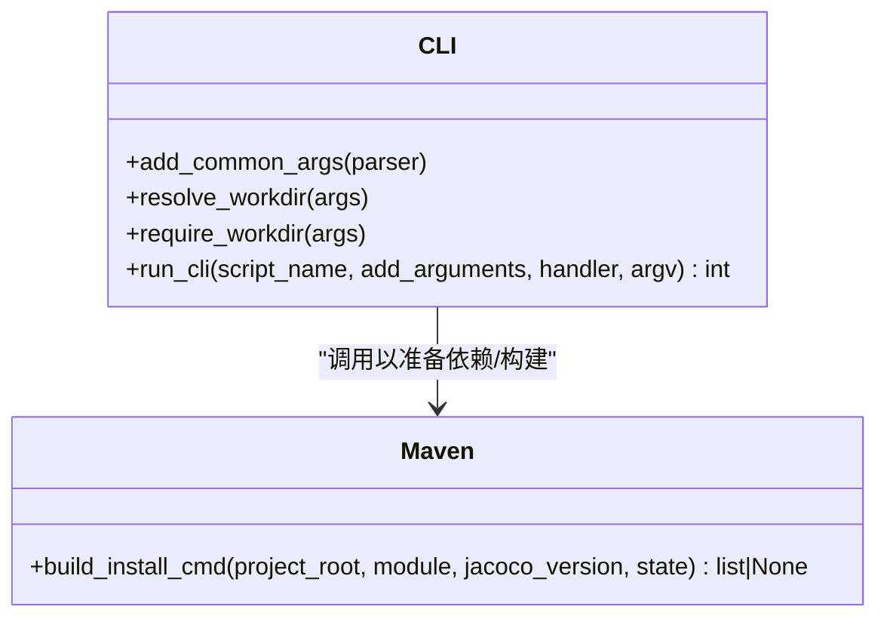
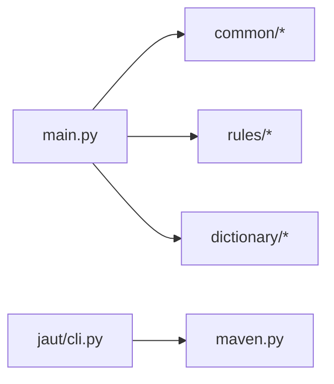

# 部署与集成

<cite>
**本文引用的文件**
- [install.sh](file://install.sh)
- [README.md](file://sensitive-log-review/README.md)
- [SKILL.md](file://sensitive-log-review/SKILL.md)
- [cli.py](file://batch-unit-test-generator/scripts/jaut/cli.py)
- [maven.py](file://java-unit-test-generator/scripts/jaut/maven.py)
- [pojo.config](file://sensitive-log-review/scripts/rules/pojo.config)
- [log-scanner.json](file://sensitive-log-review/scripts/rules/log-scanner.json)
- [.gitignore](file://.gitignore)
</cite>

## 目录
1. [简介](#简介)
2. [项目结构](#项目结构)
3. [核心组件](#核心组件)
4. [架构总览](#架构总览)
5. [详细组件分析](#详细组件分析)
6. [依赖关系分析](#依赖关系分析)
7. [性能考虑](#性能考虑)
8. [故障诊断指南](#故障诊断指南)
9. [结论](#结论)
10. [附录](#附录)

## 简介
本指南面向 ping-skills 项目的部署与集成，覆盖环境要求、安装步骤（手动与自动化）、CI/CD 集成（Jenkins、GitHub Actions）、与现有开发工作流（Git Hooks、预提交钩子）的对接方式、容器化与 Kubernetes 编排建议、性能调优与监控告警配置，以及常见问题的排障方法。目标是帮助团队快速将工具链稳定地嵌入到开发与运维流程中。

## 项目结构
仓库包含多个独立 Skill：
- sensitive-log-review：敏感信息日志审查流水线，Python + Java（Checkstyle），无第三方 Python 依赖，支持 CI 门禁与 HTML 报告。
- java-unit-test-generator / batch-unit-test-generator：Java 单元测试生成与批量执行能力，依赖 Maven/JaCoCo，提供统一 CLI 框架与状态机路由。
- sensors-analyze：传感器分析报告处理脚本集合。
- install.sh：一键将 skill 安装到目标工具的 .tool/skills 目录，并清理非必要文件。

图表来源
- [install.sh:145-204](file://install.sh#L145-L204)
- [README.md:30-54](file://sensitive-log-review/README.md#L30-L54)
- [cli.py:95-129](file://batch-unit-test-generator/scripts/jaut/cli.py#L95-L129)
- [maven.py:288-316](file://java-unit-test-generator/scripts/jaut/maven.py#L288-L316)

章节来源
- [install.sh:1-289](file://install.sh#L1-L289)
- [README.md:1-497](file://sensitive-log-review/README.md#L1-L497)
- [SKILL.md:1-288](file://sensitive-log-review/SKILL.md#L1-L288)
- [cli.py:1-129](file://batch-unit-test-generator/scripts/jaut/cli.py#L1-L129)
- [maven.py:288-316](file://java-unit-test-generator/scripts/jaut/maven.py#L288-L316)

## 核心组件
- 安装器 install.sh：自动发现并复制 skill 到目标工具目录，按工具差异处理 SKILL.md 中的 tools 行，清理测试与缓存文件。
- 敏感信息日志审查 main.py：编排多条并行链路，产出中间清单与 HTML 报告，提供 --doctor 环境诊断与 --fail-on 门禁策略。
- 单元测试生成 jaut/cli.py：统一 CLI 入口，解析参数、初始化日志、异常转协议块、计算下一步动作并输出。
- Maven/JaCoCo 集成：按需注入 JaCoCo prepare-agent，支持多模块增量构建与跳过测试加速。

章节来源
- [install.sh:145-204](file://install.sh#L145-L204)
- [README.md:127-160](file://sensitive-log-review/README.md#L127-L160)
- [cli.py:63-129](file://batch-unit-test-generator/scripts/jaut/cli.py#L63-L129)
- [maven.py:288-316](file://java-unit-test-generator/scripts/jaut/maven.py#L288-L316)

## 架构总览
下图展示敏感信息日志审查在 CI 中的典型调用路径与产物流转。

图表来源
- [README.md:175-234](file://sensitive-log-review/README.md#L175-L234)
- [SKILL.md:70-157](file://sensitive-log-review/SKILL.md#L70-L157)

## 详细组件分析

### 安装器 install.sh
- 功能要点
  - 自动发现 skill 目录，支持交互式或命令行选择工具与 skill。
  - 复制到目标工具目录（如 .qoder/skills、.claude/skills 等）。
  - 非 qoder/qwen 时移除 SKILL.md 及 agents 下 .md 文件的第一个 tools 行。
  - 清理 tests、__pycache__、test.log 等非必要文件。
- 使用建议
  - 在 CI 中以非交互模式传入工具名与 skill 名，指定项目根目录。
  - 结合 Git Hook 在提交前将最新 skill 同步到本地工具目录。

章节来源
- [install.sh:145-204](file://install.sh#L145-L204)
- [install.sh:210-289](file://install.sh#L210-L289)

### 敏感信息日志审查（sensitive-log-review）
- 环境要求
  - Python 3.10+；Java Runtime（运行 Checkstyle）；Git 2.0+；pytest（仅开发）。
  - Windows 需设置 PYTHONIOENCODING=utf-8。
- 部署位置
  - 推荐置于项目内 .qoder/skills/sensitive-log-review/ 或同类目录。
- 关键参数
  - -r/--root：项目根（必须为 git 仓库）。
  - -b/--branch：对比基准分支。
  - -o/--output-dir：产物输出目录（最高优先级）。
  - --run-id：并行隔离子目录。
  - --fail-on：门禁类别开关。
  - --changed-only/--full-scan：变更/全量扫描切换。
  - --strict-mode：存在失败文件即失败。
  - --doctor：环境诊断。
- 产物
  - 中间清单（list/results/fields）与最终 HTML 报告。
- 退出码契约
  - 0 通过；1 门禁拦截；2 执行错误。

图表来源
- [README.md:30-54](file://sensitive-log-review/README.md#L30-L54)
- [README.md:167-234](file://sensitive-log-review/README.md#L167-L234)
- [SKILL.md:70-157](file://sensitive-log-review/SKILL.md#L70-L157)

章节来源
- [README.md:57-160](file://sensitive-log-review/README.md#L57-L160)
- [SKILL.md:31-68](file://sensitive-log-review/SKILL.md#L31-L68)

### 单元测试生成（jaut/cli.py 与 maven 集成）
- 统一 CLI 框架
  - 解析共享参数（--workdir/--project-root）。
  - 统一日志初始化与异常转协议块。
  - 根据 Decision 与 Route 计算 next_step 并输出。
- Maven/JaCoCo 集成
  - 检测 pom 是否配置 jacoco-maven-plugin，未配置则动态挂载 prepare-agent。
  - 支持多模块 -pl/-am 增量构建，跳过测试提升速度。

图表来源
- [cli.py:63-129](file://batch-unit-test-generator/scripts/jaut/cli.py#L63-L129)
- [maven.py:288-316](file://java-unit-test-generator/scripts/jaut/maven.py#L288-L316)

章节来源
- [cli.py:1-129](file://batch-unit-test-generator/scripts/jaut/cli.py#L1-L129)
- [maven.py:288-316](file://java-unit-test-generator/scripts/jaut/maven.py#L288-L316)

### 规则与词典
- pojo.config：定义 POJO 判定目录与后缀，用于识别待检查的类。
- log-scanner.json：配置日志变量名与系统输出检测开关。

章节来源
- [pojo.config:1-25](file://sensitive-log-review/scripts/rules/pojo.config#L1-L25)
- [log-scanner.json:1-7](file://sensitive-log-review/scripts/rules/log-scanner.json#L1-L7)

## 依赖关系分析
- 外部依赖
  - Python 3.10+（类型标注语法 X | None）。
  - Java Runtime（运行 Checkstyle）。
  - Git（变更计算）。
  - pytest（仅开发单测）。
- 内部依赖
  - scripts/common 包：路径、文本、git_utils、pojo_config、dictionary、errors、failures、java_lexer。
  - rules/dictionary：分层词典与规则配置。
- 耦合与内聚
  - main.py 作为编排层，低耦合调用各检查脚本；common 包集中复用逻辑，提高内聚性。
  - jaut/cli.py 与 maven.py 解耦：CLI 负责流程控制，maven 专注构建命令组装。

图表来源
- [SKILL.md:158-196](file://sensitive-log-review/SKILL.md#L158-L196)
- [cli.py:95-129](file://batch-unit-test-generator/scripts/jaut/cli.py#L95-L129)
- [maven.py:288-316](file://java-unit-test-generator/scripts/jaut/maven.py#L288-L316)

章节来源
- [SKILL.md:158-196](file://sensitive-log-review/SKILL.md#L158-L196)

## 性能考虑
- 变更优先：默认 --changed-only 仅扫描相对目标分支的变更文件，显著降低耗时。
- 并行执行：四条链路并行，缩短整体审查时间。
- 增量构建：单元测试生成阶段通过 -pl/-am 与 -DskipTests 减少不必要编译。
- 产物缓存：合理设置 --run-id 避免 CI 并行冲突；必要时可缓存中间清单。
- 严格模式：--strict-mode 仅在需要严格质量门禁时启用，避免误报导致频繁失败。

[本节为通用指导，无需特定文件引用]

## 故障诊断指南
- 环境诊断
  - 使用 --doctor 逐项检查 Python/java/git 可用性、规则与词典文件完整性、输出目录可写性等。
- 常见问题
  - 控制台中文乱码：设置 PYTHONIOENCODING=utf-8。
  - 不是 git 仓库：确保 -r 指向包含 .git 的仓库根。
  - 找不到 java：安装 JRE/JDK 并确保 PATH。
  - 变更检查结果为空：确认分支引用完整（CI 中 fetch-depth: 0），或使用 --full-scan。
  - run-id 非法字符：仅允许字母数字/._-，且首字符为字母数字，最长 64 字符。
  - jar SHA256 校验失败：从可信源重新获取 jar 或同步更新基线。
- 失败文件
  - failed-files.list 记录读取/解析失败的文件；默认不计入门禁；开启 --strict-mode 则以失败结束。

章节来源
- [README.md:361-483](file://sensitive-log-review/README.md#L361-L483)
- [SKILL.md:51-68](file://sensitive-log-review/SKILL.md#L51-L68)

## 结论
本指南提供了 ping-skills 的完整部署与集成方案：从环境准备、安装脚本使用，到 CI/CD 流水线集成、与开发工作流的衔接、容器化与编排建议、性能优化与监控告警，以及详尽的故障诊断方法。按照本文实践，团队可将敏感信息审查与单元测试生成能力稳定地嵌入到现有研发流程中，提升代码质量与安全合规水平。

## 附录

### 环境要求与系统依赖
- Python 3.10+
- Java Runtime（运行 Checkstyle）
- Git 2.0+
- pytest（仅开发）
- Windows 需设置 PYTHONIOENCODING=utf-8

章节来源
- [README.md:57-85](file://sensitive-log-review/README.md#L57-L85)
- [SKILL.md:158-165](file://sensitive-log-review/SKILL.md#L158-L165)

### 安装步骤（手动与自动化）
- 手动安装
  - 在项目根目录下执行 install.sh，选择工具与 skill，指定项目目录。
- 自动化部署
  - CI 中非交互调用 install.sh，传入工具与 skill 列表，并指定项目目录。
  - 结合 Git Hook 在提交前同步 skill 到本地工具目录。

章节来源
- [install.sh:210-289](file://install.sh#L210-L289)

### CI/CD 集成示例
- Jenkins Declarative Pipeline
  - 设置环境变量 PYTHONIOENCODING=utf-8。
  - 执行审查命令，归档 review-output 产物。
- GitHub Actions
  - checkout 使用 fetch-depth: 0。
  - setup-python 与 setup-java。
  - 执行审查命令并上传产物。

章节来源
- [README.md:175-234](file://sensitive-log-review/README.md#L175-L234)

### 与开发工作流集成
- Git Hooks
  - pre-commit：运行敏感信息审查与单元测试生成，失败则阻止提交。
- 预提交钩子
  - 使用 install.sh 将最新 skill 同步到 .qoder/.claude/.opencode 等目录。
- 持续集成流水线
  - 在 PR/MR 合并前执行审查与门禁，归档报告供评审参考。

[本节为通用指导，无需特定文件引用]

### 容器化与 Kubernetes 编排建议
- 容器镜像
  - 基础镜像：python:3.11-slim + openjdk:17-jre-slim。
  - 安装 Git 与必要的系统库；将 skill 目录拷贝至镜像。
  - 设置环境变量 PYTHONIOENCODING=utf-8。
- 编排配置
  - Deployment：运行审查任务，挂载输出目录持久卷。
  - ConfigMap：存放规则与词典文件，便于热更新。
  - ServiceAccount：如需访问私有仓库，配置凭据。
  - 资源限制：为审查任务设置 CPU/内存上限，避免影响集群稳定性。

[本节为通用指导，无需特定文件引用]

### 性能调优与监控告警
- 性能调优
  - 使用 --changed-only 与 --run-id 提升并发效率。
  - 单元测试生成阶段使用 -pl/-am 与 -DskipTests。
- 监控告警
  - 收集审查退出码与产物大小，设置阈值告警。
  - 对 failedFiles 数量与失败率进行趋势监控。
  - 对 CI 流水线耗时与失败率进行看板展示。

[本节为通用指导，无需特定文件引用]

### 忽略文件与制品管理
- .gitignore 排除构建产物、缓存与临时文件，保持仓库整洁。
- CI 中归档 review-output 产物，保留历史报告以供审计。

章节来源
- [.gitignore:1-88](file://.gitignore#L1-L88)