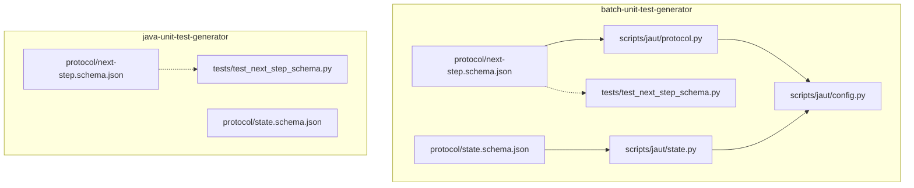
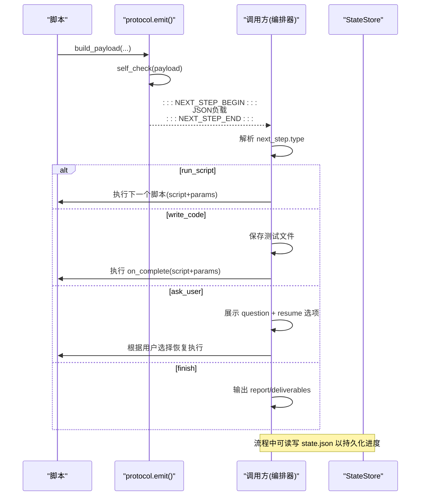
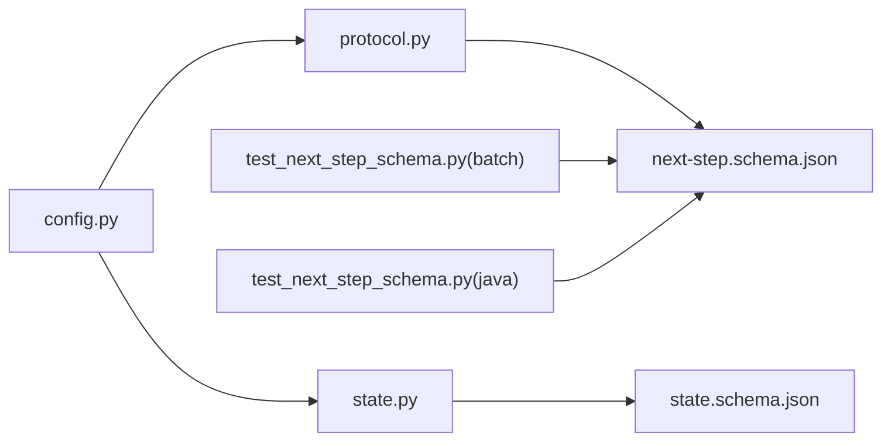

# JSON Schema 配置

<cite>
**本文引用的文件**
- [next-step.schema.json](file://batch-unit-test-generator/protocol/next-step.schema.json)
- [state.schema.json](file://batch-unit-test-generator/protocol/state.schema.json)
- [next-step.schema.json](file://java-unit-test-generator/protocol/next-step.schema.json)
- [state.schema.json](file://java-unit-test-generator/protocol/state.schema.json)
- [protocol.py](file://batch-unit-test-generator/scripts/jaut/protocol.py)
- [state.py](file://batch-unit-test-generator/scripts/jaut/state.py)
- [config.py](file://batch-unit-test-generator/scripts/jaut/config.py)
- [test_next_step_schema.py](file://batch-unit-test-generator/tests/test_next_step_schema.py)
- [test_next_step_schema.py](file://java-unit-test-generator/tests/test_next_step_schema.py)
</cite>

## 目录
1. [简介](#简介)
2. [项目结构](#项目结构)
3. [核心组件](#核心组件)
4. [架构总览](#架构总览)
5. [详细组件分析](#详细组件分析)
6. [依赖关系分析](#依赖关系分析)
7. [性能与可靠性](#性能与可靠性)
8. [故障排查指南](#故障排查指南)
9. [结论](#结论)
10. [附录：Schema 参考与示例](#附录schema-参考与示例)

## 简介
本文件为 ping-skills 项目中“NEXT_STEP 协议”和“状态存储 state.json”的完整 JSON Schema 配置文档。内容涵盖：
- NEXT_STEP 协议消息格式（请求/响应/错误处理）
- 状态持久化字段的生命周期管理与版本兼容
- Schema 验证过程与错误信息处理
- Schema 扩展指南与自定义字段添加方法
- 实际配置文件示例与常见配置模式
- 帮助开发者正确实现协议通信与状态管理

## 项目结构
本项目在两个子工程中分别维护了相同的协议与状态 Schema，并配套运行时校验与持久化逻辑：
- batch-unit-test-generator：批量单元测试生成器
- java-unit-test-generator：Java 单元测试生成器

图表来源
- [next-step.schema.json:1-195](file://batch-unit-test-generator/protocol/next-step.schema.json#L1-L195)
- [state.schema.json:1-161](file://batch-unit-test-generator/protocol/state.schema.json#L1-L161)
- [protocol.py:1-105](file://batch-unit-test-generator/scripts/jaut/protocol.py#L1-L105)
- [state.py:1-165](file://batch-unit-test-generator/scripts/jaut/state.py#L1-L165)
- [config.py:1-181](file://batch-unit-test-generator/scripts/jaut/config.py#L1-L181)
- [test_next_step_schema.py:1-66](file://batch-unit-test-generator/tests/test_next_step_schema.py#L1-L66)
- [test_next_step_schema.py:1-66](file://java-unit-test-generator/tests/test_next_step_schema.py#L1-L66)

章节来源
- [next-step.schema.json:1-195](file://batch-unit-test-generator/protocol/next-step.schema.json#L1-L195)
- [state.schema.json:1-161](file://batch-unit-test-generator/protocol/state.schema.json#L1-L161)
- [protocol.py:1-105](file://batch-unit-test-generator/scripts/jaut/protocol.py#L1-L105)
- [state.py:1-165](file://batch-unit-test-generator/scripts/jaut/state.py#L1-L165)
- [config.py:1-181](file://batch-unit-test-generator/scripts/jaut/config.py#L1-L181)
- [test_next_step_schema.py:1-66](file://batch-unit-test-generator/tests/test_next_step_schema.py#L1-L66)
- [test_next_step_schema.py:1-66](file://java-unit-test-generator/tests/test_next_step_schema.py#L1-L66)

## 核心组件
- NEXT_STEP 协议负载：由脚本在 stdout 末尾输出，被标记包裹，包含协议版本、脚本名、状态、退出码、摘要、产物、指标与下一步动作。
- 状态存储 state.json：断点续跑的状态文档，记录工作树、覆盖率、迭代预算、方法进度等，支持原子写入与向后兼容迁移。
- 运行期校验：轻量自检必填键与枚举值；可选使用 jsonschema 进行严格校验。
- 配置常量：集中定义协议版本、标记、状态枚举、退出码、阈值与预算等。

章节来源
- [protocol.py:17-43](file://batch-unit-test-generator/scripts/jaut/protocol.py#L17-L43)
- [config.py:35-48](file://batch-unit-test-generator/scripts/jaut/config.py#L35-L48)
- [state.py:77-165](file://batch-unit-test-generator/scripts/jaut/state.py#L77-L165)

## 架构总览
NEXT_STEP 协议是脚本与调用方（LLM/编排器）之间的契约。脚本执行完毕后，通过 emit 输出标记包裹的 JSON 负载；调用方解析后根据 next_step.type 决定后续动作（继续运行脚本、让 LLM 写代码、询问用户或结束）。

图表来源
- [protocol.py:22-105](file://batch-unit-test-generator/scripts/jaut/protocol.py#L22-L105)
- [state.py:77-165](file://batch-unit-test-generator/scripts/jaut/state.py#L77-L165)

## 详细组件分析

### NEXT_STEP 协议 Schema（batch-unit-test-generator）
- 顶层对象
  - protocol_version: 固定字符串“1.0”
  - script: 产出本协议的脚本文件名
  - status: 枚举 ["success", "empty", "failed", "needs_input"]
  - exit_code: 枚举 [0, 1, 2, 3]，含义分别为正常完成、需要继续、脚本执行错误、状态/协议错误
  - summary: 面向调用方的一句话结论
  - artifacts: 产物数组，每项至少包含 path 与 kind
  - metrics: 可选量化指标对象
  - next_step: 下一步动作对象，必须包含 type 与 reason，并按 type 条件要求不同字段
- next_step 类型与约束
  - run_script: 必须提供 script 与 params
  - write_code: 必须提供 instructions 与 on_complete（on_complete 必须包含 script 与 params）
  - ask_user: 必须提供 question；resume 项中非 terminate 选项必须包含 script 与 params
  - finish: 除 select_worktree.py、batch_diff.py、batch_init.py 外，其他脚本的 finish 必须携带 report
- 额外规则
  - additionalProperties: false 表示不允许未知顶层字段
  - allOf 条件分支用于强制某些场景下的必填字段

章节来源
- [next-step.schema.json:1-195](file://batch-unit-test-generator/protocol/next-step.schema.json#L1-L195)
- [test_next_step_schema.py:17-65](file://batch-unit-test-generator/tests/test_next_step_schema.py#L17-L65)

### NEXT_STEP 协议 Schema（java-unit-test-generator）
- 与批量版基本一致，差异在于裸 finish 的脚本排除表仅包含 select_worktree.py
- 其余字段、枚举、条件约束保持一致

章节来源
- [next-step.schema.json:1-195](file://java-unit-test-generator/protocol/next-step.schema.json#L1-L195)
- [test_next_step_schema.py:17-65](file://java-unit-test-generator/tests/test_next_step_schema.py#L17-L65)

### 状态存储 Schema（state.json）
- 顶层必需字段
  - schema_version: 整数，最小值为 1，用于顺序迁移
  - project_root: 选定工作树根目录绝对路径
  - threshold: 行覆盖率门槛（百分比），默认 80.0
  - target_class: 目标类 FQCN
  - module: Maven 模块标识（根模块为 '.'）
  - iteration: 当前方法迭代轮次（切换方法时清零）
  - global_iteration: 全局迭代轮次（永不重置）
  - methods: 方法覆盖率数组
- 关键对象与定义
  - classCoverage: covered、missed、rate（0-100）
  - methodCoverage: name、desc、covered、missed、status（pending/done/skipped）、initial_rate、round_rates、round_test_results
- 其他重要字段
  - workdir、target_method、source_file、jacoco_version、coverage_excludes、mvn_log、git_baseline
  - current_method、coverage_history、test_history、final_checked、final_check_fail_streak
  - worktree_branch、final_test_summary、test_class_file、test_class_simple、plan
  - method_round_bonus、global_round_bonus、validate_fail_streak、jacoco_config_cache
  - batch_mode、class_round_used（批量模式专用）
- 兼容性
  - additionalProperties: true 允许扩展字段
  - from_dict 加载时对缺失键填默认值，保证向后兼容旧版本 state.json

章节来源
- [state.schema.json:1-161](file://batch-unit-test-generator/protocol/state.schema.json#L1-L161)
- [state.schema.json:1-151](file://java-unit-test-generator/protocol/state.schema.json#L1-L151)

### 运行期协议实现（protocol.py）
- make_next_step：构造 next_step 对象，按类型附加必要字段
- build_payload：统一构建负载，设置协议版本、状态、退出码、摘要、产物与 next_step
- payload_from_decision：从 Decision 模型组装负载
- self_check：轻量自检必填键与枚举取值，不符仅告警不抛异常
- emit：序列化负载并以标记包裹输出；若序列化失败，输出错误负载以避免调用方无限等待

章节来源
- [protocol.py:17-105](file://batch-unit-test-generator/scripts/jaut/protocol.py#L17-L105)

### 状态持久化（state.py）
- StateStore：围绕单个 workdir 的状态读写
  - locked：跨进程独占锁，保护 load→修改→save 的原子性
  - load：读取并反序列化，缺失或损坏返回 None；对旧版本执行迁移
  - save：原子写入（临时文件 + os.replace + fsync）
  - write_coverage：写出 coverage.json 快照
- 迁移管道：_migrate 将旧 schema_version 顺序升级到当前版本，缺失迁移函数会报错

章节来源
- [state.py:43-75](file://batch-unit-test-generator/scripts/jaut/state.py#L43-L75)
- [state.py:77-165](file://batch-unit-test-generator/scripts/jaut/state.py#L77-L165)

### 配置常量（config.py）
- 协议相关：NEXT_STEP_PROTOCOL_VERSION、BEGIN/END 标记、状态枚举、next_step.type 枚举
- 退出码：EXIT_OK、EXIT_CONTINUE、EXIT_ERROR、EXIT_STATE
- 覆盖率与测试：DEFAULT_THRESHOLD、DEFAULT_JACOCO_VERSION、ABSTRACT_METHOD_COVERAGE、ASSERTION_FAILURE_TYPE_PREFIXES
- 迭代预算与升级：NO_IMPROVEMENT_ROUNDS、TEST_FAIL_STREAK_ROUNDS、METHOD_ROUND_BUDGET、GLOBAL_ROUND_BUDGET、FINAL_CHECK_FAIL_STREAK_LIMIT、RESUME_GRANT_ROUNDS、VALIDATE_FAIL_STREAK_LIMIT
- Maven 执行：超时、终止策略、必带参数
- 批量模式：BATCH_CLASS_ROUND_BUDGET、BATCH_AUTO_GRANT、默认分支探测顺序
- state.json 版本：STATE_SCHEMA_VERSION

章节来源
- [config.py:35-79](file://batch-unit-test-generator/scripts/jaut/config.py#L35-L79)
- [config.py:141-173](file://batch-unit-test-generator/scripts/jaut/config.py#L141-L173)

## 依赖关系分析
- 协议层依赖配置常量（协议版本、标记、枚举、退出码）
- 状态层依赖配置常量（文件名、工作目录、schema 版本）
- 测试用例验证 Schema 的条件分支（finish→report 的脚本排除表）

图表来源
- [config.py:35-79](file://batch-unit-test-generator/scripts/jaut/config.py#L35-L79)
- [protocol.py:17-43](file://batch-unit-test-generator/scripts/jaut/protocol.py#L17-L43)
- [state.py:77-165](file://batch-unit-test-generator/scripts/jaut/state.py#L77-L165)
- [test_next_step_schema.py:17-65](file://batch-unit-test-generator/tests/test_next_step_schema.py#L17-L65)
- [test_next_step_schema.py:17-65](file://java-unit-test-generator/tests/test_next_step_schema.py#L17-L65)

章节来源
- [config.py:35-79](file://batch-unit-test-generator/scripts/jaut/config.py#L35-L79)
- [protocol.py:17-43](file://batch-unit-test-generator/scripts/jaut/protocol.py#L17-L43)
- [state.py:77-165](file://batch-unit-test-generator/scripts/jaut/state.py#L77-L165)
- [test_next_step_schema.py:17-65](file://batch-unit-test-generator/tests/test_next_step_schema.py#L17-L65)
- [test_next_step_schema.py:17-65](file://java-unit-test-generator/tests/test_next_step_schema.py#L17-L65)

## 性能与可靠性
- 原子写入：state.json 采用临时文件 + os.replace + fsync，避免半截状态破坏断点续跑
- 并发安全：使用独立 .lock 文件与平台相关锁（POSIX fcntl.flock / Windows msvcrt.locking）保护临界区
- 容错输出：emit 在序列化失败时输出错误负载，避免调用方无限等待
- 向后兼容：state.json 加载时对缺失键填默认值，并通过迁移管道逐步升级 schema_version

章节来源
- [state.py:147-165](file://batch-unit-test-generator/scripts/jaut/state.py#L147-L165)
- [state.py:93-129](file://batch-unit-test-generator/scripts/jaut/state.py#L93-L129)
- [protocol.py:74-105](file://batch-unit-test-generator/scripts/jaut/protocol.py#L74-L105)

## 故障排查指南
- 协议负载缺少必填键或枚举非法：self_check 会记录警告，检查 payload 构建逻辑与 config 中的枚举集合
- finish 未携带 report：在非排除脚本下，next_step.type=finish 必须包含 report；参考测试用例验证条件分支
- 状态文件损坏或缺失：load 返回 None，调用方应按状态错误流转；检查 file 权限与磁盘空间
- 迁移失败：缺少 vN 迁移函数会抛出异常，需补充 _MIGRATIONS 注册表并递增 STATE_SCHEMA_VERSION
- 序列化失败：emit 捕获异常并输出错误负载；检查 payload 数据结构与 ensure_ascii 编码

章节来源
- [protocol.py:59-105](file://batch-unit-test-generator/scripts/jaut/protocol.py#L59-L105)
- [state.py:55-75](file://batch-unit-test-generator/scripts/jaut/state.py#L55-L75)
- [test_next_step_schema.py:41-65](file://batch-unit-test-generator/tests/test_next_step_schema.py#L41-L65)

## 结论
NEXT_STEP 协议与 state.json Schema 共同构成了脚本与编排器之间的稳定契约。通过严格的 Schema 约束、运行期轻量自检与可选的 jsonschema 校验，以及原子化的状态持久化与迁移机制，系统实现了高可靠、可扩展且向后兼容的协议通信与状态管理。开发者应遵循本文档的字段定义、约束条件与最佳实践，确保协议消息的正确性与状态的一致性。

## 附录：Schema 参考与示例

### NEXT_STEP 协议字段参考
- 顶层字段
  - protocol_version: 字符串，固定“1.0”
  - script: 字符串，脚本文件名
  - status: 枚举 ["success", "empty", "failed", "needs_input"]
  - exit_code: 枚举 [0, 1, 2, 3]
  - summary: 字符串，一句话结论
  - artifacts: 数组，每项包含 path、kind
  - metrics: 可选对象，量化指标
  - next_step: 对象，必须包含 type、reason，并按类型条件要求其他字段
- next_step 类型与必填
  - run_script: 必须 script、params
  - write_code: 必须 instructions、on_complete（on_complete 必须 script、params）
  - ask_user: 必须 question；resume 项中非 terminate 必须 script、params
  - finish: 除特定脚本外必须 report

章节来源
- [next-step.schema.json:1-195](file://batch-unit-test-generator/protocol/next-step.schema.json#L1-L195)
- [next-step.schema.json:1-195](file://java-unit-test-generator/protocol/next-step.schema.json#L1-L195)

### state.json 字段参考
- 顶层必需
  - schema_version、project_root、threshold、target_class、module、iteration、global_iteration、methods
- 关键对象
  - classCoverage: covered、missed、rate
  - methodCoverage: name、desc、covered、missed、status、initial_rate、round_rates、round_test_results
- 其他字段
  - workdir、target_method、source_file、jacoco_version、coverage_excludes、mvn_log、git_baseline
  - current_method、coverage_history、test_history、final_checked、final_check_fail_streak
  - worktree_branch、final_test_summary、test_class_file、test_class_simple、plan
  - method_round_bonus、global_round_bonus、validate_fail_streak、jacoco_config_cache
  - batch_mode、class_round_used

章节来源
- [state.schema.json:1-161](file://batch-unit-test-generator/protocol/state.schema.json#L1-L161)
- [state.schema.json:1-151](file://java-unit-test-generator/protocol/state.schema.json#L1-L151)

### 验证过程与错误处理
- 运行期自检：检查必填键与枚举取值，仅告警不阻断
- 可选严格校验：安装 jsonschema 后可用代表性 payload 验证条件分支（如 finish→report）
- 错误负载输出：序列化失败时输出错误负载，避免调用方无限等待

章节来源
- [protocol.py:59-105](file://batch-unit-test-generator/scripts/jaut/protocol.py#L59-L105)
- [test_next_step_schema.py:41-65](file://batch-unit-test-generator/tests/test_next_step_schema.py#L41-L65)
- [test_next_step_schema.py:41-65](file://java-unit-test-generator/tests/test_next_step_schema.py#L41-L65)

### Schema 扩展指南与自定义字段
- 扩展 state.json：由于 additionalProperties 为 true，可直接添加新字段；如需强约束，可在 definitions 中新增类型并在 properties 引用
- 扩展 next-step.schema.json：顶层 additionalProperties 为 false，新增字段需在 properties 中声明；必要时调整 required 与 allOf 条件
- 版本兼容：对 state.json 的结构变更，递增 STATE_SCHEMA_VERSION 并追加迁移函数至 _MIGRATIONS；加载时自动迁移到当前版本

章节来源
- [state.schema.json:1-161](file://batch-unit-test-generator/protocol/state.schema.json#L1-L161)
- [next-step.schema.json:1-195](file://batch-unit-test-generator/protocol/next-step.schema.json#L1-L195)
- [state.py:43-75](file://batch-unit-test-generator/scripts/jaut/state.py#L43-L75)
- [config.py:171-173](file://batch-unit-test-generator/scripts/jaut/config.py#L171-L173)

### 实际配置文件示例与常见模式
- 典型 NEXT_STEP 负载
  - success + run_script：携带 script、params，exit_code=1
  - write_code：携带 instructions、on_complete，exit_code=0 或 1
  - ask_user：携带 question、resume 选项，exit_code=1
  - finish：携带 report（非排除脚本），exit_code=0
- 典型 state.json 模式
  - init 阶段：写入 project_root、threshold、target_class、module、coverage_excludes、git_baseline
  - 迭代阶段：更新 iteration、global_iteration、current_method、methods 轨迹、coverage_history、test_history
  - 终验阶段：设置 final_checked、final_test_summary，必要时增加 validate_fail_streak 计数

章节来源
- [protocol.py:22-43](file://batch-unit-test-generator/scripts/jaut/protocol.py#L22-L43)
- [state.schema.json:1-161](file://batch-unit-test-generator/protocol/state.schema.json#L1-L161)
- [state.schema.json:1-151](file://java-unit-test-generator/protocol/state.schema.json#L1-L151)