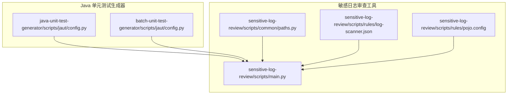
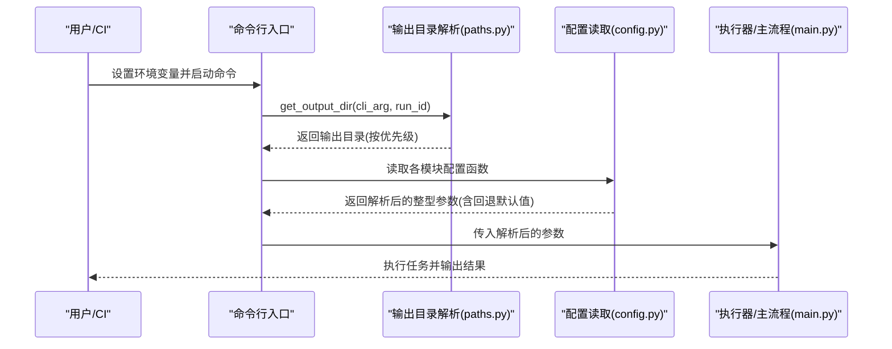
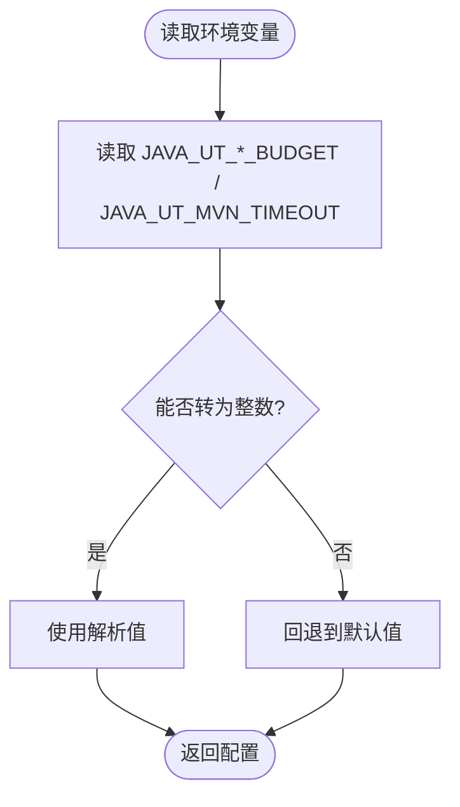
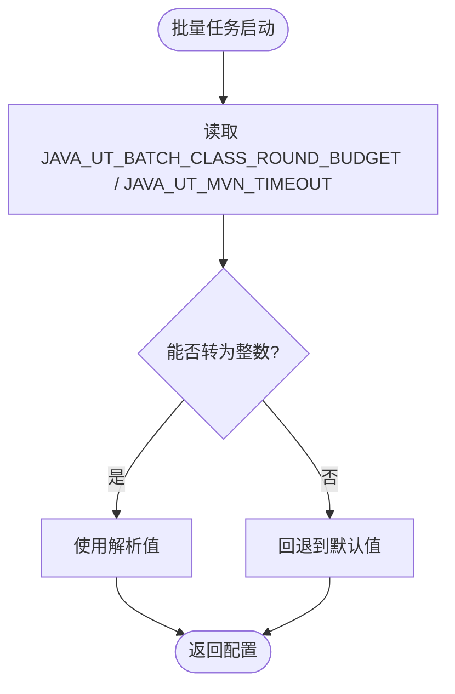
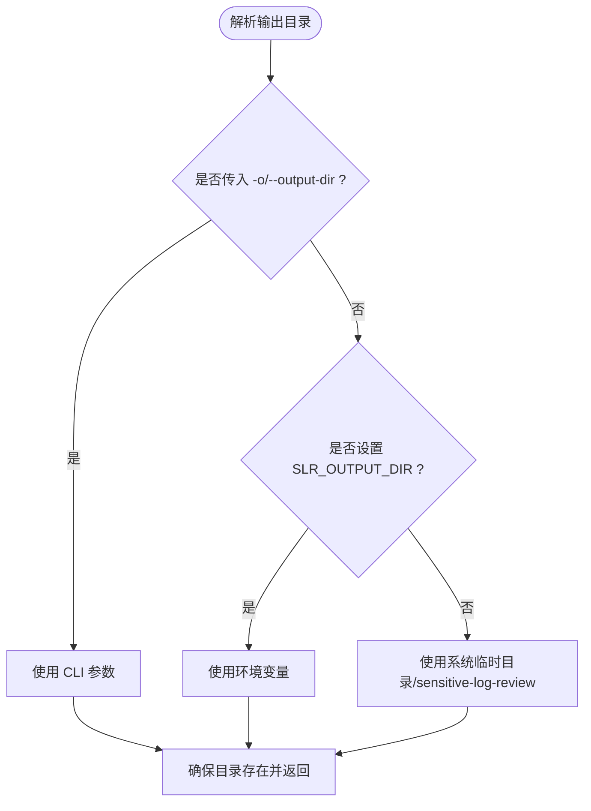
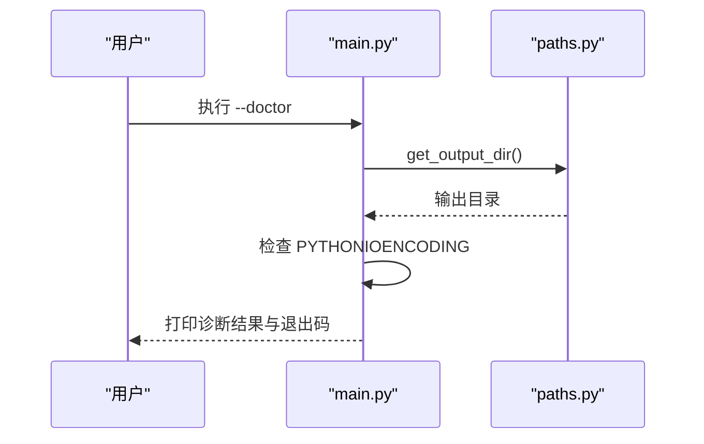
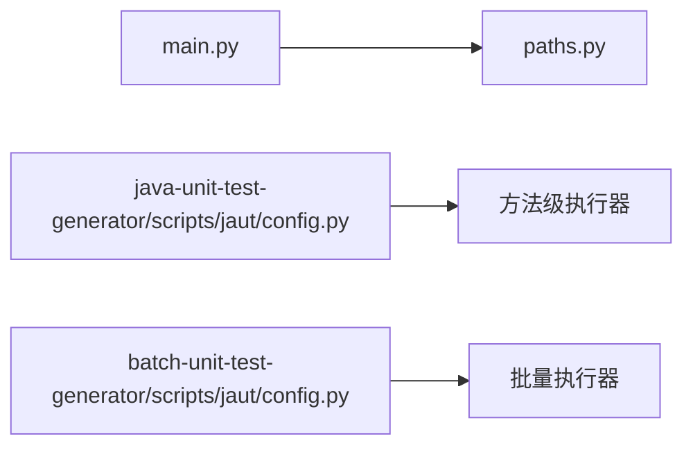

# 环境变量配置

<cite>
**本文引用的文件**
- [batch-unit-test-generator/scripts/jaut/config.py](file://batch-unit-test-generator/scripts/jaut/config.py)
- [java-unit-test-generator/scripts/jaut/config.py](file://java-unit-test-generator/scripts/jaut/config.py)
- [sensitive-log-review/scripts/common/paths.py](file://sensitive-log-review/scripts/common/paths.py)
- [sensitive-log-review/scripts/main.py](file://sensitive-log-review/scripts/main.py)
- [sensitive-log-review/scripts/rules/log-scanner.json](file://sensitive-log-review/scripts/rules/log-scanner.json)
- [sensitive-log-review/scripts/rules/pojo.config](file://sensitive-log-review/scripts/rules/pojo.config)
</cite>

## 目录
1. [简介](#简介)
2. [项目结构](#项目结构)
3. [核心组件](#核心组件)
4. [架构总览](#架构总览)
5. [详细组件分析](#详细组件分析)
6. [依赖关系分析](#依赖关系分析)
7. [性能考虑](#性能考虑)
8. [故障排查指南](#故障排查指南)
9. [结论](#结论)
10. [附录](#附录)

## 简介
本文件为 ping-skills 项目的环境变量配置文档，覆盖以下范围：
- 所有可用的环境变量清单（名称、类型、默认值、作用域）
- 优先级与覆盖规则（系统级、用户级、项目级）
- 必需与可选环境要求
- 不同部署环境的推荐配置模板（开发、测试、生产）
- 验证机制与错误处理
- 安全相关配置（密钥与敏感信息保护建议）
- 动态更新与热重载支持说明
- 实际配置示例与常见问题解决方案

## 项目结构
本项目包含多个独立工具，各自维护其配置与环境变量：
- Java 单元测试生成器（单方法与批量）
- 敏感日志审查工具
- 其他辅助脚本（不在本次环境变量文档范围内）

图表来源
- [java-unit-test-generator/scripts/jaut/config.py:75-130](file://java-unit-test-generator/scripts/jaut/config.py#L75-L130)
- [batch-unit-test-generator/scripts/jaut/config.py:83-156](file://batch-unit-test-generator/scripts/jaut/config.py#L83-L156)
- [sensitive-log-review/scripts/common/paths.py:20-63](file://sensitive-log-review/scripts/common/paths.py#L20-L63)
- [sensitive-log-review/scripts/main.py:680-729](file://sensitive-log-review/scripts/main.py#L680-L729)
- [sensitive-log-review/scripts/rules/log-scanner.json:1-7](file://sensitive-log-review/scripts/rules/log-scanner.json#L1-L7)
- [sensitive-log-review/scripts/rules/pojo.config:1-25](file://sensitive-log-review/scripts/rules/pojo.config#L1-L25)

章节来源
- [java-unit-test-generator/scripts/jaut/config.py:75-130](file://java-unit-test-generator/scripts/jaut/config.py#L75-L130)
- [batch-unit-test-generator/scripts/jaut/config.py:83-156](file://batch-unit-test-generator/scripts/jaut/config.py#L83-L156)
- [sensitive-log-review/scripts/common/paths.py:20-63](file://sensitive-log-review/scripts/common/paths.py#L20-L63)
- [sensitive-log-review/scripts/main.py:680-729](file://sensitive-log-review/scripts/main.py#L680-L729)
- [sensitive-log-review/scripts/rules/log-scanner.json:1-7](file://sensitive-log-review/scripts/rules/log-scanner.json#L1-L7)
- [sensitive-log-review/scripts/rules/pojo.config:1-25](file://sensitive-log-review/scripts/rules/pojo.config#L1-L25)

## 核心组件
- Java 单元测试生成器（方法级与批量）
  - 通过环境变量控制 Maven 超时、迭代预算等运行时参数
- 敏感日志审查工具
  - 通过环境变量控制输出目录；提供运行环境诊断能力
  - 通过 JSON/INI 类配置文件控制扫描行为

章节来源
- [java-unit-test-generator/scripts/jaut/config.py:75-130](file://java-unit-test-generator/scripts/jaut/config.py#L75-L130)
- [batch-unit-test-generator/scripts/jaut/config.py:83-156](file://batch-unit-test-generator/scripts/jaut/config.py#L83-L156)
- [sensitive-log-review/scripts/common/paths.py:20-63](file://sensitive-log-review/scripts/common/paths.py#L20-L63)
- [sensitive-log-review/scripts/main.py:680-729](file://sensitive-log-review/scripts/main.py#L680-L729)

## 架构总览
下图展示了环境变量在运行时的解析路径与优先级。

图表来源
- [sensitive-log-review/scripts/common/paths.py:44-63](file://sensitive-log-review/scripts/common/paths.py#L44-L63)
- [java-unit-test-generator/scripts/jaut/config.py:81-130](file://java-unit-test-generator/scripts/jaut/config.py#L81-L130)
- [batch-unit-test-generator/scripts/jaut/config.py:100-156](file://batch-unit-test-generator/scripts/jaut/config.py#L100-L156)
- [sensitive-log-review/scripts/main.py:705-758](file://sensitive-log-review/scripts/main.py#L705-L758)

## 详细组件分析

### Java 单元测试生成器（方法级）
- 环境变量
  - JAVA_UT_METHOD_ROUND_BUDGET
    - 类型：整数
    - 默认值：8
    - 作用域：方法级迭代轮次上限
    - 说明：用于限制单个方法的迭代轮数
  - JAVA_UT_GLOBAL_ROUND_BUDGET
    - 类型：整数
    - 默认值：30
    - 作用域：全局迭代轮次上限
    - 说明：用于限制整体任务的迭代轮数
  - JAVA_UT_MVN_TIMEOUT
    - 类型：整数（秒）
    - 默认值：1800
    - 作用域：Maven 执行超时
    - 说明：非法值将回退到默认值

- 解析与验证
  - 通过 config 模块的函数读取环境变量，尝试转换为整数；失败时回退默认值
  - 零值视为合法，由调用方决定语义；负数值可解析，但需调用方自行判断合理性

图表来源
- [java-unit-test-generator/scripts/jaut/config.py:81-130](file://java-unit-test-generator/scripts/jaut/config.py#L81-L130)

章节来源
- [java-unit-test-generator/scripts/jaut/config.py:75-130](file://java-unit-test-generator/scripts/jaut/config.py#L75-L130)

### Java 单元测试生成器（批量）
- 环境变量
  - JAVA_UT_BATCH_CLASS_ROUND_BUDGET
    - 类型：整数
    - 默认值：30
    - 作用域：类级总预算
    - 说明：用于限制批量任务中类的总迭代轮数
  - JAVA_UT_MVN_TIMEOUT
    - 类型：整数（秒）
    - 默认值：1800
    - 作用域：Maven 执行超时
    - 说明：与“方法级”共享同一环境变量名，统一控制 Maven 超时

- 解析与验证
  - 同“方法级”，采用函数式读取与整型转换，非法值回退默认值

图表来源
- [batch-unit-test-generator/scripts/jaut/config.py:100-156](file://batch-unit-test-generator/scripts/jaut/config.py#L100-L156)

章节来源
- [batch-unit-test-generator/scripts/jaut/config.py:83-156](file://batch-unit-test-generator/scripts/jaut/config.py#L83-L156)

### 敏感日志审查工具
- 环境变量
  - SLR_OUTPUT_DIR
    - 类型：字符串（目录路径）
    - 默认值：系统临时目录下的 sensitive-log-review 子目录
    - 作用域：产物输出目录
    - 说明：优先级低于 CLI 参数 -o/--output-dir；高于系统临时目录
  - PYTHONIOENCODING
    - 类型：字符串（编码名）
    - 默认值：未设置
    - 作用域：Python 标准输入输出编码
    - 说明：Windows 下非 utf-8 时会给出警告提示，避免中文乱码

- 输出目录解析优先级
  1) CLI 参数 -o/--output-dir
  2) 环境变量 SLR_OUTPUT_DIR
  3) 系统临时目录下的 sensitive-log-review 子目录

图表来源
- [sensitive-log-review/scripts/common/paths.py:44-63](file://sensitive-log-review/scripts/common/paths.py#L44-L63)

- 运行环境诊断
  - 支持 --doctor 模式进行环境检查，包括对 PYTHONIOENCODING 的诊断与建议
  - 诊断结果以 OK/WARN/FAIL 标记，并在结束时汇总统计

图表来源
- [sensitive-log-review/scripts/main.py:680-729](file://sensitive-log-review/scripts/main.py#L680-L729)
- [sensitive-log-review/scripts/common/paths.py:44-63](file://sensitive-log-review/scripts/common/paths.py#L44-L63)

章节来源
- [sensitive-log-review/scripts/common/paths.py:20-63](file://sensitive-log-review/scripts/common/paths.py#L20-L63)
- [sensitive-log-review/scripts/main.py:680-729](file://sensitive-log-review/scripts/main.py#L680-L729)

### 配置文件（非环境变量）
- log-scanner.json
  - 控制日志扫描行为（如 logger_names、detect_system_out、detect_print_stack_trace）
  - 属于项目内配置，非环境变量
- pojo.config
  - 定义 POJO 文件匹配规则（目录与后缀）
  - 属于项目内配置，非环境变量

章节来源
- [sensitive-log-review/scripts/rules/log-scanner.json:1-7](file://sensitive-log-review/scripts/rules/log-scanner.json#L1-L7)
- [sensitive-log-review/scripts/rules/pojo.config:1-25](file://sensitive-log-review/scripts/rules/pojo.config#L1-L25)

## 依赖关系分析
- 模块间依赖
  - main.py 依赖 paths.py 解析输出目录
  - 两个 jaut/config.py 分别被各自的工具链引用，提供统一的配置读取逻辑
- 外部依赖
  - Python 标准库 os、tempfile、pathlib
  - 第三方库未在环境变量层面直接体现

图表来源
- [sensitive-log-review/scripts/main.py:705-758](file://sensitive-log-review/scripts/main.py#L705-L758)
- [sensitive-log-review/scripts/common/paths.py:44-63](file://sensitive-log-review/scripts/common/paths.py#L44-L63)
- [java-unit-test-generator/scripts/jaut/config.py:81-130](file://java-unit-test-generator/scripts/jaut/config.py#L81-L130)
- [batch-unit-test-generator/scripts/jaut/config.py:100-156](file://batch-unit-test-generator/scripts/jaut/config.py#L100-L156)

章节来源
- [sensitive-log-review/scripts/main.py:705-758](file://sensitive-log-review/scripts/main.py#L705-L758)
- [sensitive-log-review/scripts/common/paths.py:44-63](file://sensitive-log-review/scripts/common/paths.py#L44-L63)
- [java-unit-test-generator/scripts/jaut/config.py:81-130](file://java-unit-test-generator/scripts/jaut/config.py#L81-L130)
- [batch-unit-test-generator/scripts/jaut/config.py:100-156](file://batch-unit-test-generator/scripts/jaut/config.py#L100-L156)

## 性能考虑
- Maven 超时与进程终止策略
  - JAVA_UT_MVN_TIMEOUT 影响构建与测试执行时长；合理设置可避免长时间挂起
  - 配合两段式终止（SIGTERM + SIGKILL）与 EOF 后等待策略，提升稳定性
- 迭代预算
  - 方法级与全局轮次预算限制可防止无限循环，提高资源利用率
- 输出目录写入
  - 确保 SLR_OUTPUT_DIR 指向可写且磁盘空间充足的目录，避免 I/O 瓶颈

[本节为通用指导，不直接分析具体文件]

## 故障排查指南
- 常见错误与处理
  - 环境变量类型错误
    - 现象：整型环境变量无法解析
    - 处理：自动回退到默认值；检查环境变量格式是否为纯数字
  - 输出目录不可写
    - 现象：创建目录失败
    - 处理：检查权限或更换 SLR_OUTPUT_DIR；必要时使用 -o 指定可写目录
  - Windows 编码问题
    - 现象：中文乱码
    - 处理：设置 PYTHONIOENCODING=utf-8；或在 PowerShell 中设置相应环境变量
  - 诊断模式
    - 使用 --doctor 快速定位环境问题；根据输出中的 OK/WARN/FAIL 调整配置

章节来源
- [sensitive-log-review/scripts/main.py:680-729](file://sensitive-log-review/scripts/main.py#L680-L729)
- [sensitive-log-review/scripts/common/paths.py:44-63](file://sensitive-log-review/scripts/common/paths.py#L44-L63)

## 结论
- 本项目的环境变量集中在三个关键位置：
  - Java 单元测试生成器：JAVA_UT_METHOD_ROUND_BUDGET、JAVA_UT_GLOBAL_ROUND_BUDGET、JAVA_UT_MVN_TIMEOUT、JAVA_UT_BATCH_CLASS_ROUND_BUDGET
  - 敏感日志审查工具：SLR_OUTPUT_DIR、PYTHONIOENCODING
- 优先级规则清晰：CLI 参数 > 环境变量 > 默认值
- 验证机制稳健：整型转换失败回退默认值；输出目录解析具备健壮性与安全性
- 建议在不同环境中合理设置超时与预算，确保稳定与高效运行

[本节为总结性内容，不直接分析具体文件]

## 附录

### 环境变量清单与默认值
- JAVA_UT_METHOD_ROUND_BUDGET
  - 类型：整数
  - 默认值：8
  - 作用域：方法级迭代轮次上限
- JAVA_UT_GLOBAL_ROUND_BUDGET
  - 类型：整数
  - 默认值：30
  - 作用域：全局迭代轮次上限
- JAVA_UT_MVN_TIMEOUT
  - 类型：整数（秒）
  - 默认值：1800
  - 作用域：Maven 执行超时
- JAVA_UT_BATCH_CLASS_ROUND_BUDGET
  - 类型：整数
  - 默认值：30
  - 作用域：批量任务类级总预算
- SLR_OUTPUT_DIR
  - 类型：字符串（目录路径）
  - 默认值：系统临时目录下的 sensitive-log-review 子目录
  - 作用域：产物输出目录
- PYTHONIOENCODING
  - 类型：字符串（编码名）
  - 默认值：未设置
  - 作用域：Python 标准输入输出编码

章节来源
- [java-unit-test-generator/scripts/jaut/config.py:75-130](file://java-unit-test-generator/scripts/jaut/config.py#L75-L130)
- [batch-unit-test-generator/scripts/jaut/config.py:83-156](file://batch-unit-test-generator/scripts/jaut/config.py#L83-L156)
- [sensitive-log-review/scripts/common/paths.py:20-63](file://sensitive-log-review/scripts/common/paths.py#L20-L63)
- [sensitive-log-review/scripts/main.py:680-729](file://sensitive-log-review/scripts/main.py#L680-L729)

### 优先级与覆盖规则
- 输出目录优先级
  1) CLI 参数 -o/--output-dir
  2) 环境变量 SLR_OUTPUT_DIR
  3) 系统临时目录下的 sensitive-log-review 子目录
- 配置读取优先级
  - 环境变量优先于默认值；非法值回退默认值
  - 同一环境变量名在不同模块可能具有不同含义（例如 JAVA_UT_MVN_TIMEOUT 同时影响方法级与批量任务）

章节来源
- [sensitive-log-review/scripts/common/paths.py:44-63](file://sensitive-log-review/scripts/common/paths.py#L44-L63)
- [java-unit-test-generator/scripts/jaut/config.py:81-130](file://java-unit-test-generator/scripts/jaut/config.py#L81-L130)
- [batch-unit-test-generator/scripts/jaut/config.py:100-156](file://batch-unit-test-generator/scripts/jaut/config.py#L100-L156)

### 必需环境与可选环境
- 必需环境
  - Java 单元测试生成器：确保 Maven 可用；如需自定义超时与预算，设置对应 JAVA_UT_* 环境变量
  - 敏感日志审查工具：确保 Python 运行环境正常；如需自定义输出目录，设置 SLR_OUTPUT_DIR
- 可选环境
  - PYTHONIOENCODING：在 Windows 环境下建议设置为 utf-8 以避免乱码
  - 其他 JAVA_UT_* 环境变量：按需调整以提升性能与稳定性

[本节为通用指导，不直接分析具体文件]

### 不同部署环境的推荐配置模板
- 开发环境
  - JAVA_UT_MVN_TIMEOUT=600
  - JAVA_UT_METHOD_ROUND_BUDGET=8
  - JAVA_UT_GLOBAL_ROUND_BUDGET=30
  - SLR_OUTPUT_DIR=./dev-output（便于本地查看）
- 测试环境
  - JAVA_UT_MVN_TIMEOUT=900
  - JAVA_UT_METHOD_ROUND_BUDGET=10
  - JAVA_UT_GLOBAL_ROUND_BUDGET=40
  - SLR_OUTPUT_DIR=/tmp/test-output
- 生产环境
  - JAVA_UT_MVN_TIMEOUT=1800
  - JAVA_UT_METHOD_ROUND_BUDGET=8
  - JAVA_UT_GLOBAL_ROUND_BUDGET=30
  - SLR_OUTPUT_DIR=/data/logs/sensitive-log-review（确保可写与足够空间）

[本节为通用指导，不直接分析具体文件]

### 安全相关配置选项
- 密钥管理
  - 当前代码未直接读取密钥相关环境变量；建议在 CI/CD 平台注入敏感信息，避免写入仓库
- 敏感信息保护
  - 使用 SLR_OUTPUT_DIR 将产物输出到受控目录，避免泄露到公共路径
  - 谨慎设置 JAVA_UT_* 预算与超时，防止资源滥用

[本节为通用指导，不直接分析具体文件]

### 动态更新与热重载支持
- 环境变量读取方式
  - 配置函数在每次调用时从环境变量读取，因此可在进程内动态修改环境变量并立即生效
- 注意事项
  - 多线程场景下需注意并发读写环境变量的可见性
  - 对于长生命周期进程，建议重启服务以确保配置一致性

[本节为通用指导，不直接分析具体文件]

### 实际配置示例
- 设置 Maven 超时与预算
  - export JAVA_UT_MVN_TIMEOUT=900
  - export JAVA_UT_METHOD_ROUND_BUDGET=10
  - export JAVA_UT_GLOBAL_ROUND_BUDGET=40
- 设置输出目录
  - export SLR_OUTPUT_DIR=/data/output
- 设置编码（Windows）
  - $env:PYTHONIOENCODING="utf-8"

[本节为通用指导，不直接分析具体文件]

### 常见问题解决方案
- 问题：Maven 执行超时
  - 解决：增大 JAVA_UT_MVN_TIMEOUT；检查网络与依赖下载速度
- 问题：输出目录不可写
  - 解决：检查权限；使用 -o 指定可写目录；或设置 SLR_OUTPUT_DIR
- 问题：中文乱码
  - 解决：设置 PYTHONIOENCODING=utf-8；或使用 --doctor 诊断

章节来源
- [sensitive-log-review/scripts/main.py:680-729](file://sensitive-log-review/scripts/main.py#L680-L729)
- [sensitive-log-review/scripts/common/paths.py:44-63](file://sensitive-log-review/scripts/common/paths.py#L44-L63)