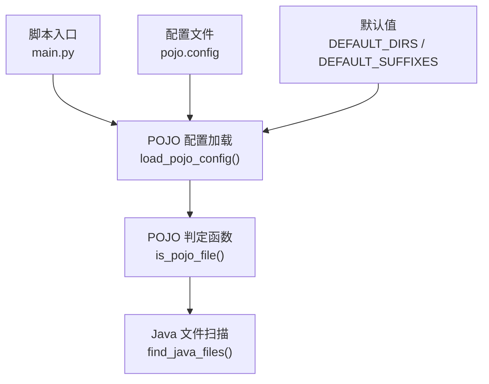
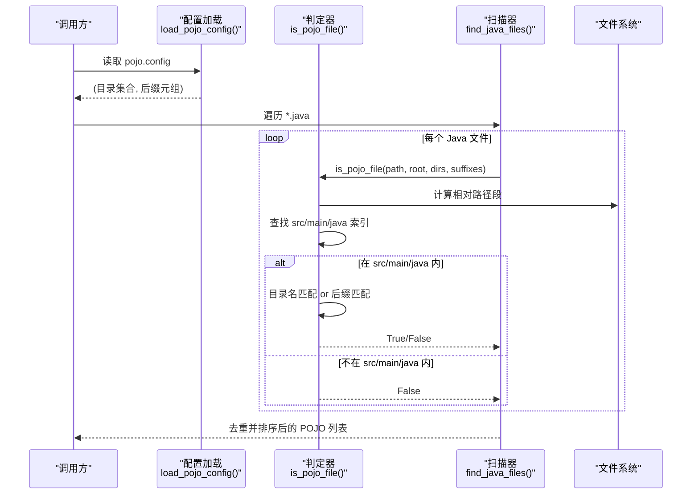
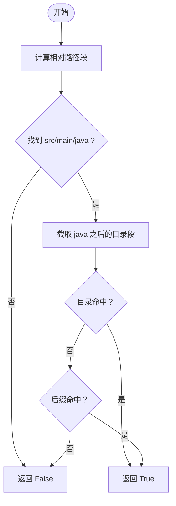
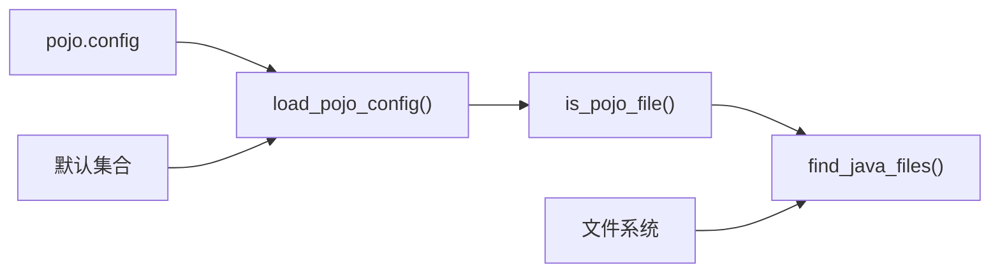

# POJO 配置管理

<cite>
**本文引用的文件**
- [pojo.config](file://sensitive-log-review/scripts/rules/pojo.config)
- [pojo_config.py](file://sensitive-log-review/scripts/common/pojo_config.py)
- [README.md](file://sensitive-log-review/README.md)
- [test_common.py](file://sensitive-log-review/tests/test_common.py)
</cite>

## 目录
1. [简介](#简介)
2. [项目结构](#项目结构)
3. [核心组件](#核心组件)
4. [架构总览](#架构总览)
5. [详细组件分析](#详细组件分析)
6. [依赖关系分析](#依赖关系分析)
7. [性能考量](#性能考量)
8. [故障排查指南](#故障排查指南)
9. [结论](#结论)
10. [附录](#附录)

## 简介
本章节面向使用 POJO 扫描与规则检查的工程，系统化说明 pojo.config 的配置语法、匹配算法与最佳实践。通过统一解析器与判定逻辑，确保在不同项目结构（标准 Java、微服务、单体应用）下对 POJO 的识别准确且高效。

## 项目结构
POJO 配置与解析位于敏感日志审查工具中，关键位置如下：
- 配置文件：scripts/rules/pojo.config
- 解析与判定逻辑：scripts/common/pojo_config.py
- 文档与使用说明：README.md
- 单元测试覆盖：tests/test_common.py

图表来源
- [pojo_config.py:27-71](file://sensitive-log-review/scripts/common/pojo_config.py#L27-L71)
- [pojo_config.py:82-127](file://sensitive-log-review/scripts/common/pojo_config.py#L82-L127)
- [pojo.config:1-25](file://sensitive-log-review/scripts/rules/pojo.config#L1-L25)

章节来源
- [pojo.config:1-25](file://sensitive-log-review/scripts/rules/pojo.config#L1-L25)
- [pojo_config.py:1-127](file://sensitive-log-review/scripts/common/pojo_config.py#L1-L127)
- [README.md:285-292](file://sensitive-log-review/README.md#L285-L292)

## 核心组件
- 配置段
  - [pojo-dir]：目录名命中清单。用于判断文件所在路径段是否属于 POJO 目录集合。
  - [pojo-file]：文件名后缀命中清单。用于判断文件名是否以指定后缀结尾（忽略大小写）。
- 默认值
  - 当配置文件缺失或某节为空时，回退到内置默认目录集合与默认后缀集合，保证扫描可用性。
- 判定规则
  - 仅当文件位于 src/main/java 范围内，且满足“目录名命中”或“文件名后缀命中”之一，才视为 POJO。

章节来源
- [pojo_config.py:16-24](file://sensitive-log-review/scripts/common/pojo_config.py#L16-L24)
- [pojo_config.py:27-71](file://sensitive-log-review/scripts/common/pojo_config.py#L27-L71)
- [pojo_config.py:82-113](file://sensitive-log-review/scripts/common/pojo_config.py#L82-L113)
- [README.md:285-292](file://sensitive-log-review/README.md#L285-L292)

## 架构总览
下图展示了从配置加载到文件判定的完整流程，以及各模块的职责边界。

图表来源
- [pojo_config.py:27-71](file://sensitive-log-review/scripts/common/pojo_config.py#L27-L71)
- [pojo_config.py:74-127](file://sensitive-log-review/scripts/common/pojo_config.py#L74-L127)

## 详细组件分析

### 配置段与语法
- 文件格式：INI 风格两节
  - [pojo-dir]：每行一个目录名（小写匹配）
  - [pojo-file]：每行一个文件名后缀（如 dto.java，忽略大小写）
- 注释与空行：支持 # 开头注释与空行，会被忽略
- 缺失/空节回退：若文件或节为空，自动回退到默认集合

章节来源
- [pojo.config:1-25](file://sensitive-log-review/scripts/rules/pojo.config#L1-L25)
- [pojo_config.py:27-71](file://sensitive-log-review/scripts/common/pojo_config.py#L27-L71)
- [test_common.py:124-145](file://sensitive-log-review/tests/test_common.py#L124-L145)

### 目录匹配算法
- 定位 src/main/java：按路径段查找 “src/main/java”，不区分大小写；未找到则直接拒绝该文件
- 截取源包路径：取 java 目录之后、文件名之前的所有路径段作为“目录部分”
- 目录命中：任一路径段出现在 [pojo-dir] 集合中即命中
- 后缀命中：文件名以 [pojo-file] 中任意后缀结尾即命中
- 判定条件：位于 src/main/java 内 且（目录命中 或 后缀命中）

图表来源
- [pojo_config.py:74-113](file://sensitive-log-review/scripts/common/pojo_config.py#L74-L113)

章节来源
- [pojo_config.py:74-113](file://sensitive-log-review/scripts/common/pojo_config.py#L74-L113)
- [test_common.py:148-184](file://sensitive-log-review/tests/test_common.py#L148-L184)

### 文件命名约定
- 后缀匹配为 endswith，非精确相等：例如 UserDTO.java 会命中 dto.java 后缀
- 忽略大小写：目录名与后缀比较均不区分大小写
- 仅限 src/main/java：测试代码、资源目录等不受影响

章节来源
- [pojo_config.py:82-113](file://sensitive-log-review/scripts/common/pojo_config.py#L82-L113)
- [test_common.py:167-179](file://sensitive-log-review/tests/test_common.py#L167-L179)

### 不同项目结构的配置模板
- 标准 Java 项目
  - 使用默认配置即可覆盖常见 DTO/VO/Entity/Model 等目录与后缀
  - 如需扩展，可在 [pojo-dir] 新增目录名，或在 [pojo-file] 新增后缀
- 微服务架构
  - 建议将各服务的 POJO 集中在各自模块的 src/main/java 下，并通过 [pojo-dir] 限定模块级目录（如 api/dto、domain/model）
  - 可结合 [pojo-file] 增加跨模块通用的后缀（如 properties.java）
- 单体应用
  - 若存在多套数据模型目录（如 model、dto、vo），均可加入 [pojo-dir]
  - 若某些类文件不以约定后缀命名，可通过 [pojo-file] 补充

提示：以上模板基于默认集合与匹配规则，无需修改即可工作；仅在组织规范偏离默认时调整配置。

章节来源
- [pojo_config.py:16-24](file://sensitive-log-review/scripts/common/pojo_config.py#L16-L24)
- [pojo.config:1-25](file://sensitive-log-review/scripts/rules/pojo.config#L1-L25)
- [README.md:285-292](file://sensitive-log-review/README.md#L285-L292)

### 添加新的 POJO 类型与目录模式
- 新增目录模式：在 [pojo-dir] 追加新目录名（小写）
- 新增文件模式：在 [pojo-file] 追加新后缀（如 xxx.java）
- 验证方式：运行单元测试或实际扫描，确认新增项被正确识别

章节来源
- [pojo.config:1-25](file://sensitive-log-review/scripts/rules/pojo.config#L1-L25)
- [test_common.py:130-145](file://sensitive-log-review/tests/test_common.py#L130-L145)

### 配置验证方法
- 单元测试覆盖
  - 缺失配置文件时回退默认值
  - 自定义配置包含注释与空行时正确解析
  - 空节时回退默认值
  - 目录命中、后缀命中、非 POJO 拒绝、非 src/main/java 拒绝等场景
- 建议验证步骤
  - 编写最小化 pojo.config 并执行扫描，观察结果是否符合预期
  - 逐步添加条目，逐项验证命中行为

章节来源
- [test_common.py:124-184](file://sensitive-log-review/tests/test_common.py#L124-L184)

## 依赖关系分析
- 配置加载依赖：pojo.config（可选，缺失则回退默认）
- 判定逻辑依赖：项目根路径、文件路径、目录集合、后缀集合
- 扫描器依赖：递归遍历 *.java，并对每个文件执行判定
- 外部约束：仅处理 src/main/java 下的文件，避免误扫测试或资源目录

图表来源
- [pojo_config.py:27-71](file://sensitive-log-review/scripts/common/pojo_config.py#L27-L71)
- [pojo_config.py:82-127](file://sensitive-log-review/scripts/common/pojo_config.py#L82-L127)

章节来源
- [pojo_config.py:27-127](file://sensitive-log-review/scripts/common/pojo_config.py#L27-L127)

## 性能考量
- 范围限制：仅在 src/main/java 内进行判定，减少无关文件扫描
- 后缀匹配：使用 endswith 而非正则，提升匹配效率
- 去重与排序：扫描结果去重并按路径不区分大小写排序，便于稳定输出
- 默认集合优化：内置常用目录与后缀，减少配置维护成本

[本节为通用性能建议，不直接分析具体文件]

## 故障排查指南
- 常见问题
  - 配置缺失或空节：自动回退默认值，不会导致扫描失败
  - 文件未被识别：检查是否在 src/main/java 内，或是否命中目录/后缀
  - 误报/漏报：调整 [pojo-dir] 或 [pojo-file]，并结合单元测试验证
- 诊断建议
  - 使用最小化配置复现问题
  - 逐步缩小范围，确认命中点
  - 参考单元测试用例对照行为

章节来源
- [test_common.py:124-184](file://sensitive-log-review/tests/test_common.py#L124-L184)
- [README.md:285-292](file://sensitive-log-review/README.md#L285-L292)

## 结论
通过统一的 pojo.config 解析与判定逻辑，本项目实现了跨工程结构的稳定 POJO 识别。遵循 src/main/java 范围限制、目录与后缀匹配规则，并结合默认集合与单元测试，可快速适配不同项目规范。建议在团队内统一目录与命名约定，必要时通过配置微调以满足特殊需求。

[本节为总结性内容，不直接分析具体文件]

## 附录
- 最佳实践
  - 保持 src/main/java 内的目录结构与命名一致，优先使用默认集合
  - 新增目录/后缀时，同步更新 pojo.config 并补充单测
  - 定期回归验证，确保新增模块符合 POJO 识别策略
- 参考实现
  - 配置示例：pojo.config
  - 解析与判定：pojo_config.py
  - 使用说明：README.md
  - 测试覆盖：test_common.py

章节来源
- [pojo.config:1-25](file://sensitive-log-review/scripts/rules/pojo.config#L1-L25)
- [pojo_config.py:1-127](file://sensitive-log-review/scripts/common/pojo_config.py#L1-L127)
- [README.md:285-292](file://sensitive-log-review/README.md#L285-L292)
- [test_common.py:124-184](file://sensitive-log-review/tests/test_common.py#L124-L184)