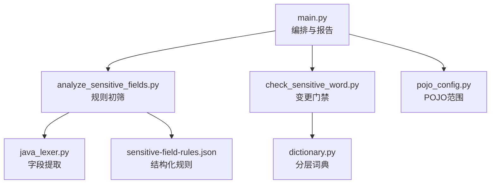
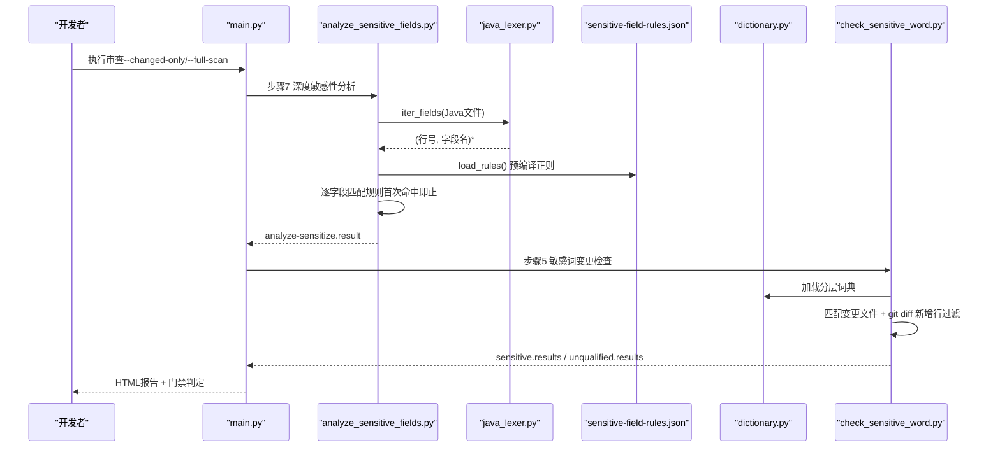
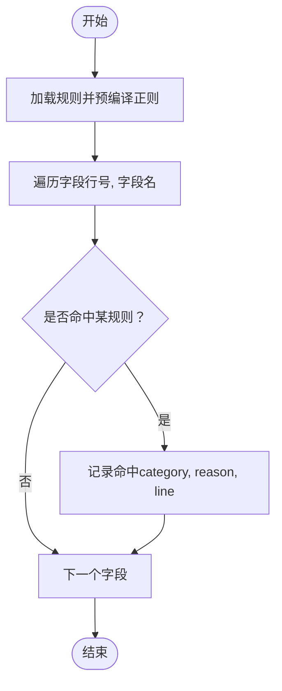
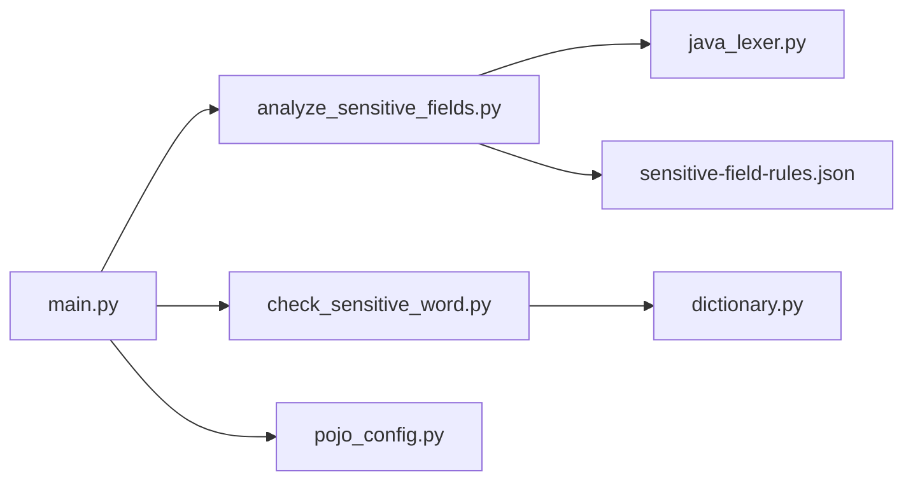

# 敏感字段规则

<cite>
**本文引用的文件**
- [sensitive-field-rules.json](file://sensitive-log-review/scripts/rules/sensitive-field-rules.json)
- [analyze_sensitive_fields.py](file://sensitive-log-review/scripts/analyze_sensitive_fields.py)
- [check_sensitive_word.py](file://sensitive-log-review/scripts/check_sensitive_word.py)
- [dictionary.py](file://sensitive-log-review/scripts/common/dictionary.py)
- [pojo_config.py](file://sensitive-log-review/scripts/common/pojo_config.py)
- [java_lexer.py](file://sensitive-log-review/scripts/common/java_lexer.py)
- [text.py](file://sensitive-log-review/scripts/common/text.py)
- [main.py](file://sensitive-log-review/scripts/main.py)
- [README.md](file://sensitive-log-review/README.md)
- [sensitive-core.txt](file://sensitive-log-review/scripts/dictionary/sensitive-core.txt)
- [sensitive-extended.txt](file://sensitive-log-review/scripts/dictionary/sensitive-extended.txt)
- [sensitive-words.whitelist](file://sensitive-log-review/scripts/dictionary/sensitive-words.whitelist)
- [test_analyze_sensitive_fields.py](file://sensitive-log-review/tests/test_analyze_sensitive_fields.py)
</cite>

## 目录
1. [简介](#简介)
2. [项目结构](#项目结构)
3. [核心组件](#核心组件)
4. [架构总览](#架构总览)
5. [详细组件分析](#详细组件分析)
6. [依赖关系分析](#依赖关系分析)
7. [性能与大型项目管理](#性能与大型项目管理)
8. [故障排查指南](#故障排查指南)
9. [结论](#结论)
10. [附录：行业模板与测试指南](#附录：行业模板与测试指南)

## 简介
本文件围绕敏感字段规则体系，系统化说明 sensitive-field-rules.json 的规则结构与匹配机制，解释字段名匹配、数据类型检测（通过 Java 词法分析器提取字段）、上下文分析（词典分层判定）与违规处理策略。同时提供金融、医疗、电商等行业的配置建议，说明字段级规则的继承与覆盖机制，指导如何新增敏感类型与自定义检测逻辑，并给出规则验证工具使用与测试用例编写指南，以及性能调优与大型项目的规则管理策略。

## 项目结构
敏感字段审查由“编排层 + 多步骤脚本 + 规则/词典”构成：
- 编排层：main.py 负责四链路并行执行与报告生成
- 规则初筛：analyze_sensitive_fields.py 基于 sensitive-field-rules.json 进行结构化规则匹配
- 词典判定：common/dictionary.py 提供四层优先级（白名单 > 黑名单 > core > extended）
- 字段提取：common/java_lexer.py 从 Java 源中抽取字段名与行号
- 变更门禁：check_sensitive_word.py 将全量审计结果与 git diff 新增行结合，输出门禁结果
- POJO 范围：common/pojo_config.py 统一判定 POJO 文件范围

图表来源
- [main.py:260-269](file://sensitive-log-review/scripts/main.py#L260-L269)
- [analyze_sensitive_fields.py:44-93](file://sensitive-log-review/scripts/analyze_sensitive_fields.py#L44-L93)
- [check_sensitive_word.py:156-243](file://sensitive-log-review/scripts/check_sensitive_word.py#L156-L243)
- [java_lexer.py:180-289](file://sensitive-log-review/scripts/common/java_lexer.py#L180-L289)
- [dictionary.py:80-132](file://sensitive-log-review/scripts/common/dictionary.py#L80-L132)
- [pojo_config.py:27-71](file://sensitive-log-review/scripts/common/pojo_config.py#L27-L71)

章节来源
- [main.py:1-800](file://sensitive-log-review/scripts/main.py#L1-L800)
- [README.md:267-310](file://sensitive-log-review/README.md#L267-L310)

## 核心组件
- 结构化规则加载与正则预编译：load_rules 读取 sensitive-field-rules.json，为每个规则预编译 patterns 的正则（忽略大小写），并在解析失败时输出结构化错误（E004）。
- 字段提取：iter_fields 支持类体字段、record 组件、枚举常量、匿名类；屏蔽注释与字符串字面量，保证行号准确。
- 规则匹配：对每个字段按规则顺序匹配，首次命中即止，输出 category、reason 与行号。
- 词典分层判定：whitelist/blacklist/core/extended 四级优先级，用于更细粒度的敏感词判定与命名规范检查。
- 变更门禁：check_sensitive_word.py 将全量审计清单与 git diff 新增行过滤，区分高置信与低置信（E 级默认不触发门禁，可 --fail-on-low 开启）。

章节来源
- [analyze_sensitive_fields.py:44-93](file://sensitive-log-review/scripts/analyze_sensitive_fields.py#L44-L93)
- [java_lexer.py:180-289](file://sensitive-log-review/scripts/common/java_lexer.py#L180-L289)
- [dictionary.py:80-132](file://sensitive-log-review/scripts/common/dictionary.py#L80-L132)
- [check_sensitive_word.py:71-110](file://sensitive-log-review/scripts/check_sensitive_word.py#L71-L110)

## 架构总览
敏感字段规则在流水线中的位置与数据流如下：

图表来源
- [main.py:260-269](file://sensitive-log-review/scripts/main.py#L260-L269)
- [analyze_sensitive_fields.py:44-93](file://sensitive-log-review/scripts/analyze_sensitive_fields.py#L44-L93)
- [check_sensitive_word.py:156-243](file://sensitive-log-review/scripts/check_sensitive_word.py#L156-L243)
- [java_lexer.py:180-289](file://sensitive-log-review/scripts/common/java_lexer.py#L180-L289)
- [dictionary.py:80-132](file://sensitive-log-review/scripts/common/dictionary.py#L80-L132)

## 详细组件分析

### 敏感字段规则文件 sensitive-field-rules.json
- 结构：JSON 数组，每条规则包含 category、level、patterns、reason。
- 匹配语义：对每个字段按规则顺序匹配，首次命中即止；patterns 在加载时预编译并忽略大小写。
- 内置类别：身份鉴别信息、生物识别信息、金融账户信息、财产与信用信息、基本资料、交易与行为信息、密钥与证书。
- 扩展方式：新增类别或模式只需追加规则项；确保 patterns 为合法正则且避免泛用词造成噪音。

图表来源
- [analyze_sensitive_fields.py:44-93](file://sensitive-log-review/scripts/analyze_sensitive_fields.py#L44-L93)
- [sensitive-field-rules.json:1-45](file://sensitive-log-review/scripts/rules/sensitive-field-rules.json#L1-L45)

章节来源
- [sensitive-field-rules.json:1-45](file://sensitive-log-review/scripts/rules/sensitive-field-rules.json#L1-L45)
- [analyze_sensitive_fields.py:44-93](file://sensitive-log-review/scripts/analyze_sensitive_fields.py#L44-L93)
- [README.md:294-306](file://sensitive-log-review/README.md#L294-L306)

### 字段名匹配与数据类型检测
- 字段名匹配：基于字段名的正则匹配（忽略大小写），支持多种命名风格（驼峰、下划线、数字拆分）。
- 数据类型检测：通过 java_lexer.py 的 iter_fields 提取字段声明，排除方法局部变量，支持 record 组件与枚举常量；屏蔽注释与字符串字面量以保证准确性。
- 白名单豁免：字段名小写整名在白名单中则跳过匹配。

章节来源
- [java_lexer.py:180-289](file://sensitive-log-review/scripts/common/java_lexer.py#L180-L289)
- [text.py:13-43](file://sensitive-log-review/scripts/common/text.py#L13-L43)
- [analyze_sensitive_fields.py:70-93](file://sensitive-log-review/scripts/analyze_sensitive_fields.py#L70-L93)

### 上下文分析与词典分层判定
- 四层优先级：whitelist（整名豁免）> blacklist（整名必拦）> core（高置信）> extended（低置信）。
- 分类用途：core/extended 用于字段名拆分后的单词精确匹配；blacklist/whitelist 用于整名级别的高/低风险控制。
- 适用场景：命名规范检查、可能敏感字段审计、低置信提示（[LOW]）。

章节来源
- [dictionary.py:80-132](file://sensitive-log-review/scripts/common/dictionary.py#L80-L132)
- [sensitive-core.txt:1-93](file://sensitive-log-review/scripts/dictionary/sensitive-core.txt#L1-L93)
- [sensitive-extended.txt:1-230](file://sensitive-log-review/scripts/dictionary/sensitive-extended.txt#L1-L230)
- [sensitive-words.whitelist:1-12](file://sensitive-log-review/scripts/dictionary/sensitive-words.whitelist#L1-L12)

### 脱敏策略与违规处理
- 脱敏策略：建议在日志输出前对敏感字段进行脱敏（如掩码、哈希、截断），或在 @ToString(of={...}) 中显式控制输出字段。
- 违规处理：
  - 高置信敏感字段（core/blacklist）→ 标记 SENSITIVE，计入门禁（默认）。
  - 低置信敏感字段（extended/E 级）→ 标记 [LOW]，默认不触发门禁，可通过 --fail-on-low 开启。
  - 命名不规范 → 标记 UNQUALIFIED，计入门禁（可选）。
- 门禁开关：--fail-on 指定计数项（violation, sensitive, unqualified, tostring, analyze, miss_comments, low），空串关闭门禁。

章节来源
- [check_sensitive_word.py:93-110](file://sensitive-log-review/scripts/check_sensitive_word.py#L93-L110)
- [check_sensitive_word.py:211-243](file://sensitive-log-review/scripts/check_sensitive_word.py#L211-L243)
- [main.py:705-729](file://sensitive-log-review/scripts/main.py#L705-L729)
- [README.md:255-266](file://sensitive-log-review/README.md#L255-L266)

### 字段级别的规则继承与覆盖机制
- 规则顺序优先：sensitive-field-rules.json 中规则按顺序匹配，首次命中即止，后序规则不会覆盖先序规则。
- 词典优先级覆盖：whitelist/blacklist 高于 core/extended，整名匹配优先于拆分词匹配。
- 白名单豁免：字段名小写整名在白名单中直接豁免，不参与后续匹配。

章节来源
- [analyze_sensitive_fields.py:84-88](file://sensitive-log-review/scripts/analyze_sensitive_fields.py#L84-L88)
- [dictionary.py:94-122](file://sensitive-log-review/scripts/common/dictionary.py#L94-L122)
- [sensitive-words.whitelist:1-12](file://sensitive-log-review/scripts/dictionary/sensitive-words.whitelist#L1-L12)

### 添加新的敏感字段类型与自定义检测逻辑
- 新增类型：在 sensitive-field-rules.json 中添加新规则项，定义 category、level、patterns、reason。
- 自定义检测：
  - 若需更复杂逻辑（如结合注释语义），可在 analyze_sensitive_fields.py 中扩展 analyze_file 函数，增加 on_error 回调与失败统计。
  - 若需引入外部词典或业务字典，可在 dictionary.py 中扩展 SensitiveDicts 与加载逻辑。
- 验证与回归：使用 test_analyze_sensitive_fields.py 中的用例模板验证新规则的正确性与边界情况。

章节来源
- [sensitive-field-rules.json:1-45](file://sensitive-log-review/scripts/rules/sensitive-field-rules.json#L1-L45)
- [analyze_sensitive_fields.py:70-93](file://sensitive-log-review/scripts/analyze_sensitive_fields.py#L70-L93)
- [dictionary.py:125-132](file://sensitive-log-review/scripts/common/dictionary.py#L125-L132)
- [test_analyze_sensitive_fields.py:41-116](file://sensitive-log-review/tests/test_analyze_sensitive_fields.py#L41-L116)

## 依赖关系分析
- main.py 编排各步骤，调用 analyze_sensitive_fields.py 与 check_sensitive_word.py。
- analyze_sensitive_fields.py 依赖 java_lexer.py 提取字段，依赖 sensitive-field-rules.json 规则。
- check_sensitive_word.py 依赖 dictionary.py 分层词典，并结合 git diff 新增行过滤。
- pojo_config.py 统一 POJO 范围判定，影响步骤4与步骤6的扫描范围。

图表来源
- [main.py:260-269](file://sensitive-log-review/scripts/main.py#L260-L269)
- [analyze_sensitive_fields.py:44-93](file://sensitive-log-review/scripts/analyze_sensitive_fields.py#L44-L93)
- [check_sensitive_word.py:156-243](file://sensitive-log-review/scripts/check_sensitive_word.py#L156-L243)
- [pojo_config.py:27-71](file://sensitive-log-review/scripts/common/pojo_config.py#L27-L71)

章节来源
- [main.py:1-800](file://sensitive-log-review/scripts/main.py#L1-L800)
- [analyze_sensitive_fields.py:1-189](file://sensitive-log-review/scripts/analyze_sensitive_fields.py#L1-L189)
- [check_sensitive_word.py:1-262](file://sensitive-log-review/scripts/check_sensitive_word.py#L1-L262)

## 性能与大型项目管理
- 性能优化建议：
  - 仅变更扫描：默认 --changed-only 模式，减少扫描范围。
  - 正则预编译：规则加载时预编译 patterns，避免热路径重复构造。
  - 词典缓存：dictionary.py 使用 mtime 缓存词表集合，避免重复读取大词典。
  - 失败文件统计：FailureRecorder 记录失败文件，便于定位问题。
- 大型项目管理策略：
  - 规则分层：将通用规则放入 sensitive-field-rules.json，业务特定规则通过扩展词典或自定义逻辑实现。
  - 版本化管理：词典文件头部含 # version: 版本头，每次修改递增版本号，便于追溯。
  - CI 集成：使用 --run-id 隔离并行运行产物，避免覆盖；HTML 报告归档便于回溯。
  - 严格模式：--strict-mode 在存在失败文件时以退出码 2 结束，确保质量基线。

章节来源
- [analyze_sensitive_fields.py:44-67](file://sensitive-log-review/scripts/analyze_sensitive_fields.py#L44-L67)
- [dictionary.py:31-77](file://sensitive-log-review/scripts/common/dictionary.py#L31-L77)
- [README.md:113-124](file://sensitive-log-review/README.md#L113-L124)
- [README.md:459-467](file://sensitive-log-review/README.md#L459-L467)

## 故障排查指南
- 规则文件损坏：E004 错误，提示 JSON 损坏行列位置，修复后重新运行。
- 非 git 仓库：E001 错误，确保 -r 指向 git 仓库根。
- 分支无效：E003 错误，校验分支名合法性。
- 输出目录不可写：E006 错误，检查权限与环境变量 SLR_OUTPUT_DIR。
- run-id 非法：E005 错误，仅允许字母数字/._-，且不以符号开头。
- jar SHA256 校验失败：E007 错误，检查 checkstyle jar 完整性。

章节来源
- [analyze_sensitive_fields.py:54-67](file://sensitive-log-review/scripts/analyze_sensitive_fields.py#L54-L67)
- [main.py:740-756](file://sensitive-log-review/scripts/main.py#L740-L756)
- [README.md:459-467](file://sensitive-log-review/README.md#L459-L467)

## 结论
敏感字段规则体系通过结构化规则、词典分层判定与 Java 词法分析，实现了高精度、可扩展的敏感字段识别与门禁控制。遵循本文的配置与管理策略，可有效降低敏感数据泄露风险，满足金融、医疗、电商等多行业合规要求。

## 附录：行业模板与测试指南

### 金融行业模板
- 重点类别：身份鉴别信息（C3）、金融账户信息（C3/C2）、财产与信用信息（C2/C3）、密钥与证书（C3）。
- 建议规则：card.?no、account.?no、balance、private.?key、secret.?key、token。
- 词典补充：sensitive-core.txt 加入高置信词根；sensitive-extended.txt 加入低置信业务词。

### 医疗行业模板
- 重点类别：生物识别信息（C3）、健康信息（C3）、基本资料（C2/C3）。
- 建议规则：face、fingerprint、medical、health、diagnosis、patient。
- 词典补充：sensitive-core.txt 加入生物识别与健康词根；sensitive-extended.txt 加入低置信场景词。

### 电商行业模板
- 重点类别：基本资料（C2/C3）、交易与行为信息（C2）、金融账户信息（C3/C2）。
- 建议规则：phone、email、address、transaction、order.?no、payment、card.?no。
- 词典补充：sensitive-core.txt 加入高置信词根；sensitive-extended.txt 加入低置信业务词。

### 测试用例编写指南
- 规则加载测试：验证 JSON 格式、正则预编译、忽略大小写匹配。
- 字段匹配测试：验证首次命中即止、白名单豁免、无命中情况。
- 边界情况测试：record 组件、枚举常量、匿名类、注释与字符串屏蔽。
- 参考用例：test_analyze_sensitive_fields.py 中的 TestLoadRules 与 TestAnalyzeFile。

章节来源
- [test_analyze_sensitive_fields.py:41-116](file://sensitive-log-review/tests/test_analyze_sensitive_fields.py#L41-L116)
- [java_lexer.py:180-289](file://sensitive-log-review/scripts/common/java_lexer.py#L180-L289)
- [sensitive-field-rules.json:1-45](file://sensitive-log-review/scripts/rules/sensitive-field-rules.json#L1-L45)