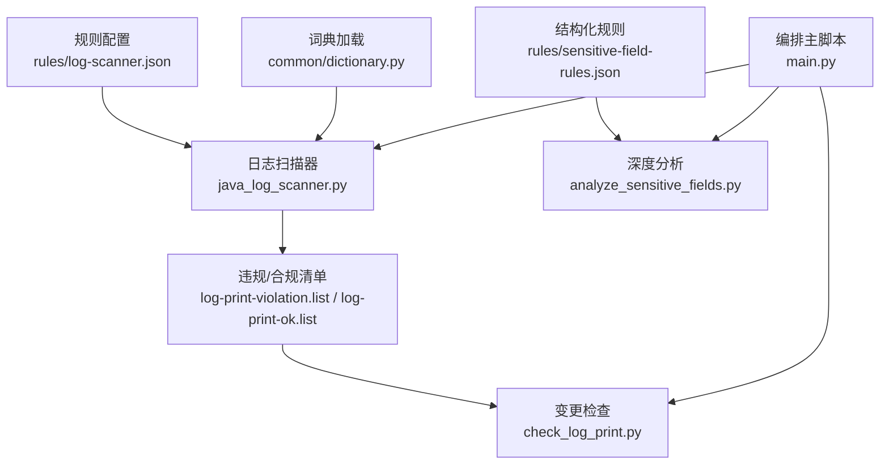
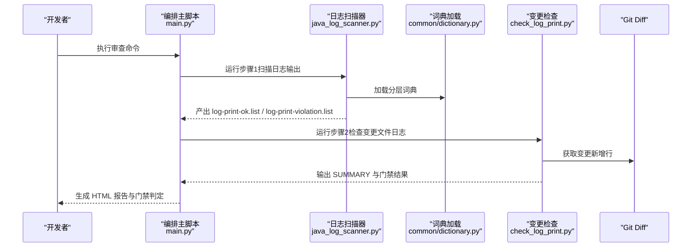
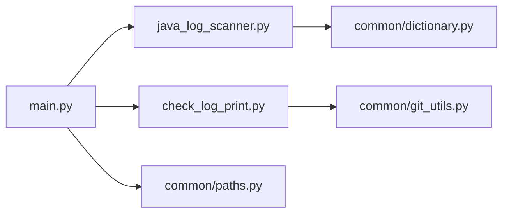

# 日志扫描规则

<cite>
**本文引用的文件**
- [log-scanner.json](file://sensitive-log-review/scripts/rules/log-scanner.json)
- [java_log_scanner.py](file://sensitive-log-review/scripts/java_log_scanner.py)
- [check_log_print.py](file://sensitive-log-review/scripts/check_log_print.py)
- [dictionary.py](file://sensitive-log-review/scripts/common/dictionary.py)
- [main.py](file://sensitive-log-review/scripts/main.py)
- [sensitive-field-rules.json](file://sensitive-log-review/scripts/rules/sensitive-field-rules.json)
- [sensitive-core.txt](file://sensitive-log-review/scripts/dictionary/sensitive-core.txt)
- [sensitive-extended.txt](file://sensitive-log-review/scripts/dictionary/sensitive-extended.txt)
- [sensitive-words.blacklist](file://sensitive-log-review/scripts/dictionary/sensitive-words.blacklist)
- [sensitive-words.whitelist](file://sensitive-log-review/scripts/dictionary/sensitive-words.whitelist)
- [README.md](file://sensitive-log-review/README.md)
- [SKILL.md](file://sensitive-log-review/SKILL.md)
</cite>

## 目录
1. [简介](#简介)
2. [项目结构](#项目结构)
3. [核心组件](#核心组件)
4. [架构总览](#架构总览)
5. [详细组件分析](#详细组件分析)
6. [依赖关系分析](#依赖关系分析)
7. [性能与大规模扫描策略](#性能与大规模扫描策略)
8. [故障排查与调试](#故障排查与调试)
9. [结论](#结论)
10. [附录：配置示例与最佳实践](#附录：配置示例与最佳实践)

## 简介
本文件为“敏感信息日志审查”中的日志扫描规则提供系统化文档，聚焦 log-scanner.json 的配置结构与行为、日志级别过滤、敏感信息识别规则、告警阈值、优先级与冲突解决、扩展方式、测试与调试方法，以及面向大规模代码库的性能优化建议。该工具面向 Java 工程，围绕“敏感数据不落日志”的目标，对日志输出进行合规性检查，并结合变更文件比对形成门禁判定。

## 项目结构
日志扫描相关能力由以下关键部分组成：
- 规则配置：rules/log-scanner.json（控制日志变量名、可选检测开关）
- 扫描器实现：scripts/java_log_scanner.py（正则匹配、多行拼接、敏感词分层判定）
- 变更检查：scripts/check_log_print.py（基于 git diff 的变更过滤与门禁判定）
- 词典加载：scripts/common/dictionary.py（四层词典优先级与分类）
- 编排入口：scripts/main.py（并行链路、产物汇总、报告生成）
- 结构化规则：rules/sensitive-field-rules.json（字段级结构化规则，供深度分析使用）
- 词典文件：dictionary/*.txt（高置信/低置信/黑白名单）

图表来源
- [log-scanner.json:1-7](file://sensitive-log-review/scripts/rules/log-scanner.json#L1-L7)
- [java_log_scanner.py:70-103](file://sensitive-log-review/scripts/java_log_scanner.py#L70-L103)
- [dictionary.py:80-132](file://sensitive-log-review/scripts/common/dictionary.py#L80-L132)
- [check_log_print.py:96-136](file://sensitive-log-review/scripts/check_log_print.py#L96-L136)
- [main.py:187-269](file://sensitive-log-review/scripts/main.py#L187-L269)

章节来源
- [README.md:20-55](file://sensitive-log-review/README.md#L20-L55)
- [SKILL.md:70-157](file://sensitive-log-review/SKILL.md#L70-L157)

## 核心组件
- 日志扫描器（java_log_scanner.py）
  - 支持 JSON 序列化输出检测（JSON_LOG）
  - 支持 System.out/System.err 输出检测（SYSOUT，需开启）
  - 支持 printStackTrace 调用检测（STACK_TRACE，需开启）
  - 敏感词分层判定：白名单豁免 > 黑名单命中 > 高置信 core > 低置信 extended
  - 多行日志拼接与括号闭合判断
  - 输出合规/违规清单到指定输出目录
- 变更检查（check_log_print.py）
  - 仅保留在 git diff 新增行中出现的清单条目
  - LOW:* 标签默认不触发门禁，可通过 --fail-on-low 打开
  - 输出 SUMMARY 摘要行供编排层解析
- 词典加载（dictionary.py）
  - 四层词典：whitelist/blacklist/core/extended
  - classify(words, identifier) 返回 (level, word) 或 None
- 规则配置（log-scanner.json）
  - logger_names：识别哪些变量名为日志对象
  - detect_system_out：是否检测 System.out/err 输出
  - detect_print_stack_trace：是否检测 printStackTrace()

章节来源
- [java_log_scanner.py:44-66](file://sensitive-log-review/scripts/java_log_scanner.py#L44-L66)
- [java_log_scanner.py:148-213](file://sensitive-log-review/scripts/java_log_scanner.py#L148-L213)
- [check_log_print.py:38-93](file://sensitive-log-review/scripts/check_log_print.py#L38-L93)
- [dictionary.py:80-132](file://sensitive-log-review/scripts/common/dictionary.py#L80-L132)
- [log-scanner.json:1-7](file://sensitive-log-review/scripts/rules/log-scanner.json#L1-L7)

## 架构总览
日志扫描流水线分为两条主线：
- 步骤1：扫描日志输出（java_log_scanner.py），生成合规/违规清单
- 步骤2：检查变更文件日志（check_log_print.py），基于 git diff 过滤并判定门禁

编排层 main.py 将步骤1与步骤2组织为并行链路，并与其他检查链路汇合后生成 HTML 报告。

图表来源
- [main.py:187-269](file://sensitive-log-review/scripts/main.py#L187-L269)
- [java_log_scanner.py:359-417](file://sensitive-log-review/scripts/java_log_scanner.py#L359-L417)
- [check_log_print.py:139-227](file://sensitive-log-review/scripts/check_log_print.py#L139-L227)
- [dictionary.py:125-132](file://sensitive-log-review/scripts/common/dictionary.py#L125-L132)

## 详细组件分析

### 规则配置：log-scanner.json
- 字段说明
  - logger_names：数组，定义哪些变量名被视为日志对象（如 log.info(...)）。默认包含常见日志变量名。
  - detect_system_out：布尔值，是否检测 System.out/System.err 输出。默认关闭以减少噪音。
  - detect_print_stack_trace：布尔值，是否检测 printStackTrace() 调用。默认关闭以减少噪音。
- 行为影响
  - 当 detect_system_out 为 true 时，非日志调用行若匹配 System.out/err 打印将被标记为 SYSOUT 违规。
  - 当 detect_print_stack_trace 为 true 时，非日志调用行若匹配 printStackTrace() 将被标记为 STACK_TRACE 违规。
  - logger_names 用于构建日志调用匹配正则，覆盖 LOGGER 等常量风格。

章节来源
- [log-scanner.json:1-7](file://sensitive-log-review/scripts/rules/log-scanner.json#L1-L7)
- [java_log_scanner.py:70-103](file://sensitive-log-review/scripts/java_log_scanner.py#L70-L103)
- [java_log_scanner.py:162-170](file://sensitive-log-review/scripts/java_log_scanner.py#L162-L170)

### 敏感信息识别与词典机制
- 四层优先级
  - 白名单（whitelist）：整名豁免，命中即视为安全
  - 黑名单（blacklist）：整名或拆分词命中，最高严重级
  - 高置信（core）：字段名拆分后的单词精确匹配，命中即违规
  - 低置信（extended）：命中仅标记 [LOW]，默认不触发门禁
- 分类函数
  - SensitiveDicts.classify(words, identifier) 返回 (level, word) 或 None
  - 白名单优先；黑名单次之；然后依次匹配 core 与 extended
- 词典文件
  - sensitive-core.txt：高置信敏感词（密码、生物识别、卡号等）
  - sensitive-extended.txt：低置信上下文词（姓名、联系方式、地址等）
  - sensitive-words.blacklist：整名必拦（pwd、cardNo、smsCode 等）
  - sensitive-words.whitelist：整名豁免（cardType、logId 等）

章节来源
- [dictionary.py:80-132](file://sensitive-log-review/scripts/common/dictionary.py#L80-L132)
- [sensitive-core.txt:1-93](file://sensitive-log-review/scripts/dictionary/sensitive-core.txt#L1-L93)
- [sensitive-extended.txt:1-200](file://sensitive-log-review/scripts/dictionary/sensitive-extended.txt#L1-L200)
- [sensitive-words.blacklist:1-13](file://sensitive-log-review/scripts/dictionary/sensitive-words.blacklist#L1-L13)
- [sensitive-words.whitelist:1-12](file://sensitive-log-review/scripts/dictionary/sensitive-words.whitelist#L1-L12)

### 日志级别过滤与告警阈值
- 日志级别过滤
  - 通过 logger_names 限定日志变量名，避免误判普通字符串中的关键字
  - 构建日志调用匹配正则，仅对匹配到的日志调用行进行参数提取与违规检测
- 告警阈值
  - 高置信（core）与黑名单命中直接标记为 SENSITIVE，计入门禁
  - 低置信（extended）标记为 LOW，默认不计入门禁，可通过 --fail-on-low 打开
  - 结构化规则（sensitive-field-rules.json）用于字段级深度分析，按类别与级别判定

章节来源
- [java_log_scanner.py:90-103](file://sensitive-log-review/scripts/java_log_scanner.py#L90-L103)
- [java_log_scanner.py:176-198](file://sensitive-log-review/scripts/java_log_scanner.py#L176-L198)
- [check_log_print.py:38-41](file://sensitive-log-review/scripts/check_log_print.py#L38-L41)
- [sensitive-field-rules.json:1-45](file://sensitive-log-review/scripts/rules/sensitive-field-rules.json#L1-L45)

### 不同业务场景下的配置示例
- 用户信息检测
  - 在 sensitive-extended.txt 中添加用户相关上下文词（如 name、username、phone、email）
  - 在 sensitive-core.txt 中添加高置信词（如 password、token、secret）
  - 在 sensitive-words.blacklist 中添加整名必拦字段（如 idCard、smsCode）
  - 在 sensitive-words.whitelist 中添加豁免字段（如 cardType、logId）
- 财务数据检测
  - 在 sensitive-core.txt 中添加金融账户相关词（如 cardno、account、balance）
  - 在 sensitive-field-rules.json 中增加交易与行为信息类别的规则（如 transaction、order.no）
- 系统参数检测
  - 在 sensitive-core.txt 中添加密钥与证书相关词（如 private.key、secret.key、certificate）
  - 在 sensitive-extended.txt 中添加设备与网络标识词（如 imei、mac、ip）

注意：以上示例为配置思路，具体词条请参考词典文件与规则文件。

章节来源
- [sensitive-core.txt:1-93](file://sensitive-log-review/scripts/dictionary/sensitive-core.txt#L1-L93)
- [sensitive-extended.txt:1-200](file://sensitive-log-review/scripts/dictionary/sensitive-extended.txt#L1-L200)
- [sensitive-words.blacklist:1-13](file://sensitive-log-review/scripts/dictionary/sensitive-words.blacklist#L1-L13)
- [sensitive-words.whitelist:1-12](file://sensitive-log-review/scripts/dictionary/sensitive-words.whitelist#L1-L12)
- [sensitive-field-rules.json:1-45](file://sensitive-log-review/scripts/rules/sensitive-field-rules.json#L1-L45)

### 规则优先级机制与冲突解决策略
- 优先级顺序
  - 白名单 > 黑名单 > 高置信（core） > 低置信（extended）
- 冲突解决
  - 若字段名在白名单中，即使命中黑名单或 core 也视为安全
  - 若字段名不在白名单但命中黑名单，则直接判为 SENSITIVE
  - 若未命中黑名单，则依次匹配 core 与 extended
- 多词敏感短语
  - 在行级（排除字符串常量）检查多词敏感短语（如 bank account），避免重复标记

章节来源
- [dictionary.py:94-122](file://sensitive-log-review/scripts/common/dictionary.py#L94-L122)
- [java_log_scanner.py:200-206](file://sensitive-log-review/scripts/java_log_scanner.py#L200-L206)

### 自定义日志格式解析器与扩展扫描规则
- 自定义日志变量名
  - 修改 logger_names，添加项目中使用的日志变量名（如 LogHelper、LogUtil）
- 启用可选检测项
  - 设置 detect_system_out 为 true，启用 System.out/err 输出检测
  - 设置 detect_print_stack_trace 为 true，启用 printStackTrace() 调用检测
- 扩展敏感词
  - 在高置信词典（sensitive-core.txt）中添加新的高置信词
  - 在低置信词典（sensitive-extended.txt）中添加新的低置信词
  - 在黑名单（sensitive-words.blacklist）中添加整名必拦字段
  - 在白名单（sensitive-words.whitelist）中添加整名豁免字段
- 扩展结构化规则
  - 在 sensitive-field-rules.json 中新增类别与模式，用于字段级深度分析

章节来源
- [log-scanner.json:1-7](file://sensitive-log-review/scripts/rules/log-scanner.json#L1-L7)
- [java_log_scanner.py:70-103](file://sensitive-log-review/scripts/java_log_scanner.py#L70-L103)
- [dictionary.py:125-132](file://sensitive-log-review/scripts/common/dictionary.py#L125-L132)
- [sensitive-field-rules.json:1-45](file://sensitive-log-review/scripts/rules/sensitive-field-rules.json#L1-L45)

### 规则测试方法与调试技巧
- 单元测试
  - 使用 pytest 运行 tests 目录下的单测，覆盖 common 包与各检查脚本
- 环境诊断
  - 使用 --doctor 模式逐项检查运行环境（Python/java/git/jar 校验/规则与词典文件/输出目录等）
- 详细输出
  - 使用 -v/--verbose 模式打印各子脚本的命令与标准输出/错误
- 变更过滤验证
  - 使用 check_log_print.py 的 --fail-on-low 选项打开低置信门禁，便于调试
- 失败文件记录
  - 查看 failed-files.list 定位读取/解析失败的文件与原因

章节来源
- [SKILL.md:265-272](file://sensitive-log-review/SKILL.md#L265-L272)
- [main.py:582-702](file://sensitive-log-review/scripts/main.py#L582-L702)
- [check_log_print.py:96-136](file://sensitive-log-review/scripts/check_log_print.py#L96-L136)

## 依赖关系分析
- 模块耦合
  - java_log_scanner.py 依赖 dictionary.py 进行敏感词判定
  - check_log_print.py 依赖 git_utils.py 获取变更文件与新增行
  - main.py 编排所有步骤，依赖 paths.py 管理输出目录与产物文件名
- 外部依赖
  - Python 3.10+、Java Runtime（Checkstyle）、Git
- 潜在循环依赖
  - 无直接循环依赖，各模块职责清晰，通过公共模块解耦

图表来源
- [java_log_scanner.py:34-38](file://sensitive-log-review/scripts/java_log_scanner.py#L34-L38)
- [check_log_print.py:31-35](file://sensitive-log-review/scripts/check_log_print.py#L31-L35)
- [main.py:41-70](file://sensitive-log-review/scripts/main.py#L41-L70)

章节来源
- [README.md:57-111](file://sensitive-log-review/README.md#L57-L111)

## 性能与大规模扫描策略
- 变更扫描模式
  - 默认 --changed-only 模式仅扫描相对目标分支变更的 Java 文件，速度快
  - 全量扫描 --full-scan 覆盖变更模式，适用于全面审计
- 并行执行
  - main.py 使用 ThreadPoolExecutor(max_workers=4) 组织四条并行链路，提升效率
- 词典缓存
  - dictionary.py 使用模块级缓存与 mtime 失效机制，避免重复解析大词典文件
- 正则编译缓存
  - java_log_scanner.py 使用 lru_cache 缓存日志调用匹配正则，减少重复编译
- 输出目录隔离
  - CI 场景使用 --run-id 追加隔离子目录，避免产物覆盖
- 失败文件统计
  - 严格模式 --strict-mode 可拦截存在失败文件的执行，确保质量

章节来源
- [main.py:777-786](file://sensitive-log-review/scripts/main.py#L777-L786)
- [dictionary.py:31-77](file://sensitive-log-review/scripts/common/dictionary.py#L31-L77)
- [java_log_scanner.py:90-103](file://sensitive-log-review/scripts/java_log_scanner.py#L90-L103)
- [README.md:113-124](file://sensitive-log-review/README.md#L113-L124)

## 故障排查与调试
- 控制台中文乱码
  - 设置 PYTHONIOENCODING=utf-8，避免 Windows 下中文输出乱码
- 不是 git 仓库
  - 显式传入 -r/--root 指向 git 仓库根目录
- 找不到 java 命令
  - 安装 JRE/JDK 并确保 java 在 PATH 中
- 变更检查无结果
  - 使用 --branch 指定正确的对比基准，CI 中 fetch-depth: 0
- 误报处理
  - 将完整字段名加入 sensitive-words.whitelist，递增版本头后重新运行
- 漏报处理
  - 高置信词根追加到 sensitive-core.txt，必须拦截的字段名追加到 sensitive-words.blacklist
- run-id 非法字符
  - 仅允许 [A-Za-z0-9._-]，且首字符必须是字母或数字，最长 64 字符
- jar SHA256 校验告警
  - 从可信源重新获取 jar 文件或同步更新基线值

章节来源
- [README.md:363-467](file://sensitive-log-review/README.md#L363-L467)

## 结论
日志扫描规则通过 log-scanner.json 配置与词典机制，实现对 Java 工程中日志输出的合规性检查。结合变更文件比对与结构化规则，形成完整的敏感信息防护体系。通过灵活的配置与可扩展的词典，可适配不同业务场景的需求。在大规模代码库中，采用变更扫描、并行执行与缓存机制，确保高效稳定的扫描性能。

## 附录：配置示例与最佳实践
- 配置示例
  - 用户信息：在 sensitive-core.txt 中添加 password、token；在 sensitive-extended.txt 中添加 name、phone
  - 财务数据：在 sensitive-core.txt 中添加 cardno、account；在 sensitive-field-rules.json 中增加交易类别
  - 系统参数：在 sensitive-core.txt 中添加 private.key、certificate；在 sensitive-extended.txt 中添加 imei、mac
- 最佳实践
  - 定期维护词典文件，递增版本头
  - 使用 --doctor 模式进行环境诊断
  - 在 CI 中使用 --run-id 隔离产物
  - 合理配置 logger_names，避免误判
  - 谨慎启用 detect_system_out 与 detect_print_stack_trace，减少噪音

章节来源
- [sensitive-core.txt:1-93](file://sensitive-log-review/scripts/dictionary/sensitive-core.txt#L1-L93)
- [sensitive-extended.txt:1-200](file://sensitive-log-review/scripts/dictionary/sensitive-extended.txt#L1-L200)
- [sensitive-field-rules.json:1-45](file://sensitive-log-review/scripts/rules/sensitive-field-rules.json#L1-L45)
- [README.md:127-160](file://sensitive-log-review/README.md#L127-L160)