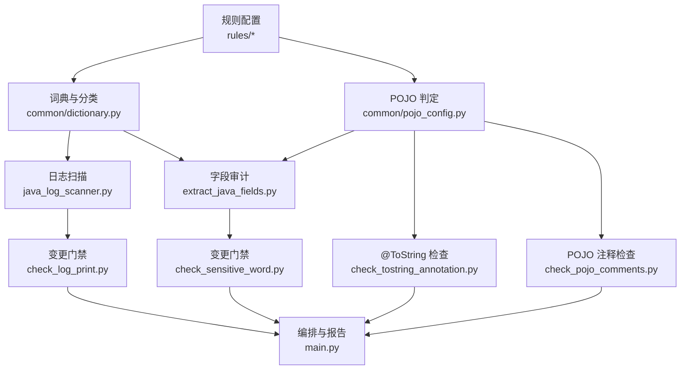
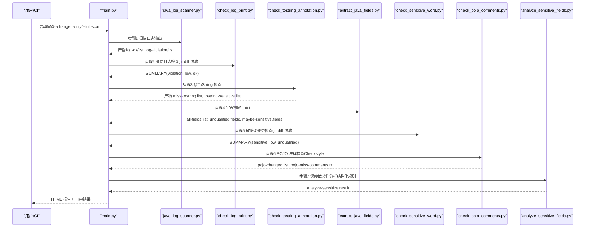
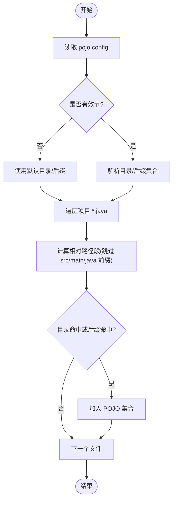
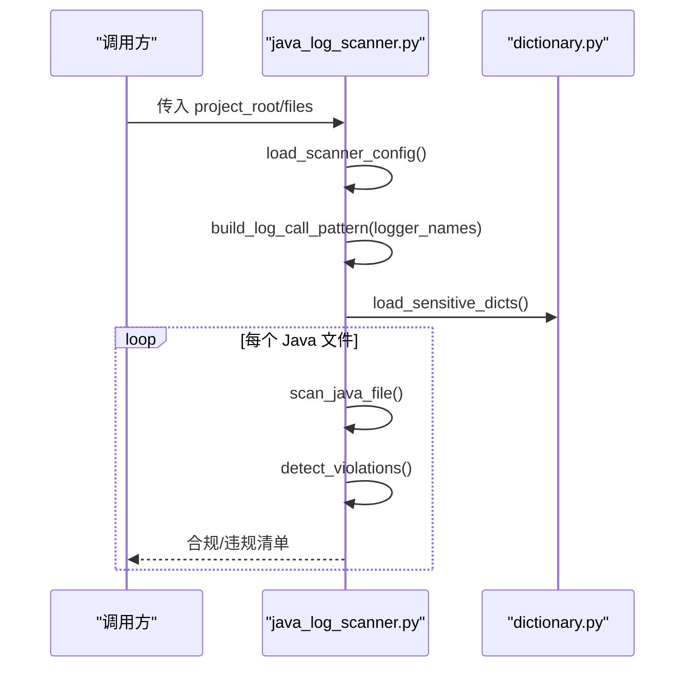
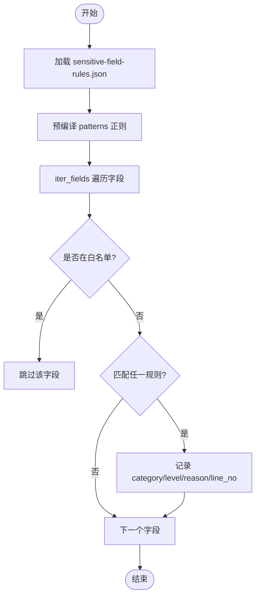
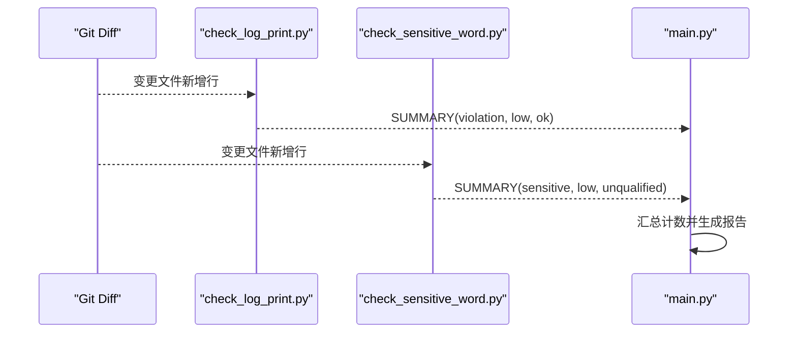
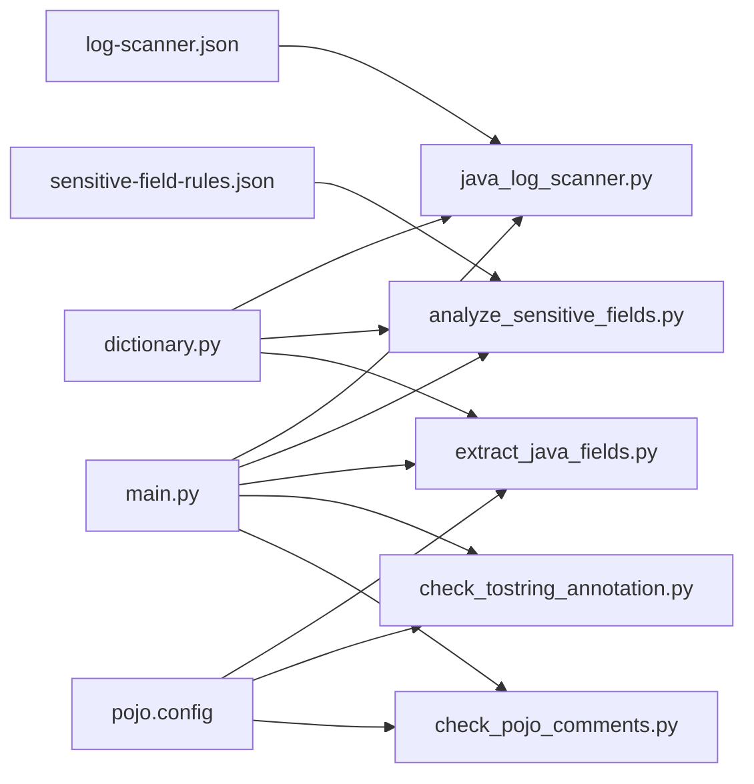

# 规则配置管理

<cite>
**本文引用的文件**
- [log-scanner.json](file://sensitive-log-review/scripts/rules/log-scanner.json)
- [sensitive-field-rules.json](file://sensitive-log-review/scripts/rules/sensitive-field-rules.json)
- [pojo.config](file://sensitive-log-review/scripts/rules/pojo.config)
- [dictionary.py](file://sensitive-log-review/scripts/common/dictionary.py)
- [pojo_config.py](file://sensitive-log-review/scripts/common/pojo_config.py)
- [java_log_scanner.py](file://sensitive-log-review/scripts/java_log_scanner.py)
- [analyze_sensitive_fields.py](file://sensitive-log-review/scripts/analyze_sensitive_fields.py)
- [check_log_print.py](file://sensitive-log-review/scripts/check_log_print.py)
- [check_sensitive_word.py](file://sensitive-log-review/scripts/check_sensitive_word.py)
- [extract_java_fields.py](file://sensitive-log-review/scripts/extract_java_fields.py)
- [check_tostring_annotation.py](file://sensitive-log-review/scripts/check_tostring_annotation.py)
- [check_pojo_comments.py](file://sensitive-log-review/scripts/check_pojo_comments.py)
- [main.py](file://sensitive-log-review/scripts/main.py)
- [java_lexer.py](file://sensitive-log-review/scripts/common/java_lexer.py)
- [sensitive-core.txt](file://sensitive-log-review/scripts/dictionary/sensitive-core.txt)
</cite>

## 目录
1. [简介](#简介)
2. [项目结构](#项目结构)
3. [核心组件](#核心组件)
4. [架构总览](#架构总览)
5. [详细组件分析](#详细组件分析)
6. [依赖关系分析](#依赖关系分析)
7. [性能与缓存策略](#性能与缓存策略)
8. [故障排除指南](#故障排除指南)
9. [结论](#结论)
10. [附录：配置模板与最佳实践](#附录：配置模板与最佳实践)

## 简介
本文件面向 ping-skills 的“敏感信息日志审查”能力，系统化说明规则配置文件的结构与用途、动态加载机制（含热更新与缓存）、内置规则的定制方法、自定义扩展接口、不同业务场景下的推荐配置与最佳实践、规则优先级与冲突解决、验证与测试方法、完整配置示例与迁移策略。目标是帮助用户快速为自身项目配置合适的检查规则，并稳定运行在 CI/CD 中。

## 项目结构
敏感信息日志审查的规则与实现集中在 sensitive-log-review/scripts 目录下，关键位置如下：
- 规则定义
  - rules/log-scanner.json：日志扫描器开关与日志变量名白名单
  - rules/sensitive-field-rules.json：结构化敏感字段规则（类别、级别、正则模式）
  - rules/pojo.config：POJO 目录与文件名后缀判定规则
- 词典与分层判定
  - dictionary/*.txt：敏感词词典（core/extended/blacklist/whitelist）
  - common/dictionary.py：词典加载与分类逻辑（含缓存与线程安全）
- 规则执行脚本
  - java_log_scanner.py：日志输出扫描
  - extract_java_fields.py：字段提取与命名规范/敏感性审计
  - check_tostring_annotation.py：@ToString 注解合规检查
  - check_pojo_comments.py：POJO 字段注释检查（调用 Checkstyle）
  - analyze_sensitive_fields.py：基于结构化规则的深度敏感性分析
  - check_log_print.py / check_sensitive_word.py：变更门禁检查（结合 git diff）
- 编排与报告
  - main.py：四链路并行编排、HTML 报告生成、环境诊断（--doctor）
  - common/java_lexer.py：Java 词法分析（字段/类声明提取）

**图表来源**
- [main.py:187-297](file://sensitive-log-review/scripts/main.py#L187-L297)
- [java_log_scanner.py:70-103](file://sensitive-log-review/scripts/java_log_scanner.py#L70-L103)
- [extract_java_fields.py:52-103](file://sensitive-log-review/scripts/extract_java_fields.py#L52-L103)
- [check_tostring_annotation.py:93-139](file://sensitive-log-review/scripts/check_tostring_annotation.py#L93-L139)
- [check_pojo_comments.py:81-95](file://sensitive-log-review/scripts/check_pojo_comments.py#L81-L95)

**章节来源**
- [main.py:1-80](file://sensitive-log-review/scripts/main.py#L1-L80)
- [pojo_config.py:1-127](file://sensitive-log-review/scripts/common/pojo_config.py#L1-L127)
- [dictionary.py:1-143](file://sensitive-log-review/scripts/common/dictionary.py#L1-L143)

## 核心组件
- POJO 配置（pojo.config）
  - 定义 POJO 所在目录名集合与 Java 文件名后缀集合；缺失或空节时回退默认值；统一 endswith 匹配；限定 src/main/java 范围内判定。
  - 提供 find_java_files/is_pojo_file 等工具函数，供各步骤复用。
- 日志扫描规则（log-scanner.json）
  - logger_names：识别哪些日志变量名（如 log/logger/LOG/LOGGER 等）。
  - detect_system_out/detect_print_stack_trace：可选检测项，默认关闭以减少噪音。
- 敏感字段规则（sensitive-field-rules.json）
  - 结构化数组：category（类别）、level（级别，如 C2/C3）、patterns（正则列表）、reason（原因说明）。
  - 用于 analyze_sensitive_fields.py 进行“规则初筛层”的深度敏感性分析。
- 词典与分类（dictionary.py）
  - 分层词典：core（高置信）、extended（低置信）、blacklist（最高优先级）、whitelist（豁免）。
  - classify 判定顺序：whitelist > blacklist > core > extended。
  - 模块级 mtime 缓存 + 线程锁，支持词典文件热更新无需重启进程。

**章节来源**
- [pojo.config:1-25](file://sensitive-log-review/scripts/rules/pojo.config#L1-L25)
- [log-scanner.json:1-7](file://sensitive-log-review/scripts/rules/log-scanner.json#L1-L7)
- [sensitive-field-rules.json:1-45](file://sensitive-log-review/scripts/rules/sensitive-field-rules.json#L1-L45)
- [dictionary.py:31-132](file://sensitive-log-review/scripts/common/dictionary.py#L31-L132)
- [pojo_config.py:27-127](file://sensitive-log-review/scripts/common/pojo_config.py#L27-L127)

## 架构总览
系统以 main.py 为编排入口，将四条链路并行执行：
- 链路A：步骤1 日志扫描 → 步骤2 变更日志检查
- 链路B：步骤3 @ToString 注解检查
- 链路C：步骤4 字段提取审计 → 步骤5 敏感词变更检查
- 链路D：步骤6 POJO 注释检查 → 步骤7 深度敏感性分析
最终汇总计数并生成 HTML 报告。

**图表来源**
- [main.py:187-297](file://sensitive-log-review/scripts/main.py#L187-L297)
- [java_log_scanner.py:359-417](file://sensitive-log-review/scripts/java_log_scanner.py#L359-L417)
- [check_log_print.py:139-227](file://sensitive-log-review/scripts/check_log_print.py#L139-L227)
- [check_tostring_annotation.py:180-251](file://sensitive-log-review/scripts/check_tostring_annotation.py#L180-L251)
- [extract_java_fields.py:149-201](file://sensitive-log-review/scripts/extract_java_fields.py#L149-L201)
- [check_sensitive_word.py:156-243](file://sensitive-log-review/scripts/check_sensitive_word.py#L156-L243)
- [check_pojo_comments.py:183-254](file://sensitive-log-review/scripts/check_pojo_comments.py#L183-L254)
- [analyze_sensitive_fields.py:127-170](file://sensitive-log-review/scripts/analyze_sensitive_fields.py#L127-L170)

## 详细组件分析

### POJO 配置解析与文件判定
- 解析 pojo.config：支持 [pojo-dir] 与 [pojo-file] 两个小节；缺失/空节回退默认值；去重并保持顺序。
- 判定 is_pojo_file：限定 src/main/java 之后路径段；目录命中或文件名后缀命中即视为 POJO。
- 批量查找 find_java_files：递归扫描 *.java，去重并按路径不区分大小写排序。

**图表来源**
- [pojo_config.py:27-127](file://sensitive-log-review/scripts/common/pojo_config.py#L27-L127)

**章节来源**
- [pojo_config.py:27-127](file://sensitive-log-review/scripts/common/pojo_config.py#L27-L127)

### 日志扫描规则与执行
- 配置加载：load_scanner_config 从 rules/log-scanner.json 读取；损坏或缺失时回退默认配置并告警。
- 日志调用匹配：build_log_call_pattern 根据 logger_names 构建正则，并使用 lru_cache 缓存编译结果。
- 违规检测：detect_violations 对单行（已拼接多行）日志进行 JSON_LOG、SENSITIVE/LOW、SYSOUT、STACK_TRACE 检测。
- 扫描流程：scan_java_file 逐行处理，跳过注释/字符串字面量，支持多行日志拼接。

**图表来源**
- [java_log_scanner.py:70-103](file://sensitive-log-review/scripts/java_log_scanner.py#L70-L103)
- [java_log_scanner.py:148-213](file://sensitive-log-review/scripts/java_log_scanner.py#L148-L213)
- [dictionary.py:80-132](file://sensitive-log-review/scripts/common/dictionary.py#L80-L132)

**章节来源**
- [log-scanner.json:1-7](file://sensitive-log-review/scripts/rules/log-scanner.json#L1-L7)
- [java_log_scanner.py:70-103](file://sensitive-log-review/scripts/java_log_scanner.py#L70-L103)
- [java_log_scanner.py:148-213](file://sensitive-log-review/scripts/java_log_scanner.py#L148-L213)

### 敏感字段规则与深度分析
- 规则加载：analyze_sensitive_fields.py 读取 rules/sensitive-field-rules.json，预编译 patterns 的正则。
- 字段迭代：通过 common/java_lexer.iter_fields 提取字段名及行号。
- 白名单豁免：若字段名小写存在于技术缩写白名单，则跳过。
- 规则匹配：按规则顺序匹配，命中后记录 reason 与行号。

**图表来源**
- [analyze_sensitive_fields.py:44-93](file://sensitive-log-review/scripts/analyze_sensitive_fields.py#L44-L93)
- [sensitive-field-rules.json:1-45](file://sensitive-log-review/scripts/rules/sensitive-field-rules.json#L1-L45)

**章节来源**
- [analyze_sensitive_fields.py:44-93](file://sensitive-log-review/scripts/analyze_sensitive_fields.py#L44-L93)
- [sensitive-field-rules.json:1-45](file://sensitive-log-review/scripts/rules/sensitive-field-rules.json#L1-L45)

### 变更门禁与低置信提示
- 日志门禁（check_log_print.py）：仅保留当前分支新增行中的清单行；tags 全部为 LOW:* 默认不触发门禁，--fail-on-low 可开启。
- 字段门禁（check_sensitive_word.py）：仅保留字段名出现在新增行中的记录；[E:*] 低置信默认不触发门禁，--fail-on-low 可开启。
- 输出格式：SUMMARY 行供 main.py 解析聚合。

**图表来源**
- [check_log_print.py:74-93](file://sensitive-log-review/scripts/check_log_print.py#L74-L93)
- [check_sensitive_word.py:71-90](file://sensitive-log-review/scripts/check_sensitive_word.py#L71-L90)
- [main.py:791-800](file://sensitive-log-review/scripts/main.py#L791-L800)

**章节来源**
- [check_log_print.py:139-227](file://sensitive-log-review/scripts/check_log_print.py#L139-L227)
- [check_sensitive_word.py:156-243](file://sensitive-log-review/scripts/check_sensitive_word.py#L156-L243)

### @ToString 注解检查
- 检查范围：class 检查；interface/enum 跳过；record 默认 skip，--record-policy warn 降级提示。
- 校验内容：是否包含 @ToString(of = {...})；of 中字段是否命中敏感词。
- 输出：miss-tostring-annotation.list 与 tostring-sensitive-violations.list。

**章节来源**
- [check_tostring_annotation.py:93-139](file://sensitive-log-review/scripts/check_tostring_annotation.py#L93-L139)
- [check_tostring_annotation.py:180-251](file://sensitive-log-review/scripts/check_tostring_annotation.py#L180-L251)

### POJO 注释检查（Checkstyle）
- 依赖定位：checkstyle jar 与 pojo-field-doc.xml 配置文件。
- 完整性校验：校验 jar SHA256 基线（缺失时告警，不一致时报错）。
- 执行流程：获取变更 POJO 文件 → 运行 Checkstyle → 统计 [ERROR] 行数 → 输出 pojo-miss-comments.txt。

**章节来源**
- [check_pojo_comments.py:42-78](file://sensitive-log-review/scripts/check_pojo_comments.py#L42-L78)
- [check_pojo_comments.py:108-138](file://sensitive-log-review/scripts/check_pojo_comments.py#L108-L138)
- [check_pojo_comments.py:183-254](file://sensitive-log-review/scripts/check_pojo_comments.py#L183-L254)

## 依赖关系分析
- 规则到实现的映射
  - log-scanner.json → java_log_scanner.py（logger_names、可选检测开关）
  - sensitive-field-rules.json → analyze_sensitive_fields.py（结构化规则匹配）
  - pojo.config → 多个脚本（POJO 判定、变更 POJO 收集）
- 词典到分类的映射
  - dictionary/*.txt → dictionary.py（分层词典加载与 classify）
- 编排到子脚本
  - main.py → 调用各脚本并汇总结果、生成报告

**图表来源**
- [main.py:187-297](file://sensitive-log-review/scripts/main.py#L187-L297)
- [java_log_scanner.py:70-103](file://sensitive-log-review/scripts/java_log_scanner.py#L70-L103)
- [analyze_sensitive_fields.py:44-93](file://sensitive-log-review/scripts/analyze_sensitive_fields.py#L44-L93)
- [extract_java_fields.py:52-103](file://sensitive-log-review/scripts/extract_java_fields.py#L52-L103)
- [check_tostring_annotation.py:93-139](file://sensitive-log-review/scripts/check_tostring_annotation.py#L93-L139)
- [check_pojo_comments.py:81-95](file://sensitive-log-review/scripts/check_pojo_comments.py#L81-L95)

**章节来源**
- [main.py:187-297](file://sensitive-log-review/scripts/main.py#L187-L297)
- [dictionary.py:80-132](file://sensitive-log-review/scripts/common/dictionary.py#L80-L132)

## 性能与缓存策略
- 正则编译缓存
  - _build_log_call_pattern_cached：同一 logger_names 元组只编译一次，避免重复开销。
- 词典文件缓存
  - _WORD_SET_CACHE：键为文件绝对路径，值为 (mtime, 词集合)；mtime 变化自动失效；线程锁保证并发安全。
- 变更门禁优化
  - AddedLinesCache：每文件一次 git diff 调用，减少进程开销。
- 扫描范围优化
  - changed-only 模式：仅扫描变更 Java 文件，显著降低全量扫描成本。

**章节来源**
- [java_log_scanner.py:90-103](file://sensitive-log-review/scripts/java_log_scanner.py#L90-L103)
- [dictionary.py:31-77](file://sensitive-log-review/scripts/common/dictionary.py#L31-L77)
- [check_log_print.py:74-93](file://sensitive-log-review/scripts/check_log_print.py#L74-L93)
- [check_sensitive_word.py:71-90](file://sensitive-log-review/scripts/check_sensitive_word.py#L71-L90)

## 故障排除指南
- 环境诊断（--doctor）
  - 检查 Python 版本、java/git 可用性、checkstyle jar 存在性与 SHA256 校验、规则文件可解析性、词典文件存在/非空/版本头、输出目录可写性、PYTHONIOENCODING。
- 常见错误
  - 规则文件缺失/损坏：JSON 损坏会给出具体行列位置；pojo.config 解析失败会回退默认值。
  - 词典文件不可读：打印警告并返回空集合，不影响其他步骤。
  - git 仓库无效或分支不存在：结构化错误提示（E003），退出码 2。
  - 输出目录不可写：结构化错误提示（E006），退出码 2。
- 建议操作
  - 先运行 --doctor 确认环境与依赖；再执行审查流水线。
  - 若词典或规则频繁变更，确保文件头部包含 # version: 以便追踪。
  - 遇到中文乱码，Windows 下设置 PYTHONIOENCODING="utf-8"。

**章节来源**
- [main.py:533-702](file://sensitive-log-review/scripts/main.py#L533-L702)
- [check_pojo_comments.py:61-78](file://sensitive-log-review/scripts/check_pojo_comments.py#L61-L78)
- [dictionary.py:38-49](file://sensitive-log-review/scripts/common/dictionary.py#L38-L49)

## 结论
本规则配置体系通过“规则文件 + 词典 + 脚本化执行 + 编排报告”的方式，实现了日志输出、字段命名与敏感性、@ToString 注解、POJO 注释等多维度的质量门禁。其核心优势在于：
- 配置解耦：规则与实现分离，便于定制与演进。
- 动态加载与热更新：词典文件 mtime 缓存，修改后无需重启即可生效。
- 低置信提示与门禁灵活控制：默认宽松、可配置严格模式。
- 并行编排与性能优化：四链路并行、正则与词典缓存、变更门禁增量检查。
建议团队结合自身业务敏感度与合规要求，选择合适的规则与阈值，并通过 --doctor 与单元测试持续验证配置正确性。

## 附录：配置模板与最佳实践

### 推荐配置模板
- 日志扫描（log-scanner.json）
  - 常规生产：启用常见日志变量名，关闭 System.out/printStackTrace。
  - 强管控：开启可选检测项，配合门禁严格模式。
- 敏感字段规则（sensitive-field-rules.json）
  - 金融场景：提高 card/account/balance 等类别级别至 C3。
  - 通用场景：保持现有类别划分，按需增减 patterns。
- POJO 配置（pojo.config）
  - 标准分层：dto/vo/do/entity/model 等目录纳入；properties.java 纳入配置类。
  - 企业定制：增加内部约定目录（如 reqvo/respvo），并在 pojo.config 中声明。

**章节来源**
- [log-scanner.json:1-7](file://sensitive-log-review/scripts/rules/log-scanner.json#L1-L7)
- [sensitive-field-rules.json:1-45](file://sensitive-log-review/scripts/rules/sensitive-field-rules.json#L1-L45)
- [pojo.config:1-25](file://sensitive-log-review/scripts/rules/pojo.config#L1-L25)

### 规则优先级与冲突解决
- 词典分类优先级：whitelist（豁免）> blacklist（最高违规）> core（高置信违规）> extended（低置信提示）。
- 日志扫描标签：JSON_LOG、SENSITIVE:<word>、LOW:<word>、SYSOUT、STACK_TRACE。
- 门禁策略：
  - 日志门禁：默认仅 HIGH/阻塞项触发门禁；LOW 需 --fail-on-low。
  - 字段门禁：默认 E 级（低置信）不触发门禁；--fail-on-low 开启后触发。

**章节来源**
- [dictionary.py:80-132](file://sensitive-log-review/scripts/common/dictionary.py#L80-L132)
- [java_log_scanner.py:148-213](file://sensitive-log-review/scripts/java_log_scanner.py#L148-L213)
- [check_log_print.py:38-41](file://sensitive-log-review/scripts/check_log_print.py#L38-L41)
- [check_sensitive_word.py:93-100](file://sensitive-log-review/scripts/check_sensitive_word.py#L93-L100)

### 验证与测试方法
- 环境诊断：python scripts/main.py --doctor
- 规则校验：
  - JSON 规则：main.py 诊断阶段尝试解析 JSON，失败给出行列位置。
  - 词典文件：检查是否存在、非空、含版本头。
- 单元测试参考：tests/test_* 覆盖词典加载、字段提取、日志扫描、变更门禁等。
- 本地验证：
  - 使用 --changed-only 针对变更集快速验证。
  - 使用 --full-scan 全量验证。
  - 查看 HTML 报告与失败文件分片。

**章节来源**
- [main.py:533-702](file://sensitive-log-review/scripts/main.py#L533-L702)
- [analyze_sensitive_fields.py:44-67](file://sensitive-log-review/scripts/analyze_sensitive_fields.py#L44-L67)

### 版本兼容性与迁移策略
- 词典版本头：建议在词典文件头部添加 # version: 日期.序号，便于追溯与回滚。
- 规则演进：
  - 新增 patterns：先在 extended 层灰度验证，逐步提升为 core。
  - 调整级别：谨慎评估影响面，必要时通过 whitelist/blacklist 微调。
- 迁移步骤：
  - 备份旧规则与词典。
  - 引入新版本规则，运行 --doctor 与环境自检。
  - 在 CI 中先以宽松模式运行，观察 LOW/E 级数量，逐步收紧。
  - 发布前完成回归测试与报告评审。

**章节来源**
- [dictionary.py:31-77](file://sensitive-log-review/scripts/common/dictionary.py#L31-L77)
- [sensitive-core.txt:1-93](file://sensitive-log-review/scripts/dictionary/sensitive-core.txt#L1-L93)