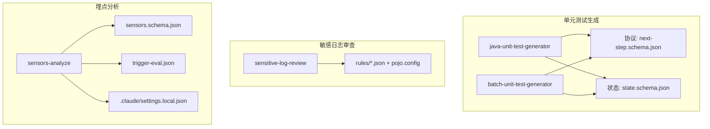
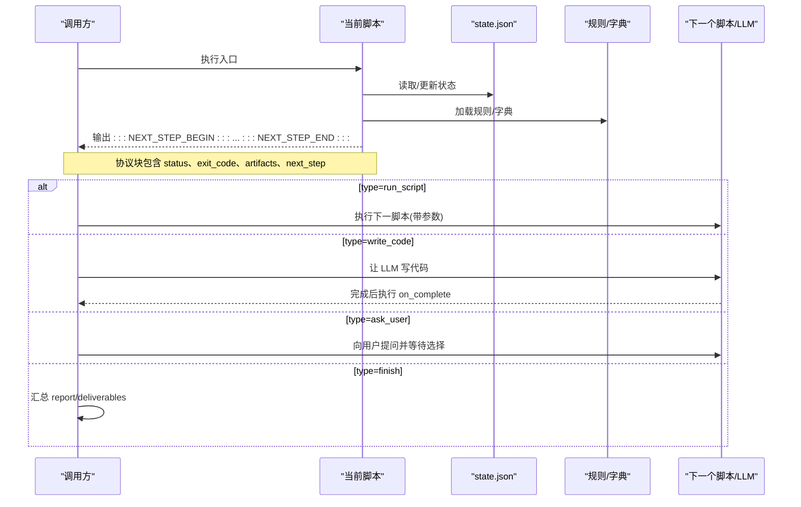
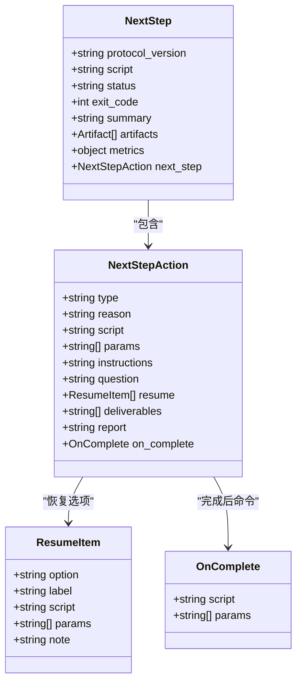
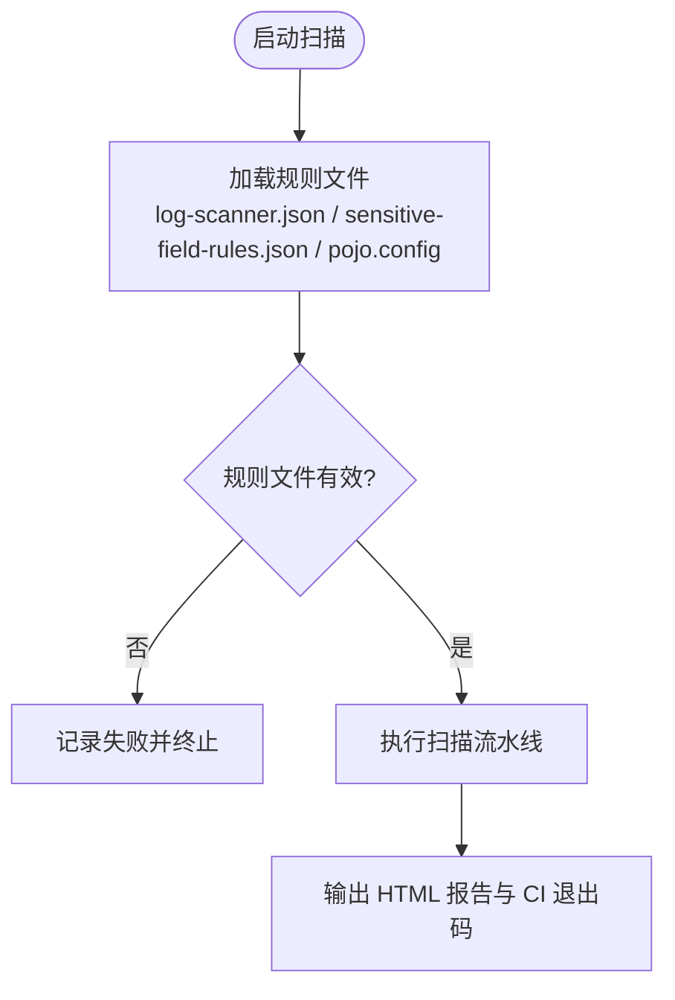
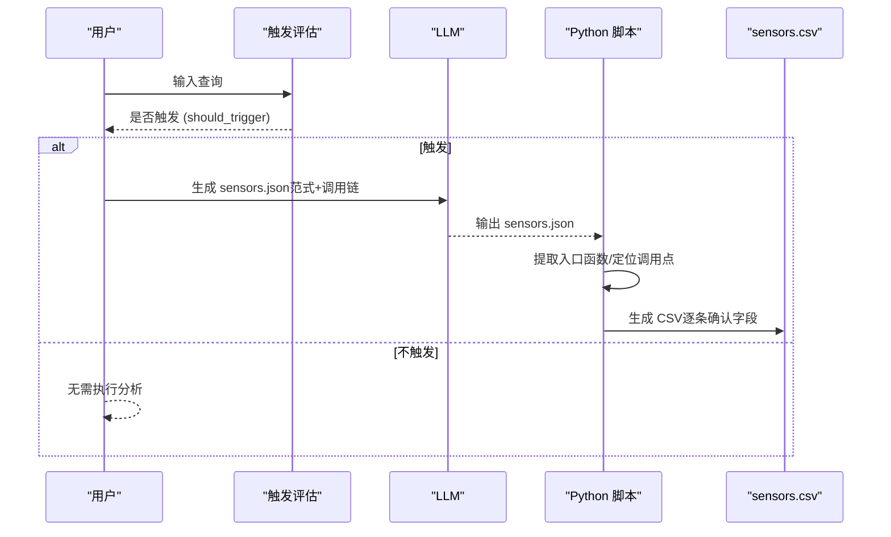
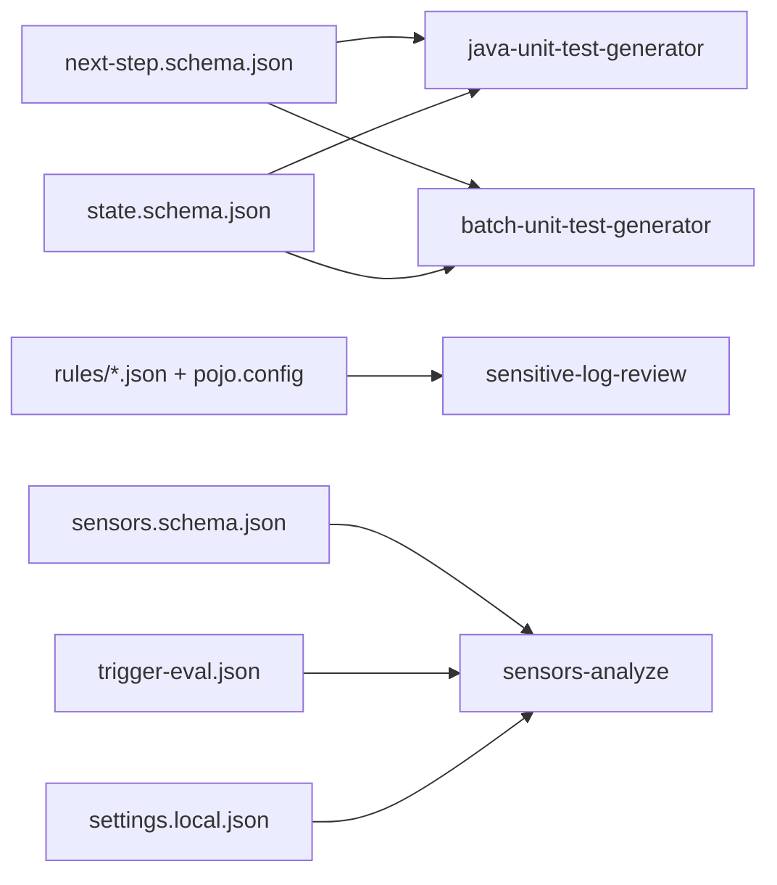

# 配置指南

<cite>
**本文引用的文件**
- [CLAUDE.md](file://CLAUDE.md)
- [AGENTS.md](file://AGENTS.md)
- [batch-unit-test-generator/protocol/next-step.schema.json](file://batch-unit-test-generator/protocol/next-step.schema.json)
- [batch-unit-test-generator/protocol/state.schema.json](file://batch-unit-test-generator/protocol/state.schema.json)
- [java-unit-test-generator/protocol/next-step.schema.json](file://java-unit-test-generator/protocol/next-step.schema.json)
- [java-unit-test-generator/protocol/state.schema.json](file://java-unit-test-generator/protocol/state.schema.json)
- [sensitive-log-review/scripts/rules/log-scanner.json](file://sensitive-log-review/scripts/rules/log-scanner.json)
- [sensitive-log-review/scripts/rules/sensitive-field-rules.json](file://sensitive-log-review/scripts/rules/sensitive-field-rules.json)
- [sensors-analyze/sensors.schema.json](file://sensors-analyze/sensors.schema.json)
- [sensors-analyze/trigger-eval.json](file://sensors-analyze/trigger-eval.json)
- [sensors-analyze/.claude/settings.local.json](file://sensors-analyze/.claude/settings.local.json)
- [batch-unit-test-generator/scripts/jaut/config.py](file://batch-unit-test-generator/scripts/jaut/config.py)
- [java-unit-test-generator/scripts/jaut/config.py](file://java-unit-test-generator/scripts/jaut/config.py)
- [sensitive-log-review/scripts/main.py](file://sensitive-log-review/scripts/main.py)
- [sensors-analyze/scripts/check_report.py](file://sensors-analyze/scripts/check_report.py)
</cite>

## 目录
1. [简介](#简介)
2. [项目结构](#项目结构)
3. [核心组件](#核心组件)
4. [架构总览](#架构总览)
5. [详细组件分析](#详细组件分析)
6. [依赖关系分析](#依赖关系分析)
7. [性能与可扩展性](#性能与可扩展性)
8. [故障排除指南](#故障排除指南)
9. [结论](#结论)
10. [附录：配置模板与最佳实践](#附录：配置模板与最佳实践)

## 简介
本指南面向 ping-skills 仓库中的四类“技能”（agent skills），聚焦于如何正确配置、验证与升级各技能的运行环境。内容涵盖：
- JSON Schema 定义的作用与使用方式
- 动态加载机制（规则、状态、协议）
- 版本管理与迁移策略
- 环境变量配置项说明、默认值与优先级
- 规则系统（内置规则定制与自定义扩展）
- 不同场景的推荐配置与最佳实践
- 配置校验与错误处理
- 迁移与升级注意事项
- 实际示例与排错方法

## 项目结构
该仓库由四个相互独立的技能组成，每个技能包含：
- SKILL.md（触发与工作流说明）
- references/ 与 protocol/（规则与协议 Schema）
- scripts/（Python 驱动脚本）
- tests/（pytest 测试套件）

其中：
- java-unit-test-generator 与 batch-unit-test-generator 共享 NEXT_STEP 协议与 state.json 状态模型，但各自维护一份 jaut 引擎副本，存在差异。
- sensitive-log-review 通过 rules/ 下的 JSON 与 pojo.config 进行扫描规则配置，并提供 doctor 诊断。
- sensors-analyze 以 sensors.schema.json 描述埋点分析报告结构，配合 trigger-eval.json 控制触发条件，并使用 .claude/settings.local.json 管理权限。

**图表来源**
- [CLAUDE.md:38-59](file://CLAUDE.md#L38-L59)
- [AGENTS.md:5-14](file://AGENTS.md#L5-L14)

**章节来源**
- [CLAUDE.md:38-59](file://CLAUDE.md#L38-L59)
- [AGENTS.md:5-14](file://AGENTS.md#L5-L14)

## 核心组件
- 协议层（NEXT_STEP）：统一脚本间通信格式，规定退出码、产物、下一步动作与完成报告等字段。
- 状态层（state.json）：断点续跑的状态持久化，支持向后兼容与增量迁移。
- 规则层（rules/）：敏感日志扫描的规则与字典，支持 JSON 与结构化配置。
- 分析模型（sensors.schema.json）：埋点分析报告的结构化约束，指导 LLM 输出与后续脚本解析。
- 触发与权限（trigger-eval.json, settings.local.json）：控制何时触发分析以及工具权限。

**章节来源**
- [batch-unit-test-generator/protocol/next-step.schema.json:1-195](file://batch-unit-test-generator/protocol/next-step.schema.json#L1-L195)
- [java-unit-test-generator/protocol/next-step.schema.json:1-195](file://java-unit-test-generator/protocol/next-step.schema.json#L1-L195)
- [batch-unit-test-generator/protocol/state.schema.json:1-161](file://batch-unit-test-generator/protocol/state.schema.json#L1-L161)
- [java-unit-test-generator/protocol/state.schema.json:1-151](file://java-unit-test-generator/protocol/state.schema.json#L1-L151)
- [sensitive-log-review/scripts/rules/log-scanner.json:1-7](file://sensitive-log-review/scripts/rules/log-scanner.json#L1-L7)
- [sensitive-log-review/scripts/rules/sensitive-field-rules.json:1-45](file://sensitive-log-review/scripts/rules/sensitive-field-rules.json#L1-L45)
- [sensors-analyze/sensors.schema.json:1-262](file://sensors-analyze/sensors.schema.json#L1-L262)
- [sensors-analyze/trigger-eval.json:1-90](file://sensors-analyze/trigger-eval.json#L1-L90)
- [sensors-analyze/.claude/settings.local.json:1-8](file://sensors-analyze/.claude/settings.local.json#L1-L8)

## 架构总览
NEXT_STEP 协议驱动脚本工作流，状态文件承载进度与预算，规则文件决定行为边界，Schema 保证数据一致性。

**图表来源**
- [batch-unit-test-generator/protocol/next-step.schema.json:16-177](file://batch-unit-test-generator/protocol/next-step.schema.json#L16-L177)
- [java-unit-test-generator/protocol/next-step.schema.json:16-177](file://java-unit-test-generator/protocol/next-step.schema.json#L16-L177)

**章节来源**
- [CLAUDE.md:38-47](file://CLAUDE.md#L38-L47)

## 详细组件分析

### 协议与状态（单元测试生成技能）
- 协议字段
  - protocol_version：固定为字符串常量，用于协议版本控制。
  - script：产出本协议块的脚本名。
  - status：success/empty/failed/needs_input。
  - exit_code：0=完成；1=继续；2=脚本错误；3=状态/协议错误。
  - artifacts：产物列表（worktree、coverage、mvn_log、surefire_report、test_file）。
  - metrics：可选指标（覆盖率、轮次、测试计数等）。
  - next_step：下一步动作，包括 run_script/write_code/ask_user/finish，以及对应必需字段（script、params、instructions、question、resume、deliverables、report、on_complete）。
- 状态字段
  - schema_version：用于顺序迁移，旧文件缺失视为 1。
  - project_root/workdir/threshold/target_class/module 等基础信息。
  - coverage_excludes：覆盖率排除模式（fnmatch）。
  - iteration/global_iteration/current_method/class_coverage/methods 等迭代与覆盖率轨迹。
  - final_checked/final_check_fail_streak 等终验保护。
  - worktree_branch/test_class_file/test_class_simple/plan 等上下文。
  - method_round_bonus/global_round_bonus/validate_fail_streak 等预算与违规计数。
  - jacoco_config_cache 缓存 JaCoCo 探测结果。
  - batch_mode/class_round_used（批量模式特有）。

**图表来源**
- [batch-unit-test-generator/protocol/next-step.schema.json:16-177](file://batch-unit-test-generator/protocol/next-step.schema.json#L16-L177)
- [java-unit-test-generator/protocol/next-step.schema.json:16-177](file://java-unit-test-generator/protocol/next-step.schema.json#L16-L177)

**章节来源**
- [batch-unit-test-generator/protocol/next-step.schema.json:1-195](file://batch-unit-test-generator/protocol/next-step.schema.json#L1-L195)
- [java-unit-test-generator/protocol/next-step.schema.json:1-195](file://java-unit-test-generator/protocol/next-step.schema.json#L1-L195)
- [batch-unit-test-generator/protocol/state.schema.json:1-161](file://batch-unit-test-generator/protocol/state.schema.json#L1-L161)
- [java-unit-test-generator/protocol/state.schema.json:1-151](file://java-unit-test-generator/protocol/state.schema.json#L1-L151)

### 规则系统（敏感日志审查）
- log-scanner.json：定义 logger_names、是否检测 system_out/print_stack_trace。
- sensitive-field-rules.json：按类别、级别、正则模式识别敏感字段，附带原因说明。
- 规则文件校验：doctor 模式会检查规则文件是否存在且可解析，JSON 损坏或空内容将记录失败。

**图表来源**
- [sensitive-log-review/scripts/rules/log-scanner.json:1-7](file://sensitive-log-review/scripts/rules/log-scanner.json#L1-L7)
- [sensitive-log-review/scripts/rules/sensitive-field-rules.json:1-45](file://sensitive-log-review/scripts/rules/sensitive-field-rules.json#L1-L45)
- [sensitive-log-review/scripts/main.py:635-654](file://sensitive-log-review/scripts/main.py#L635-L654)

**章节来源**
- [sensitive-log-review/scripts/rules/log-scanner.json:1-7](file://sensitive-log-review/scripts/rules/log-scanner.json#L1-L7)
- [sensitive-log-review/scripts/rules/sensitive-field-rules.json:1-45](file://sensitive-log-review/scripts/rules/sensitive-field-rules.json#L1-L45)
- [sensitive-log-review/scripts/main.py:635-654](file://sensitive-log-review/scripts/main.py#L635-L654)

### 埋点分析（sensors-analyze）
- sensors.schema.json：定义 meta（项目路径、语言、分析时间、SDK 摘要）、paradigms（范式数组，含调用链、入口函数、SDK API）。
- trigger-eval.json：提供查询样例与 should_trigger 标记，用于判断是否触发分析流程。
- .claude/settings.local.json：设置工具权限（如 WebSearch）。

**图表来源**
- [sensors-analyze/sensors.schema.json:1-262](file://sensors-analyze/sensors.schema.json#L1-L262)
- [sensors-analyze/trigger-eval.json:1-90](file://sensors-analyze/trigger-eval.json#L1-L90)
- [sensors-analyze/.claude/settings.local.json:1-8](file://sensors-analyze/.claude/settings.local.json#L1-L8)

**章节来源**
- [sensors-analyze/sensors.schema.json:1-262](file://sensors-analyze/sensors.schema.json#L1-L262)
- [sensors-analyze/trigger-eval.json:1-90](file://sensors-analyze/trigger-eval.json#L1-L90)
- [sensors-analyze/.claude/settings.local.json:1-8](file://sensors-analyze/.claude/settings.local.json#L1-L8)

## 依赖关系分析
- 单元测试生成技能：
  - 依赖 NEXT_STEP 协议与 state.json 状态模型。
  - 两个技能各自维护 jaut 引擎副本，需同步修改与测试。
- 敏感日志审查：
  - 依赖 rules/ 下的 JSON 与 pojo.config，doctor 模式校验规则完整性。
- 埋点分析：
  - 依赖 sensors.schema.json 作为输出契约，trigger-eval.json 控制触发，settings.local.json 控制权限。

**图表来源**
- [batch-unit-test-generator/protocol/next-step.schema.json:1-195](file://batch-unit-test-generator/protocol/next-step.schema.json#L1-L195)
- [java-unit-test-generator/protocol/next-step.schema.json:1-195](file://java-unit-test-generator/protocol/next-step.schema.json#L1-L195)
- [batch-unit-test-generator/protocol/state.schema.json:1-161](file://batch-unit-test-generator/protocol/state.schema.json#L1-L161)
- [java-unit-test-generator/protocol/state.schema.json:1-151](file://java-unit-test-generator/protocol/state.schema.json#L1-L151)
- [sensitive-log-review/scripts/rules/log-scanner.json:1-7](file://sensitive-log-review/scripts/rules/log-scanner.json#L1-L7)
- [sensitive-log-review/scripts/rules/sensitive-field-rules.json:1-45](file://sensitive-log-review/scripts/rules/sensitive-field-rules.json#L1-L45)
- [sensors-analyze/sensors.schema.json:1-262](file://sensors-analyze/sensors.schema.json#L1-L262)
- [sensors-analyze/trigger-eval.json:1-90](file://sensors-analyze/trigger-eval.json#L1-L90)
- [sensors-analyze/.claude/settings.local.json:1-8](file://sensors-analyze/.claude/settings.local.json#L1-L8)

**章节来源**
- [CLAUDE.md:49-59](file://CLAUDE.md#L49-L59)
- [AGENTS.md:41-45](file://AGENTS.md#L41-L45)

## 性能与可扩展性
- 超时与预算
  - Maven 构建超时可通过环境变量覆盖，非法值回退到默认值。
  - 单方法与全局预算可通过环境变量调整，影响迭代轮次上限。
  - 批量模式下有类级预算上限，避免无限循环。
- 覆盖率排除
  - 支持 fnmatch 模式对类名匹配，减少无关类进入统计。
- 缓存
  - JaCoCo 配置探测结果缓存，提升重复执行效率。
- 可扩展性
  - 规则系统支持新增类别与模式，便于适配企业规范。
  - 埋点分析支持多种范式（代码埋点、全埋点、指令、装饰器、Hook、自动埋点配置），便于多技术栈覆盖。

**章节来源**
- [batch-unit-test-generator/scripts/jaut/config.py:83-152](file://batch-unit-test-generator/scripts/jaut/config.py#L83-L152)
- [java-unit-test-generator/scripts/jaut/config.py:75-126](file://java-unit-test-generator/scripts/jaut/config.py#L75-L126)
- [batch-unit-test-generator/protocol/state.schema.json:32-110](file://batch-unit-test-generator/protocol/state.schema.json#L32-L110)
- [java-unit-test-generator/protocol/state.schema.json:32-100](file://java-unit-test-generator/protocol/state.schema.json#L32-L100)

## 故障排除指南
- 协议与状态
  - 若 exit_code=3，检查 state.json 是否符合 state.schema.json 约束，确保必填字段齐全。
  - 若 finish 缺少 report，检查脚本是否满足协议约束（非 select_worktree/batch_diff/batch_init 的 finish 必须携带 report）。
- 规则文件
  - 使用 --doctor 检查规则文件是否存在且可解析；JSON 损坏会记录具体行列位置。
  - 若扫描结果为空，检查 logger_names 与 patterns 是否覆盖目标变量与字段。
- 埋点分析
  - 若 CSV 行报错，检查 file 格式与 required 字段是否为空，避免动态占位符。
  - 若未触发分析，核对 trigger-eval.json 中查询是否匹配 should_trigger=true 的样例。
- 环境变量
  - 若 Maven 构建超时，检查 JAVA_UT_MVN_TIMEOUT 是否设置为合法整数；非法值将回退默认值。
  - 若预算不足导致提前结束，调整 JAVA_UT_METHOD_ROUND_BUDGET/JAVA_UT_GLOBAL_ROUND_BUDGET/JAVA_UT_BATCH_CLASS_ROUND_BUDGET。

**章节来源**
- [batch-unit-test-generator/protocol/next-step.schema.json:179-193](file://batch-unit-test-generator/protocol/next-step.schema.json#L179-L193)
- [java-unit-test-generator/protocol/next-step.schema.json:179-193](file://java-unit-test-generator/protocol/next-step.schema.json#L179-L193)
- [sensitive-log-review/scripts/main.py:635-654](file://sensitive-log-review/scripts/main.py#L635-L654)
- [sensors-analyze/scripts/check_report.py:106-133](file://sensors-analyze/scripts/check_report.py#L106-L133)
- [batch-unit-test-generator/tests/test_config.py:21-54](file://batch-unit-test-generator/tests/test_config.py#L21-L54)
- [java-unit-test-generator/tests/test_config.py:21-54](file://java-unit-test-generator/tests/test_config.py#L21-L54)

## 结论
本指南系统化梳理了 ping-skills 的配置体系：以协议与状态为核心，规则与分析模型为边界，环境变量为调优手段。遵循 Schema 约束、合理使用规则与预算、利用 doctor 与测试用例进行验证，可快速搭建稳定可靠的自动化工作流。

## 附录：配置模板与最佳实践
- 单元测试生成
  - 推荐阈值：80% 行覆盖率；可根据业务风险调整为更高或更低。
  - 覆盖率排除：对无关类（如 DTO、枚举）添加排除模式，减少噪音。
  - 预算设置：根据团队节奏设置方法与全局预算，避免过长迭代。
  - 最佳实践：仅修改 src/test/java/**，不触碰生产代码与 pom.xml；使用 state.json 断点续跑。
- 敏感日志审查
  - 建议开启 logger_names 白名单，关闭高噪音检测（system_out/print_stack_trace）除非必要。
  - 按企业规范扩展 sensitive-field-rules.json，增加新类别与模式。
  - 在 CI 中使用 --fail-on 指定告警级别，结合 HTML 报告进行门禁。
- 埋点分析
  - 明确 SDK 与范式，完善 sensors.schema.json 的 call_chain 与 entry_functions。
  - 使用 trigger-eval.json 精准控制触发范围，避免误报。
  - 人工确认 CSV 中的 page_name/biz_id 等关键字段，确保上报准确性。

[本节为概念性内容，不直接分析具体文件]