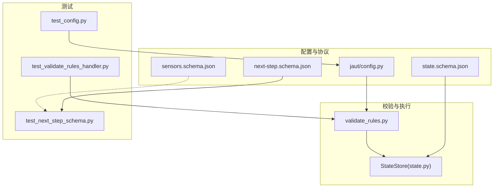
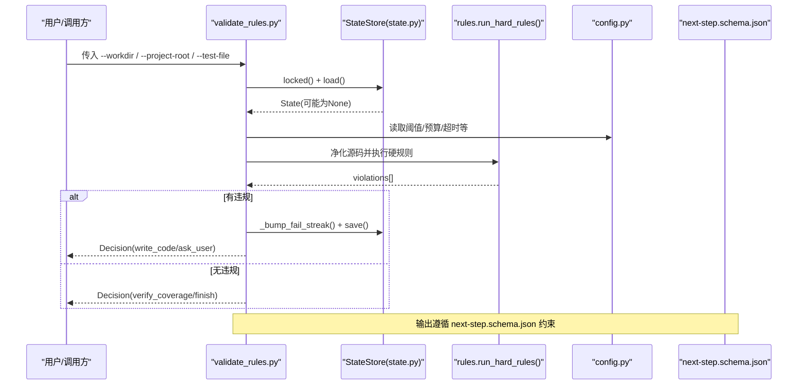
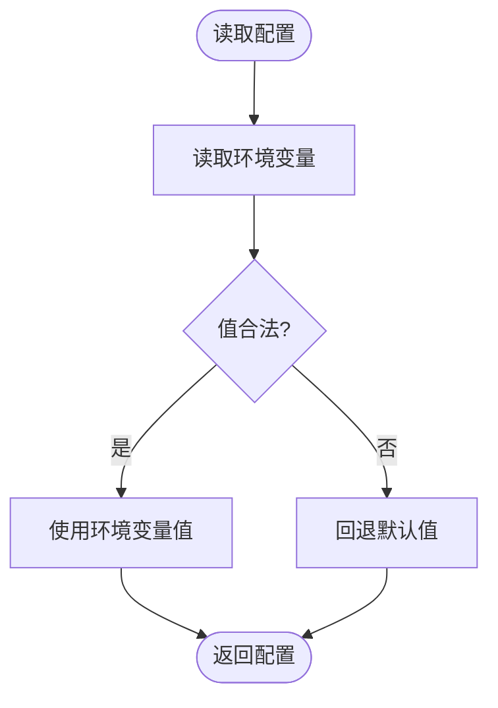
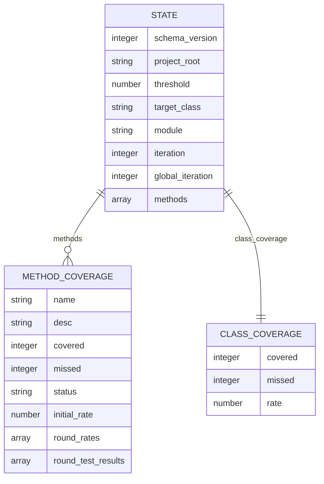
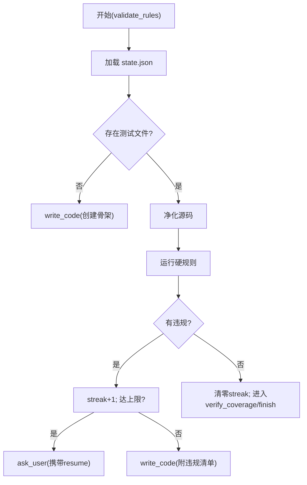
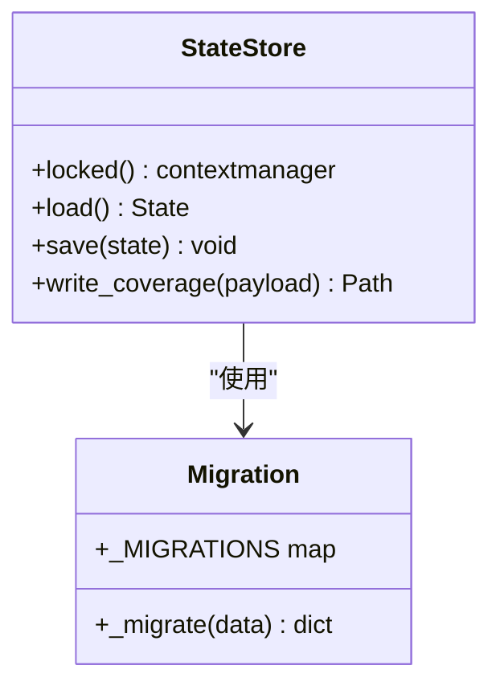
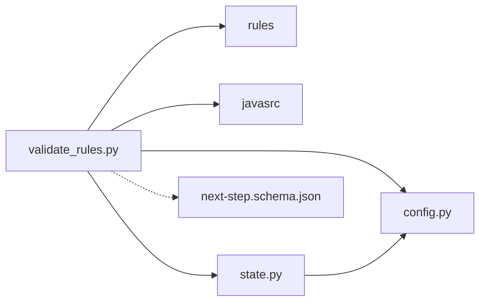

# 配置验证与调试

<cite>
**本文引用的文件**
- [batch-unit-test-generator/scripts/jaut/config.py](file://batch-unit-test-generator/scripts/jaut/config.py)
- [java-unit-test-generator/scripts/jaut/config.py](file://java-unit-test-generator/scripts/jaut/config.py)
- [batch-unit-test-generator/protocol/next-step.schema.json](file://batch-unit-test-generator/protocol/next-step.schema.json)
- [batch-unit-test-generator/protocol/state.schema.json](file://batch-unit-test-generator/protocol/state.schema.json)
- [sensors-analyze/sensors.schema.json](file://sensors-analyze/sensors.schema.json)
- [batch-unit-test-generator/scripts/validate_rules.py](file://batch-unit-test-generator/scripts/validate_rules.py)
- [java-unit-test-generator/scripts/validate_rules.py](file://java-unit-test-generator/scripts/validate_rules.py)
- [batch-unit-test-generator/scripts/jaut/state.py](file://batch-unit-test-generator/scripts/jaut/state.py)
- [java-unit-test-generator/scripts/jaut/state.py](file://java-unit-test-generator/scripts/jaut/state.py)
- [batch-unit-test-generator/tests/test_next_step_schema.py](file://batch-unit-test-generator/tests/test_next_step_schema.py)
- [java-unit-test-generator/tests/test_next_step_schema.py](file://java-unit-test-generator/tests/test_next_step_schema.py)
- [batch-unit-test-generator/tests/test_config.py](file://batch-unit-test-generator/tests/test_config.py)
- [java-unit-test-generator/tests/test_config.py](file://java-unit-test-generator/tests/test_config.py)
- [batch-unit-test-generator/tests/test_validate_rules_handler.py](file://batch-unit-test-generator/tests/test_validate_rules_handler.py)
- [java-unit-test-generator/tests/test_validate_rules_handler.py](file://java-unit-test-generator/tests/test_validate_rules_handler.py)
</cite>

## 目录
1. [简介](#简介)
2. [项目结构](#项目结构)
3. [核心组件](#核心组件)
4. [架构总览](#架构总览)
5. [详细组件分析](#详细组件分析)
6. [依赖关系分析](#依赖关系分析)
7. [性能考虑](#性能考虑)
8. [故障排查指南](#故障排查指南)
9. [结论](#结论)
10. [附录](#附录)

## 简介
本文件面向 ping-skills 项目中的“配置验证与调试”，聚焦以下目标：
- 解释配置文件的验证机制：语法检查、类型校验、业务规则校验。
- 说明配置错误的诊断方法与错误信息解读。
- 提供配置调试工具与命令的使用方法。
- 说明配置热重载与动态更新的支持情况。
- 给出配置性能优化建议与最佳实践。
- 汇总常见配置问题的排查步骤与解决方案。
- 说明配置备份与恢复机制。
- 解释配置版本管理与迁移工具的使用。
- 指导如何编写自定义验证规则与调试钩子。

## 项目结构
本项目在多个子模块中实现了统一的配置与协议校验体系，关键位置如下：
- 全局配置常量与环境变量解析：jaut/config.py（批量与 Java 单测生成器各自一份）。
- 协议与状态 JSON Schema：protocol/*.schema.json（NEXT_STEP 协议、state.json 状态结构），以及 sensors-analyze 的分析报告 schema。
- 规范校验脚本：validate_rules.py（批量与 Java 单测生成器各一份），负责测试代码的硬规则校验与流程路由。
- 状态存储与迁移：scripts/jaut/state.py，实现 state.json 的原子读写、并发锁、Schema 版本迁移。
- 单元测试：tests/*_schema.py、tests/test_config.py、tests/test_validate_rules_handler.py 等，覆盖配置与行为契约。

图表来源
- [batch-unit-test-generator/scripts/jaut/config.py:1-181](file://batch-unit-test-generator/scripts/jaut/config.py#L1-L181)
- [java-unit-test-generator/scripts/jaut/config.py:1-172](file://java-unit-test-generator/scripts/jaut/config.py#L1-L172)
- [batch-unit-test-generator/protocol/next-step.schema.json:1-195](file://batch-unit-test-generator/protocol/next-step.schema.json#L1-L195)
- [batch-unit-test-generator/protocol/state.schema.json:1-161](file://batch-unit-test-generator/protocol/state.schema.json#L1-L161)
- [sensors-analyze/sensors.schema.json:1-262](file://sensors-analyze/sensors.schema.json#L1-L262)
- [batch-unit-test-generator/scripts/validate_rules.py:1-230](file://batch-unit-test-generator/scripts/validate_rules.py#L1-L230)
- [java-unit-test-generator/scripts/validate_rules.py:1-208](file://java-unit-test-generator/scripts/validate_rules.py#L1-L208)
- [batch-unit-test-generator/scripts/jaut/state.py:43-164](file://batch-unit-test-generator/scripts/jaut/state.py#L43-L164)
- [java-unit-test-generator/scripts/jaut/state.py:43-164](file://java-unit-test-generator/scripts/jaut/state.py#L43-L164)

章节来源
- [batch-unit-test-generator/scripts/jaut/config.py:1-181](file://batch-unit-test-generator/scripts/jaut/config.py#L1-L181)
- [java-unit-test-generator/scripts/jaut/config.py:1-172](file://java-unit-test-generator/scripts/jaut/config.py#L1-L172)
- [batch-unit-test-generator/protocol/next-step.schema.json:1-195](file://batch-unit-test-generator/protocol/next-step.schema.json#L1-L195)
- [batch-unit-test-generator/protocol/state.schema.json:1-161](file://batch-unit-test-generator/protocol/state.schema.json#L1-L161)
- [sensors-analyze/sensors.schema.json:1-262](file://sensors-analyze/sensors.schema.json#L1-L262)
- [batch-unit-test-generator/scripts/validate_rules.py:1-230](file://batch-unit-test-generator/scripts/validate_rules.py#L1-L230)
- [java-unit-test-generator/scripts/validate_rules.py:1-208](file://java-unit-test-generator/scripts/validate_rules.py#L1-L208)
- [batch-unit-test-generator/scripts/jaut/state.py:43-164](file://batch-unit-test-generator/scripts/jaut/state.py#L43-L164)
- [java-unit-test-generator/scripts/jaut/state.py:43-164](file://java-unit-test-generator/scripts/jaut/state.py#L43-L164)

## 核心组件
- 全局配置与运行时参数
  - 集中定义路径、协议常量、预算阈值、Maven 超时、日志格式、Git worktree 命名限制等；部分值通过环境变量覆盖并提供容错回退。
  - 关键入口：config.mvn_timeout()、config.batch_class_round_budget()、config.method_round_budget()、config.global_round_budget()。
- 协议与状态 Schema
  - next-step.schema.json：定义 NEXT_STEP 协议载荷的结构、枚举、条件必填字段与约束。
  - state.schema.json：定义 state.json 的状态结构、字段类型、枚举、历史轨迹与迁移兼容策略。
  - sensors.schema.json：定义埋点分析报告的结构，便于后续脚本提取与定位。
- 规范校验与流程路由
  - validate_rules.py：读取 state.json，定位测试类，净化源码后运行硬规则引擎，统计连续违规次数，达到阈值升级 ask_user，否则返回 write_code 或进入 verify_coverage。
- 状态存储与迁移
  - StateStore：提供加锁、load/save、coverage 快照写入；_migrate 按 schema_version 顺序迁移旧 state.json 到当前版本。

章节来源
- [batch-unit-test-generator/scripts/jaut/config.py:1-181](file://batch-unit-test-generator/scripts/jaut/config.py#L1-L181)
- [java-unit-test-generator/scripts/jaut/config.py:1-172](file://java-unit-test-generator/scripts/jaut/config.py#L1-L172)
- [batch-unit-test-generator/protocol/next-step.schema.json:1-195](file://batch-unit-test-generator/protocol/next-step.schema.json#L1-L195)
- [batch-unit-test-generator/protocol/state.schema.json:1-161](file://batch-unit-test-generator/protocol/state.schema.json#L1-L161)
- [sensors-analyze/sensors.schema.json:1-262](file://sensors-analyze/sensors.schema.json#L1-L262)
- [batch-unit-test-generator/scripts/validate_rules.py:1-230](file://batch-unit-test-generator/scripts/validate_rules.py#L1-L230)
- [java-unit-test-generator/scripts/validate_rules.py:1-208](file://java-unit-test-generator/scripts/validate_rules.py#L1-L208)
- [batch-unit-test-generator/scripts/jaut/state.py:43-164](file://batch-unit-test-generator/scripts/jaut/state.py#L43-L164)
- [java-unit-test-generator/scripts/jaut/state.py:43-164](file://java-unit-test-generator/scripts/jaut/state.py#L43-L164)

## 架构总览
下图展示了配置验证与调试的关键交互：配置常量驱动行为，Schema 约束数据，validate_rules 编排校验与路由，StateStore 保证状态一致性与迁移。

图表来源
- [batch-unit-test-generator/scripts/validate_rules.py:56-138](file://batch-unit-test-generator/scripts/validate_rules.py#L56-L138)
- [java-unit-test-generator/scripts/validate_rules.py:56-127](file://java-unit-test-generator/scripts/validate_rules.py#L56-L127)
- [batch-unit-test-generator/scripts/jaut/state.py:93-164](file://batch-unit-test-generator/scripts/jaut/state.py#L93-L164)
- [java-unit-test-generator/scripts/jaut/state.py:93-164](file://java-unit-test-generator/scripts/jaut/state.py#L93-L164)
- [batch-unit-test-generator/protocol/next-step.schema.json:1-195](file://batch-unit-test-generator/protocol/next-step.schema.json#L1-L195)

## 详细组件分析

### 配置常量与环境变量解析（config）
- 职责
  - 集中管理阈值、预算、超时、路径模板、协议枚举等，避免散落字面量。
  - 通过环境变量覆盖关键运行时参数，并提供非法值回退默认值的健壮性。
- 关键点
  - mvn_timeout()：从 JAVA_UT_MVN_TIMEOUT 读取，非数字或空串回退默认。
  - batch_class_round_budget()/method_round_budget()/global_round_budget()：分别控制批量/方法级/全局轮次预算。
  - EXIT_* 退出码、NEXT_STEP_* 协议常量、PRUNE_DIRS、WORKTREE_* 命名限制等。
- 验证方式
  - 单元测试断言退出码互异、预算为正、协议常量类型与取值范围等。

图表来源
- [batch-unit-test-generator/scripts/jaut/config.py:100-110](file://batch-unit-test-generator/scripts/jaut/config.py#L100-L110)
- [java-unit-test-generator/scripts/jaut/config.py:121-131](file://java-unit-test-generator/scripts/jaut/config.py#L121-L131)
- [batch-unit-test-generator/tests/test_config.py:21-55](file://batch-unit-test-generator/tests/test_config.py#L21-L55)
- [java-unit-test-generator/tests/test_config.py:21-55](file://java-unit-test-generator/tests/test_config.py#L21-L55)

章节来源
- [batch-unit-test-generator/scripts/jaut/config.py:1-181](file://batch-unit-test-generator/scripts/jaut/config.py#L1-L181)
- [java-unit-test-generator/scripts/jaut/config.py:1-172](file://java-unit-test-generator/scripts/jaut/config.py#L1-L172)
- [batch-unit-test-generator/tests/test_config.py:1-140](file://batch-unit-test-generator/tests/test_config.py#L1-L140)
- [java-unit-test-generator/tests/test_config.py:1-140](file://java-unit-test-generator/tests/test_config.py#L1-L140)

### 协议与状态 Schema（JSON Schema）
- next-step.schema.json
  - 强制字段：protocol_version、script、status、exit_code、summary、artifacts、next_step。
  - next_step.type 限定 run_script/write_code/ask_user/finish，并按 type 条件要求不同字段（如 write_code 需要 instructions 与 on_complete）。
  - 对 finish 且非特定脚本时要求 report 字段。
- state.schema.json
  - 强制字段：schema_version、project_root、threshold、target_class、module、iteration、global_iteration、methods。
  - 支持 coverage_history、test_history、round_rates、round_test_results 等轨迹字段，用于无提升/失败升级判定。
  - 兼容旧版本：缺失键以默认值填充，迁移管道确保向后兼容。
- sensors.schema.json
  - 定义埋点分析报告结构，包含 meta、paradigms、entry_functions、sdk_apis 等，便于后续脚本提取与定位。

图表来源
- [batch-unit-test-generator/protocol/state.schema.json:1-161](file://batch-unit-test-generator/protocol/state.schema.json#L1-L161)

章节来源
- [batch-unit-test-generator/protocol/next-step.schema.json:1-195](file://batch-unit-test-generator/protocol/next-step.schema.json#L1-L195)
- [batch-unit-test-generator/protocol/state.schema.json:1-161](file://batch-unit-test-generator/protocol/state.schema.json#L1-L161)
- [sensors-analyze/sensors.schema.json:1-262](file://sensors-analyze/sensors.schema.json#L1-L262)

### 规范校验与流程路由（validate_rules）
- 输入
  - --workdir/--project-root 定位工作目录；--test-file 可显式指定测试文件（优先于 state.test_class_file）。
  - 读取 <workdir>/state.json 获取 test_class_file、project_root、git_baseline 等。
- 处理逻辑
  - 定位测试文件；缺失则写回 write_code（要求创建骨架），并累计连续违规计数。
  - 净化源码后运行硬规则引擎（禁止 catch/裸 try、git baseline 变更限制等）。
  - 有违规：累计 streak，达到阈值升级为 ask_user（携带 resume 选项），否则返回 write_code（附违规清单）。
  - 无违规：清零 streak，进入 verify_coverage 或 finish。
- 输出
  - 遵循 next-step.schema.json 的协议载荷，包含 status、exit_code、summary、next_step 等。

图表来源
- [batch-unit-test-generator/scripts/validate_rules.py:56-138](file://batch-unit-test-generator/scripts/validate_rules.py#L56-L138)
- [java-unit-test-generator/scripts/validate_rules.py:56-127](file://java-unit-test-generator/scripts/validate_rules.py#L56-L127)

章节来源
- [batch-unit-test-generator/scripts/validate_rules.py:1-230](file://batch-unit-test-generator/scripts/validate_rules.py#L1-L230)
- [java-unit-test-generator/scripts/validate_rules.py:1-208](file://java-unit-test-generator/scripts/validate_rules.py#L1-L208)
- [batch-unit-test-generator/tests/test_validate_rules_handler.py:64-239](file://batch-unit-test-generator/tests/test_validate_rules_handler.py#L64-L239)
- [java-unit-test-generator/tests/test_validate_rules_handler.py:64-239](file://java-unit-test-generator/tests/test_validate_rules_handler.py#L64-L239)

### 状态存储与迁移（StateStore）
- 并发安全
  - 使用独立 .lock 文件进行跨进程独占锁，保护 load→修改→save 的原子性。
  - 检测残留锁文件（超过 24 小时）并提示。
- 版本迁移
  - _migrate(data)：按 schema_version 顺序执行迁移函数，将旧 state.json 升级到当前版本。
  - 新增结构变更时需递增 config.STATE_SCHEMA_VERSION 并追加迁移函数。
- 原子写入
  - 先写 .tmp，再 os.replace 替换，确保崩溃不产生半写状态。

图表来源
- [batch-unit-test-generator/scripts/jaut/state.py:43-164](file://batch-unit-test-generator/scripts/jaut/state.py#L43-L164)
- [java-unit-test-generator/scripts/jaut/state.py:43-164](file://java-unit-test-generator/scripts/jaut/state.py#L43-L164)

章节来源
- [batch-unit-test-generator/scripts/jaut/state.py:43-164](file://batch-unit-test-generator/scripts/jaut/state.py#L43-L164)
- [java-unit-test-generator/scripts/jaut/state.py:43-164](file://java-unit-test-generator/scripts/jaut/state.py#L43-L164)

### 协议载荷验证（next-step.schema.json）
- 验证要点
  - 强制字段与枚举校验：status、exit_code、next_step.type 等。
  - 条件必填：run_script 需 script+params；write_code 需 instructions+on_complete；ask_user 需 question。
  - finish 场景：除 select_worktree/batch_diff/batch_init 外需 report。
- 测试覆盖
  - 代表性 payload 通过/失败用例，验证条件分支与必填字段。

章节来源
- [batch-unit-test-generator/protocol/next-step.schema.json:1-195](file://batch-unit-test-generator/protocol/next-step.schema.json#L1-L195)
- [batch-unit-test-generator/tests/test_next_step_schema.py:41-65](file://batch-unit-test-generator/tests/test_next_step_schema.py#L41-L65)
- [java-unit-test-generator/tests/test_next_step_schema.py:41-65](file://java-unit-test-generator/tests/test_next_step_schema.py#L41-L65)

## 依赖关系分析
- 组件耦合
  - validate_rules 依赖 config（阈值/预算/超时）、rules（硬规则引擎）、javasrc（源码净化）、state（状态读写）、prompt（规则文件路径）。
  - StateStore 依赖 config（文件名/路径常量）与文件系统锁。
  - Schema 作为契约被测试与脚本共同遵守。
- 外部依赖
  - jsonschema（可选）用于协议载荷验证；若未安装则跳过。
- 潜在循环依赖
  - 通过模块化导入与职责分离避免循环；validate_rules 仅单向依赖 config/state/rules。

图表来源
- [batch-unit-test-generator/scripts/validate_rules.py:1-230](file://batch-unit-test-generator/scripts/validate_rules.py#L1-L230)
- [java-unit-test-generator/scripts/validate_rules.py:1-208](file://java-unit-test-generator/scripts/validate_rules.py#L1-L208)
- [batch-unit-test-generator/scripts/jaut/config.py:1-181](file://batch-unit-test-generator/scripts/jaut/config.py#L1-L181)
- [java-unit-test-generator/scripts/jaut/config.py:1-172](file://java-unit-test-generator/scripts/jaut/config.py#L1-L172)
- [batch-unit-test-generator/scripts/jaut/state.py:43-164](file://batch-unit-test-generator/scripts/jaut/state.py#L43-L164)
- [java-unit-test-generator/scripts/jaut/state.py:43-164](file://java-unit-test-generator/scripts/jaut/state.py#L43-L164)

章节来源
- [batch-unit-test-generator/scripts/validate_rules.py:1-230](file://batch-unit-test-generator/scripts/validate_rules.py#L1-L230)
- [java-unit-test-generator/scripts/validate_rules.py:1-208](file://java-unit-test-generator/scripts/validate_rules.py#L1-L208)
- [batch-unit-test-generator/scripts/jaut/config.py:1-181](file://batch-unit-test-generator/scripts/jaut/config.py#L1-L181)
- [java-unit-test-generator/scripts/jaut/config.py:1-172](file://java-unit-test-generator/scripts/jaut/config.py#L1-L172)
- [batch-unit-test-generator/scripts/jaut/state.py:43-164](file://batch-unit-test-generator/scripts/jaut/state.py#L43-L164)
- [java-unit-test-generator/scripts/jaut/state.py:43-164](file://java-unit-test-generator/scripts/jaut/state.py#L43-L164)

## 性能考虑
- 配置读取
  - 环境变量解析为轻量操作，建议在进程启动时缓存结果，避免重复解析。
- 状态文件 IO
  - 使用原子写入与文件锁减少竞争；避免频繁小写，合并状态更新。
- 规则校验
  - 源码净化与规则匹配应尽量避免重复扫描；可对大文件分块处理。
- Maven 执行
  - 合理设置超时与进度报告间隔，防止主 Agent 误判进程无响应。
- 内存与 CPU
  - 覆盖率与测试结果轨迹数组增长较快，注意定期归档或裁剪历史。

[本节为通用指导，无需具体文件引用]

## 故障排查指南
- 常见问题与定位
  - state.json 缺失或损坏：StateStore.load 返回 None 或记录警告；检查文件是否存在与可读。
  - 残留锁文件：StateStore.locked 检测到 >24h 的 .lock 文件会提示；确认无其他进程后可手动删除。
  - 协议载荷不符合 Schema：next-step.schema.json 校验失败；检查必填字段与枚举值。
  - 规范校验连续失败：validate_rules 累计 streak，达到阈值升级为 ask_user；查看最近一轮违规清单与 mvn 日志路径。
- 错误信息解读
  - exit_code：0=正常完成；1=需要继续处理；2=脚本执行错误；3=状态/协议错误。
  - status：success/empty/failed/needs_input；结合 next_step.type 判断下一步动作。
  - 违规清单：包含行号级信息与权威文档链接，便于 LLM 或人工修复。
- 调试工具与命令
  - 使用 --workdir/--project-root 指定工作目录；--test-file 显式指定测试文件进行快速验证。
  - 观察 logs 目录下的 mvn.log 与 mvn_progress.json，辅助定位构建与覆盖率问题。
  - 通过单元测试复现：test_config.py、test_next_step_schema.py、test_validate_rules_handler.py。

章节来源
- [batch-unit-test-generator/scripts/jaut/state.py:93-164](file://batch-unit-test-generator/scripts/jaut/state.py#L93-L164)
- [java-unit-test-generator/scripts/jaut/state.py:93-164](file://java-unit-test-generator/scripts/jaut/state.py#L93-L164)
- [batch-unit-test-generator/protocol/next-step.schema.json:1-195](file://batch-unit-test-generator/protocol/next-step.schema.json#L1-L195)
- [batch-unit-test-generator/scripts/validate_rules.py:56-138](file://batch-unit-test-generator/scripts/validate_rules.py#L56-L138)
- [java-unit-test-generator/scripts/validate_rules.py:56-127](file://java-unit-test-generator/scripts/validate_rules.py#L56-L127)
- [batch-unit-test-generator/tests/test_config.py:1-140](file://batch-unit-test-generator/tests/test_config.py#L1-L140)
- [java-unit-test-generator/tests/test_config.py:1-140](file://java-unit-test-generator/tests/test_config.py#L1-L140)
- [batch-unit-test-generator/tests/test_next_step_schema.py:41-65](file://batch-unit-test-generator/tests/test_next_step_schema.py#L41-L65)
- [java-unit-test-generator/tests/test_next_step_schema.py:41-65](file://java-unit-test-generator/tests/test_next_step_schema.py#L41-L65)
- [batch-unit-test-generator/tests/test_validate_rules_handler.py:64-239](file://batch-unit-test-generator/tests/test_validate_rules_handler.py#L64-L239)
- [java-unit-test-generator/tests/test_validate_rules_handler.py:64-239](file://java-unit-test-generator/tests/test_validate_rules_handler.py#L64-L239)

## 结论
本项目通过集中化的配置常量、严格的 JSON Schema 约束、健壮的规范校验与状态迁移机制，提供了完善的配置验证与调试能力。借助环境变量覆盖、原子写入与并发锁、条件必填与枚举校验、连续违规升级与 resume 选项，用户能够有效诊断和解决配置相关问题，并在批量与单测场景中保持稳定的流程推进。

[本节为总结，无需具体文件引用]

## 附录
- 配置热重载与动态更新
  - 环境变量在每次调用 config.*() 时读取，具备运行时动态更新能力；但需注意并发与一致性。
  - state.json 通过 StateStore 原子写入，支持多进程安全更新；不建议直接编辑，应通过 API 或脚本更新。
- 配置备份与恢复
  - 建议对 state.json 与 coverage.json 进行定期备份；迁移前保留旧版本以便回滚。
  - 利用 Schema 向后兼容与迁移管道，逐步升级 state.json 结构。
- 版本管理与迁移
  - 新增结构变更时递增 config.STATE_SCHEMA_VERSION，并在 _MIGRATIONS 注册迁移函数。
  - 迁移函数应幂等、可逆（尽量），并附带单元测试保障。
- 自定义验证规则与调试钩子
  - 扩展 rules 引擎：注册新的硬规则，返回违规对象（含行号与描述）。
  - 调试钩子：在 validate_rules 中增加日志或断点，结合 mvn.log 与 state.json 轨迹字段定位问题。
  - 参考现有测试用例编写断言，确保新规则的正确性与稳定性。

[本节为补充说明，无需具体文件引用]