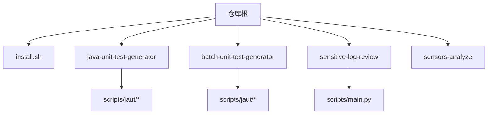
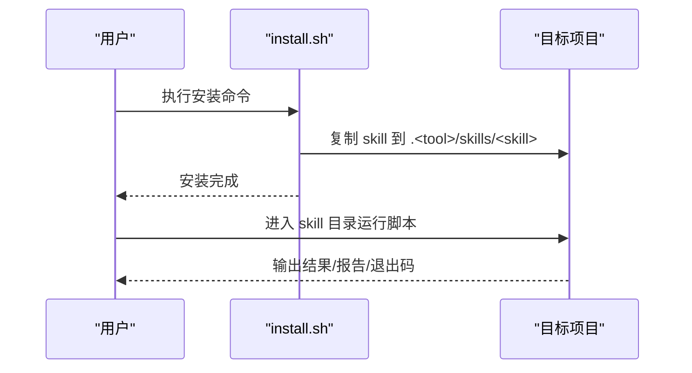
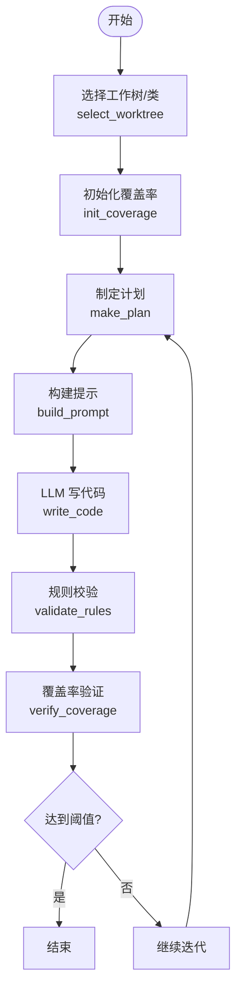
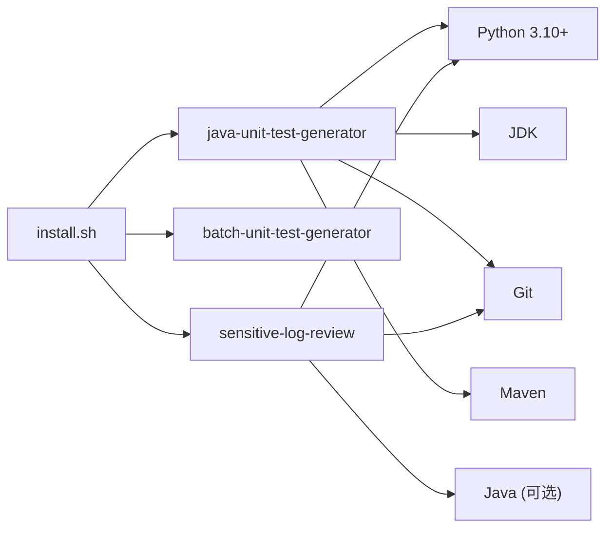

# 快速开始

<cite>
**本文引用的文件**
- [install.sh](file://install.sh)
- [AGENTS.md](file://AGENTS.md)
- [CLAUDE.md](file://CLAUDE.md)
- [sensitive-log-review/README.md](file://sensitive-log-review/README.md)
- [sensitive-log-review/SKILL.md](file://sensitive-log-review/SKILL.md)
- [java-unit-test-generator/scripts/jaut/cli.py](file://java-unit-test-generator/scripts/jaut/cli.py)
- [java-unit-test-generator/scripts/jaut/config.py](file://java-unit-test-generator/scripts/jaut/config.py)
- [batch-unit-test-generator/scripts/jaut/config.py](file://batch-unit-test-generator/scripts/jaut/config.py)
</cite>

## 目录
1. [简介](#简介)
2. [项目结构](#项目结构)
3. [核心组件](#核心组件)
4. [架构总览](#架构总览)
5. [详细组件分析](#详细组件分析)
6. [依赖关系分析](#依赖关系分析)
7. [性能注意事项](#性能注意事项)
8. [故障排除指南](#故障排除指南)
9. [结论](#结论)
10. [附录：15分钟上手清单](#附录15分钟上手清单)

## 简介
本指南帮助你在 15 分钟内完成环境准备、安装并运行第一个技能。仓库包含多个“技能”（skills），每个技能独立部署到目标项目中，通过 Python 脚本驱动工作流，并与 LLM 协作完成特定任务。你可以选择：
- 先体验“敏感日志审查”技能（无需 Maven/JAVA 构建，仅需要 Python、Git、可选的 Java）
- 或体验“Java 单元测试生成”技能（需要 Java、Maven、Git）

## 项目结构
仓库根目录提供统一安装脚本 install.sh，可将任意 skill 复制到目标项目的隐藏目录中，供不同 AI 工具使用。各 skill 自包含说明文档、脚本与测试。

图表来源
- [install.sh:144-204](file://install.sh#L144-L204)
- [AGENTS.md:5-14](file://AGENTS.md#L5-L14)

章节来源
- [AGENTS.md:5-14](file://AGENTS.md#L5-L14)
- [CLAUDE.md:16-34](file://CLAUDE.md#L16-L34)

## 核心组件
- 安装器：install.sh，支持交互式或参数化安装，将 skill 复制到目标项目的 .<tool>/skills/<skill> 目录，并清理非必要文件。
- 敏感日志审查：Python 脚本流水线，检查变更代码是否可能将敏感信息输出到日志，生成 HTML 报告与 CI 门禁判定。
- 单元测试生成：基于 NEXT_STEP 协议，迭代生成 JUnit5+Mockito 测试，直到覆盖率达标；支持单类与批量模式。

章节来源
- [install.sh:144-204](file://install.sh#L144-L204)
- [sensitive-log-review/README.md:57-111](file://sensitive-log-review/README.md#L57-L111)
- [CLAUDE.md:36-55](file://CLAUDE.md#L36-L55)

## 架构总览
技能通过 Python 脚本编排，遵循统一的退出码与协议约定，便于与 AI 执行体协同。单元测试生成技能采用 NEXT_STEP 协议，状态持久化在 workdir 的 state.json，流程包括选择工作树、初始化覆盖率、制定计划、构建提示、LLM 写代码、规则校验、覆盖率验证等步骤。

图表来源
- [install.sh:210-289](file://install.sh#L210-L289)
- [CLAUDE.md:36-55](file://CLAUDE.md#L36-L55)

## 详细组件分析

### 环境准备（前置依赖）
- Python 3.10+：所有脚本基于标准库，无第三方依赖（测试阶段需要 pytest）。
- Git：用于获取变更列表与分支对比。
- Java Runtime：敏感日志审查中的 POJO 注释检查依赖 Checkstyle（可通过 java -jar 运行）；单元测试生成需要 Maven 与 JDK。
- Maven：单元测试生成技能必需，用于编译与运行测试、生成覆盖率报告。

建议：
- Windows 设置 PYTHONIOENCODING=utf-8 以避免控制台中文乱码。
- 确保 git、java、mvn 可在 PATH 中直接调用。

章节来源
- [sensitive-log-review/README.md:57-86](file://sensitive-log-review/README.md#L57-L86)
- [CLAUDE.md:16-34](file://CLAUDE.md#L16-L34)

### 一键安装（使用 install.sh）
- 用法：./install.sh <claude|qwen|qoder|opencode|all> [<skill>[,<skill>...]] [<project-dir>]
- 行为：
  - 扫描仓库根下的 skill 目录（排除隐藏目录与 agents）。
  - 交互式或参数化选择工具与 skill。
  - 将 skill 复制到目标项目的 .<tool>/skills/<skill>，并复制 agents 到 .<tool>/agents。
  - 清理 tests、__pycache__、.pytest_cache、test.log 等非必要内容。
  - 对 claude/opencode 目标，移除 SKILL.md 及 agents/*.md 中的 tools 行；qoder/qwen 保留。

示例：
- 全部安装：./install.sh all
- 指定工具与 skill：./install.sh qoder sensitive-log-review /path/to/project
- 交互式：./install.sh

章节来源
- [install.sh:144-204](file://install.sh#L144-L204)
- [install.sh:210-289](file://install.sh#L210-L289)
- [CLAUDE.md:16-34](file://CLAUDE.md#L16-L34)

### 手动安装
- 将 skill 目录复制到目标项目的 .<tool>/skills/<skill>。
- 如有 agents 目录，复制到 .<tool>/agents。
- 根据目标工具决定是否删除 SKILL.md 中的 tools 行（qoder/qwen 保留，其他工具删除）。
- 清理 tests、缓存等非必要文件。

章节来源
- [install.sh:144-204](file://install.sh#L144-L204)

### 快速体验：敏感日志审查（推荐首次体验）
- 适用场景：PR/MR 合并前、安全合规检查、CI 门禁。
- 基本命令（在项目根目录）：
  - python scripts/main.py -r . -b master -o ./review-output
  - 全量扫描：python scripts/main.py -r . --full-scan
  - 环境诊断：python scripts/main.py --doctor -r .
- 输出：HTML 报告与多类中间产物（违规清单、敏感字段结果、POJO 注释问题等）。
- 退出码：0 通过，1 门禁拦截，2 执行错误。

章节来源
- [sensitive-log-review/SKILL.md:10-29](file://sensitive-log-review/SKILL.md#L10-L29)
- [sensitive-log-review/README.md:127-160](file://sensitive-log-review/README.md#L127-L160)
- [sensitive-log-review/README.md:167-174](file://sensitive-log-review/README.md#L167-L174)

### 快速体验：Java 单元测试生成（进阶）
- 能力：为单个 Java 类（或方法）迭代生成 JUnit5+Mockito 测试，直至 JaCoCo 覆盖率达标。
- 关键流程（NEXT_STEP 协议）：
  - select_worktree → init_coverage → make_plan → build_prompt → LLM write_code → validate_rules → verify_coverage
  - 状态保存在 workdir/state.json，支持断点续跑。
- CLI 入口：scripts/jaut/cli.py 提供统一脚手架，解析参数、处理异常、输出 next_step JSON 块与退出码。
- 配置要点：
  - 默认覆盖率阈值 80%（可配置）。
  - Maven 超时、失败忽略标志、进度报告等由 config.py 集中管理。
  - 批量模式支持从分支 diff 中批量处理多个类。

章节来源
- [CLAUDE.md:36-55](file://CLAUDE.md#L36-L55)
- [java-unit-test-generator/scripts/jaut/cli.py:1-129](file://java-unit-test-generator/scripts/jaut/cli.py#L1-L129)
- [java-unit-test-generator/scripts/jaut/config.py:50-118](file://java-unit-test-generator/scripts/jaut/config.py#L50-L118)
- [batch-unit-test-generator/scripts/jaut/config.py:141-168](file://batch-unit-test-generator/scripts/jaut/config.py#L141-L168)

### 第一个技能的完整流程（以单元测试生成为例）
以下流程展示从选择类到生成测试的关键步骤与数据流转。

图表来源
- [CLAUDE.md:36-55](file://CLAUDE.md#L36-L55)
- [java-unit-test-generator/scripts/jaut/cli.py:95-129](file://java-unit-test-generator/scripts/jaut/cli.py#L95-L129)

章节来源
- [CLAUDE.md:36-55](file://CLAUDE.md#L36-L55)
- [java-unit-test-generator/scripts/jaut/cli.py:95-129](file://java-unit-test-generator/scripts/jaut/cli.py#L95-L129)

## 依赖关系分析
- 安装器依赖 Bash 与文件系统操作，不依赖外部包。
- 敏感日志审查依赖 Python 3.10+、Git、可选 Java（Checkstyle）。
- 单元测试生成依赖 Python、Git、JDK、Maven；内部通过 jaut 引擎协调 Maven、Surefire、JaCoCo。

图表来源
- [install.sh:144-204](file://install.sh#L144-L204)
- [sensitive-log-review/README.md:57-86](file://sensitive-log-review/README.md#L57-L86)
- [CLAUDE.md:36-55](file://CLAUDE.md#L36-L55)

章节来源
- [install.sh:144-204](file://install.sh#L144-L204)
- [sensitive-log-review/README.md:57-86](file://sensitive-log-review/README.md#L57-L86)
- [CLAUDE.md:36-55](file://CLAUDE.md#L36-L55)

## 性能注意事项
- 敏感日志审查默认仅扫描变更文件（--changed-only），速度快；全量扫描（--full-scan）较慢。
- 单元测试生成通过预算控制轮次（方法级与全局），避免无限迭代；Maven 执行带超时与进度报告，防止卡死。
- 批量模式按大类拆分策略分组处理，提升效率。

章节来源
- [sensitive-log-review/README.md:48-53](file://sensitive-log-review/README.md#L48-L53)
- [java-unit-test-generator/scripts/jaut/config.py:68-99](file://java-unit-test-generator/scripts/jaut/config.py#L68-L99)
- [batch-unit-test-generator/scripts/jaut/config.py:141-168](file://batch-unit-test-generator/scripts/jaut/config.py#L141-L168)

## 故障排除指南
常见问题与解决思路：
- 控制台中文乱码（Windows）：设置 PYTHONIOENCODING=utf-8。
- 不是 git 仓库：确保 -r/--root 指向包含 .git 的仓库根目录。
- 找不到 java 命令：安装 JRE/JDK 并确保 PATH 正确；敏感日志审查的步骤6失败仅警告，不影响整体退出码。
- 变更检查无结果：确认对比基准分支（--branch），CI 需完整历史（fetch-depth: 0）；必要时使用 --full-scan。
- 误报/漏报：调整词典与规则（白名单/黑名单/core/extended），递增版本头后重新运行。
- CI 门禁失败：查看控制台末尾计数项与 HTML 报告定位问题；调整 --fail-on 或修复代码。
- run-id 非法字符：仅允许字母数字/._-，且首字符必须为字母或数字，最长 64 字符。
- jar SHA256 校验告警：Checkstyle jar 完整性受保护，若替换或升级需同步更新基线并回归测试。
- failedFiles 警告：打开 failed-files.list 定位原因；严格模式下存在失败文件即退出码 2。

章节来源
- [sensitive-log-review/README.md:361-483](file://sensitive-log-review/README.md#L361-L483)
- [sensitive-log-review/SKILL.md:31-57](file://sensitive-log-review/SKILL.md#L31-L57)

## 结论
通过 install.sh 可快速将任意 skill 安装到目标项目；敏感日志审查适合快速体验与安全合规检查；单元测试生成适合自动化提升测试覆盖率。遵循退出码契约与协议规范，可无缝集成至 CI 流程。

## 附录：15分钟上手清单
- 准备环境：安装 Python 3.10+、Git；如需单元测试生成，安装 JDK 与 Maven。
- 安装技能：
  - 一键：./install.sh qoder sensitive-log-review /path/to/project
  - 交互：./install.sh
- 体验敏感日志审查：
  - 在项目根目录执行：python scripts/main.py -r . -b master -o ./review-output
  - 查看 HTML 报告与产物文件。
- 体验单元测试生成（进阶）：
  - 确保 Maven 与 JDK 可用。
  - 按照 NEXT_STEP 流程运行脚本，观察覆盖率逐步提升。

章节来源
- [install.sh:210-289](file://install.sh#L210-L289)
- [sensitive-log-review/SKILL.md:10-29](file://sensitive-log-review/SKILL.md#L10-L29)
- [CLAUDE.md:36-55](file://CLAUDE.md#L36-L55)