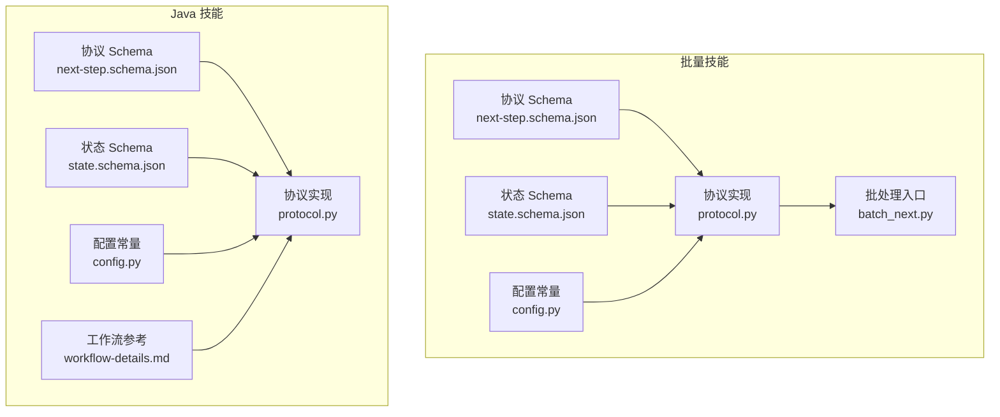
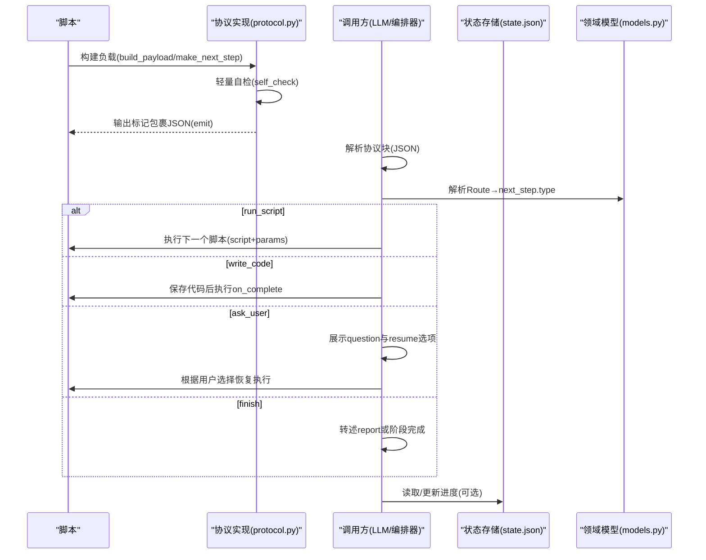
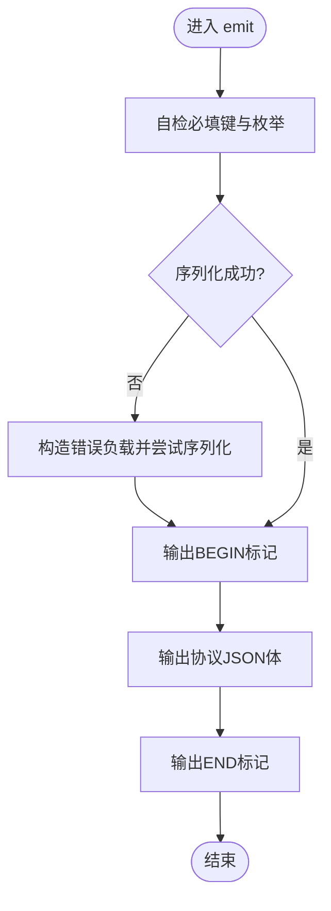
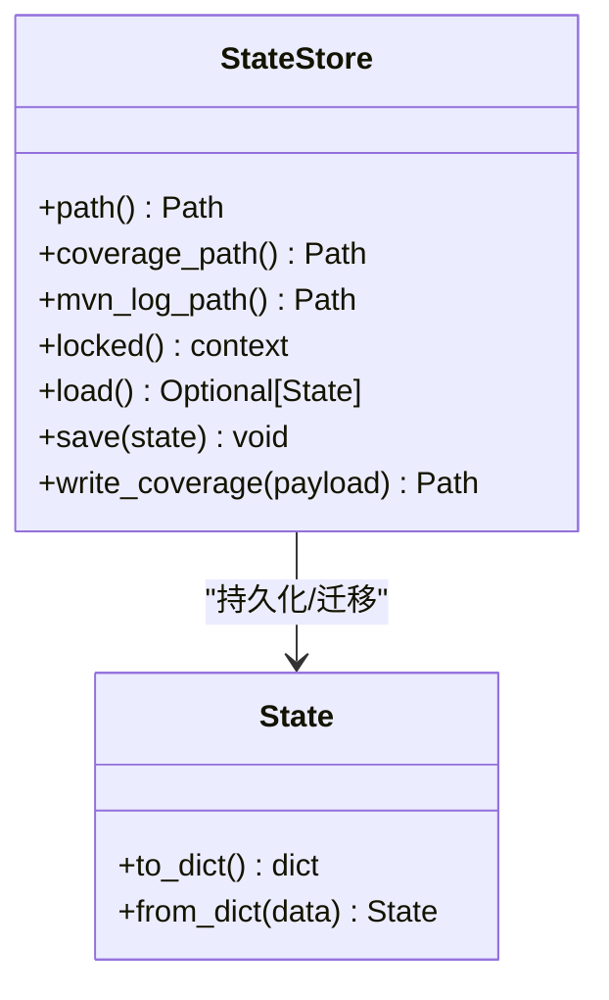
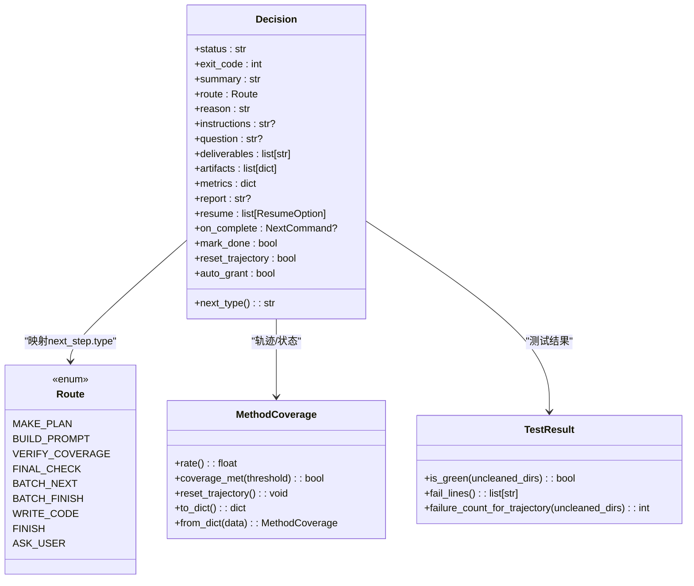
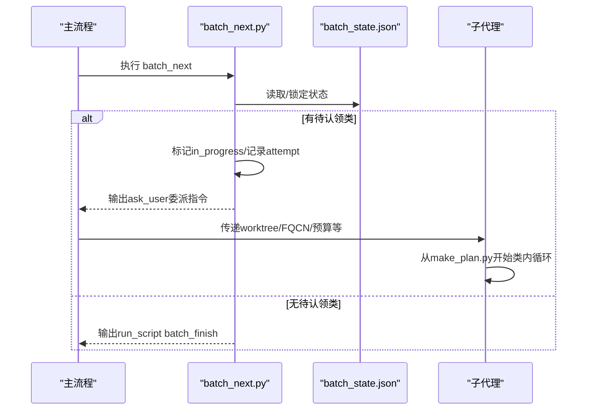
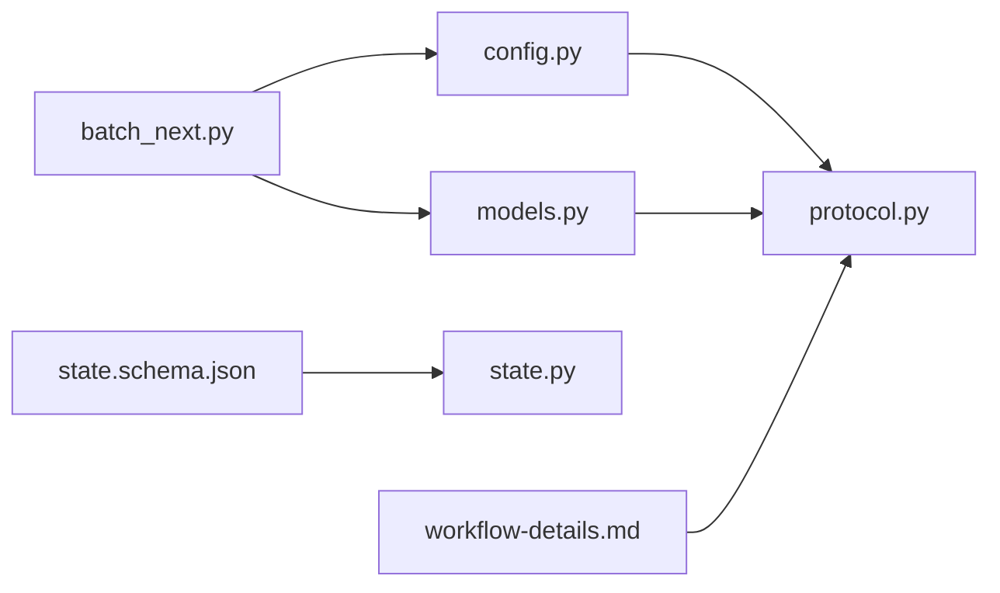

# NEXT_STEP 协议设计

<cite>
**本文引用的文件**
- [batch-unit-test-generator/protocol/next-step.schema.json](file://batch-unit-test-generator/protocol/next-step.schema.json)
- [java-unit-test-generator/protocol/next-step.schema.json](file://java-unit-test-generator/protocol/next-step.schema.json)
- [batch-unit-test-generator/protocol/state.schema.json](file://batch-unit-test-generator/protocol/state.schema.json)
- [java-unit-test-generator/protocol/state.schema.json](file://java-unit-test-generator/protocol/state.schema.json)
- [batch-unit-test-generator/scripts/jaut/protocol.py](file://batch-unit-test-generator/scripts/jaut/protocol.py)
- [java-unit-test-generator/scripts/jaut/protocol.py](file://java-unit-test-generator/scripts/jaut/protocol.py)
- [batch-unit-test-generator/scripts/jaut/config.py](file://batch-unit-test-generator/scripts/jaut/config.py)
- [java-unit-test-generator/scripts/jaut/config.py](file://java-unit-test-generator/scripts/jaut/config.py)
- [batch-unit-test-generator/tests/test_next_step_schema.py](file://batch-unit-test-generator/tests/test_next_step_schema.py)
- [java-unit-test-generator/tests/test_next_step_schema.py](file://java-unit-test-generator/tests/test_next_step_schema.py)
- [batch-unit-test-generator/scripts/batch_next.py](file://batch-unit-test-generator/scripts/batch_next.py)
- [java-unit-test-generator/scripts/jaut/state.py](file://java-unit-test-generator/scripts/jaut/state.py)
- [batch-unit-test-generator/scripts/jaut/models.py](file://batch-unit-test-generator/scripts/jaut/models.py)
- [java-unit-test-generator/references/workflow-details.md](file://java-unit-test-generator/references/workflow-details.md)
</cite>

## 目录
1. [简介](#简介)
2. [项目结构](#项目结构)
3. [核心组件](#核心组件)
4. [架构总览](#架构总览)
5. [详细组件分析](#详细组件分析)
6. [依赖关系分析](#依赖关系分析)
7. [性能考虑](#性能考虑)
8. [故障排查指南](#故障排查指南)
9. [结论](#结论)
10. [附录](#附录)

## 简介
NEXT_STEP 协议是脚本与 AI 助手（或编排器）之间的唯一契约，用于在自动化测试生成流程中标准化“状态—决策—执行”的交互。每个脚本在结束时，通过标准标记包裹 JSON 块输出协议负载；调用方仅解析该 JSON 块，据此决定下一步动作：继续运行脚本、让 LLM 编写代码、向用户提问或直接结束任务。

协议的设计目标包括：
- 标准化脚本与 AI 助手的通信机制，确保跨脚本、跨技能的一致性与可组合性。
- 明确消息格式规范：状态消息、决策消息和执行指令的结构化定义。
- 以 JSON Schema 进行数据完整性校验，保证负载结构与语义约束。
- 提供版本管理与向后兼容策略，支持渐进式演进。
- 给出完整的工作流示例与扩展指南，便于新增自定义消息类型。

## 项目结构
本仓库包含两个技能实现（批量单元测试生成器与 Java 单元测试生成器），它们共享相同的协议思想与约定，并在各自目录下维护独立的协议 Schema 与脚本实现。

图表来源
- [batch-unit-test-generator/protocol/next-step.schema.json:1-195](file://batch-unit-test-generator/protocol/next-step.schema.json#L1-L195)
- [java-unit-test-generator/protocol/next-step.schema.json:1-195](file://java-unit-test-generator/protocol/next-step.schema.json#L1-L195)
- [batch-unit-test-generator/scripts/jaut/protocol.py:1-105](file://batch-unit-test-generator/scripts/jaut/protocol.py#L1-L105)
- [java-unit-test-generator/scripts/jaut/protocol.py:1-105](file://java-unit-test-generator/scripts/jaut/protocol.py#L1-L105)
- [batch-unit-test-generator/scripts/jaut/config.py:1-181](file://batch-unit-test-generator/scripts/jaut/config.py#L1-L181)
- [java-unit-test-generator/scripts/jaut/config.py:1-172](file://java-unit-test-generator/scripts/jaut/config.py#L1-L172)
- [batch-unit-test-generator/scripts/batch_next.py:1-178](file://batch-unit-test-generator/scripts/batch_next.py#L1-L178)
- [java-unit-test-generator/references/workflow-details.md:30-141](file://java-unit-test-generator/references/workflow-details.md#L30-L141)

章节来源
- [batch-unit-test-generator/protocol/next-step.schema.json:1-195](file://batch-unit-test-generator/protocol/next-step.schema.json#L1-L195)
- [java-unit-test-generator/protocol/next-step.schema.json:1-195](file://java-unit-test-generator/protocol/next-step.schema.json#L1-L195)
- [batch-unit-test-generator/scripts/jaut/protocol.py:1-105](file://batch-unit-test-generator/scripts/jaut/protocol.py#L1-L105)
- [java-unit-test-generator/scripts/jaut/protocol.py:1-105](file://java-unit-test-generator/scripts/jaut/protocol.py#L1-L105)
- [batch-unit-test-generator/scripts/jaut/config.py:1-181](file://batch-unit-test-generator/scripts/jaut/config.py#L1-L181)
- [java-unit-test-generator/scripts/jaut/config.py:1-172](file://java-unit-test-generator/scripts/jaut/config.py#L1-L172)
- [batch-unit-test-generator/scripts/batch_next.py:1-178](file://batch-unit-test-generator/scripts/batch_next.py#L1-L178)
- [java-unit-test-generator/references/workflow-details.md:30-141](file://java-unit-test-generator/references/workflow-details.md#L30-L141)

## 核心组件
- 协议负载构建与输出：负责组装 NEXT_STEP 负载、轻量自检、并以标记包裹输出到 stdout。
- 配置常量：集中管理协议版本、标记、枚举值、退出码等单一事实源。
- 状态存储：原子读写 state.json，提供迁移管道与默认值填充，保障断点续跑与向后兼容。
- 领域模型：类型化的覆盖率、测试结果、决策产物与路由映射，支撑 next_step.type 的生成。
- 工作流参考：说明协议块结构、路由类型、特殊字段、退出码与兜底策略。

章节来源
- [batch-unit-test-generator/scripts/jaut/protocol.py:1-105](file://batch-unit-test-generator/scripts/jaut/protocol.py#L1-L105)
- [java-unit-test-generator/scripts/jaut/protocol.py:1-105](file://java-unit-test-generator/scripts/jaut/protocol.py#L1-L105)
- [batch-unit-test-generator/scripts/jaut/config.py:1-181](file://batch-unit-test-generator/scripts/jaut/config.py#L1-L181)
- [java-unit-test-generator/scripts/jaut/config.py:1-172](file://java-unit-test-generator/scripts/jaut/config.py#L1-L172)
- [java-unit-test-generator/scripts/jaut/state.py:1-165](file://java-unit-test-generator/scripts/jaut/state.py#L1-L165)
- [batch-unit-test-generator/scripts/jaut/models.py:1-693](file://batch-unit-test-generator/scripts/jaut/models.py#L1-L693)
- [java-unit-test-generator/references/workflow-details.md:30-141](file://java-unit-test-generator/references/workflow-details.md#L30-L141)

## 架构总览
NEXT_STEP 协议的核心在于“脚本产出负载 → 调用方解析并路由 → 执行下一步”。下图展示了典型交互序列：脚本完成时输出协议块，调用方根据 next_step.type 选择后续动作。

图表来源
- [batch-unit-test-generator/scripts/jaut/protocol.py:22-105](file://batch-unit-test-generator/scripts/jaut/protocol.py#L22-L105)
- [java-unit-test-generator/scripts/jaut/protocol.py:22-105](file://java-unit-test-generator/scripts/jaut/protocol.py#L22-L105)
- [batch-unit-test-generator/scripts/jaut/models.py:43-76](file://batch-unit-test-generator/scripts/jaut/models.py#L43-L76)
- [java-unit-test-generator/scripts/jaut/state.py:77-165](file://java-unit-test-generator/scripts/jaut/state.py#L77-L165)
- [java-unit-test-generator/references/workflow-details.md:58-121](file://java-unit-test-generator/references/workflow-details.md#L58-L121)

## 详细组件分析

### 协议负载与输出（protocol.py）
- 负载构建：统一字段顺序与缺省值，支持 metrics 可选注入。
- 轻量自检：检查必填键与枚举取值，不符合仅告警不阻断。
- 输出保护：序列化失败时降级为错误协议块，避免调用方无限等待。
- 标记包裹：使用 BEGIN/END 标记，确保调用方只解析协议块中的 JSON。

图表来源
- [batch-unit-test-generator/scripts/jaut/protocol.py:59-105](file://batch-unit-test-generator/scripts/jaut/protocol.py#L59-L105)
- [java-unit-test-generator/scripts/jaut/protocol.py:59-105](file://java-unit-test-generator/scripts/jaut/protocol.py#L59-L105)

章节来源
- [batch-unit-test-generator/scripts/jaut/protocol.py:1-105](file://batch-unit-test-generator/scripts/jaut/protocol.py#L1-L105)
- [java-unit-test-generator/scripts/jaut/protocol.py:1-105](file://java-unit-test-generator/scripts/jaut/protocol.py#L1-L105)

### 配置常量（config.py）
- 协议版本与标记：NEXT_STEP_PROTOCOL_VERSION、BEGIN/END 标记。
- 枚举与退出码：status 取值、next_step.type 取值、EXIT_OK/CONTINUE/ERROR/STATE。
- 覆盖率与预算：默认门槛、抽象方法达标规则、迭代轮次上限与升级阈值。
- Maven 执行：超时、进度报告、必带参数。
- 批量模式：类级预算、自动继续、大类拆分阈值。

章节来源
- [batch-unit-test-generator/scripts/jaut/config.py:1-181](file://batch-unit-test-generator/scripts/jaut/config.py#L1-L181)
- [java-unit-test-generator/scripts/jaut/config.py:1-172](file://java-unit-test-generator/scripts/jaut/config.py#L1-L172)

### 状态存储与迁移（state.py + state.schema.json）
- 原子写入：临时文件 + os.replace + fsync，避免半截状态破坏断点续跑。
- 加载与迁移：从旧 schema_version 顺序迁移到当前版本，缺失键填默认值，保证向后兼容。
- 锁机制：独立 .lock 文件，跨进程独占，防止并发写冲突。
- Schema 约束：state.json 必需字段与嵌套结构定义，覆盖类与方法覆盖率轨迹、历史、预算计数等。

图表来源
- [java-unit-test-generator/scripts/jaut/state.py:77-165](file://java-unit-test-generator/scripts/jaut/state.py#L77-L165)
- [batch-unit-test-generator/protocol/state.schema.json:1-161](file://batch-unit-test-generator/protocol/state.schema.json#L1-L161)
- [java-unit-test-generator/protocol/state.schema.json:1-151](file://java-unit-test-generator/protocol/state.schema.json#L1-L151)

章节来源
- [java-unit-test-generator/scripts/jaut/state.py:1-165](file://java-unit-test-generator/scripts/jaut/state.py#L1-L165)
- [batch-unit-test-generator/protocol/state.schema.json:1-161](file://batch-unit-test-generator/protocol/state.schema.json#L1-L161)
- [java-unit-test-generator/protocol/state.schema.json:1-151](file://java-unit-test-generator/protocol/state.schema.json#L1-L151)

### 领域模型与路由（models.py）
- Route 枚举：将业务逻辑路由映射到 next_step.type（run_script/write_code/ask_user/finish）。
- Decision 产物：携带 status、exit_code、summary、route、reason 以及可选 instructions/question/deliverables/report/resume/on_complete。
- 覆盖率与测试结果：MethodCoverage、ClassCoverage、TestResult、FailedCase，提供 is_green 判定与轨迹记录。
- 批量状态：BatchState/BatchClassEntry，支持方法组拆分与进度推进。

图表来源
- [batch-unit-test-generator/scripts/jaut/models.py:43-76](file://batch-unit-test-generator/scripts/jaut/models.py#L43-L76)
- [batch-unit-test-generator/scripts/jaut/models.py:123-180](file://batch-unit-test-generator/scripts/jaut/models.py#L123-L180)
- [batch-unit-test-generator/scripts/jaut/models.py:243-281](file://batch-unit-test-generator/scripts/jaut/models.py#L243-L281)
- [batch-unit-test-generator/scripts/jaut/models.py:313-348](file://batch-unit-test-generator/scripts/jaut/models.py#L313-L348)

章节来源
- [batch-unit-test-generator/scripts/jaut/models.py:1-693](file://batch-unit-test-generator/scripts/jaut/models.py#L1-L693)

### 批处理入口（batch_next.py）
- 认领与委派：读取 batch_state.json，标记 in_progress，输出 ask_user 委派指令，子代理据此从 make_plan.py 开始类内迭代。
- 无待认领类：直接 run_script batch_finish.py 进入批量终验。
- 断点续跑：已有 in_progress 类再次输出委派要件；支持 --reset-claim 复位僵死状态。

图表来源
- [batch-unit-test-generator/scripts/batch_next.py:53-178](file://batch-unit-test-generator/scripts/batch_next.py#L53-L178)

章节来源
- [batch-unit-test-generator/scripts/batch_next.py:1-178](file://batch-unit-test-generator/scripts/batch_next.py#L1-L178)

### 工作流参考（workflow-details.md）
- 协议块结构：标记包裹 JSON，调用方仅解析块内内容。
- 路由类型：run_script/write_code/ask_user/finish。
- 特殊字段：write_code 的 on_complete；finish 的 report 与阶段完成语义。
- 退出码说明：0/1/2/3 的含义与重要提示（非零退出码不等于失败）。
- 协议块缺失兜底：日志尾部读取与终止策略。

章节来源
- [java-unit-test-generator/references/workflow-details.md:30-141](file://java-unit-test-generator/references/workflow-details.md#L30-L141)

## 依赖关系分析
- 协议实现依赖配置常量（版本、标记、枚举、退出码）。
- 领域模型提供 Route→next_step.type 的映射，供协议层生成具体 next_step。
- 状态存储与 Schema 共同保障 state.json 的原子性与兼容性。
- 批处理入口依赖模型与配置，驱动子代理与终验流程。

图表来源
- [batch-unit-test-generator/scripts/jaut/config.py:1-181](file://batch-unit-test-generator/scripts/jaut/config.py#L1-L181)
- [batch-unit-test-generator/scripts/jaut/protocol.py:1-105](file://batch-unit-test-generator/scripts/jaut/protocol.py#L1-L105)
- [batch-unit-test-generator/scripts/jaut/models.py:1-693](file://batch-unit-test-generator/scripts/jaut/models.py#L1-L693)
- [batch-unit-test-generator/protocol/state.schema.json:1-161](file://batch-unit-test-generator/protocol/state.schema.json#L1-L161)
- [java-unit-test-generator/references/workflow-details.md:30-141](file://java-unit-test-generator/references/workflow-details.md#L30-L141)
- [batch-unit-test-generator/scripts/batch_next.py:1-178](file://batch-unit-test-generator/scripts/batch_next.py#L1-L178)

章节来源
- [batch-unit-test-generator/scripts/jaut/config.py:1-181](file://batch-unit-test-generator/scripts/jaut/config.py#L1-L181)
- [batch-unit-test-generator/scripts/jaut/protocol.py:1-105](file://batch-unit-test-generator/scripts/jaut/protocol.py#L1-L105)
- [batch-unit-test-generator/scripts/jaut/models.py:1-693](file://batch-unit-test-generator/scripts/jaut/models.py#L1-L693)
- [batch-unit-test-generator/protocol/state.schema.json:1-161](file://batch-unit-test-generator/protocol/state.schema.json#L1-L161)
- [java-unit-test-generator/references/workflow-details.md:30-141](file://java-unit-test-generator/references/workflow-details.md#L30-L141)
- [batch-unit-test-generator/scripts/batch_next.py:1-178](file://batch-unit-test-generator/scripts/batch_next.py#L1-L178)

## 性能考虑
- 原子写入与锁：state.json 的原子写入与独立锁文件减少并发竞争与损坏风险。
- 轻量自检：运行时不依赖第三方 jsonschema，仅在 emit 前做必要校验，降低开销。
- 超时与进度：Maven 执行具备超时与进度报告，避免长时间阻塞导致误判。
- 预算控制：单方法与全局轮次上限、连续失败/无提升升级阈值，防止无限循环。

[本节为通用指导，无需特定文件引用]

## 故障排查指南
- 协议块缺失：若脚本崩溃/超时未输出协议块，读取 <workdir>/logs/<script>.log 尾部与 summary，向用户报告并终止，禁止自行猜测 next_step 或手动修改 state.json。
- 序列化失败：protocol.py 在序列化失败时输出错误协议块，避免调用方无限等待；检查日志定位异常原因。
- 状态文件损坏：state.json 读取失败视为缺失，由调用方按状态错误流转；检查锁文件残留与权限问题。
- 退出码误用：非零退出码（尤其是 1）不代表失败，一切以协议块的 status + next_step 为准。

章节来源
- [java-unit-test-generator/references/workflow-details.md:99-121](file://java-unit-test-generator/references/workflow-details.md#L99-L121)
- [batch-unit-test-generator/scripts/jaut/protocol.py:74-105](file://batch-unit-test-generator/scripts/jaut/protocol.py#L74-L105)
- [java-unit-test-generator/scripts/jaut/state.py:130-145](file://java-unit-test-generator/scripts/jaut/state.py#L130-L145)

## 结论
NEXT_STEP 协议通过标准化的负载结构、严格的 Schema 约束与健壮的运行时自检，实现了脚本与 AI 助手之间的高效协作。其版本管理与向后兼容策略确保了长期演进的可维护性；结合状态存储的原子写入与迁移管道，保障了断点续跑与稳定性。通过清晰的退出码约定与工作流参考，调用方可准确理解并驱动复杂测试生成流程。

[本节为总结，无需特定文件引用]

## 附录

### 消息格式规范（摘要）
- 顶层字段：protocol_version、script、status、exit_code、summary、artifacts、metrics（可选）、next_step。
- next_step 字段：type（run_script/write_code/ask_user/finish）、reason，以及按类型要求的 script/params/instructions/question/resume/deliverables/report/on_complete。
- 条件约束：某些脚本的 finish 必须携带 report；resume 的 params 描述中包含 WORK_DIR 位置参数与 select_worktree 的特殊处理。

章节来源
- [batch-unit-test-generator/protocol/next-step.schema.json:1-195](file://batch-unit-test-generator/protocol/next-step.schema.json#L1-L195)
- [java-unit-test-generator/protocol/next-step.schema.json:1-195](file://java-unit-test-generator/protocol/next-step.schema.json#L1-L195)
- [batch-unit-test-generator/tests/test_next_step_schema.py:1-66](file://batch-unit-test-generator/tests/test_next_step_schema.py#L1-L66)
- [java-unit-test-generator/tests/test_next_step_schema.py:1-66](file://java-unit-test-generator/tests/test_next_step_schema.py#L1-L66)

### 版本管理与向后兼容策略
- 协议版本：protocol_version 固定为 "1.0"，由 config 统一管理。
- 状态 Schema 版本：state.schema.json 通过 schema_version 与迁移管道实现顺序升级；加载时对缺失键填默认值，兼容旧版本 state.json。
- 迁移函数：_migrations 注册表按需追加，每次结构变更递增 STATE_SCHEMA_VERSION 并实现迁移逻辑。

章节来源
- [batch-unit-test-generator/scripts/jaut/config.py:171-173](file://batch-unit-test-generator/scripts/jaut/config.py#L171-L173)
- [java-unit-test-generator/scripts/jaut/config.py:162-164](file://java-unit-test-generator/scripts/jaut/config.py#L162-L164)
- [java-unit-test-generator/scripts/jaut/state.py:43-74](file://java-unit-test-generator/scripts/jaut/state.py#L43-L74)

### 典型工作流程示例
- 初始化：init_coverage.py 创建最小化桩测试类，确保 JaCoCo 能产出覆盖率报告。
- 迭代：make_plan.py 生成计划，verify_coverage.py 验证覆盖率与测试，必要时 ask_user 升级。
- 终验：final_check.py 进行最终检查，finish 输出 report 或阶段完成。
- 批量：batch_next.py 认领类并委派子代理，无待认领类则进入 batch_finish.py。

章节来源
- [java-unit-test-generator/references/workflow-details.md:30-141](file://java-unit-test-generator/references/workflow-details.md#L30-L141)
- [batch-unit-test-generator/scripts/batch_next.py:1-178](file://batch-unit-test-generator/scripts/batch_next.py#L1-L178)

### 协议扩展指南与自定义消息类型
- 新增 next_step.type：需在 config 中扩展枚举，并在 models 中映射 Route→next_step.type；更新 protocol Schema 的条件分支。
- 新增字段：在 Schema 中添加属性与约束，保持 additionalProperties=false 以确保严格校验；在 protocol.py 的 build_payload 中支持可选注入。
- 兼容性：对现有负载保持向后兼容，新增字段设为可选；状态 Schema 通过迁移管道处理旧数据。
- 测试：使用 test_next_step_schema.py 验证条件分支与约束，确保新类型与字段的正确性。

章节来源
- [batch-unit-test-generator/scripts/jaut/config.py:32-49](file://batch-unit-test-generator/scripts/jaut/config.py#L32-L49)
- [batch-unit-test-generator/scripts/jaut/models.py:43-76](file://batch-unit-test-generator/scripts/jaut/models.py#L43-L76)
- [batch-unit-test-generator/protocol/next-step.schema.json:66-177](file://batch-unit-test-generator/protocol/next-step.schema.json#L66-L177)
- [batch-unit-test-generator/tests/test_next_step_schema.py:1-66](file://batch-unit-test-generator/tests/test_next_step_schema.py#L1-L66)