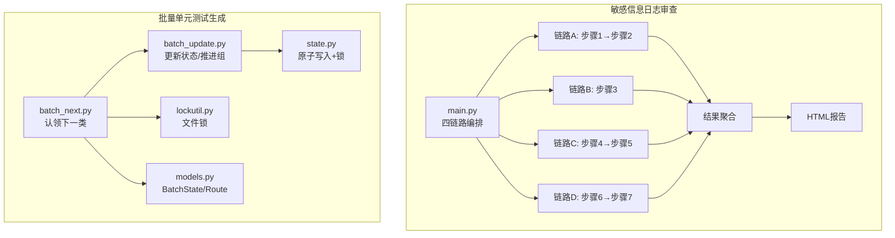
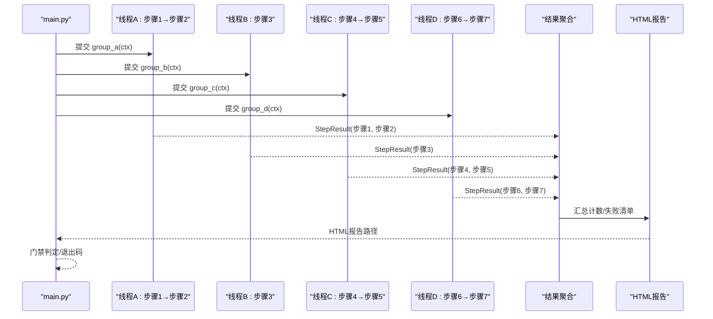
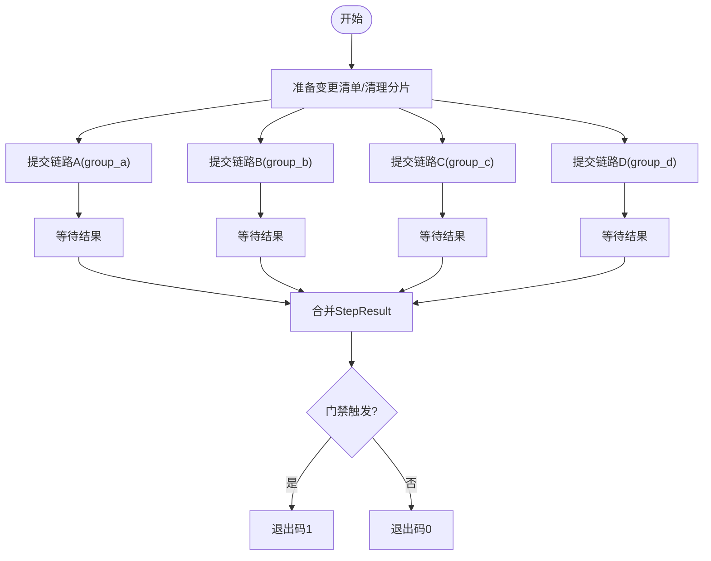
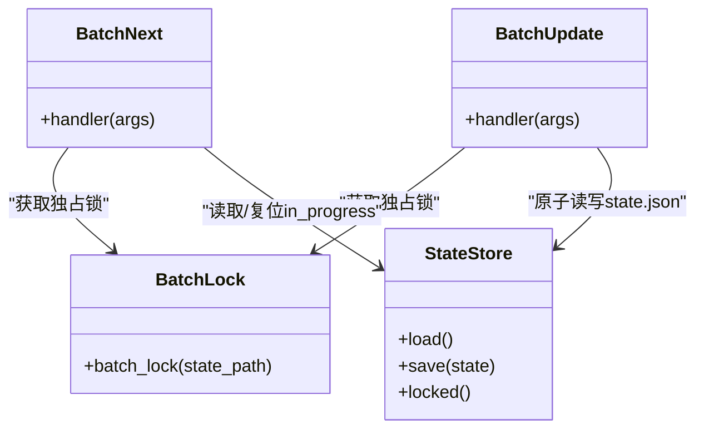
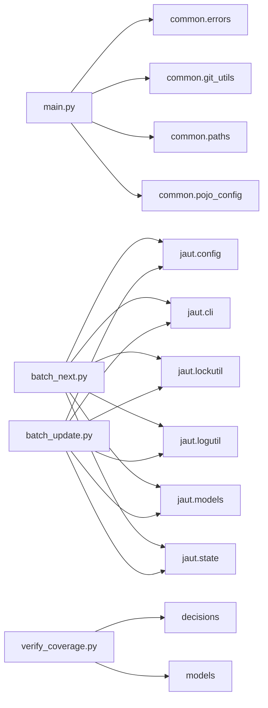

# 并行处理引擎

<cite>
**本文引用的文件**
- [sensitive-log-review/scripts/main.py](file://sensitive-log-review/scripts/main.py)
- [batch-unit-test-generator/scripts/batch_next.py](file://batch-unit-test-generator/scripts/batch_next.py)
- [batch-unit-test-generator/scripts/batch_update.py](file://batch-unit-test-generator/scripts/batch_update.py)
- [batch-unit-test-generator/scripts/jaut/lockutil.py](file://batch-unit-test-generator/scripts/jaut/lockutil.py)
- [java-unit-test-generator/scripts/jaut/state.py](file://java-unit-test-generator/scripts/jaut/state.py)
- [batch-unit-test-generator/scripts/jaut/models.py](file://batch-unit-test-generator/scripts/jaut/models.py)
- [java-unit-test-generator/scripts/verify_coverage.py](file://java-unit-test-generator/scripts/verify_coverage.py)
- [batch-unit-test-generator/tests/test_batch.py](file://batch-unit-test-generator/tests/test_batch.py)
- [sensitive-log-review/tests/test_errors.py](file://sensitive-log-review/tests/test_errors.py)
</cite>

## 目录
1. [简介](#简介)
2. [项目结构](#项目结构)
3. [核心组件](#核心组件)
4. [架构总览](#架构总览)
5. [详细组件分析](#详细组件分析)
6. [依赖关系分析](#依赖关系分析)
7. [性能考量](#性能考量)
8. [故障诊断指南](#故障诊断指南)
9. [结论](#结论)
10. [附录](#附录)

## 简介
本仓库包含四个独立的“技能”工程，其中敏感信息日志审查与批量单元测试生成两个工程实现了完整的并行处理引擎。本文聚焦于该四链路并行架构的设计原理、任务分发与执行调度、结果聚合机制、线程池管理策略（资源分配、负载均衡、故障恢复）、任务依赖与执行顺序控制、数据共享与同步机制（内存共享与文件锁）、性能优化策略（任务粒度调整与资源利用率优化），以及监控指标与故障诊断方法。

## 项目结构
- 敏感信息日志审查：以主脚本编排七步检查，拆分为四条并行链路，最终汇聚生成 HTML 报告并输出门禁结果。
- 批量单元测试生成：通过 batch_init → batch_next → 子代理迭代 → batch_update → batch_finish 的批处理流水线，结合文件锁与状态机实现多类并发委派与断点续跑。

**图表来源**
- [sensitive-log-review/scripts/main.py:276-298](file://sensitive-log-review/scripts/main.py#L276-L298)
- [batch-unit-test-generator/scripts/batch_next.py:53-87](file://batch-unit-test-generator/scripts/batch_next.py#L53-L87)
- [batch-unit-test-generator/scripts/batch_update.py:107-148](file://batch-unit-test-generator/scripts/batch_update.py#L107-L148)
- [batch-unit-test-generator/scripts/jaut/lockutil.py:34-55](file://batch-unit-test-generator/scripts/jaut/lockutil.py#L34-L55)
- [java-unit-test-generator/scripts/jaut/state.py:93-128](file://java-unit-test-generator/scripts/jaut/state.py#L93-L128)
- [batch-unit-test-generator/scripts/jaut/models.py:43-75](file://batch-unit-test-generator/scripts/jaut/models.py#L43-L75)

**章节来源**
- [sensitive-log-review/scripts/main.py:1-22](file://sensitive-log-review/scripts/main.py#L1-L22)
- [batch-unit-test-generator/scripts/batch_next.py:1-22](file://batch-unit-test-generator/scripts/batch_next.py#L1-L22)

## 核心组件
- 四链路编排器：将七个检查步骤划分为四条独立链路，使用线程池并发执行，统一收集 StepResult 并汇总计数。
- 任务分组与依赖：链路内部存在顺序依赖（如步骤4完成后才能执行步骤5），链路之间相互独立可并行。
- 结果聚合与门禁：汇总各链路结果，计算门禁触发项，生成 HTML 报告，按退出码契约返回。
- 批量委派与状态机：batch_next 负责从 batch_state.json 中认领 pending/recheck 的类，标记 in_progress；batch_update 根据类内 state.json 判定完成或推进方法组；两者均受文件锁保护。
- 文件锁与原子写入：跨平台文件锁（POSIX fcntl / Windows msvcrt）确保并发安全；state.json 采用临时文件 + os.replace + fsync 的原子写入。

**章节来源**
- [sensitive-log-review/scripts/main.py:83-109](file://sensitive-log-review/scripts/main.py#L83-L109)
- [sensitive-log-review/scripts/main.py:276-298](file://sensitive-log-review/scripts/main.py#L276-L298)
- [sensitive-log-review/scripts/main.py:777-856](file://sensitive-log-review/scripts/main.py#L777-L856)
- [batch-unit-test-generator/scripts/batch_next.py:53-87](file://batch-unit-test-generator/scripts/batch_next.py#L53-L87)
- [batch-unit-test-generator/scripts/batch_update.py:107-148](file://batch-unit-test-generator/scripts/batch_update.py#L107-L148)
- [batch-unit-test-generator/scripts/jaut/lockutil.py:34-55](file://batch-unit-test-generator/scripts/jaut/lockutil.py#L34-L55)
- [java-unit-test-generator/scripts/jaut/state.py:93-128](file://java-unit-test-generator/scripts/jaut/state.py#L93-L128)

## 架构总览
四链路并行架构的核心思想是将相互独立的检查任务分配到不同线程，最大化利用 CPU 与 I/O 能力；同时通过明确的依赖边界保证正确性。

**图表来源**
- [sensitive-log-review/scripts/main.py:276-298](file://sensitive-log-review/scripts/main.py#L276-L298)
- [sensitive-log-review/scripts/main.py:777-856](file://sensitive-log-review/scripts/main.py#L777-L856)

## 详细组件分析

### 四链路并行与任务分发
- 链路A：步骤1（扫描日志输出）→ 步骤2（变更日志检查）。步骤1失败则短路返回。
- 链路B：步骤3（@ToString 注解检查）。
- 链路C：步骤4（提取Java字段）→ 步骤5（敏感词检查）。步骤4失败则短路返回。
- 链路D：步骤6（POJO注释检查）→ 步骤7（深度敏感性分析）。
- 使用 ThreadPoolExecutor(max_workers=4) 并发提交四个链路，收集 Future 结果并合并 StepResult。

**图表来源**
- [sensitive-log-review/scripts/main.py:276-298](file://sensitive-log-review/scripts/main.py#L276-L298)
- [sensitive-log-review/scripts/main.py:777-856](file://sensitive-log-review/scripts/main.py#L777-L856)

**章节来源**
- [sensitive-log-review/scripts/main.py:276-298](file://sensitive-log-review/scripts/main.py#L276-L298)
- [sensitive-log-review/scripts/main.py:777-856](file://sensitive-log-review/scripts/main.py#L777-L856)

### 执行调度与结果聚合
- 每个链路函数返回 StepResult 列表，聚合层按名称索引汇总计数，区分关键步骤与仅警告步骤。
- 失败文件分片合并后计入 failedFiles，超过阈值时醒目告警。
- HTML 报告尽力而为生成，即使失败也不影响整体流程继续。

**章节来源**
- [sensitive-log-review/scripts/main.py:800-856](file://sensitive-log-review/scripts/main.py#L800-L856)

### 线程池管理策略
- 资源分配：固定最大工作线程数为 4，匹配四链路数量，避免过度竞争。
- 负载均衡：链路间无共享状态，天然负载均衡；链路内部顺序依赖由函数内逻辑保证。
- 故障恢复：链路异常被捕获为 StepResult.fail，不影响其他链路；聚合层兜底未预期异常。

**章节来源**
- [sensitive-log-review/scripts/main.py:777-789](file://sensitive-log-review/scripts/main.py#L777-L789)

### 任务依赖与执行顺序控制
- 链路内依赖：步骤1→步骤2、步骤4→步骤5、步骤6→步骤7，通过函数顺序调用实现。
- 链路间依赖：无直接依赖，全部并行；最终聚合阶段才进行结果合并。
- 批量流水线依赖：batch_next 读取 batch_state.json 并锁定，选择 pending/recheck 的类；batch_update 根据类级 state.json 推进方法组或结束。

**章节来源**
- [sensitive-log-review/scripts/main.py:276-298](file://sensitive-log-review/scripts/main.py#L276-L298)
- [batch-unit-test-generator/scripts/batch_next.py:53-87](file://batch-unit-test-generator/scripts/batch_next.py#L53-L87)
- [batch-unit-test-generator/scripts/batch_update.py:107-148](file://batch-unit-test-generator/scripts/batch_update.py#L107-L148)

### 数据共享与同步机制
- 内存共享：StepResult 在聚合前不共享，聚合后以字典形式汇总计数。
- 文件锁管理：
  - batch_next/batch_update 使用 lockutil.batch_lock 对 batch_state.json 加独占锁，防止竞态。
  - state.py 提供 StateStore.locked 上下文管理器，保护 load→修改→save 的原子性。
- 原子写入：state.json 通过临时文件 + os.replace + fsync 保证一致性。

**图表来源**
- [batch-unit-test-generator/scripts/jaut/lockutil.py:34-55](file://batch-unit-test-generator/scripts/jaut/lockutil.py#L34-L55)
- [java-unit-test-generator/scripts/jaut/state.py:93-128](file://java-unit-test-generator/scripts/jaut/state.py#L93-L128)
- [batch-unit-test-generator/scripts/batch_next.py:53-87](file://batch-unit-test-generator/scripts/batch_next.py#L53-L87)
- [batch-unit-test-generator/scripts/batch_update.py:107-148](file://batch-unit-test-generator/scripts/batch_update.py#L107-L148)

**章节来源**
- [batch-unit-test-generator/scripts/jaut/lockutil.py:34-55](file://batch-unit-test-generator/scripts/jaut/lockutil.py#L34-L55)
- [java-unit-test-generator/scripts/jaut/state.py:93-128](file://java-unit-test-generator/scripts/jaut/state.py#L93-L128)

### 性能优化策略
- 任务粒度调整：
  - 四链路将细粒度检查组合成链路，减少线程切换开销。
  - 批量模式下支持大类检测方法组分批委派，降低单次任务复杂度。
- 资源利用率优化：
  - 固定线程数匹配链路数，避免上下文切换过多。
  - 变更模式（--changed-only）减少扫描范围，提升吞吐。
- 决策与预算控制：
  - 单方法与全局迭代预算限制，避免无限循环。
  - 连续无提升检测与接近门槛豁免，提高收敛效率。

**章节来源**
- [batch-unit-test-generator/references/diff-analysis.md:36-64](file://batch-unit-test-generator/references/diff-analysis.md#L36-L64)
- [java-unit-test-generator/scripts/verify_coverage.py:177-198](file://java-unit-test-generator/scripts/verify_coverage.py#L177-L198)
- [batch-unit-test-generator/scripts/jaut/decisions.py:221-239](file://batch-unit-test-generator/scripts/jaut/decisions.py#L221-L239)
- [batch-unit-test-generator/scripts/batch_update.py:251-263](file://batch-unit-test-generator/scripts/batch_update.py#L251-L263)

### 监控指标与故障诊断
- 监控指标：
  - 每步骤 summary 计数（violation/sensitive/unqualified/tostring 等）。
  - failedFiles 数量与占比告警。
  - 总耗时与门禁触发项。
- 故障诊断：
  - --doctor 模式逐项检查运行环境（Python/java/git/checkstyle jar/规则词典/输出目录）。
  - 结构化错误码与修复建议（E001-E007）。
  - 批量模式的升级原因推断（单方法上限、连续测试失败、覆盖率无提升）。

**章节来源**
- [sensitive-log-review/scripts/main.py:533-703](file://sensitive-log-review/scripts/main.py#L533-L703)
- [sensitive-log-review/tests/test_errors.py:1-27](file://sensitive-log-review/tests/test_errors.py#L1-L27)
- [batch-unit-test-generator/tests/test_batch.py:230-279](file://batch-unit-test-generator/tests/test_batch.py#L230-L279)

## 依赖关系分析
- main.py 依赖 common.* 模块进行工具化操作（字典、错误、Git、路径、POJO配置）。
- batch_next/batch_update 依赖 jaut.* 模块（config、cli、lockutil、logutil、models、state）。
- verify_coverage 依赖 decisions 与 models 进行覆盖率验证与决策路由。

**图表来源**
- [sensitive-log-review/scripts/main.py:24-75](file://sensitive-log-review/scripts/main.py#L24-L75)
- [batch-unit-test-generator/scripts/batch_next.py:24-42](file://batch-unit-test-generator/scripts/batch_next.py#L24-L42)
- [batch-unit-test-generator/scripts/batch_update.py:107-148](file://batch-unit-test-generator/scripts/batch_update.py#L107-L148)
- [java-unit-test-generator/scripts/verify_coverage.py:177-198](file://java-unit-test-generator/scripts/verify_coverage.py#L177-L198)

**章节来源**
- [sensitive-log-review/scripts/main.py:24-75](file://sensitive-log-review/scripts/main.py#L24-L75)
- [batch-unit-test-generator/scripts/batch_next.py:24-42](file://batch-unit-test-generator/scripts/batch_next.py#L24-L42)

## 性能考量
- 四链路并行将 I/O 密集型检查（日志扫描、文件读取）与 CPU 密集型检查（敏感词匹配、深度分析）混合，充分利用多核。
- 变更模式减少扫描范围，显著降低 I/O 压力。
- 批量模式的方法组分批委派避免单次任务过大导致超时或内存压力。
- 文件锁粒度最小化，仅在状态读写临界区加锁，减少阻塞。

[本节为通用性能讨论，不直接分析具体文件]

## 故障诊断指南
- 运行环境诊断：--doctor 模式检查 Python/java/git/checkstyle jar/规则词典/输出目录可写性。
- 结构化错误：统一错误码与修复建议，便于快速定位问题。
- 批量模式升级：当单方法预算耗尽、连续测试失败或覆盖率无提升时，自动推断升级原因并提示用户决策。
- 失败文件统计：failedFiles 超过已处理文件总数 10% 时醒目告警，引导排查。

**章节来源**
- [sensitive-log-review/scripts/main.py:533-703](file://sensitive-log-review/scripts/main.py#L533-L703)
- [sensitive-log-review/tests/test_errors.py:1-27](file://sensitive-log-review/tests/test_errors.py#L1-L27)
- [batch-unit-test-generator/tests/test_batch.py:230-279](file://batch-unit-test-generator/tests/test_batch.py#L230-L279)

## 结论
本并行处理引擎通过四链路并行架构实现了高效的任务分发与执行调度，结合文件锁与原子写入保证了并发安全。批量流水线通过状态机与文件锁实现了可靠的委派与断点续跑。性能方面通过任务粒度调整与资源利用率优化达到目标全流程 <60s。监控与诊断机制提供了完善的可观测性与故障恢复能力。

[本节为总结，不直接分析具体文件]

## 附录
- 退出码契约：
  - 敏感信息日志审查：0=通过，1=触发门禁，2=执行错误。
  - 批量单元测试生成：NEXT_STEP 协议 exit_code 0=完成，1=继续，2=脚本错误，3=状态/协议错误。
- 关键路径参考：
  - 四链路并行入口：[sensitive-log-review/scripts/main.py:777-789](file://sensitive-log-review/scripts/main.py#L777-L789)
  - 批量认领入口：[batch-unit-test-generator/scripts/batch_next.py:53-87](file://batch-unit-test-generator/scripts/batch_next.py#L53-L87)
  - 批量更新入口：[batch-unit-test-generator/scripts/batch_update.py:107-148](file://batch-unit-test-generator/scripts/batch_update.py#L107-L148)

[本节为附录，不直接分析具体文件]