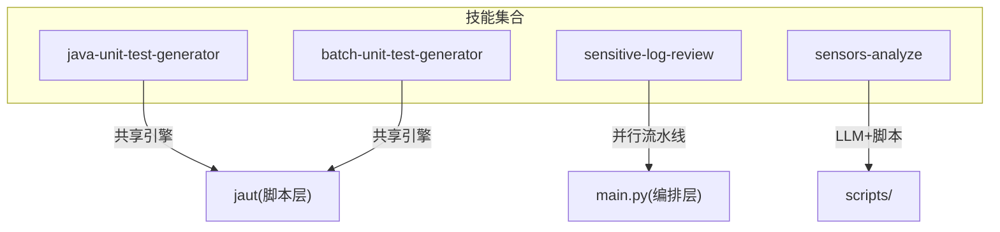
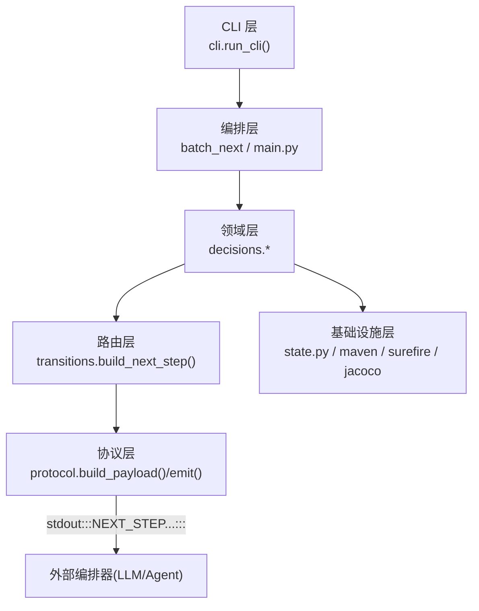
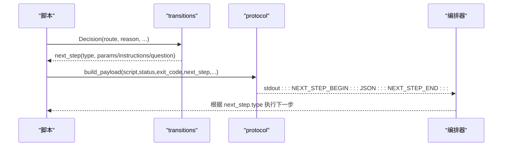
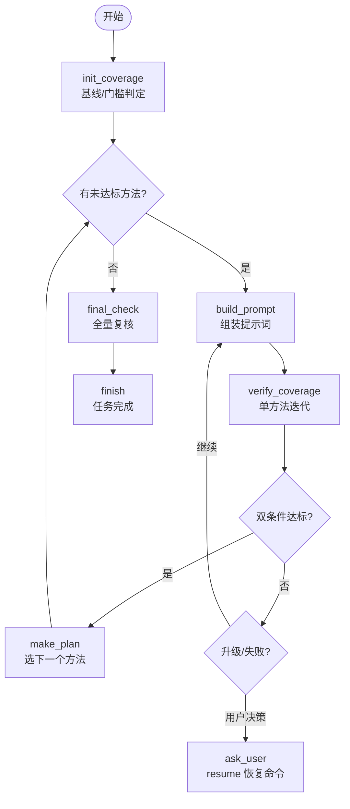
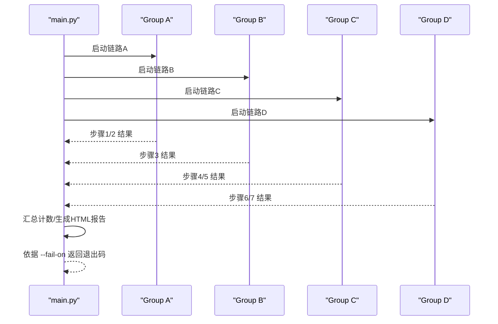
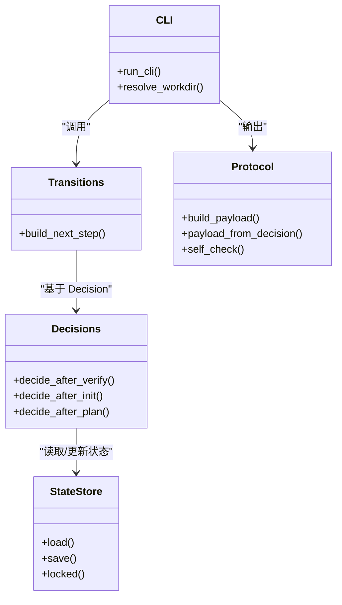
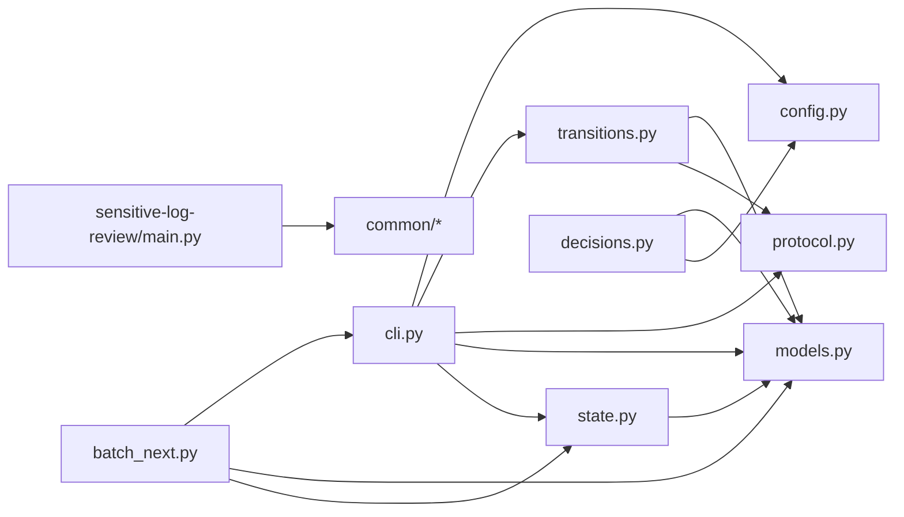

# 架构概览

<cite>
**本文引用的文件**
- [README.md](file://README.md)
- [AGENTS.md](file://AGENTS.md)
- [CLAUDE.md](file://CLAUDE.md)
- [batch-unit-test-generator/protocol/next-step.schema.json](file://batch-unit-test-generator/protocol/next-step.schema.json)
- [batch-unit-test-generator/protocol/state.schema.json](file://batch-unit-test-generator/protocol/state.schema.json)
- [java-unit-test-generator/scripts/jaut/config.py](file://java-unit-test-generator/scripts/jaut/config.py)
- [java-unit-test-generator/scripts/jaut/models.py](file://java-unit-test-generator/scripts/jaut/models.py)
- [java-unit-test-generator/scripts/jaut/transitions.py](file://java-unit-test-generator/scripts/jaut/transitions.py)
- [java-unit-test-generator/scripts/jaut/protocol.py](file://java-unit-test-generator/scripts/jaut/protocol.py)
- [java-unit-test-generator/scripts/jaut/state.py](file://java-unit-test-generator/scripts/jaut/state.py)
- [java-unit-test-generator/scripts/jaut/cli.py](file://java-unit-test-generator/scripts/jaut/cli.py)
- [java-unit-test-generator/scripts/jaut/decisions.py](file://java-unit-test-generator/scripts/jaut/decisions.py)
- [batch-unit-test-generator/scripts/batch_next.py](file://batch-unit-test-generator/scripts/batch_next.py)
- [sensitive-log-review/scripts/main.py](file://sensitive-log-review/scripts/main.py)
</cite>

## 目录
1. [简介](#简介)
2. [项目结构](#项目结构)
3. [核心组件](#核心组件)
4. [架构总览](#架构总览)
5. [详细组件分析](#详细组件分析)
6. [依赖关系分析](#依赖关系分析)
7. [性能考量](#性能考量)
8. [故障排查指南](#故障排查指南)
9. [结论](#结论)
10. [附录](#附录)

## 简介
本仓库包含四个独立的“技能”（skills），每个技能可安装到目标项目中独立运行。其中，单元测试生成类技能（java-unit-test-generator、batch-unit-test-generator）采用分层架构与事件驱动模式，通过 NEXT_STEP 协议在脚本与编排器（LLM/Agent）之间进行强契约通信；敏感日志审查技能（sensitive-log-review）采用多链路并行流水线；埋点分析技能（sensors-analyze）提供 LLM/Python 混合流水线。本文聚焦整体架构、NEXT_STEP 协议、状态机与并行处理引擎，并给出扩展点与插件机制说明。

**章节来源**
- [AGENTS.md:5-14](file://AGENTS.md#L5-L14)
- [CLAUDE.md:5-14](file://CLAUDE.md#L5-L14)

## 项目结构
- 顶层按“技能”划分：java-unit-test-generator、batch-unit-test-generator、sensitive-log-review、sensors-analyze。
- 每个技能内部遵循统一约定：SKILL.md（触发与工作流）、references/（规则与参考）、protocol/（JSON Schema 契约）、scripts/（Python 驱动）、tests/（pytest）。
- 单元测试类技能共享 jaut 引擎（两套副本已分化），负责 CLI 脚手架、状态存储、决策路由、协议封装、Maven/Surefire/JaCoCo 集成等。

**图表来源**
- [AGENTS.md:5-14](file://AGENTS.md#L5-L14)
- [CLAUDE.md:5-14](file://CLAUDE.md#L5-L14)

**章节来源**
- [AGENTS.md:5-14](file://AGENTS.md#L5-L14)
- [CLAUDE.md:5-14](file://CLAUDE.md#L5-L14)

## 核心组件
- CLI 层：统一入口与错误收敛，解析参数、初始化日志、异常转协议块、输出 EXIT_CODE。
- 编排层：工作流调度（如 batch_next 认领类、sensitive-log-review 四链路并行）。
- 领域层：纯函数决策（覆盖率/测试收敛判定、升级策略、方法队列推进）。
- 基础设施层：状态持久化（state.json 原子写入）、Maven/Surefire/JaCoCo 执行、Git worktree、报告渲染。
- 协议层：NEXT_STEP 协议负载构建、自检、stdout 标记块输出；Schema 约束 next_step.type/status/字段。

**章节来源**
- [java-unit-test-generator/scripts/jaut/cli.py:1-129](file://java-unit-test-generator/scripts/jaut/cli.py#L1-L129)
- [java-unit-test-generator/scripts/jaut/protocol.py:1-71](file://java-unit-test-generator/scripts/jaut/protocol.py#L1-L71)
- [batch-unit-test-generator/protocol/next-step.schema.json:1-195](file://batch-unit-test-generator/protocol/next-step.schema.json#L1-L195)
- [java-unit-test-generator/scripts/jaut/state.py:1-165](file://java-unit-test-generator/scripts/jaut/state.py#L1-L165)
- [java-unit-test-generator/scripts/jaut/decisions.py:1-610](file://java-unit-test-generator/scripts/jaut/decisions.py#L1-L610)
- [batch-unit-test-generator/scripts/batch_next.py:1-178](file://batch-unit-test-generator/scripts/batch_next.py#L1-L178)
- [sensitive-log-review/scripts/main.py:1-800](file://sensitive-log-review/scripts/main.py#L1-L800)

## 架构总览
系统采用分层 + 事件驱动：
- 分层：CLI 层 → 编排层 → 领域层 → 基础设施层，职责清晰、耦合低。
- 事件驱动：以 NEXT_STEP 协议为事件总线，脚本产出结构化 next_step，编排器据此驱动下一步动作（run_script/write_code/ask_user/finish）。
- 状态机：State 记录进度、覆盖率轨迹、预算计数；Decision 表达当前步骤的“逻辑路由”，transitions 将其映射为具体 next_step。

**图表来源**
- [java-unit-test-generator/scripts/jaut/cli.py:95-129](file://java-unit-test-generator/scripts/jaut/cli.py#L95-L129)
- [java-unit-test-generator/scripts/jaut/transitions.py:41-68](file://java-unit-test-generator/scripts/jaut/transitions.py#L41-L68)
- [java-unit-test-generator/scripts/jaut/protocol.py:28-71](file://java-unit-test-generator/scripts/jaut/protocol.py#L28-L71)
- [batch-unit-test-generator/scripts/batch_next.py:53-159](file://batch-unit-test-generator/scripts/batch_next.py#L53-L159)
- [sensitive-log-review/scripts/main.py:777-786](file://sensitive-log-review/scripts/main.py#L777-L786)

## 详细组件分析

### NEXT_STEP 协议设计与实现
- 协议负载：包含 protocol_version、script、status、exit_code、summary、artifacts、metrics、next_step。
- next_step.type：run_script/write_code/ask_user/finish，不同 type 携带不同必填字段（如 write_code 需 instructions 与 on_complete）。
- 退出码：0=完成，1=继续，2=脚本错误，3=状态/协议错误。
- 校验：运行时轻量自检（必填键与枚举），Schema 权威；冲突时优先级：Schema > references/UnitTestRules.md > SKILL.md > LLM 判断。

**图表来源**
- [batch-unit-test-generator/protocol/next-step.schema.json:1-195](file://batch-unit-test-generator/protocol/next-step.schema.json#L1-L195)
- [java-unit-test-generator/scripts/jaut/transitions.py:41-68](file://java-unit-test-generator/scripts/jaut/transitions.py#L41-L68)
- [java-unit-test-generator/scripts/jaut/protocol.py:28-71](file://java-unit-test-generator/scripts/jaut/protocol.py#L28-L71)

**章节来源**
- [batch-unit-test-generator/protocol/next-step.schema.json:1-195](file://batch-unit-test-generator/protocol/next-step.schema.json#L1-L195)
- [java-unit-test-generator/scripts/jaut/protocol.py:1-71](file://java-unit-test-generator/scripts/jaut/protocol.py#L1-L71)
- [CLAUDE.md:38-47](file://CLAUDE.md#L38-L47)

### 状态机与工作流管理
- State：断点续跑状态文档，包含项目根、阈值、目标类/方法、覆盖率轨迹、迭代轮次、全局轮次、终验标志等。
- StateStore：原子写入（临时文件 + os.replace + fsync），跨进程锁保护 load→修改→save；支持 schema 迁移。
- 状态流转：init_coverage → make_plan → build_prompt → verify_coverage → final_check → finish；批量场景由 batch_next 认领类后进入类内循环。

**图表来源**
- [java-unit-test-generator/scripts/jaut/state.py:77-165](file://java-unit-test-generator/scripts/jaut/state.py#L77-L165)
- [java-unit-test-generator/scripts/jaut/decisions.py:583-610](file://java-unit-test-generator/scripts/jaut/decisions.py#L583-L610)
- [java-unit-test-generator/scripts/jaut/decisions.py:178-267](file://java-unit-test-generator/scripts/jaut/decisions.py#L178-L267)
- [batch-unit-test-generator/scripts/batch_next.py:53-159](file://batch-unit-test-generator/scripts/batch_next.py#L53-L159)

**章节来源**
- [batch-unit-test-generator/protocol/state.schema.json:1-161](file://batch-unit-test-generator/protocol/state.schema.json#L1-L161)
- [java-unit-test-generator/scripts/jaut/state.py:1-165](file://java-unit-test-generator/scripts/jaut/state.py#L1-L165)
- [java-unit-test-generator/scripts/jaut/decisions.py:178-267](file://java-unit-test-generator/scripts/jaut/decisions.py#L178-L267)
- [java-unit-test-generator/scripts/jaut/decisions.py:583-610](file://java-unit-test-generator/scripts/jaut/decisions.py#L583-L610)

### 并行处理引擎（敏感日志审查）
- 四链路并行：A/B/C/D 组分别执行扫描、注解检查、字段提取与敏感词检查、POJO 注释与深度分析。
- 汇总与门禁：合并各步骤结果，统计计数项，生成 HTML 报告；依据 --fail-on 决定退出码。
- 环境诊断：--doctor 模式仅检查环境与依赖，不执行审查。

**图表来源**
- [sensitive-log-review/scripts/main.py:777-800](file://sensitive-log-review/scripts/main.py#L777-L800)
- [sensitive-log-review/scripts/main.py:276-298](file://sensitive-log-review/scripts/main.py#L276-L298)

**章节来源**
- [sensitive-log-review/scripts/main.py:1-800](file://sensitive-log-review/scripts/main.py#L1-L800)

### 组件交互与职责划分
- CLI 层：统一参数解析、日志初始化、异常转协议块、调用 transitions 与 protocol 输出。
- 编排层：batch_next 认领类并委派子代理；sensitive-log-review 编排多链路。
- 领域层：decisions.* 纯函数决策（无 I/O），输出 Decision；transitions 将 route 解析为 next_step。
- 基础设施层：state.py 原子读写 state.json；maven/surefire/jacoco 集成；worktree 管理；报告渲染。

**图表来源**
- [java-unit-test-generator/scripts/jaut/cli.py:95-129](file://java-unit-test-generator/scripts/jaut/cli.py#L95-L129)
- [java-unit-test-generator/scripts/jaut/transitions.py:41-68](file://java-unit-test-generator/scripts/jaut/transitions.py#L41-L68)
- [java-unit-test-generator/scripts/jaut/protocol.py:28-71](file://java-unit-test-generator/scripts/jaut/protocol.py#L28-L71)
- [java-unit-test-generator/scripts/jaut/decisions.py:178-267](file://java-unit-test-generator/scripts/jaut/decisions.py#L178-L267)
- [java-unit-test-generator/scripts/jaut/state.py:77-165](file://java-unit-test-generator/scripts/jaut/state.py#L77-L165)

**章节来源**
- [java-unit-test-generator/scripts/jaut/cli.py:1-129](file://java-unit-test-generator/scripts/jaut/cli.py#L1-L129)
- [java-unit-test-generator/scripts/jaut/transitions.py:1-128](file://java-unit-test-generator/scripts/jaut/transitions.py#L1-L128)
- [java-unit-test-generator/scripts/jaut/protocol.py:1-71](file://java-unit-test-generator/scripts/jaut/protocol.py#L1-L71)
- [java-unit-test-generator/scripts/jaut/decisions.py:1-610](file://java-unit-test-generator/scripts/jaut/decisions.py#L1-L610)
- [java-unit-test-generator/scripts/jaut/state.py:1-165](file://java-unit-test-generator/scripts/jaut/state.py#L1-L165)

### 扩展点与插件机制
- 新增脚本：遵循 CLI 层规范，实现 add_arguments(handler) 与 handler(args) -> (Decision, EmitContext)，即可接入 NEXT_STEP 流程。
- 新增路由：在 transitions._ROUTE_SCRIPT 中注册新脚本名，并在 decisions 中定义 Route 分支。
- 新增规则/词典：在 sensitive-log-review 的 rules/ 与 dictionary/ 中添加配置，main.py 自动加载。
- 协议扩展：在 next-step.schema.json 中扩展 next_step 字段，保持向后兼容（additionalProperties 控制严格度）。

**章节来源**
- [java-unit-test-generator/scripts/jaut/transitions.py:18-29](file://java-unit-test-generator/scripts/jaut/transitions.py#L18-L29)
- [batch-unit-test-generator/protocol/next-step.schema.json:66-177](file://batch-unit-test-generator/protocol/next-step.schema.json#L66-L177)
- [sensitive-log-review/scripts/main.py:73-75](file://sensitive-log-review/scripts/main.py#L73-L75)

## 依赖关系分析
- CLI 依赖 config、protocol、transitions、models、state。
- decisions 依赖 models、config，纯函数无 I/O。
- transitions 依赖 models、protocol，集中解析 run_script 路径与参数。
- state 依赖 models、config，提供原子读写与迁移。
- batch_next 依赖 jaut.cli、jaut.models、jaut.lockutil、jaut.state。
- sensitive-log-review main 依赖 common.* 工具模块与子脚本。

**图表来源**
- [java-unit-test-generator/scripts/jaut/cli.py:1-129](file://java-unit-test-generator/scripts/jaut/cli.py#L1-L129)
- [java-unit-test-generator/scripts/jaut/decisions.py:1-610](file://java-unit-test-generator/scripts/jaut/decisions.py#L1-L610)
- [java-unit-test-generator/scripts/jaut/transitions.py:1-128](file://java-unit-test-generator/scripts/jaut/transitions.py#L1-L128)
- [java-unit-test-generator/scripts/jaut/state.py:1-165](file://java-unit-test-generator/scripts/jaut/state.py#L1-L165)
- [batch-unit-test-generator/scripts/batch_next.py:1-178](file://batch-unit-test-generator/scripts/batch_next.py#L1-L178)
- [sensitive-log-review/scripts/main.py:1-800](file://sensitive-log-review/scripts/main.py#L1-L800)

**章节来源**
- [java-unit-test-generator/scripts/jaut/config.py:1-172](file://java-unit-test-generator/scripts/jaut/config.py#L1-L172)
- [java-unit-test-generator/scripts/jaut/models.py:1-499](file://java-unit-test-generator/scripts/jaut/models.py#L1-L499)

## 性能考量
- 原子写入与锁：state.json 使用临时文件 + os.replace + fsync，配合 .lock 文件跨进程锁，避免并发写破坏。
- 超时与终止：Maven 执行支持超时与环境变量覆盖，两段式终止（SIGTERM 宽限后 SIGKILL）。
- 并行流水线：敏感日志审查采用 ThreadPoolExecutor 四链路并行，缩短端到端耗时。
- 增量与缓存：JaCoCo 配置探测缓存、coverage/test_history 轨迹用于升级判定，减少重复计算。

**章节来源**
- [java-unit-test-generator/scripts/jaut/state.py:93-129](file://java-unit-test-generator/scripts/jaut/state.py#L93-L129)
- [java-unit-test-generator/scripts/jaut/config.py:104-131](file://java-unit-test-generator/scripts/jaut/config.py#L104-L131)
- [sensitive-log-review/scripts/main.py:777-786](file://sensitive-log-review/scripts/main.py#L777-L786)

## 故障排查指南
- 协议错误：检查 next-step.schema.json 必填字段与枚举值；确认 status 与 next_step.type 合法。
- 状态缺失：确保 --workdir 或 --project-root 正确传入；state.json 存在且可读。
- Maven 失败：查看 mvn.log 与 surefire 报告；确认 -Dtest 匹配测试类；必要时清理报告目录重试。
- 并行链路失败：检查子脚本返回值与 SUMMARY 计数；使用 --doctor 验证环境与依赖。
- 升级卡死：关注连续失败/无提升阈值；通过 ask_user resume 选项追加预算或调整门槛。

**章节来源**
- [batch-unit-test-generator/protocol/next-step.schema.json:1-195](file://batch-unit-test-generator/protocol/next-step.schema.json#L1-L195)
- [java-unit-test-generator/scripts/jaut/cli.py:25-46](file://java-unit-test-generator/scripts/jaut/cli.py#L25-L46)
- [sensitive-log-review/scripts/main.py:582-702](file://sensitive-log-review/scripts/main.py#L582-L702)

## 结论
ping-skills 通过分层架构与 NEXT_STEP 协议实现了脚本与编排器的解耦协作；状态机保障断点续跑与可观测性；并行流水线提升吞吐；扩展点设计使新增脚本与规则易于集成。建议在后续演进中持续完善 Schema 版本迁移、监控指标与可观测性能力。

## 附录
- 典型工作流：select_worktree → init_coverage → make_plan → build_prompt → verify_coverage → final_check → finish。
- 批量工作流：batch_diff → batch_init → batch_next → batch_update → batch_finish。
- 退出码契约：0=完成，1=继续，2=脚本错误，3=状态/协议错误。

**章节来源**
- [CLAUDE.md:38-47](file://CLAUDE.md#L38-L47)
- [AGENTS.md:41-45](file://AGENTS.md#L41-L45)