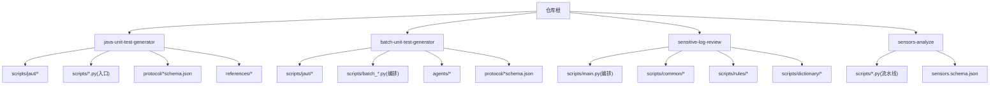
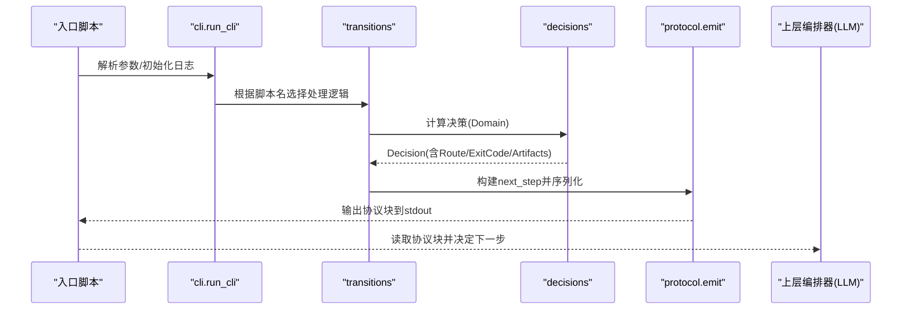
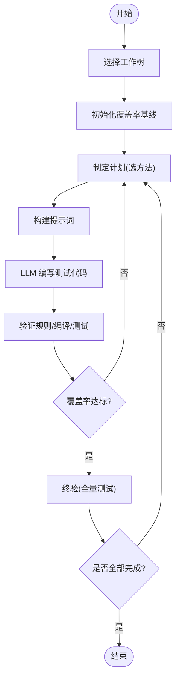
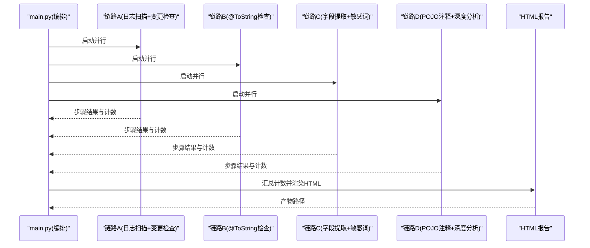
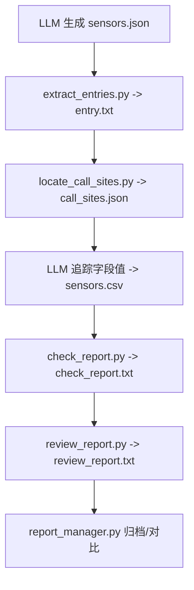
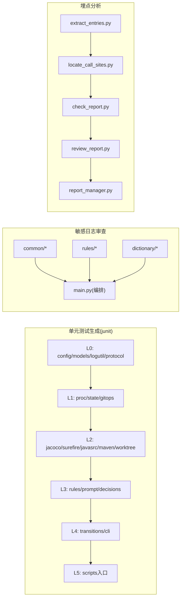
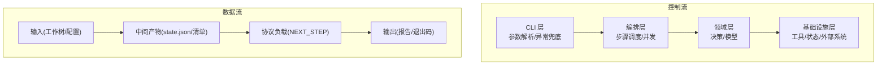

# 模块化架构设计

<cite>
**本文引用的文件**
- [README.md](file://README.md)
- [AGENTS.md](file://AGENTS.md)
- [CLAUDE.md](file://CLAUDE.md)
- [java-unit-test-generator/SKILL.md](file://java-unit-test-generator/SKILL.md)
- [batch-unit-test-generator/SKILL.md](file://batch-unit-test-generator/SKILL.md)
- [sensitive-log-review/SKILL.md](file://sensitive-log-review/SKILL.md)
- [sensors-analyze/CLAUDE.md](file://sensors-analyze/CLAUDE.md)
- [java-unit-test-generator/scripts/jaut/models.py](file://java-unit-test-generator/scripts/jaut/models.py)
- [java-unit-test-generator/scripts/jaut/cli.py](file://java-unit-test-generator/scripts/jaut/cli.py)
- [java-unit-test-generator/scripts/jaut/protocol.py](file://java-unit-test-generator/scripts/jaut/protocol.py)
- [java-unit-test-generator/scripts/jaut/maven.py](file://java-unit-test-generator/scripts/jaut/maven.py)
- [java-unit-test-generator/scripts/init_coverage.py](file://java-unit-test-generator/scripts/init_coverage.py)
- [batch-unit-test-generator/scripts/jaut/__init__.py](file://batch-unit-test-generator/scripts/jaut/__init__.py)
- [batch-unit-test-generator/scripts/jaut/cli.py](file://batch-unit-test-generator/scripts/jaut/cli.py)
- [batch-unit-test-generator/scripts/batch_diff.py](file://batch-unit-test-generator/scripts/batch_diff.py)
- [sensitive-log-review/scripts/main.py](file://sensitive-log-review/scripts/main.py)
- [sensors-analyze/scripts/extract_entries.py](file://sensors-analyze/scripts/extract_entries.py)
</cite>

## 目录
1. [引言](#引言)
2. [项目结构](#项目结构)
3. [核心组件](#核心组件)
4. [架构总览](#架构总览)
5. [详细组件分析](#详细组件分析)
6. [依赖关系分析](#依赖关系分析)
7. [性能考量](#性能考量)
8. [故障排查指南](#故障排查指南)
9. [结论](#结论)
10. [附录](#附录)

## 引言
本仓库包含四个相互独立的“技能模块”（Agent Skills），每个模块以“可插拔、自包含”的方式被安装到目标项目中，通过脚本驱动与 LLM 协作完成特定任务。整体采用分层与协议化设计：CLI 层负责参数解析与统一入口；编排层组织步骤与并发；领域层封装业务决策与模型；基础设施层提供工具调用、状态持久化与外部系统交互。各模块之间通过明确的协议（如 NEXT_STEP）和退出码契约进行通信，确保可组合、可观测、可恢复。

## 项目结构
仓库按“技能”划分顶层目录，每个技能内部遵循一致的组织方式：SKILL.md（触发与工作流）、references/（规则与参考）、protocol/（协议 Schema）、scripts/（Python 驱动脚本）、tests/（pytest 用例）。两个单元测试生成技能共享同一套 jaut 引擎的副本（已分化），敏感日志审查技能采用多链路并行编排，埋点分析技能采用 LLM+脚本的确定性流水线。

**图表来源**
- [AGENTS.md:5-14](file://AGENTS.md#L5-L14)
- [CLAUDE.md:36-64](file://CLAUDE.md#L36-L64)

**章节来源**
- [AGENTS.md:5-14](file://AGENTS.md#L5-L14)
- [CLAUDE.md:36-64](file://CLAUDE.md#L36-L64)

## 核心组件
- CLI 脚手架：统一参数解析、日志初始化、异常到协议块的转换、Decision->next_step->emit->exit_code 流程。
- 领域模型：类型化的数据类（覆盖率、方法/类统计、测试结果、决策产物、状态持久化）。
- 协议层：NEXT_STEP 负载构建、自检与 stdout 输出，作为脚本与编排器之间的唯一契约。
- 编排层：将多个子脚本或步骤按依赖关系串行/并行执行，汇总计数并生成报告。
- 基础设施层：Maven/JaCoCo/Surefire 集成、Git 工作树管理、进程运行、状态文件原子写入等。

**章节来源**
- [java-unit-test-generator/scripts/jaut/cli.py:1-30](file://java-unit-test-generator/scripts/jaut/cli.py#L1-L30)
- [java-unit-test-generator/scripts/jaut/models.py:1-499](file://java-unit-test-generator/scripts/jaut/models.py#L1-L499)
- [java-unit-test-generator/scripts/jaut/protocol.py:1-105](file://java-unit-test-generator/scripts/jaut/protocol.py#L1-L105)
- [sensitive-log-review/scripts/main.py:1-800](file://sensitive-log-review/scripts/main.py#L1-L800)

## 架构总览
下图展示了“单元测试生成技能”的分层与数据流：入口脚本委托 cli.run_cli，进入 transitions 路由，调用 decisions 产出 Decision，再由 protocol 组装为 NEXT_STEP 负载并通过 stdout 输出给上层编排器（LLM/主流程）。

**图表来源**
- [java-unit-test-generator/scripts/jaut/cli.py:1-30](file://java-unit-test-generator/scripts/jaut/cli.py#L1-L30)
- [java-unit-test-generator/scripts/jaut/protocol.py:28-105](file://java-unit-test-generator/scripts/jaut/protocol.py#L28-L105)
- [java-unit-test-generator/scripts/jaut/models.py:309-342](file://java-unit-test-generator/scripts/jaut/models.py#L309-L342)

**章节来源**
- [java-unit-test-generator/scripts/jaut/cli.py:1-30](file://java-unit-test-generator/scripts/jaut/cli.py#L1-L30)
- [java-unit-test-generator/scripts/jaut/protocol.py:1-105](file://java-unit-test-generator/scripts/jaut/protocol.py#L1-L105)
- [java-unit-test-generator/scripts/jaut/models.py:1-499](file://java-unit-test-generator/scripts/jaut/models.py#L1-L499)

## 详细组件分析

### 单元测试生成技能（单类/批量）
- 职责划分
  - CLI 层：统一入口、异常兜底、协议输出。
  - 领域层：覆盖率原语、方法/类覆盖、测试结果、决策产物、状态持久化。
  - 编排层：单类流程（select_worktree→init_coverage→make_plan→build_prompt→write_code→validate_rules→verify_coverage→final_check→finish）；批量流程（batch_diff→batch_init→batch_next→子代理迭代→batch_update→batch_finish）。
  - 基础设施层：Maven/JaCoCo/Surefire 集成、Git 工作树、进程运行、状态文件原子写。
- 关键机制
  - NEXT_STEP 协议：run_script/write_code/ask_user/finish，退出码 0/1/2/3。
  - 断点续跑：state.json 原子写，支持 resume。
  - 升级策略：连续失败/无提升/预算耗尽时 ask_user，批量模式自动继续。
  - 文件修改边界：仅允许修改 src/test/java/**。

**图表来源**
- [java-unit-test-generator/SKILL.md:11-23](file://java-unit-test-generator/SKILL.md#L11-L23)
- [java-unit-test-generator/scripts/jaut/models.py:347-499](file://java-unit-test-generator/scripts/jaut/models.py#L347-L499)

**章节来源**
- [java-unit-test-generator/SKILL.md:11-23](file://java-unit-test-generator/SKILL.md#L11-L23)
- [batch-unit-test-generator/SKILL.md:23-42](file://batch-unit-test-generator/SKILL.md#L23-L42)
- [java-unit-test-generator/scripts/jaut/models.py:1-499](file://java-unit-test-generator/scripts/jaut/models.py#L1-L499)

### 敏感信息日志审查技能
- 职责划分
  - 编排层：main.py 定义四链路并行（A/B/C/D），汇总计数，生成 HTML 报告。
  - 领域层：门禁类别、计数项、规则与词典加载。
  - 基础设施层：子脚本调用、Git 变更清单、Checkstyle 校验、输出目录策略。
- 关键机制
  - 退出码契约：0=通过，1=门禁命中，2=执行错误。
  - 并行链路：步骤1/2、步骤3、步骤4/5、步骤6/7 并行执行，最终汇合生成报告。
  - 环境诊断：--doctor 模式逐项检查运行环境与依赖。

**图表来源**
- [sensitive-log-review/scripts/main.py:1-800](file://sensitive-log-review/scripts/main.py#L1-L800)

**章节来源**
- [sensitive-log-review/SKILL.md:31-57](file://sensitive-log-review/SKILL.md#L31-L57)
- [sensitive-log-review/scripts/main.py:1-800](file://sensitive-log-review/scripts/main.py#L1-L800)

### 埋点分析技能（sensors-analyze）
- 职责划分
  - LLM 阶段：识别埋点范式，产出 sensors.json（需校验 schema）。
  - 脚本阶段：提取入口候选 entry.txt → 定位调用点 call_sites.json → LLM 追踪字段值 → 校验一致性 check_report.txt → 预审 review_report.txt → 归档 report_manager.py。
- 关键机制
  - 严格约束：只读目标代码库、CSV 中不允许动态占位符、entry.txt 需人工确认标记。
  - 输出规范：固定 CSV 列顺序、call_sites 条目结构、next_step 单行指令。

**图表来源**
- [sensors-analyze/CLAUDE.md:11-47](file://sensors-analyze/CLAUDE.md#L11-L47)
- [sensors-analyze/scripts/extract_entries.py:1-308](file://sensors-analyze/scripts/extract_entries.py#L1-L308)

**章节来源**
- [sensors-analyze/CLAUDE.md:11-47](file://sensors-analyze/CLAUDE.md#L11-L47)
- [sensors-analyze/scripts/extract_entries.py:1-308](file://sensors-analyze/scripts/extract_entries.py#L1-L308)

## 依赖关系分析
- 分层依赖（单向）：L0 基础(config, models, logutil, protocol) → L1 基础设施(proc, state, gitops) → L2 解析构建(jacoco, surefire, javasrc, maven, worktree) → L3 领域(rules, prompt, decisions) → L4 编排(transitions, cli) → L5 入口(scripts)。
- 模块间耦合：
  - 单元测试生成技能：jaut 引擎在两个技能中复制且已分化，需同步维护。
  - 敏感日志审查：common 包被所有子脚本复用，规则与词典集中管理。
  - 埋点分析：脚本间通过约定文件格式（entry.txt/call_sites.json/sensors.csv）解耦。

**图表来源**
- [java-unit-test-generator/scripts/jaut/__init__.py:1-22](file://java-unit-test-generator/scripts/jaut/__init__.py#L1-L22)
- [batch-unit-test-generator/scripts/jaut/__init__.py:1-22](file://batch-unit-test-generator/scripts/jaut/__init__.py#L1-L22)
- [sensitive-log-review/scripts/main.py:1-800](file://sensitive-log-review/scripts/main.py#L1-L800)
- [sensors-analyze/scripts/extract_entries.py:1-308](file://sensors-analyze/scripts/extract_entries.py#L1-L308)

**章节来源**
- [java-unit-test-generator/scripts/jaut/__init__.py:1-22](file://java-unit-test-generator/scripts/jaut/__init__.py#L1-L22)
- [batch-unit-test-generator/scripts/jaut/__init__.py:1-22](file://batch-unit-test-generator/scripts/jaut/__init__.py#L1-L22)

## 性能考量
- 单元测试生成
  - Maven 长时间执行：后台运行、进度轮询、超时保护；install 仅一次，verify 定向 mvn 不带 -am。
  - 覆盖率排除启发式：自动检测 Lombok/MapStruct 注解并排除生成类。
  - 大类拆分：方法组拆分与探索模式预算翻倍，减少单次委派压力。
- 敏感日志审查
  - 四链路并行：缩短端到端耗时；失败分片记录避免重复扫描。
  - 产物折叠展示：HTML 长列表默认折叠，降低渲染开销。
- 埋点分析
  - ripgrep 优先回退纯 Python grep，平衡速度与兼容性。
  - 审计模式独立扫描未覆盖函数与 SDK API 调用点，辅助补漏。

[本节为通用指导，不直接分析具体文件]

## 故障排查指南
- 单元测试生成
  - 协议块缺失：读取 <workdir>/logs/<script>.log 尾部与 summary，向用户报告错误并终止。
  - 退出码含义：0=完成，1=继续，2=脚本错误，3=状态/协议错误。
  - 常见错误：StepError（可预期错误，携带 Decision）、Exception（内部错误转 failed+ask_user）。
- 敏感日志审查
  - 退出码契约：0=通过，1=门禁命中，2=执行错误；--strict-mode 下失败文件以 2 结束。
  - 环境诊断：--doctor 逐项检查 Python/Java/Git/Checkstyle jar/规则与词典/输出目录。
- 埋点分析
  - 约束：禁止修改目标代码库；CSV 不允许动态占位符；entry.txt 需 # CONFIRMED 标记。
  - 输出：每脚本仅一行 next_step 指令到 stdout，其余日志到 --log。

**章节来源**
- [java-unit-test-generator/SKILL.md:25-37](file://java-unit-test-generator/SKILL.md#L25-L37)
- [java-unit-test-generator/scripts/jaut/cli.py:1-30](file://java-unit-test-generator/scripts/jaut/cli.py#L1-L30)
- [sensitive-log-review/SKILL.md:31-57](file://sensitive-log-review/SKILL.md#L31-L57)
- [sensors-analyze/CLAUDE.md:59-73](file://sensors-analyze/CLAUDE.md#L59-L73)

## 结论
ping-skills 通过清晰的层级划分、严格的协议与退出码契约、以及可插拔的技能组织方式，实现了高内聚、低耦合的模块化架构。单元测试生成技能以 jaut 引擎为核心，结合 NEXT_STEP 协议实现可中断、可恢复的迭代；敏感日志审查技能以并行编排与标准化产物提升效率与可观测性；埋点分析技能以 LLM+脚本的确定性流水线保障质量。该设计便于扩展新模块、集成现有模块，并提供完善的生命周期管理与错误处理策略。

[本节为总结，不直接分析具体文件]

## 附录

### 如何扩展新模块（示例：新增一个“代码规范检查”技能）
- 目录结构
  - 新建 skill 目录，包含 SKILL.md（触发与工作流）、references/（规则）、protocol/（可选协议 Schema）、scripts/（Python 驱动）、tests/（pytest）。
- 入口脚本
  - 实现 main(argv)->int，使用 argparse 解析参数，调用 run_cli 或直接编排子步骤。
- 协议与通信
  - 若需要与 LLM/编排器交互，遵循 NEXT_STEP 协议（protocol.py）输出负载；否则使用标准退出码与结构化日志。
- 领域与基础设施
  - 领域层：定义数据模型与决策函数（纯函数，不做 I/O）。
  - 基础设施层：封装外部工具调用（如 linter、git diff、文件扫描）。
- 测试与文档
  - 编写 pytest 用例，覆盖正常路径与失败路径；更新 SKILL.md 与 README。

**章节来源**
- [AGENTS.md:16-28](file://AGENTS.md#L16-L28)
- [CLAUDE.md:36-64](file://CLAUDE.md#L36-L64)
- [java-unit-test-generator/scripts/jaut/protocol.py:1-105](file://java-unit-test-generator/scripts/jaut/protocol.py#L1-L105)

### 如何集成现有模块（示例：在 CI 中串联单元测试生成与敏感日志审查）
- 单元测试生成
  - 先执行 select_worktree→init_coverage→make_plan→build_prompt→write_code→validate_rules→verify_coverage→final_check→finish，依据 exit_code 判断继续或终止。
- 敏感日志审查
  - 执行 main.py --branch <target> -r <repo> -o <out>，依据 exit_code 决定是否阻断合并。
- 产物与报告
  - 单元测试生成：state.json、coverage/history、finish report。
  - 敏感日志审查：HTML 报告、中间清单文件、failed-files.list。

**章节来源**
- [java-unit-test-generator/SKILL.md:11-23](file://java-unit-test-generator/SKILL.md#L11-L23)
- [sensitive-log-review/SKILL.md:10-29](file://sensitive-log-review/SKILL.md#L10-L29)
- [sensitive-log-review/scripts/main.py:732-800](file://sensitive-log-review/scripts/main.py#L732-L800)

### 模块生命周期管理
- 初始化：选择工作树、安装依赖、建立基线（覆盖率/分支/产物目录）。
- 运行：按协议驱动步骤，记录状态与历史，支持断点续跑。
- 升级与恢复：预算耗尽/连续失败时 ask_user，批量模式自动继续；resume 命令恢复游标。
- 收尾：终验通过后生成报告，清理临时文件（谨慎操作，避免误删未合并代码）。

**章节来源**
- [java-unit-test-generator/SKILL.md:29-57](file://java-unit-test-generator/SKILL.md#L29-L57)
- [batch-unit-test-generator/SKILL.md:233-248](file://batch-unit-test-generator/SKILL.md#L233-L248)

### 架构图表（数据流向与控制流）

**图表来源**
- [java-unit-test-generator/scripts/jaut/cli.py:1-30](file://java-unit-test-generator/scripts/jaut/cli.py#L1-L30)
- [sensitive-log-review/scripts/main.py:1-800](file://sensitive-log-review/scripts/main.py#L1-L800)
- [java-unit-test-generator/scripts/jaut/protocol.py:28-105](file://java-unit-test-generator/scripts/jaut/protocol.py#L28-L105)