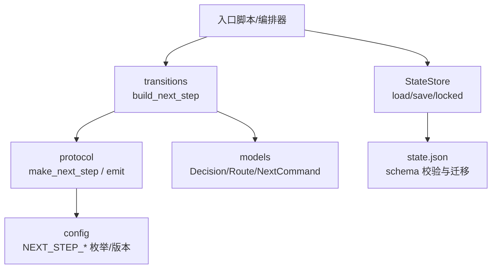
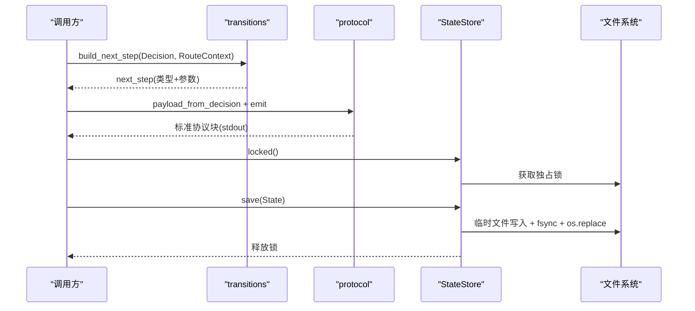
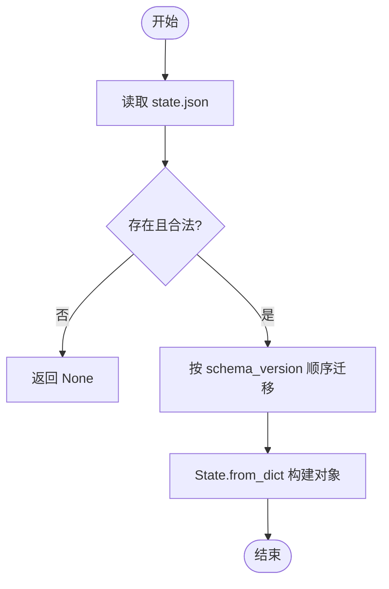
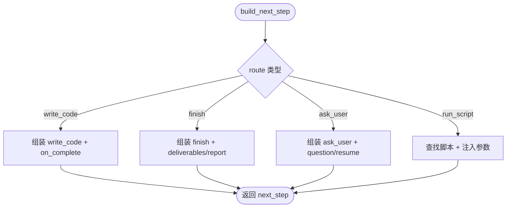
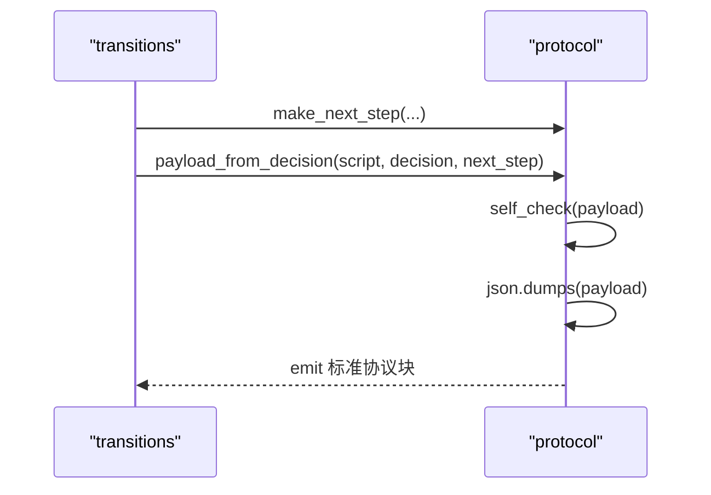
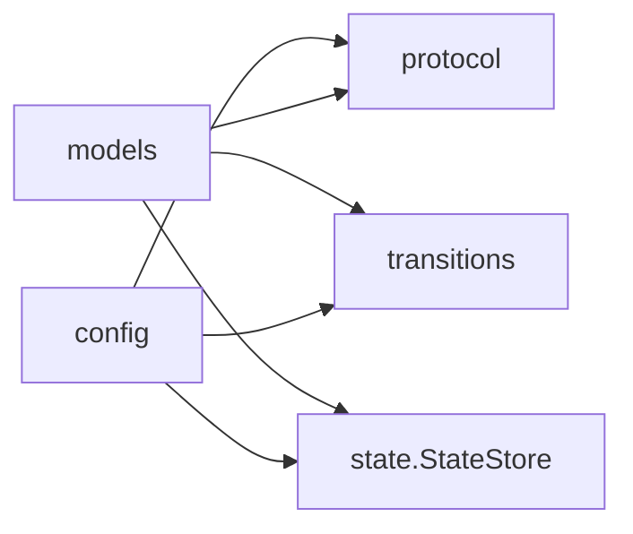

# 状态机模式实现

<cite>
**本文引用的文件**
- [state.py](file://java-unit-test-generator/scripts/jaut/state.py)
- [models.py](file://java-unit-test-generator/scripts/jaut/models.py)
- [transitions.py](file://java-unit-test-generator/scripts/jaut/transitions.py)
- [protocol.py](file://java-unit-test-generator/scripts/jaut/protocol.py)
- [config.py](file://java-unit-test-generator/scripts/jaut/config.py)
- [state.schema.json](file://java-unit-test-generator/protocol/state.schema.json)
- [test_transitions.py](file://java-unit-test-generator/tests/test_transitions.py)
</cite>

## 目录
1. [简介](#简介)
2. [项目结构](#项目结构)
3. [核心组件](#核心组件)
4. [架构总览](#架构总览)
5. [详细组件分析](#详细组件分析)
6. [依赖关系分析](#依赖关系分析)
7. [性能与并发特性](#性能与并发特性)
8. [故障排查指南](#故障排查指南)
9. [结论](#结论)
10. [附录：扩展与最佳实践](#附录：扩展与最佳实践)

## 简介
本技术文档围绕工作流中的“状态机模式”展开，聚焦于状态定义、转换规则、事件处理机制、持久化策略（序列化、恢复、并发安全）、验证与错误处理、扩展方法（新增状态与定制转换），以及监控调试工具的使用。该实现以声明式路由为核心，将决策结果映射为下一步动作，并通过原子化的状态存储保证断点续跑与多进程并发安全。

## 项目结构
- 状态模型与持久化
  - models.State：状态的数据结构与序列化/反序列化
  - state.StateStore：state.json 的原子读写、锁与迁移
- 工作流路由与转换
  - transitions.build_next_step：根据 Decision.route 生成 next_step
  - protocol：协议负载构建与输出
  - config：全局常量、枚举与阈值
- 测试与契约
  - tests/test_transitions.py：覆盖路由到 next_step 的转换行为
  - protocol/state.schema.json：state.json 的结构契约

图表来源
- [transitions.py:39-66](file://java-unit-test-generator/scripts/jaut/transitions.py#L39-L66)
- [protocol.py:22-43](file://java-unit-test-generator/scripts/jaut/protocol.py#L22-L43)
- [state.py:77-156](file://java-unit-test-generator/scripts/jaut/state.py#L77-L156)
- [models.py:347-499](file://java-unit-test-generator/scripts/jaut/models.py#L347-L499)
- [config.py:35-48](file://java-unit-test-generator/scripts/jaut/config.py#L35-L48)

章节来源
- [transitions.py:39-66](file://java-unit-test-generator/scripts/jaut/transitions.py#L39-L66)
- [protocol.py:22-43](file://java-unit-test-generator/scripts/jaut/protocol.py#L22-L43)
- [state.py:77-156](file://java-unit-test-generator/scripts/jaut/state.py#L77-L156)
- [models.py:347-499](file://java-unit-test-generator/scripts/jaut/models.py#L347-L499)
- [config.py:35-48](file://java-unit-test-generator/scripts/jaut/config.py#L35-L48)

## 核心组件
- 状态模型 State
  - 承载工作流进度、覆盖率轨迹、预算计数等；提供 to_dict/from_dict 用于持久化与恢复，兼容旧 schema 字段。
- 状态存储 StateStore
  - 原子写入 state.json（临时文件 + fsync + os.replace）
  - 跨进程独占锁（POSIX fcntl / Windows msvcrt），保护 load→修改→save 的原子性
  - schema 迁移管道，按顺序升级旧 state.json
- 路由与转换 transitions
  - 将 Decision.route 解析为具体 next_step（run_script/write_code/finish/ask_user）
  - 统一注入 --workdir 参数与脚本绝对路径，消除分散硬编码
- 协议 protocol
  - 构建 NEXT_STEP 负载并做轻量自检，最终通过 stdout 标记块输出
- 配置 config
  - 集中管理协议版本、状态枚举、退出码、阈值与预算等

章节来源
- [models.py:347-499](file://java-unit-test-generator/scripts/jaut/models.py#L347-L499)
- [state.py:77-156](file://java-unit-test-generator/scripts/jaut/state.py#L77-L156)
- [transitions.py:39-66](file://java-unit-test-generator/scripts/jaut/transitions.py#L39-L66)
- [protocol.py:22-43](file://java-unit-test-generator/scripts/jaut/protocol.py#L22-L43)
- [config.py:35-48](file://java-unit-test-generator/scripts/jaut/config.py#L35-L48)

## 架构总览
状态机由“决策 → 路由 → 协议 → 执行 → 状态更新”构成闭环。每个步骤产出标准化的 next_step，调用方据此驱动后续动作；状态变更通过 StateStore 原子落盘，确保中断后可恢复。

图表来源
- [transitions.py:39-66](file://java-unit-test-generator/scripts/jaut/transitions.py#L39-L66)
- [protocol.py:46-56](file://java-unit-test-generator/scripts/jaut/protocol.py#L46-L56)
- [protocol.py:74-105](file://java-unit-test-generator/scripts/jaut/protocol.py#L74-L105)
- [state.py:93-156](file://java-unit-test-generator/scripts/jaut/state.py#L93-L156)

## 详细组件分析

### 状态模型与持久化（State 与 StateStore）
- 数据结构
  - State 包含项目根、目标类/方法、覆盖率、迭代轮次、预算追加、历史轨迹、终验标志等；to_dict/from_dict 负责序列化与向后兼容。
- 持久化策略
  - 原子写入：先写 .tmp，再 fsync，最后 os.replace 替换，避免半截状态。
  - 并发安全：使用独立 .lock 文件进行独占锁（POSIX fcntl / Windows msvcrt），在上下文管理器中加解锁，异常时也能释放。
  - 迁移管道：_migrate 按 schema_version 顺序应用迁移函数，缺失迁移则抛出明确错误。
- 恢复机制
  - load 对缺失/损坏文件返回 None，由上层按“状态错误”流转；从 dict 构造时填充默认值，兼容旧版本 state.json。

图表来源
- [state.py:55-74](file://java-unit-test-generator/scripts/jaut/state.py#L55-L74)
- [state.py:130-145](file://java-unit-test-generator/scripts/jaut/state.py#L130-L145)
- [models.py:458-499](file://java-unit-test-generator/scripts/jaut/models.py#L458-L499)

章节来源
- [state.py:55-74](file://java-unit-test-generator/scripts/jaut/state.py#L55-L74)
- [state.py:93-156](file://java-unit-test-generator/scripts/jaut/state.py#L93-L156)
- [models.py:458-499](file://java-unit-test-generator/scripts/jaut/models.py#L458-L499)

### 工作流路由与转换（transitions）
- 路由类型
  - run_script：根据 Route 映射到 scripts 下的具体脚本，并注入 --workdir 等参数
  - write_code：携带 instructions 与 on_complete（默认 validate_rules.py）
  - finish：携带 deliverables 与可选 report
  - ask_user：携带 question 与 resume（用户选项恢复命令）
- 参数注入
  - _params_for 对 run_script 路由统一注入 --workdir，并对 FINAL_CHECK 补充 project-root/class/jacoco-version 等
  - _resolve_command/_resume_entries 补全脚本绝对路径与工作目录前缀
- 防御性校验
  - workdir 为空或非法时抛出 ValueError，防止无效参数传播

图表来源
- [transitions.py:39-66](file://java-unit-test-generator/scripts/jaut/transitions.py#L39-L66)
- [transitions.py:93-126](file://java-unit-test-generator/scripts/jaut/transitions.py#L93-L126)

章节来源
- [transitions.py:39-66](file://java-unit-test-generator/scripts/jaut/transitions.py#L39-L66)
- [transitions.py:93-126](file://java-unit-test-generator/scripts/jaut/transitions.py#L93-L126)

### 协议与输出（protocol）
- 负载构建
  - make_next_step 生成 next_step 字典；build_payload 统一字段顺序与缺省值；payload_from_decision 将 Decision 与 next_step 组合成完整负载
- 自检与输出
  - self_check 校验必填键与枚举取值，仅记录警告不阻断
  - emit 在 stdout 中以 BEGIN/END 标记包裹 JSON 块；序列化失败时降级输出错误协议块，避免调用方无限等待

图表来源
- [protocol.py:22-43](file://java-unit-test-generator/scripts/jaut/protocol.py#L22-L43)
- [protocol.py:46-56](file://java-unit-test-generator/scripts/jaut/protocol.py#L46-L56)
- [protocol.py:59-105](file://java-unit-test-generator/scripts/jaut/protocol.py#L59-L105)

章节来源
- [protocol.py:22-43](file://java-unit-test-generator/scripts/jaut/protocol.py#L22-L43)
- [protocol.py:46-56](file://java-unit-test-generator/scripts/jaut/protocol.py#L46-L56)
- [protocol.py:59-105](file://java-unit-test-generator/scripts/jaut/protocol.py#L59-L105)

### 配置与约束（config）
- 协议版本与枚举
  - NEXT_STEP_PROTOCOL_VERSION、NEXT_STEP_STATUSES、NEXT_STEP_TYPES 限定负载与 next_step.type 的取值范围
- 退出码约定
  - EXIT_OK/EXIT_CONTINUE/EXIT_ERROR/EXIT_STATE 规范脚本退出语义
- 阈值与预算
  - DEFAULT_THRESHOLD、METHOD_ROUND_BUDGET、GLOBAL_ROUND_BUDGET 等控制迭代与升级策略
- 路径与文件名
  - STATE_FILENAME、COVERAGE_FILENAME、WORKDIR_PARTS 等统一管理文件位置

章节来源
- [config.py:35-48](file://java-unit-test-generator/scripts/jaut/config.py#L35-L48)
- [config.py:51-79](file://java-unit-test-generator/scripts/jaut/config.py#L51-L79)
- [config.py:100-131](file://java-unit-test-generator/scripts/jaut/config.py#L100-L131)
- [config.py:162-172](file://java-unit-test-generator/scripts/jaut/config.py#L162-L172)

## 依赖关系分析
- 模块耦合
  - transitions 依赖 models（Decision/Route/NextCommand）与 protocol（make_next_step）
  - protocol 依赖 config（协议版本与枚举）
  - state 依赖 models（State）与 config（文件名/工作目录）
- 外部契约
  - state.schema.json 定义 state.json 的结构，from_dict 与之保持一致的兼容策略
- 潜在循环
  - 当前无直接循环依赖；transitions 与 protocol 单向依赖 models/config

图表来源
- [transitions.py:9-16](file://java-unit-test-generator/scripts/jaut/transitions.py#L9-L16)
- [protocol.py:10-15](file://java-unit-test-generator/scripts/jaut/protocol.py#L10-L15)
- [state.py:9-18](file://java-unit-test-generator/scripts/jaut/state.py#L9-L18)

章节来源
- [transitions.py:9-16](file://java-unit-test-generator/scripts/jaut/transitions.py#L9-L16)
- [protocol.py:10-15](file://java-unit-test-generator/scripts/jaut/protocol.py#L10-L15)
- [state.py:9-18](file://java-unit-test-generator/scripts/jaut/state.py#L9-L18)

## 性能与并发特性
- 原子写入
  - 临时文件 + fsync + os.replace 保证崩溃恢复后状态一致性
- 并发安全
  - 独立 .lock 文件 + 平台相关 flock/locking，确保多进程并发访问 state.json 的互斥
- 迁移开销
  - 迁移按版本顺序执行，单次迁移复杂度 O(N)，N 为版本差；建议保持迁移函数轻量
- I/O 优化
  - coverage.json 快照非原子写入，适用于只读快照场景；如需强一致可考虑与 state.json 同步原子化

[本节为通用指导，无需特定文件引用]

## 故障排查指南
- 状态文件缺失或损坏
  - StateStore.load 返回 None，调用方应视为“状态错误”并走相应流程（如重新初始化）
- 残留锁文件
  - 若检测到超过 24 小时的 .lock 文件，会记录警告；确认无其他进程后可手动删除
- 协议输出异常
  - emit 序列化失败时会降级输出错误协议块，避免调用方无限等待；检查日志中的警告信息
- 路由参数非法
  - _params_for 对空 workdir 抛错；请检查调用方是否正确设置 RouteContext.workdir

章节来源
- [state.py:103-128](file://java-unit-test-generator/scripts/jaut/state.py#L103-L128)
- [state.py:130-145](file://java-unit-test-generator/scripts/jaut/state.py#L130-L145)
- [protocol.py:74-105](file://java-unit-test-generator/scripts/jaut/protocol.py#L74-L105)
- [transitions.py:107-126](file://java-unit-test-generator/scripts/jaut/transitions.py#L107-L126)

## 结论
该状态机实现以“声明式路由 + 原子状态存储 + 标准化协议”为核心，提供了清晰的状态定义、可靠的转换规则与健壮的事件处理机制。通过 schema 迁移与并发锁，系统具备断点续跑与多进程安全能力；通过协议自检与降级输出，增强了鲁棒性与可观测性。整体设计便于扩展新状态与定制转换规则，适合复杂工作流的长期演进。

[本节为总结性内容，无需特定文件引用]

## 附录：扩展与最佳实践

### 添加新状态与转换规则
- 新增状态
  - 在 config 中扩展 NEXT_STEP_TYPES（必要时）
  - 在 transitions._ROUTE_SCRIPT 中添加 route 到脚本的映射（针对 run_script）
  - 在 transitions.build_next_step 中增加分支逻辑，组装 next_step
- 定制转换规则
  - 在 Decision 中扩展字段（如 NextCommand/ResumeOption），并在 transitions 中解析
  - 在 models.State 中扩展持久化字段，完善 to_dict/from_dict 与 schema 迁移

章节来源
- [config.py:35-48](file://java-unit-test-generator/scripts/jaut/config.py#L35-L48)
- [transitions.py:21-27](file://java-unit-test-generator/scripts/jaut/transitions.py#L21-L27)
- [transitions.py:39-66](file://java-unit-test-generator/scripts/jaut/transitions.py#L39-L66)
- [models.py:347-499](file://java-unit-test-generator/scripts/jaut/models.py#L347-L499)

### 状态持久化与恢复的最佳实践
- 始终使用 StateStore.locked 包裹 load→修改→save，确保原子性
- 对 state.json 的每次结构变更递增 STATE_SCHEMA_VERSION，并实现对应迁移函数
- 对缺失/损坏状态文件采用“状态错误”流程，避免静默失败

章节来源
- [state.py:93-156](file://java-unit-test-generator/scripts/jaut/state.py#L93-L156)
- [state.py:55-74](file://java-unit-test-generator/scripts/jaut/state.py#L55-L74)
- [config.py:162-172](file://java-unit-test-generator/scripts/jaut/config.py#L162-L172)

### 状态转换的验证与错误处理
- 路由参数校验：确保 workdir 有效，否则抛出明确错误
- 协议自检：emit 前进行轻量校验，非法值记录警告但不阻断
- 降级输出：序列化失败时输出错误协议块，避免调用方阻塞

章节来源
- [transitions.py:107-126](file://java-unit-test-generator/scripts/jaut/transitions.py#L107-L126)
- [protocol.py:59-105](file://java-unit-test-generator/scripts/jaut/protocol.py#L59-L105)

### 监控与调试
- 查看 next_step 类型与参数：通过单元测试验证路由正确性
- 检查 state.json 结构：对照 state.schema.json 校验字段完整性
- 日志定位：关注 StateStore 与 protocol 的警告信息，快速定位问题

章节来源
- [test_transitions.py:21-35](file://java-unit-test-generator/tests/test_transitions.py#L21-L35)
- [test_transitions.py:183-208](file://java-unit-test-generator/tests/test_transitions.py#L183-L208)
- [state.schema.json:1-151](file://java-unit-test-generator/protocol/state.schema.json#L1-L151)