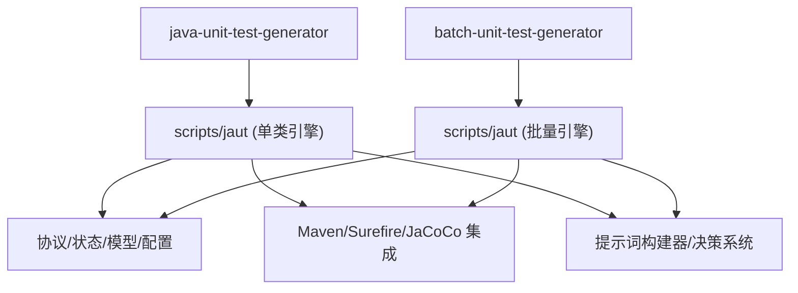
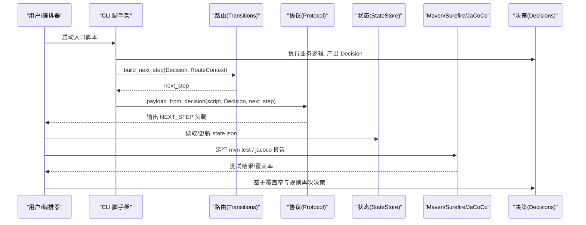
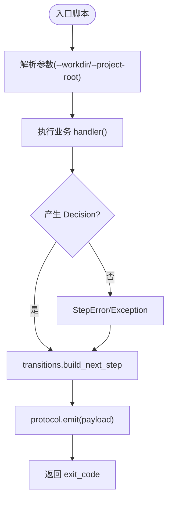
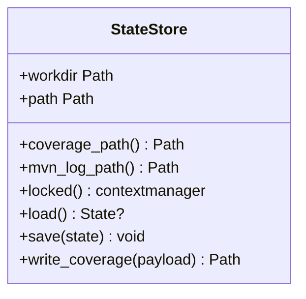
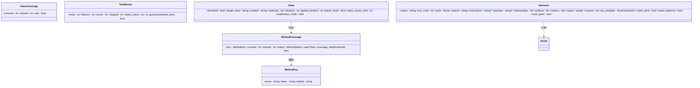
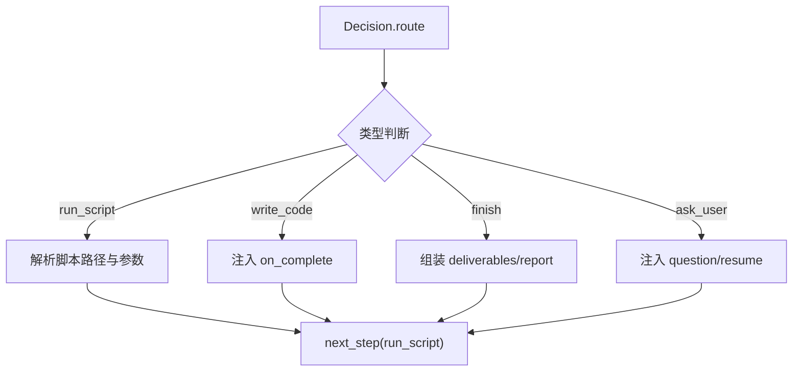
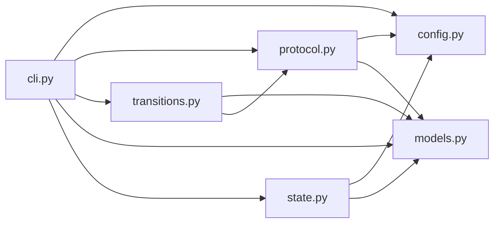
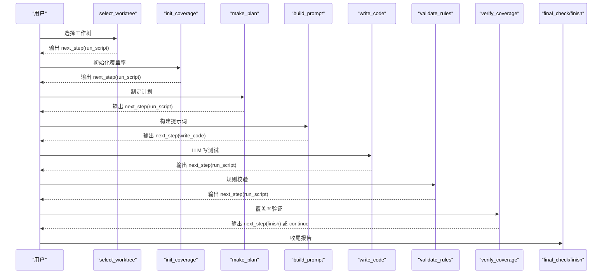

# 单元测试生成器

<cite>
**本文引用的文件**
- [README.md](file://README.md)
- [AGENTS.md](file://AGENTS.md)
- [CLAUDE.md](file://CLAUDE.md)
- [batch-unit-test-generator/scripts/jaut/cli.py](file://batch-unit-test-generator/scripts/jaut/cli.py)
- [java-unit-test-generator/scripts/jaut/cli.py](file://java-unit-test-generator/scripts/jaut/cli.py)
- [batch-unit-test-generator/scripts/jaut/state.py](file://batch-unit-test-generator/scripts/jaut/state.py)
- [java-unit-test-generator/scripts/jaut/state.py](file://java-unit-test-generator/scripts/jaut/state.py)
- [batch-unit-test-generator/scripts/jaut/transitions.py](file://batch-unit-test-generator/scripts/jaut/transitions.py)
- [batch-unit-test-generator/scripts/jaut/models.py](file://batch-unit-test-generator/scripts/jaut/models.py)
- [java-unit-test-generator/scripts/jaut/models.py](file://java-unit-test-generator/scripts/jaut/models.py)
- [batch-unit-test-generator/scripts/jaut/config.py](file://batch-unit-test-generator/scripts/jaut/config.py)
- [java-unit-test-generator/scripts/jaut/config.py](file://java-unit-test-generator/scripts/jaut/config.py)
- [batch-unit-test-generator/scripts/jaut/protocol.py](file://batch-unit-test-generator/scripts/jaut/protocol.py)
</cite>

## 目录
1. [简介](#简介)
2. [项目结构](#项目结构)
3. [核心组件](#核心组件)
4. [架构总览](#架构总览)
5. [详细组件分析](#详细组件分析)
6. [依赖关系分析](#依赖关系分析)
7. [性能考虑](#性能考虑)
8. [故障排查指南](#故障排查指南)
9. [结论](#结论)
10. [附录：使用示例与配置选项](#附录使用示例与配置选项)

## 简介
本仓库包含两个“技能”（skills）：单类测试生成器与批量测试生成器。两者共享同一套 jaut 引擎，负责基于覆盖率驱动的增量式测试生成，驱动 LLM 在指定步骤写入测试代码，并通过 Maven/Surefire/JaCoCo 闭环验证覆盖率是否达到阈值。单类模式聚焦单个 Java 类（或方法），批量模式从分支差异中抽取多个类进行流水线处理。

- 单类模式：选择目标类 → 初始化覆盖率基线 → 制定计划 → 构建提示词 → LLM 写测试 → 规则校验 → 覆盖率验证 → 达标后收尾报告。
- 批量模式：在单类流程之上增加批处理编排（diff 解析、任务队列、进度与预算控制、自动继续/升级）。

该文档重点说明 jaut 引擎的核心架构（状态机管理、Maven/Surefire/JaCoCo 集成、提示词构建器与决策系统）、覆盖率阈值驱动的工作流、Mock 对象自动生成机制、复杂依赖处理策略，并提供完整使用示例、配置项说明、常见问题与性能优化建议。

**章节来源**
- [AGENTS.md:7-14](file://AGENTS.md#L7-L14)
- [CLAUDE.md:9-14](file://CLAUDE.md#L9-L14)
- [CLAUDE.md:38-51](file://CLAUDE.md#L38-L51)

## 项目结构
- 顶层按 skill 划分：java-unit-test-generator、batch-unit-test-generator、sensitive-log-review、sensors-analyze。
- 每个 skill 内部包含：
  - scripts/jaut：jaut 引擎（CLI、状态、协议、模型、配置、工作树、Maven/Surefire/JaCoCo 集成、提示词构建、报告等）
  - references：规则与参考文档（如 UnitTestRules.md）
  - protocol：NEXT_STEP 协议 JSON Schema
  - tests：pytest 测试套件

**图表来源**
- [AGENTS.md:7-14](file://AGENTS.md#L7-L14)
- [CLAUDE.md:38-51](file://CLAUDE.md#L38-L51)

**章节来源**
- [AGENTS.md:7-14](file://AGENTS.md#L7-L14)
- [CLAUDE.md:9-14](file://CLAUDE.md#L9-L14)

## 核心组件
- CLI 脚手架：统一参数解析、日志初始化、异常到协议块的转换、Decision -> next_step -> emit -> exit_code。
- 状态存储：state.json 原子读写、跨进程锁、schema 迁移、coverage.json 快照。
- 模型层：类型化领域模型（MethodKey、MethodCoverage、ClassCoverage、TestResult、Decision、State、BatchState 等）。
- 配置中心：全局常量与阈值（覆盖率默认值、迭代预算、Maven 超时、批量预算等）。
- 协议层：NEXT_STEP 负载构建、自检与 stdout 输出。
- 路由与过渡：将 Decision.route 解析为具体 next_step（run_script/write_code/finish/ask_user）。
- 集成层：Maven/Surefire/JaCoCo 调用与结果解析。
- 提示词与决策：根据当前状态与覆盖率数据构建提示词，并产出下一步决策。

**章节来源**
- [batch-unit-test-generator/scripts/jaut/cli.py:1-129](file://batch-unit-test-generator/scripts/jaut/cli.py#L1-L129)
- [java-unit-test-generator/scripts/jaut/cli.py:1-129](file://java-unit-test-generator/scripts/jaut/cli.py#L1-L129)
- [batch-unit-test-generator/scripts/jaut/state.py:1-165](file://batch-unit-test-generator/scripts/jaut/state.py#L1-L165)
- [java-unit-test-generator/scripts/jaut/state.py:1-165](file://java-unit-test-generator/scripts/jaut/state.py#L1-L165)
- [batch-unit-test-generator/scripts/jaut/models.py:1-693](file://batch-unit-test-generator/scripts/jaut/models.py#L1-L693)
- [java-unit-test-generator/scripts/jaut/models.py:1-499](file://java-unit-test-generator/scripts/jaut/models.py#L1-L499)
- [batch-unit-test-generator/scripts/jaut/config.py:1-181](file://batch-unit-test-generator/scripts/jaut/config.py#L1-L181)
- [java-unit-test-generator/scripts/jaut/config.py:1-172](file://java-unit-test-generator/scripts/jaut/config.py#L1-L172)
- [batch-unit-test-generator/scripts/jaut/protocol.py:1-105](file://batch-unit-test-generator/scripts/jaut/protocol.py#L1-L105)

## 架构总览
jaut 引擎采用“声明式工作流 + 协议驱动”的架构：
- 入口脚本通过 CLI 框架执行 handler，返回 Decision；
- transitions 将 Decision.route 转换为 next_step；
- protocol 将 Decision + next_step 组装为 NEXT_STEP 负载并输出；
- 上层编排器（LLM/Agent）根据 next_step.type 决定下一步动作（运行脚本/写代码/询问用户/完成）；
- 状态持久化于 state.json，支持断点续跑与 schema 迁移；
- Maven/Surefire/JaCoCo 集成用于编译、运行测试、采集覆盖率并判定是否达标。

**图表来源**
- [batch-unit-test-generator/scripts/jaut/cli.py:95-129](file://batch-unit-test-generator/scripts/jaut/cli.py#L95-L129)
- [batch-unit-test-generator/scripts/jaut/transitions.py:41-68](file://batch-unit-test-generator/scripts/jaut/transitions.py#L41-L68)
- [batch-unit-test-generator/scripts/jaut/protocol.py:28-56](file://batch-unit-test-generator/scripts/jaut/protocol.py#L28-L56)
- [batch-unit-test-generator/scripts/jaut/state.py:130-165](file://batch-unit-test-generator/scripts/jaut/state.py#L130-L165)

**章节来源**
- [CLAUDE.md:38-51](file://CLAUDE.md#L38-L51)
- [batch-unit-test-generator/scripts/jaut/transitions.py:1-128](file://batch-unit-test-generator/scripts/jaut/transitions.py#L1-L128)
- [batch-unit-test-generator/scripts/jaut/protocol.py:1-105](file://batch-unit-test-generator/scripts/jaut/protocol.py#L1-L105)

## 详细组件分析

### CLI 脚手架与错误处理
- 统一参数解析与 workdir 解析（--workdir 或 --project-root）；
- StepError 封装可预期错误（状态缺失/参数缺失/环境缺失/操作失败），并携带 Decision；
- 未捕获异常统一转为 failed + ask_user(exit 2)，确保协议块始终输出；
- 日志初始化失败不影响协议输出；
- 路由上下文 RouteContext 注入 scripts_dir/workdir/state，供 transitions 解析 next_step。

**图表来源**
- [batch-unit-test-generator/scripts/jaut/cli.py:63-129](file://batch-unit-test-generator/scripts/jaut/cli.py#L63-L129)
- [java-unit-test-generator/scripts/jaut/cli.py:63-129](file://java-unit-test-generator/scripts/jaut/cli.py#L63-L129)

**章节来源**
- [batch-unit-test-generator/scripts/jaut/cli.py:1-129](file://batch-unit-test-generator/scripts/jaut/cli.py#L1-L129)
- [java-unit-test-generator/scripts/jaut/cli.py:1-129](file://java-unit-test-generator/scripts/jaut/cli.py#L1-L129)

### 状态存储与原子性
- StateStore 提供 load/save，使用临时文件 + os.replace + fsync 实现原子写入；
- 跨进程文件锁（POSIX fcntl.flock / Windows msvcrt.locking），避免并发破坏 state.json；
- 检测残留锁文件（超过 24 小时告警）；
- coverage.json 快照用于记录每轮覆盖率；
- schema 迁移管道：_migrate 顺序升级旧版本 state.json，新增字段兼容。

**图表来源**
- [batch-unit-test-generator/scripts/jaut/state.py:77-165](file://batch-unit-test-generator/scripts/jaut/state.py#L77-L165)
- [java-unit-test-generator/scripts/jaut/state.py:77-165](file://java-unit-test-generator/scripts/jaut/state.py#L77-L165)

**章节来源**
- [batch-unit-test-generator/scripts/jaut/state.py:1-165](file://batch-unit-test-generator/scripts/jaut/state.py#L1-L165)
- [java-unit-test-generator/scripts/jaut/state.py:1-165](file://java-unit-test-generator/scripts/jaut/state.py#L1-L165)

### 模型层与覆盖率计算
- MethodKey：以 name+desc 唯一标识方法（JaCoCo 语义）；
- MethodCoverage：跟踪 covered/missed/status/round_rates/round_test_results/initial_rate；
- ClassCoverage：类级行覆盖率聚合；
- TestResult：surefire 结果解析，is_green 严格判定（fail-closed）；
- Decision：决策产物，含 route/instructions/question/deliverables/artifacts/metrics/report/resume/on_complete/mark_done/reset_trajectory/auto_grant；
- State：持久化状态，含 threshold/target_class/module/jacoco_version/git_baseline/iteration/global_iteration/batch_mode/class_round_used/exploration_mode 等；
- BatchState/BatchClassEntry：批量计划条目与总态，支持方法分组与推进。

**图表来源**
- [batch-unit-test-generator/scripts/jaut/models.py:77-343](file://batch-unit-test-generator/scripts/jaut/models.py#L77-L343)
- [java-unit-test-generator/scripts/jaut/models.py:77-341](file://java-unit-test-generator/scripts/jaut/models.py#L77-L341)
- [batch-unit-test-generator/scripts/jaut/models.py:347-693](file://batch-unit-test-generator/scripts/jaut/models.py#L347-L693)

**章节来源**
- [batch-unit-test-generator/scripts/jaut/models.py:1-693](file://batch-unit-test-generator/scripts/jaut/models.py#L1-L693)
- [java-unit-test-generator/scripts/jaut/models.py:1-499](file://java-unit-test-generator/scripts/jaut/models.py#L1-L499)

### 配置中心与阈值驱动
- 默认覆盖率阈值 DEFAULT_THRESHOLD=80.0；抽象/接口方法视为达标 100.0；
- 迭代预算：单方法 METHOD_ROUND_BUDGET=8，全局 GLOBAL_ROUND_BUDGET=30；
- 无提升升级：连续 NO_IMPROVEMENT_ROUNDS=3 轮无提升触发 ask_user；接近门槛时抑制升级；
- 测试失败 streak：TEST_FAIL_STREAK_ROUNDS=3；
- Maven 超时：默认 1800s，可通过 JAVA_UT_MVN_TIMEOUT 覆盖；
- 批量模式：类级预算 batch_class_round_budget() 默认 30，探索模式倍数 EXPLORATION_MODE_MULTIPLIER=2；
- 终验与规则校验：FINAL_CHECK_FAIL_STREAK_LIMIT=2，VALIDATE_FAIL_STREAK_LIMIT=5。

**章节来源**
- [batch-unit-test-generator/scripts/jaut/config.py:50-181](file://batch-unit-test-generator/scripts/jaut/config.py#L50-L181)
- [java-unit-test-generator/scripts/jaut/config.py:50-172](file://java-unit-test-generator/scripts/jaut/config.py#L50-L172)

### 协议层与退出码契约
- NEXT_STEP 负载必填键：protocol_version/script/status/exit_code/summary/artifacts/next_step；
- status 取值：success/empty/failed/needs_input；
- next_step.type 取值：run_script/write_code/ask_user/finish；
- emit 在 stdout 末尾输出标记包裹的 JSON 块，序列化失败时输出错误协议块；
- 退出码：0=完成，1=继续（正常流转），2=脚本错误，3=状态/协议错误。

**章节来源**
- [batch-unit-test-generator/scripts/jaut/protocol.py:1-105](file://batch-unit-test-generator/scripts/jaut/protocol.py#L1-L105)
- [batch-unit-test-generator/scripts/jaut/config.py:32-49](file://batch-unit-test-generator/scripts/jaut/config.py#L32-L49)

### 路由与过渡（Transitions）
- 集中表达 DAG：MAKE_PLAN/BUILD_PROMPT/VERIFY_COVERAGE/FINAL_CHECK/BATCH_NEXT/BATCH_FINISH/WRITE_CODE/FINISH/ASK_USER；
- run_script 路由解析目标脚本绝对路径与参数（自动注入 --workdir）；
- write_code 路由注入 on_complete（默认 validate_rules.py）；
- ask_user 路由注入 resume 选项（补全脚本路径与 --workdir）。

**图表来源**
- [batch-unit-test-generator/scripts/jaut/transitions.py:21-68](file://batch-unit-test-generator/scripts/jaut/transitions.py#L21-L68)
- [batch-unit-test-generator/scripts/jaut/transitions.py:71-128](file://batch-unit-test-generator/scripts/jaut/transitions.py#L71-L128)

**章节来源**
- [batch-unit-test-generator/scripts/jaut/transitions.py:1-128](file://batch-unit-test-generator/scripts/jaut/transitions.py#L1-L128)

### Maven/Surefire/JaCoCo 集成
- Maven 必带参数忽略测试失败以保证覆盖率报告产出；
- 超时控制与环境变量覆盖；
- Surefire 结果解析为 TestResult，is_green 严格判定；
- JaCoCo 覆盖率报告解析为 MethodCoverage/ClassCoverage，结合阈值判定是否达标；
- 覆盖率历史与测试历史写入 state.json，支撑轨迹分析与升级决策。

**章节来源**
- [batch-unit-test-generator/scripts/jaut/config.py:80-118](file://batch-unit-test-generator/scripts/jaut/config.py#L80-L118)
- [java-unit-test-generator/scripts/jaut/config.py:101-118](file://java-unit-test-generator/scripts/jaut/config.py#L101-L118)
- [batch-unit-test-generator/scripts/jaut/models.py:240-277](file://batch-unit-test-generator/scripts/jaut/models.py#L240-L277)

### 提示词构建器与决策系统
- 提示词构建器根据当前状态、覆盖率数据、规则与计划构建提示词；
- 决策系统依据覆盖率阈值、连续失败/无提升、规则违规等条件产出 Decision；
- 决策包含 instructions/question/deliverables/artifacts/metrics/report/resume/on_complete/mark_done/reset_trajectory/auto_grant；
- 决策不直接修改状态，由入口脚本落地 mark_done/reset_trajectory 等动作。

**章节来源**
- [batch-unit-test-generator/scripts/jaut/models.py:309-343](file://batch-unit-test-generator/scripts/jaut/models.py#L309-L343)
- [java-unit-test-generator/scripts/jaut/models.py:309-341](file://java-unit-test-generator/scripts/jaut/models.py#L309-L341)

### Mock 对象自动生成与复杂依赖处理
- 通过提示词与规则约束，LLM 在 write_code 阶段自动生成 Mockito Mock；
- 针对复杂依赖（外部服务、数据库、网络等），通过 Mock 隔离副作用，确保测试稳定；
- 覆盖率驱动确保 Mock 覆盖关键分支与边界条件；
- 规则校验（validate_rules）保障生成的测试符合工程规范。

**章节来源**
- [CLAUDE.md:38-51](file://CLAUDE.md#L38-L51)
- [AGENTS.md:41-45](file://AGENTS.md#L41-L45)

## 依赖关系分析
- CLI 依赖 config/protocol/transitions/models/state/logutil；
- transitions 依赖 models.protocol；
- protocol 依赖 config/models；
- state 依赖 config/models/logutil；
- models 仅依赖 config；
- 批量模式扩展 lockutil/batch_state 等。

**图表来源**
- [batch-unit-test-generator/scripts/jaut/cli.py:12-23](file://batch-unit-test-generator/scripts/jaut/cli.py#L12-L23)
- [batch-unit-test-generator/scripts/jaut/transitions.py:9-19](file://batch-unit-test-generator/scripts/jaut/transitions.py#L9-L19)
- [batch-unit-test-generator/scripts/jaut/protocol.py:8-15](file://batch-unit-test-generator/scripts/jaut/protocol.py#L8-L15)
- [batch-unit-test-generator/scripts/jaut/state.py:7-18](file://batch-unit-test-generator/scripts/jaut/state.py#L7-L18)

**章节来源**
- [batch-unit-test-generator/scripts/jaut/cli.py:1-129](file://batch-unit-test-generator/scripts/jaut/cli.py#L1-L129)
- [batch-unit-test-generator/scripts/jaut/transitions.py:1-128](file://batch-unit-test-generator/scripts/jaut/transitions.py#L1-L128)
- [batch-unit-test-generator/scripts/jaut/protocol.py:1-105](file://batch-unit-test-generator/scripts/jaut/protocol.py#L1-L105)
- [batch-unit-test-generator/scripts/jaut/state.py:1-165](file://batch-unit-test-generator/scripts/jaut/state.py#L1-L165)

## 性能考虑
- 原子写入与文件锁避免并发竞争，提高可靠性；
- Maven 超时与进度报告防止长时间阻塞；
- 覆盖率阈值与预算控制减少无效迭代；
- 批量模式支持方法分组与探索模式，提升大类处理效率；
- 缓存 JaCoCo 配置探测结果，减少重复开销。

[本节为通用指导，无需特定文件来源]

## 故障排查指南
- 协议块序列化失败：emit 会输出错误协议块，检查日志与脚本输出；
- 状态文件损坏或缺失：load 返回 None，按状态错误流转；
- 残留锁文件：检测超过 24 小时的 .lock 文件并告警；
- Maven 超时：调整 JAVA_UT_MVN_TIMEOUT；
- 测试失败 streak：连续失败触发 ask_user，检查测试与依赖；
- 覆盖率无提升：连续无提升触发 ask_user，检查提示词与 Mock；
- 规则校验失败：连续违规触发 ask_user，检查测试规范。

**章节来源**
- [batch-unit-test-generator/scripts/jaut/protocol.py:59-105](file://batch-unit-test-generator/scripts/jaut/protocol.py#L59-L105)
- [batch-unit-test-generator/scripts/jaut/state.py:103-145](file://batch-unit-test-generator/scripts/jaut/state.py#L103-L145)
- [batch-unit-test-generator/scripts/jaut/config.py:70-99](file://batch-unit-test-generator/scripts/jaut/config.py#L70-L99)

## 结论
jaut 引擎通过协议驱动的状态机、严格的退出码契约、原子状态存储与阈值驱动的决策系统，实现了可靠的增量式测试生成。单类与批量模式共享同一套核心能力，便于在不同场景下灵活应用。配合 Maven/Surefire/JaCoCo 集成与规则校验，能够高效生成高质量测试用例并持续逼近覆盖率目标。

[本节为总结，无需特定文件来源]

## 附录：使用示例与配置选项

### 单类测试生成流程
- 选择工作树/项目根：select_worktree（或 CLI 传入 --project-root）；
- 初始化覆盖率基线：init_coverage（生成 baseline 与排除规则）；
- 制定计划：make_plan（分析待测方法与依赖）；
- 构建提示词：build_prompt（结合规则与覆盖率数据）；
- LLM 写测试：write_code（生成 JUnit5+Mockito 测试）；
- 规则校验：validate_rules（检查测试规范）；
- 覆盖率验证：verify_coverage（运行测试与 JaCoCo 报告）；
- 达标收尾：final_check/finish（生成报告）。

**图表来源**
- [CLAUDE.md:38-51](file://CLAUDE.md#L38-L51)
- [batch-unit-test-generator/scripts/jaut/transitions.py:21-68](file://batch-unit-test-generator/scripts/jaut/transitions.py#L21-L68)

### 批量测试处理流程
- 解析分支差异：batch_diff（提取变更类列表）；
- 初始化批量状态：batch_init（创建 batch_state.json）；
- 循环处理：batch_next（选择下一个 pending/recheck 类，进入单类流程）；
- 更新进度：batch_update（记录 rounds_used/escalations/method_groups）；
- 结束：batch_finish（汇总报告与统计）。

**章节来源**
- [batch-unit-test-generator/scripts/jaut/models.py:520-693](file://batch-unit-test-generator/scripts/jaut/models.py#L520-L693)
- [batch-unit-test-generator/scripts/jaut/config.py:141-168](file://batch-unit-test-generator/scripts/jaut/config.py#L141-L168)

### 配置选项说明
- 覆盖率阈值：DEFAULT_THRESHOLD=80.0；
- 抽象/接口方法：ABSTRACT_METHOD_COVERAGE=100.0；
- 迭代预算：METHOD_ROUND_BUDGET=8，GLOBAL_ROUND_BUDGET=30；
- 无提升升级：NO_IMPROVEMENT_ROUNDS=3，NO_IMPROVEMENT_NEAR_THRESHOLD_FACTOR=0.9；
- 测试失败 streak：TEST_FAIL_STREAK_ROUNDS=3；
- Maven 超时：JAVA_UT_MVN_TIMEOUT（默认 1800s）；
- 批量预算：JAVA_UT_BATCH_CLASS_ROUND_BUDGET（默认 30），EXPLORATION_MODE_MULTIPLIER=2；
- 终验与规则校验：FINAL_CHECK_FAIL_STREAK_LIMIT=2，VALIDATE_FAIL_STREAK_LIMIT=5。

**章节来源**
- [batch-unit-test-generator/scripts/jaut/config.py:50-181](file://batch-unit-test-generator/scripts/jaut/config.py#L50-L181)
- [java-unit-test-generator/scripts/jaut/config.py:50-172](file://java-unit-test-generator/scripts/jaut/config.py#L50-L172)