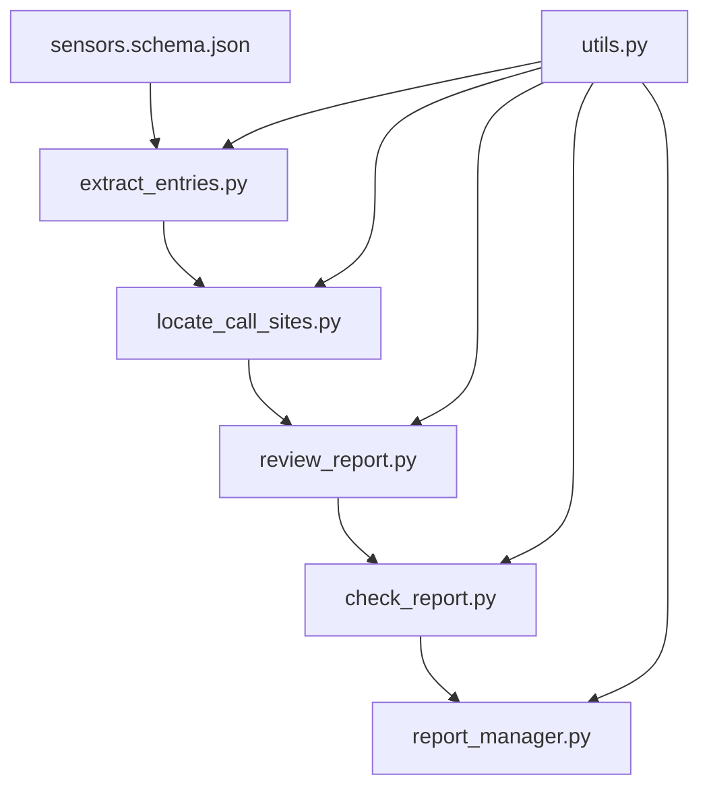
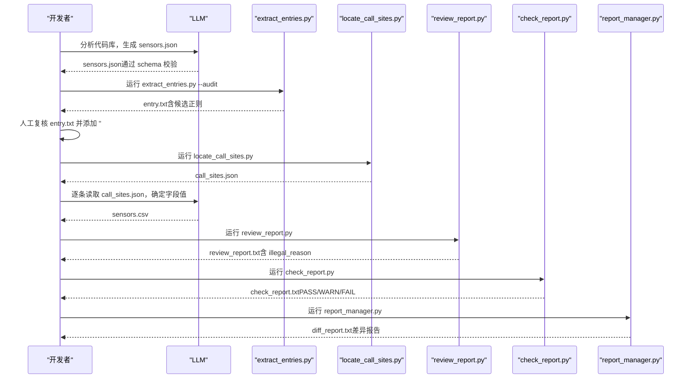
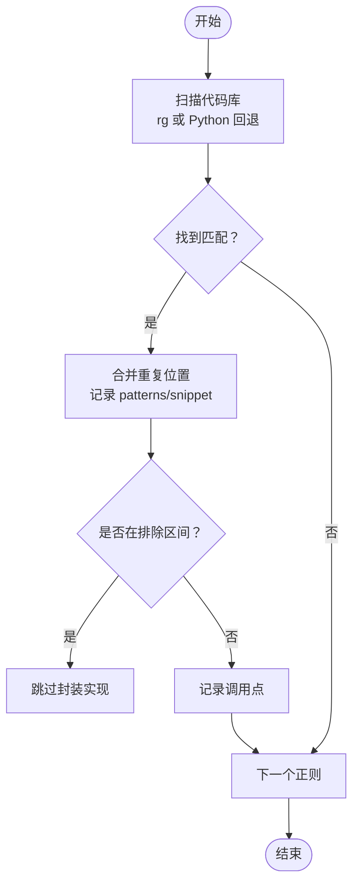
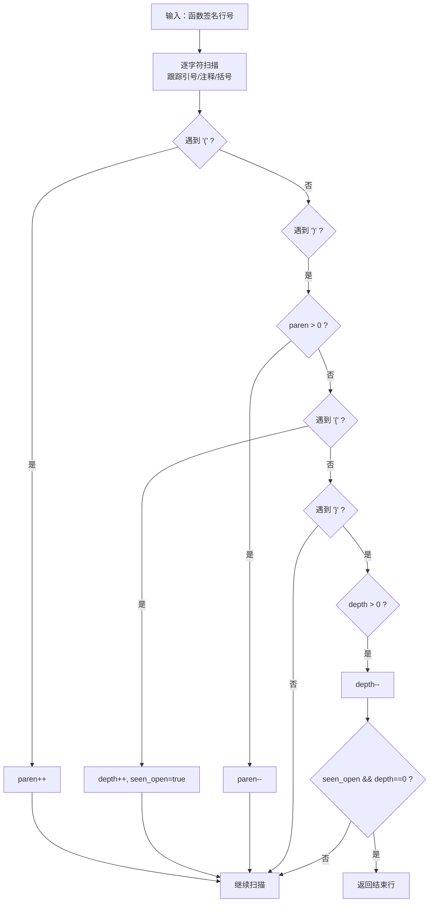
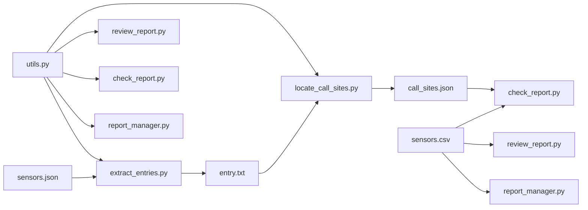

# 埋点分析工具

<cite>
**本文引用的文件**
- [sensors.schema.json](file://sensors-analyze/sensors.schema.json)
- [CLAUDE.md](file://sensors-analyze/CLAUDE.md)
- [trigger-eval.json](file://sensors-analyze/trigger-eval.json)
- [scripts/utils.py](file://sensors-analyze/scripts/utils.py)
- [scripts/extract_entries.py](file://sensors-analyze/scripts/extract_entries.py)
- [scripts/locate_call_sites.py](file://sensors-analyze/scripts/locate_call_sites.py)
- [scripts/review_report.py](file://sensors-analyze/scripts/review_report.py)
- [scripts/check_report.py](file://sensors-analyze/scripts/check_report.py)
- [scripts/report_manager.py](file://sensors-analyze/scripts/report_manager.py)
</cite>

## 目录
1. [简介](#简介)
2. [项目结构](#项目结构)
3. [核心组件](#核心组件)
4. [架构总览](#架构总览)
5. [详细组件分析](#详细组件分析)
6. [依赖关系分析](#依赖关系分析)
7. [性能与优化建议](#性能与优化建议)
8. [故障排查指南](#故障排查指南)
9. [结论](#结论)
10. [附录：配置示例与结果解读](#附录：配置示例与结果解读)

## 简介
本工具是一套面向任意代码库的“埋点盘点与校验”技能包，目标是自动发现现有埋点实现、梳理调用链路、定位所有埋点调用点，并逐条确认最终上报字段（page_name、first_biz_id、second_biz_id、first_biz_name、second_biz_name、event）。整个流程由 LLM 与 Python 脚本协作完成，强调只读分析、可追溯、可审计。

关键能力：
- 自动埋点发现机制：代码扫描、调用点定位、完整性验证
- 基于 JSON Schema 的埋点配置定义与校验
- 通过正则与 AST 思想（括号平衡、函数体范围）准确识别埋点调用位置
- 分析报告生成：埋点清单提取、调用关系分析、缺失埋点检测
- 版本归档与差异比对，防止漂移
- 与现有埋点系统解耦集成，支持多种范式（直调 SDK、封装函数、指令、装饰器、Hook、全埋点配置等）

**章节来源**
- [CLAUDE.md:1-73](file://sensors-analyze/CLAUDE.md#L1-L73)
- [trigger-eval.json:1-90](file://sensors-analyze/trigger-eval.json#L1-L90)

## 项目结构
该技能包位于 sensors-analyze 目录下，包含：
- 顶层配置与说明：sensors.schema.json、CLAUDE.md、trigger-eval.json
- scripts 子目录：各步骤的 Python 脚本与共享工具 utils.py

**图表来源**
- [sensors.schema.json:1-262](file://sensors-analyze/sensors.schema.json#L1-L262)
- [scripts/extract_entries.py:1-308](file://sensors-analyze/scripts/extract_entries.py#L1-L308)
- [scripts/locate_call_sites.py:1-347](file://sensors-analyze/scripts/locate_call_sites.py#L1-L347)
- [scripts/review_report.py:1-366](file://sensors-analyze/scripts/review_report.py#L1-L366)
- [scripts/check_report.py:1-252](file://sensors-analyze/scripts/check_report.py#L1-L252)
- [scripts/report_manager.py:1-336](file://sensors-analyze/scripts/report_manager.py#L1-L336)
- [scripts/utils.py:1-51](file://sensors-analyze/scripts/utils.py#L1-L51)

**章节来源**
- [CLAUDE.md:23-58](file://sensors-analyze/CLAUDE.md#L23-L58)

## 核心组件
- 配置与规范
  - sensors.schema.json：定义埋点分析报告的 JSON Schema，包括 meta、paradigms、call_chain、entry_functions、sdk_apis 等
  - trigger-eval.json：触发条件测试用例，用于判断是否进入该技能
- 自动化流水线
  - extract_entries.py：从 sensors.json 提取入口函数候选，生成 entry.txt（需人工确认）
  - locate_call_sites.py：按 entry.txt 的正则定位所有埋点调用点，输出 call_sites.json
  - review_report.py：预审 CSV，添加 illegal_reason 列，进行字面量匹配与结构校验
  - check_report.py：校验 call_sites.json 与 sensors.csv 的一致性，输出 check_report.txt
  - report_manager.py：CSV 归档与版本差异比对，输出 diff_report.txt
- 共享工具
  - utils.py：日志配置、next_step 输出、ripgrep 可用性检查

**章节来源**
- [sensors.schema.json:1-262](file://sensors-analyze/sensors.schema.json#L1-L262)
- [scripts/extract_entries.py:1-308](file://sensors-analyze/scripts/extract_entries.py#L1-L308)
- [scripts/locate_call_sites.py:1-347](file://sensors-analyze/scripts/locate_call_sites.py#L1-L347)
- [scripts/review_report.py:1-366](file://sensors-analyze/scripts/review_report.py#L1-L366)
- [scripts/check_report.py:1-252](file://sensors-analyze/scripts/check_report.py#L1-L252)
- [scripts/report_manager.py:1-336](file://sensors-analyze/scripts/report_manager.py#L1-L336)
- [scripts/utils.py:1-51](file://sensors-analyze/scripts/utils.py#L1-L51)

## 架构总览
整体采用“LLM + 脚本”的确定性流水线：
1. LLM 读取目标代码库，识别埋点范式，产出 sensors.json（必须通过 schema 校验）
2. extract_entries.py 提取入口函数候选 → entry.txt（人工复核后加 # CONFIRMED）
3. locate_call_sites.py 正则扫描代码库 → call_sites.json
4. LLM 逐条读取调用点，追踪字段取值 → 追加写入 sensors.csv
5. review_report.py 预审 CSV，添加 illegal_reason 列 → review_report.txt
6. check_report.py 校验一致性 → check_report.txt（PASS/WARN/FAIL）
7. report_manager.py 归档 CSV 并比对差异 → diff_report.txt

**图表来源**
- [CLAUDE.md:11-58](file://sensors-analyze/CLAUDE.md#L11-L58)
- [scripts/extract_entries.py:188-308](file://sensors-analyze/scripts/extract_entries.py#L188-L308)
- [scripts/locate_call_sites.py:230-347](file://sensors-analyze/scripts/locate_call_sites.py#L230-L347)
- [scripts/review_report.py:239-366](file://sensors-analyze/scripts/review_report.py#L239-L366)
- [scripts/check_report.py:47-252](file://sensors-analyze/scripts/check_report.py#L47-L252)
- [scripts/report_manager.py:243-336](file://sensors-analyze/scripts/report_manager.py#L243-L336)

## 详细组件分析

### 自动埋点发现机制
- 代码扫描
  - 使用 ripgrep（rg）优先搜索，回退为纯 Python 扫描
  - 支持多语言后缀白名单，避免无关文件干扰
  - 在 extract_entries.py 中提供独立审计模式，扫描含 sensors/track 关键词的函数定义，对比已知 entry_functions 名称，提示遗漏
- 调用点定位
  - 依据 entry.txt 中的正则表达式，批量搜索代码库，合并同一位置的多次命中
  - 排除 wrapper/hook 入口自身的定义行及其函数体区间，避免将封装实现误判为业务调用点
  - 计算多行调用语句的结束行，确保 snippet 完整
- 完整性验证
  - 通过 global_sdk_apis 的名称反向搜索调用点，统计未被 entry_function 覆盖的位置，提示补充
  - 校验 CSV 行数不少于调用点数，且每行 file 能在 call_sites.json 中找到对应

**图表来源**
- [scripts/locate_call_sites.py:48-94](file://sensors-analyze/scripts/locate_call_sites.py#L48-L94)
- [scripts/locate_call_sites.py:96-180](file://sensors-analyze/scripts/locate_call_sites.py#L96-L180)
- [scripts/locate_call_sites.py:183-228](file://sensors-analyze/scripts/locate_call_sites.py#L183-L228)
- [scripts/extract_entries.py:75-173](file://sensors-analyze/scripts/extract_entries.py#L75-L173)

**章节来源**
- [scripts/extract_entries.py:75-173](file://sensors-analyze/scripts/extract_entries.py#L75-L173)
- [scripts/locate_call_sites.py:22-45](file://sensors-analyze/scripts/locate_call_sites.py#L22-L45)
- [scripts/locate_call_sites.py:96-180](file://sensors-analyze/scripts/locate_call_sites.py#L96-L180)
- [scripts/locate_call_sites.py:183-228](file://sensors-analyze/scripts/locate_call_sites.py#L183-L228)

### 埋点配置的 JSON Schema 定义与验证
- 顶层对象要求 meta 与 paradigms
- meta 包含 project_path、language、analyzed_at、sdk_summary、global_sdk_apis
- paradigms 数组描述每种埋点开发范式：id、name、category、description、reference_location、call_chain、entry_functions、sdk_apis
- call_chain 描述从功能页到 SDK API 的层级，包含 data_flow 字段流转标注
- entry_functions 描述入口函数的 name、kind、location、grep_pattern、signature、note
- sdk_apis 描述最终调用的 SDK API 及其参数说明

验证过程：
- 在 Step 1 后，建议使用 jsonschema 或手动方式校验 sensors.json 是否符合 schema
- 若缺少必填字段或类型不符，后续脚本会报错或产生异常

**章节来源**
- [sensors.schema.json:1-262](file://sensors-analyze/sensors.schema.json#L1-L262)
- [CLAUDE.md:23-33](file://sensors-analyze/CLAUDE.md#L23-L33)

### 通过 AST 解析准确识别埋点调用位置
- 函数体范围计算：从签名行起寻找 '{'，按花括号深度平衡算到结束行，忽略字符串/注释内的括号
- 调用语句结束行计算：从匹配起始列起扫描括号平衡，处理多行函数调用
- 排除区间构建：wrapper/hook 入口的定义行及函数体区间被排除，避免误报
- 片段提取：根据 start_line 与 end_line 截取代码片段，便于 LLM 阅读

**图表来源**
- [scripts/locate_call_sites.py:124-173](file://sensors-analyze/scripts/locate_call_sites.py#L124-L173)
- [scripts/locate_call_sites.py:183-221](file://sensors-analyze/scripts/locate_call_sites.py#L183-L221)

**章节来源**
- [scripts/locate_call_sites.py:124-173](file://sensors-analyze/scripts/locate_call_sites.py#L124-L173)
- [scripts/locate_call_sites.py:183-221](file://sensors-analyze/scripts/locate_call_sites.py#L183-L221)

### 分析报告生成逻辑
- 埋点清单提取：从 sensors.json 的 paradigms 与 entry_functions 中提取候选正则，生成 entry.txt
- 调用关系分析：locate_call_sites.py 输出 call_sites.json，包含每个调用点的 file、start_line、end_line、patterns、snippet
- 缺失埋点检测：
  - 审计模式：扫描含 sensors/track 关键词的函数定义，对比已知 entry_functions 名称，提示遗漏
  - SDK API 覆盖验证：用 global_sdk_apis 的名称搜索调用点，统计未被 entry_function 覆盖的位置
- 一致性校验：check_report.py 校验 CSV 行数、file 对应关系、动态占位符检测、必填字段非空
- 预审与修正：review_report.py 添加 illegal_reason 列，进行字面量匹配与结构校验
- 版本归档与差异：report_manager.py 归档带时间戳的 CSV，并与上一版本比对差异

**章节来源**
- [scripts/extract_entries.py:188-308](file://sensors-analyze/scripts/extract_entries.py#L188-L308)
- [scripts/locate_call_sites.py:230-347](file://sensors-analyze/scripts/locate_call_sites.py#L230-L347)
- [scripts/review_report.py:239-366](file://sensors-analyze/scripts/review_report.py#L239-L366)
- [scripts/check_report.py:47-252](file://sensors-analyze/scripts/check_report.py#L47-L252)
- [scripts/report_manager.py:243-336](file://sensors-analyze/scripts/report_manager.py#L243-L336)

## 依赖关系分析
- 脚本间依赖
  - extract_entries.py 依赖 sensors.json 与 utils.py
  - locate_call_sites.py 依赖 entry.txt、sensors.json（可选）、utils.py
  - review_report.py 依赖 sensors.csv、call_sites.json、utils.py
  - check_report.py 依赖 call_sites.json、sensors.csv、utils.py
  - report_manager.py 依赖 sensors.csv、utils.py
- 外部依赖
  - ripgrep（rg）：优先使用，提升搜索性能；不可用时回退为 Python 扫描
  - 标准库：json、csv、re、subprocess、pathlib、logging

**图表来源**
- [scripts/utils.py:1-51](file://sensors-analyze/scripts/utils.py#L1-L51)
- [scripts/extract_entries.py:188-308](file://sensors-analyze/scripts/extract_entries.py#L188-L308)
- [scripts/locate_call_sites.py:230-347](file://sensors-analyze/scripts/locate_call_sites.py#L230-L347)
- [scripts/review_report.py:239-366](file://sensors-analyze/scripts/review_report.py#L239-L366)
- [scripts/check_report.py:47-252](file://sensors-analyze/scripts/check_report.py#L47-L252)
- [scripts/report_manager.py:243-336](file://sensors-analyze/scripts/report_manager.py#L243-L336)

**章节来源**
- [scripts/utils.py:1-51](file://sensors-analyze/scripts/utils.py#L1-L51)

## 性能与优化建议
- 搜索性能
  - 优先安装并使用 ripgrep（rg），显著提升正则搜索速度
  - 限制扫描后缀白名单，减少无关文件扫描
  - 缓存文件内容，避免同一文件被多个 pattern 重复读取
- 排除策略
  - 对 wrapper/hook 入口的定义行及函数体区间进行排除，降低误报率
  - 使用括号平衡算法精确计算调用语句结束行，提高 snippet 准确性
- 资源控制
  - 截断 snippet 到固定长度，避免内存占用过大
  - 日志输出重定向到文件，stdout 仅保留 next_step 提示，便于自动化解析
- 扩展性
  - 可通过修改 DEFAULT_EXTS 扩展支持更多语言后缀
  - 可在 entry.txt 中增加更精准的正则，减少误报与漏报

[本节为通用性能讨论，不直接分析具体文件]

## 故障排查指南
- 常见错误与处理
  - 找不到 sensors.json：请先由 LLM 完成 Step 1 生成 sensors.json
  - entry.txt 未确认：需人工复核后添加 "# CONFIRMED" 标记
  - 代码库根不存在：请传入正确的 --root 参数
  - CSV 表头不一致：确保遵循固定表头顺序，允许额外列
  - 动态占位符：禁止使用 <动态:...>、<变量:...>、<unknown> 等占位符
  - 必填字段为空：会产生 WARN，需在 resolution_report.csv 中人工复核
- 日志与输出
  - 所有脚本默认输出详细日志到 <out>.log
  - stdout 仅输出 next_step 提示，便于自动化流程解析
  - 失败时退出码：0=PASS，1=执行异常，2=FAIL，3=WARN
- 快速定位
  - 查看对应脚本的日志文件，定位具体错误原因
  - 使用 review_report.txt 中的 illegal_reason 列，快速定位问题行
  - 使用 diff_report.txt 查看 CSV 版本差异，确认变更内容

**章节来源**
- [scripts/extract_entries.py:206-308](file://sensors-analyze/scripts/extract_entries.py#L206-L308)
- [scripts/locate_call_sites.py:250-347](file://sensors-analyze/scripts/locate_call_sites.py#L250-L347)
- [scripts/review_report.py:258-366](file://sensors-analyze/scripts/review_report.py#L258-L366)
- [scripts/check_report.py:69-252](file://sensors-analyze/scripts/check_report.py#L69-L252)
- [scripts/report_manager.py:273-336](file://sensors-analyze/scripts/report_manager.py#L273-L336)

## 结论
本工具通过“LLM + 脚本”的协作模式，实现了埋点分析的自动化与标准化。其核心价值在于：
- 明确界定埋点范式与调用链路，便于治理与维护
- 精确定位所有埋点调用点，避免遗漏与误报
- 严格校验字段取值，确保数据质量
- 版本归档与差异比对，保障分析结果的可追溯性
- 与现有埋点系统解耦，支持多种接入方式

建议在团队内推广使用该工具，结合代码评审与持续集成，持续提升埋点质量与可观测性。

[本节为总结性内容，不直接分析具体文件]

## 附录：配置示例与结果解读
- 配置示例
  - sensors.json：参考 sensors.schema.json 的结构，填写 meta、paradigms、call_chain、entry_functions、sdk_apis
  - entry.txt：人工复核后的正则列表，需包含 "# CONFIRMED" 标记
  - sensors.csv：固定表头，包含 page_name、first_biz_id、second_biz_id、first_biz_name、second_biz_name、event、file、illegal_reason
- 结果解读
  - call_sites.json：每个调用点的 file、start_line、end_line、patterns、snippet
  - review_report.txt：预审摘要，列出有问题行的 illegal_reason
  - check_report.txt：校验结果 PASS/WARN/FAIL，以及错误与警告详情
  - diff_report.txt：CSV 版本差异报告，列出新增、删除、修改的行

**章节来源**
- [sensors.schema.json:1-262](file://sensors-analyze/sensors.schema.json#L1-L262)
- [CLAUDE.md:53-69](file://sensors-analyze/CLAUDE.md#L53-L69)
- [scripts/review_report.py:295-340](file://sensors-analyze/scripts/review_report.py#L295-L340)
- [scripts/check_report.py:148-202](file://sensors-analyze/scripts/check_report.py#L148-L202)
- [scripts/report_manager.py:192-240](file://sensors-analyze/scripts/report_manager.py#L192-L240)