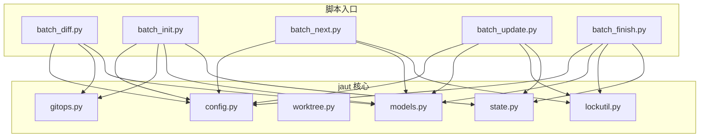
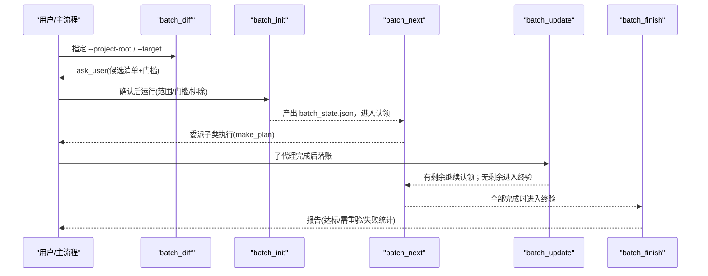
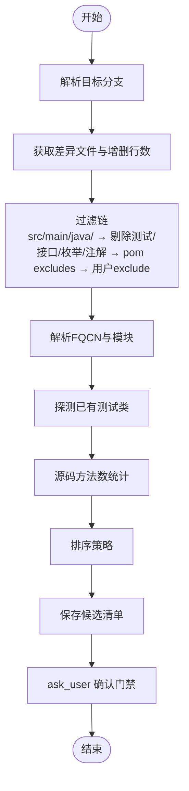
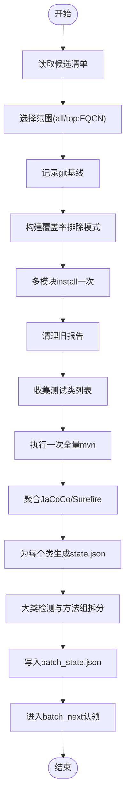
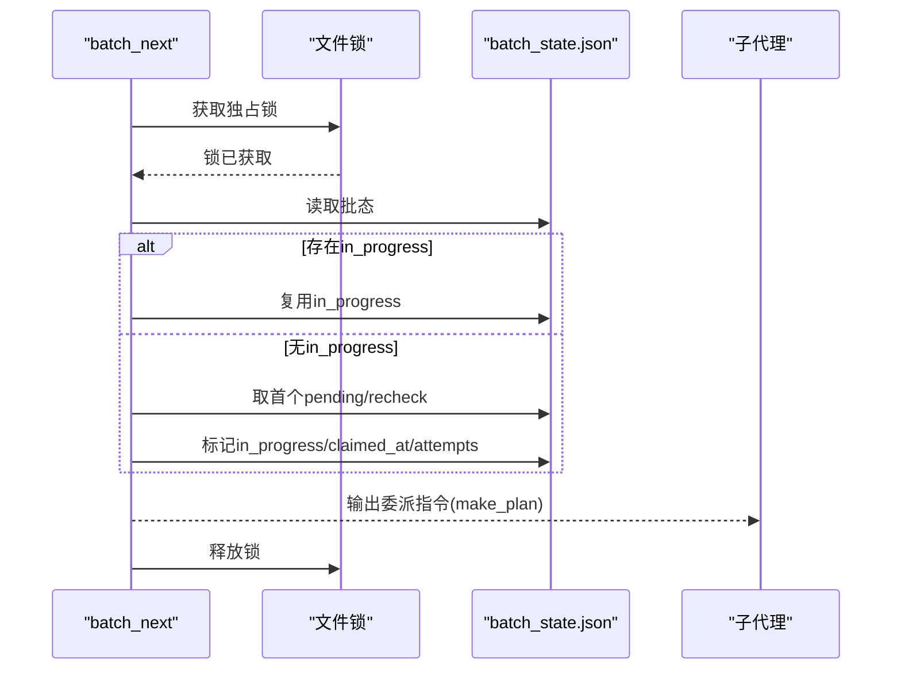
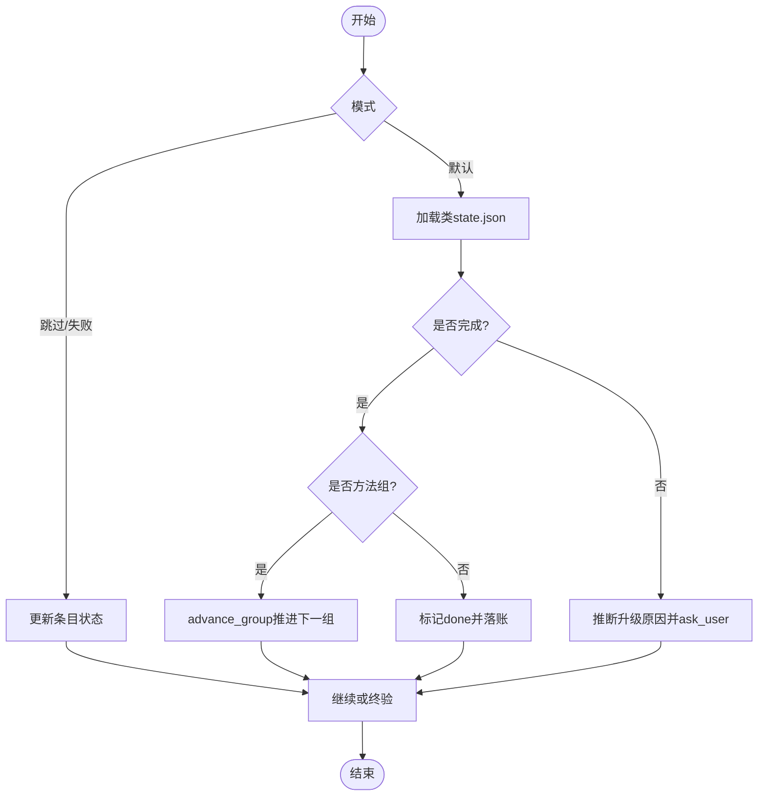
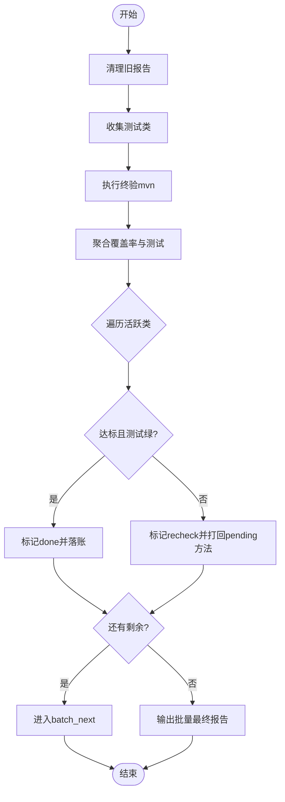
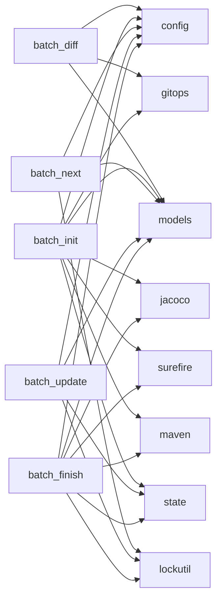

# 批量处理引擎

<cite>
**本文引用的文件**
- [batch_diff.py](file://batch-unit-test-generator/scripts/batch_diff.py)
- [batch_init.py](file://batch-unit-test-generator/scripts/batch_init.py)
- [batch_next.py](file://batch-unit-test-generator/scripts/batch_next.py)
- [batch_update.py](file://batch-unit-test-generator/scripts/batch_update.py)
- [batch_finish.py](file://batch-unit-test-generator/scripts/batch_finish.py)
- [config.py](file://batch-unit-test-generator/scripts/jaut/config.py)
- [models.py](file://batch-unit-test-generator/scripts/jaut/models.py)
- [worktree.py](file://batch-unit-test-generator/scripts/jaut/worktree.py)
- [gitops.py](file://batch-unit-test-generator/scripts/jaut/gitops.py)
- [lockutil.py](file://batch-unit-test-generator/scripts/jaut/lockutil.py)
- [state.py](file://batch-unit-test-generator/scripts/jaut/state.py)
- [diff-analysis.md](file://batch-unit-test-generator/references/diff-analysis.md)
- [test_batch.py](file://batch-unit-test-generator/tests/test_batch.py)
</cite>

## 目录
1. [简介](#简介)
2. [项目结构](#项目结构)
3. [核心组件](#核心组件)
4. [架构总览](#架构总览)
5. [详细组件分析](#详细组件分析)
6. [依赖关系分析](#依赖关系分析)
7. [性能与并发控制](#性能与并发控制)
8. [故障排查指南](#故障排查指南)
9. [结论](#结论)
10. [附录：配置与使用示例](#附录配置与使用示例)

## 简介
本技术文档面向“基于 Git 分支差异的批量单元测试生成”任务，系统性阐述批量处理引擎的工作机制与实现细节。内容覆盖：
- 工作树管理、Git 差异采集与过滤
- 任务队列与状态机（pending/in_progress/done/skipped/failed/recheck）
- 并发控制与断点续跑
- 从差异分析到任务分发再到结果聚合的完整流程
- 错误处理与重试机制
- 配置项与性能调优参数
- 实际使用场景与高效处理大量类测试生成的实践建议

## 项目结构
批量处理引擎位于 `batch-unit-test-generator/scripts` 下，由一组瘦 CLI 脚本驱动，内部通过 `jaut` 包提供领域能力（配置、模型、Maven/JaCoCo/Surefire 解析、Git 操作、工作树管理等）。

图表来源
- [batch_diff.py:1-451](file://batch-unit-test-generator/scripts/batch_diff.py#L1-L451)
- [batch_init.py:1-446](file://batch-unit-test-generator/scripts/batch_init.py#L1-L446)
- [batch_next.py:1-178](file://batch-unit-test-generator/scripts/batch_next.py#L1-L178)
- [batch_update.py:1-301](file://batch-unit-test-generator/scripts/batch_update.py#L1-L301)
- [batch_finish.py:1-254](file://batch-unit-test-generator/scripts/batch_finish.py#L1-L254)
- [config.py:1-181](file://batch-unit-test-generator/scripts/jaut/config.py#L1-L181)
- [models.py:1-693](file://batch-unit-test-generator/scripts/jaut/models.py#L1-L693)
- [worktree.py:1-333](file://batch-unit-test-generator/scripts/jaut/worktree.py#L1-L333)
- [gitops.py:1-176](file://batch-unit-test-generator/scripts/jaut/gitops.py#L1-L176)
- [lockutil.py:1-56](file://batch-unit-test-generator/scripts/jaut/lockutil.py#L1-L56)
- [state.py:1-165](file://batch-unit-test-generator/scripts/jaut/state.py#L1-L165)

章节来源
- [batch_diff.py:1-451](file://batch-unit-test-generator/scripts/batch_diff.py#L1-L451)
- [config.py:1-181](file://batch-unit-test-generator/scripts/jaut/config.py#L1-L181)

## 核心组件
- 差异分析阶段（batch_diff）：基于 Git 分支差异筛选候选类，输出确认门禁。
- 基线构建阶段（batch_init）：一次 install + 一次全量 mvn，产出每个类的 state.json 与 batch_state.json。
- 认领委派阶段（batch_next）：读取 batch_state.json，标记 in_progress，输出子代理委派指令。
- 交付落账阶段（batch_update）：根据类 state.json 判定完成并更新 batch_state.json，支持方法组推进。
- 终验阶段（batch_finish）：全量 mvn 后对每个类刷新覆盖率与测试，达标则 done，否则 recheck 重入队。
- 基础设施：
  - 配置中心（config）：阈值、预算、超时、路径模板等单一事实源。
  - 领域模型（models）：覆盖率、测试结果、决策产物、批量状态等类型化数据。
  - 工作树（worktree）：创建/清理/冲突检测等 git worktree 能力。
  - Git 操作（gitops）：变更路径采集、基线记录、当前分支探测。
  - 锁与状态（lockutil, state）：跨进程文件锁与原子读写 state.json。

章节来源
- [batch_diff.py:1-451](file://batch-unit-test-generator/scripts/batch_diff.py#L1-L451)
- [batch_init.py:1-446](file://batch-unit-test-generator/scripts/batch_init.py#L1-L446)
- [batch_next.py:1-178](file://batch-unit-test-generator/scripts/batch_next.py#L1-L178)
- [batch_update.py:1-301](file://batch-unit-test-generator/scripts/batch_update.py#L1-L301)
- [batch_finish.py:1-254](file://batch-unit-test-generator/scripts/batch_finish.py#L1-L254)
- [config.py:1-181](file://batch-unit-test-generator/scripts/jaut/config.py#L1-L181)
- [models.py:1-693](file://batch-unit-test-generator/scripts/jaut/models.py#L1-L693)
- [worktree.py:1-333](file://batch-unit-test-generator/scripts/jaut/worktree.py#L1-L333)
- [gitops.py:1-176](file://batch-unit-test-generator/scripts/jaut/gitops.py#L1-L176)
- [lockutil.py:1-56](file://batch-unit-test-generator/scripts/jaut/lockutil.py#L1-L56)
- [state.py:1-165](file://batch-unit-test-generator/scripts/jaut/state.py#L1-L165)

## 架构总览
批量处理采用“分阶段 + 状态机 + 文件锁”的编排模式，各阶段通过 NEXT_STEP 协议与主流程交互，状态持久化在 batch_state.json 与各类 state.json 中。

图表来源
- [batch_diff.py:295-442](file://batch-unit-test-generator/scripts/batch_diff.py#L295-L442)
- [batch_init.py:62-318](file://batch-unit-test-generator/scripts/batch_init.py#L62-L318)
- [batch_next.py:53-159](file://batch-unit-test-generator/scripts/batch_next.py#L53-L159)
- [batch_update.py:55-209](file://batch-unit-test-generator/scripts/batch_update.py#L55-L209)
- [batch_finish.py:50-198](file://batch-unit-test-generator/scripts/batch_finish.py#L50-L198)

## 详细组件分析

### 差异分析（batch_diff）
- 目标：基于 Git 分支差异识别需要补测的源类，输出候选清单供用户确认。
- 关键流程：
  - 自动探测目标分支（master/main/develop），支持三点 merge-base 或两点 diff。
  - 获取变更文件列表与增删行数，按 src/main/java 过滤、剔除测试类、接口/枚举/注解、pom jacoco excludes、用户 exclude-glob。
  - 解析 FQCN、模块定位、已有测试探测、源码方法数统计。
  - 排序策略：module-coverage（默认）、coverage、diff-size。
  - 保存候选清单至 workdir，触发 ask_user 确认门禁。
- 输出：Decision(route=ASK_USER)，携带候选清单与门槛提示。

图表来源
- [batch_diff.py:198-277](file://batch-unit-test-generator/scripts/batch_diff.py#L198-L277)
- [batch_diff.py:295-442](file://batch-unit-test-generator/scripts/batch_diff.py#L295-L442)
- [diff-analysis.md:1-84](file://batch-unit-test-generator/references/diff-analysis.md#L1-L84)

章节来源
- [batch_diff.py:198-277](file://batch-unit-test-generator/scripts/batch_diff.py#L198-L277)
- [batch_diff.py:295-442](file://batch-unit-test-generator/scripts/batch_diff.py#L295-L442)
- [diff-analysis.md:1-84](file://batch-unit-test-generator/references/diff-analysis.md#L1-L84)

### 基线构建（batch_init）
- 目标：一次性 install + 全量 mvn，为每个确认类生成 state.json 与 batch_state.json。
- 关键流程：
  - 读取候选清单，选择范围（all/top:N/FQCN列表）。
  - 记录 git 基线，收集覆盖率排除模式（显式 + Lombok/MapStruct 启发式）。
  - 多模块 install 一次，清理旧报告，按需收集测试类列表。
  - 执行一次全量 mvn，聚合 JaCoCo 与 Surefire 报告。
  - 为每个确认类生成 state.json（含类级覆盖率、方法表、初始轨迹），剔除无待补方法类。
  - 大类检测与方法组拆分（pending 方法数超阈值时分组）。
  - 生成 batch_state.json，输出计划摘要，交由 batch_next 认领首个类。
- 输出：Decision(route=BATCH_NEXT)。

图表来源
- [batch_init.py:62-318](file://batch-unit-test-generator/scripts/batch_init.py#L62-L318)
- [models.py:526-633](file://batch-unit-test-generator/scripts/jaut/models.py#L526-L633)

章节来源
- [batch_init.py:62-318](file://batch-unit-test-generator/scripts/batch_init.py#L62-L318)
- [models.py:526-633](file://batch-unit-test-generator/scripts/jaut/models.py#L526-L633)

### 认领委派（batch_next）
- 目标：从 batch_state.json 中认领下一个 pending/recheck 类，标记 in_progress，输出委派指令。
- 关键流程：
  - 文件锁保护批态读写。
  - 优先恢复 in_progress（断点续跑），否则取首个 pending/recheck。
  - 若无可认领类，进入 batch_finish。
  - 计算剩余预算（类级轮次），构造 make_plan 命令（大类附带 method-group）。
  - 输出 ask_user 委派指令，交由子代理执行类内迭代。
- 输出：Decision(route=ASK_USER) 或 BATCH_FINISH。

图表来源
- [batch_next.py:53-159](file://batch-unit-test-generator/scripts/batch_next.py#L53-L159)
- [lockutil.py:34-56](file://batch-unit-test-generator/scripts/jaut/lockutil.py#L34-L56)

章节来源
- [batch_next.py:53-159](file://batch-unit-test-generator/scripts/batch_next.py#L53-L159)
- [lockutil.py:34-56](file://batch-unit-test-generator/scripts/jaut/lockutil.py#L34-L56)

### 交付落账（batch_update）
- 目标：根据类 state.json 判定交付状态，更新 batch_state.json，支持方法组推进。
- 关键流程：
  - 支持 --skip-class 与 --mark-failed 快速干预。
  - 默认模式：定位 in_progress 类，读取其 state.json。
  - 若所有方法 done/skipped 或队列空：done；若仍有 pending：保持 in_progress 并推断升级原因。
  - 方法组模式：当前组完成则 advance_group 推进下一组，直至全部完成。
  - 落账 final_rate/rounds_used/escalations，继续或终验。
- 输出：Decision(route=BATCH_NEXT 或 BATCH_FINISH 或 ASK_USER)。

图表来源
- [batch_update.py:55-209](file://batch-unit-test-generator/scripts/batch_update.py#L55-L209)
- [models.py:569-576](file://batch-unit-test-generator/scripts/jaut/models.py#L569-L576)

章节来源
- [batch_update.py:55-209](file://batch-unit-test-generator/scripts/batch_update.py#L55-L209)
- [models.py:569-576](file://batch-unit-test-generator/scripts/jaut/models.py#L569-L576)

### 终验（batch_finish）
- 目标：对所有非 skipped 类进行最终验证，刷新覆盖率与测试，达标则 done，否则 recheck。
- 关键流程：
  - 清理旧报告，按需收集测试类，执行一次全量 mvn。
  - 聚合 JaCoCo/Surefire，对每个活跃类刷新覆盖率与测试。
  - 达标且测试绿：done；否则 recheck 并打回 pending 方法（final-check 语义刷新）。
  - 有 recheck 则回到 batch_next；全部确认则 finish 输出批量最终报告。
- 输出：Decision(route=BATCH_NEXT 或 FINISH)。

图表来源
- [batch_finish.py:50-198](file://batch-unit-test-generator/scripts/batch_finish.py#L50-L198)

章节来源
- [batch_finish.py:50-198](file://batch-unit-test-generator/scripts/batch_finish.py#L50-L198)

### 工作树管理（worktree）
- 职责：安全地创建/清理/冲突检测 git worktree，确保并行隔离与可恢复性。
- 关键点：
  - 预检（base_ref 有效性、目标路径、分支检出冲突）。
  - 分支矩阵：已有分支 + base_ref 强制重置；已有分支无 base_ref 复用；不存在分支新建。
  - 清理历史 worktree：强制 remove --force，prune 元数据，兜底删除残留目录。
  - 未提交变更检测：提示不会带入新 worktree。

章节来源
- [worktree.py:1-333](file://batch-unit-test-generator/scripts/jaut/worktree.py#L1-L333)

### Git 操作（gitops）
- 职责：变更路径采集、基线记录、当前分支探测。
- 关键点：
  - 变更路径集合（porcelain v1 -z 模式，处理重命名/复制/删除）。
  - 基线记录：仅 src/main/java 下的既有变更及其内容 SHA-256。
  - 当前分支：避免 detached HEAD 误判。

章节来源
- [gitops.py:1-176](file://batch-unit-test-generator/scripts/jaut/gitops.py#L1-L176)

### 状态存储与锁（state.py, lockutil.py）
- 职责：state.json 的原子读写与跨进程独占锁。
- 关键点：
  - 原子写入：临时文件 + fsync + os.replace。
  - 锁文件：独立 .lock 文件，POSIX fcntl.flock / Windows msvcrt.locking。
  - 迁移管道：schema_version 顺序迁移，兼容旧状态。

章节来源
- [state.py:1-165](file://batch-unit-test-generator/scripts/jaut/state.py#L1-L165)
- [lockutil.py:1-56](file://batch-unit-test-generator/scripts/jaut/lockutil.py#L1-L56)

## 依赖关系分析
- 脚本层（scripts/*）依赖 jaut 包，单向依赖，禁止反向。
- 核心依赖链：
  - batch_diff → config, gitops, models, maven/javasrc（间接）
  - batch_init → config, gitops, jacoco, surefire, maven, models, state
  - batch_next → config, models, lockutil
  - batch_update → config, models, lockutil, state
  - batch_finish → config, jacoco, maven, surefire, models, lockutil, state

图表来源
- [batch_diff.py:29-35](file://batch-unit-test-generator/scripts/batch_diff.py#L29-L35)
- [batch_init.py:38-45](file://batch-unit-test-generator/scripts/batch_init.py#L38-L45)
- [batch_next.py:36-41](file://batch-unit-test-generator/scripts/batch_next.py#L36-L41)
- [batch_update.py:34-39](file://batch-unit-test-generator/scripts/batch_update.py#L34-L39)
- [batch_finish.py:33-38](file://batch-unit-test-generator/scripts/batch_finish.py#L33-L38)

章节来源
- [batch_diff.py:29-35](file://batch-unit-test-generator/scripts/batch_diff.py#L29-L35)
- [batch_init.py:38-45](file://batch-unit-test-generator/scripts/batch_init.py#L38-L45)
- [batch_next.py:36-41](file://batch-unit-test-generator/scripts/batch_next.py#L36-L41)
- [batch_update.py:34-39](file://batch-unit-test-generator/scripts/batch_update.py#L34-L39)
- [batch_finish.py:33-38](file://batch-unit-test-generator/scripts/batch_finish.py#L33-L38)

## 性能与并发控制
- 并发控制：
  - 批态文件（batch_state.json）通过文件锁保证跨进程互斥访问，避免竞态条件。
  - 每类 state.json 通过 StateStore.locked() 保护原子读写。
- 性能优化：
  - 一次 install + 一次全量 mvn，减少重复构建开销。
  - 大类别方法组拆分，降低单次任务复杂度与预算压力。
  - 覆盖率排除模式（Lombok/MapStruct 启发式）减少无效计算。
  - 排序策略优先低覆盖率类，提升整体效率。
- 超时与进度：
  - Maven 超时可通过环境变量覆盖，带进度输出防止假死。
  - Git 命令超时限制，避免 NFS/网络挂起。

章节来源
- [config.py:83-97](file://batch-unit-test-generator/scripts/jaut/config.py#L83-L97)
- [config.py:127-130](file://batch-unit-test-generator/scripts/jaut/config.py#L127-L130)
- [batch_init.py:114-154](file://batch-unit-test-generator/scripts/batch_init.py#L114-L154)
- [batch_finish.py:74-98](file://batch-unit-test-generator/scripts/batch_finish.py#L74-L98)
- [lockutil.py:34-56](file://batch-unit-test-generator/scripts/jaut/lockutil.py#L34-L56)
- [state.py:93-129](file://batch-unit-test-generator/scripts/jaut/state.py#L93-L129)

## 故障排查指南
- 常见错误与处理：
  - 目标分支无法自动探测：请通过 --target 显式指定。
  - 候选清单缺失：请先运行 batch_diff 生成候选清单。
  - batch_state.json 已存在：续跑请使用 batch_next；重新开始请先删除 batch_state.json。
  - mvn 执行失败：检查 install.log/mvn.log，确认依赖与环境。
  - 无待补类：所有类均无待补方法或已被剔除。
  - 升级穿透：类级/方法级轮次耗尽、连续测试失败、覆盖率无提升，需用户决策。
- 调试建议：
  - 查看日志文件（logs 目录、mvn.log、batch-mvn.log）。
  - 检查 state.json 与 batch_state.json 的状态字段。
  - 使用 --reset-claim 复位僵死 in_progress。
  - 使用 --skip-class/--mark-failed 快速干预。

章节来源
- [batch_diff.py:306-325](file://batch-unit-test-generator/scripts/batch_diff.py#L306-L325)
- [batch_init.py:72-99](file://batch-unit-test-generator/scripts/batch_init.py#L72-L99)
- [batch_next.py:60-80](file://batch-unit-test-generator/scripts/batch_next.py#L60-L80)
- [batch_update.py:73-93](file://batch-unit-test-generator/scripts/batch_update.py#L73-L93)
- [batch_finish.py:57-66](file://batch-unit-test-generator/scripts/batch_finish.py#L57-L66)

## 结论
批量处理引擎通过清晰的阶段划分、严格的状态管理与并发控制，实现了从 Git 差异分析到批量测试生成的高效闭环。其设计兼顾了可扩展性（方法组拆分、探索模式）、可靠性（原子写入、文件锁、断点续跑）与可维护性（配置集中、模型类型化、测试覆盖）。在实际工程中，合理配置阈值与预算、利用排序策略与大类拆分，可显著提升大规模类测试生成的效率与稳定性。

## 附录：配置与使用示例

### 配置选项
- 覆盖率门槛：DEFAULT_THRESHOLD（默认 80%）
- Jacoco 版本：DEFAULT_JACOCO_VERSION（默认 0.8.12）
- 类级预算：batch_class_round_budget（默认 30 轮，可环境变量覆盖）
- 单方法预算：METHOD_ROUND_BUDGET（默认 8 轮）
- 全局预算：GLOBAL_ROUND_BUDGET（默认 30 轮）
- 无提升阈值：NO_IMPROVEMENT_ROUNDS（默认 3 轮）
- 测试失败连续阈值：TEST_FAIL_STREAK_ROUNDS（默认 3 轮）
- 大类阈值：LARGE_CLASS_DIFF_THRESHOLD（300 行）、LARGE_CLASS_METHOD_THRESHOLD（30 方法）、METHOD_GROUP_SIZE（10 方法/组）
- 目标分支自动探测顺序：DEFAULT_TARGET_BRANCHES（master/main/develop）

章节来源
- [config.py:51-79](file://batch-unit-test-generator/scripts/jaut/config.py#L51-L79)
- [config.py:141-168](file://batch-unit-test-generator/scripts/jaut/config.py#L141-L168)

### 使用示例
- 差异分析：
  - 命令：python scripts/batch_diff.py --project-root <worktree> --target auto
  - 作用：扫描差异，输出候选类清单，等待用户确认范围与门槛。
- 基线构建：
  - 命令：python scripts/batch_init.py --project-root <worktree> --classes all --threshold 80
  - 作用：一次 install + 全量 mvn，生成 state.json 与 batch_state.json。
- 认领委派：
  - 命令：python scripts/batch_next.py --project-root <worktree>
  - 作用：认领下一个类，输出子代理委派指令。
- 交付落账：
  - 命令：python scripts/batch_update.py --project-root <worktree>
  - 作用：落账类状态，继续或终验。
- 终验：
  - 命令：python scripts/batch_finish.py --project-root <worktree>
  - 作用：全量 mvn 后验证，输出批量最终报告。

章节来源
- [batch_diff.py:283-292](file://batch-unit-test-generator/scripts/batch_diff.py#L283-L292)
- [batch_init.py:50-59](file://batch-unit-test-generator/scripts/batch_init.py#L50-L59)
- [batch_next.py:46-50](file://batch-unit-test-generator/scripts/batch_next.py#L46-L50)
- [batch_update.py:44-52](file://batch-unit-test-generator/scripts/batch_update.py#L44-L52)
- [batch_finish.py:43-47](file://batch-unit-test-generator/scripts/batch_finish.py#L43-L47)