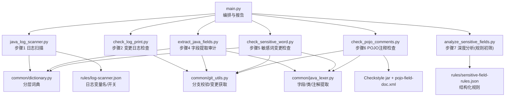
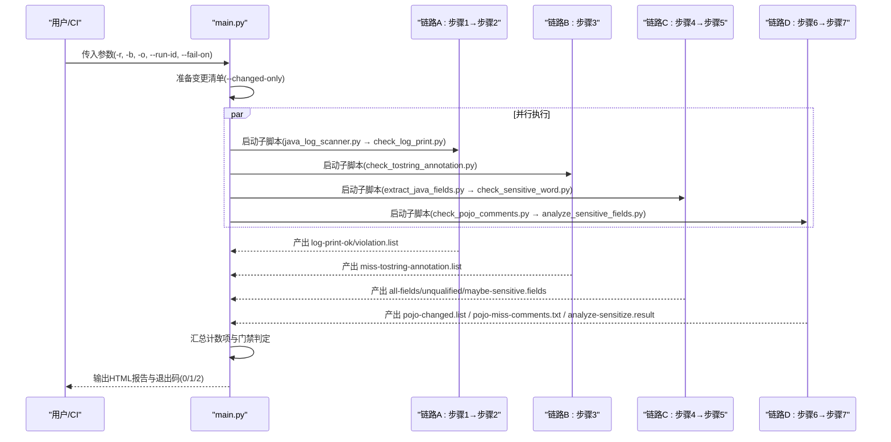
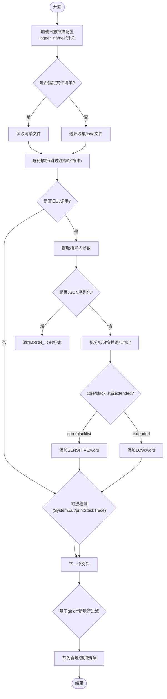
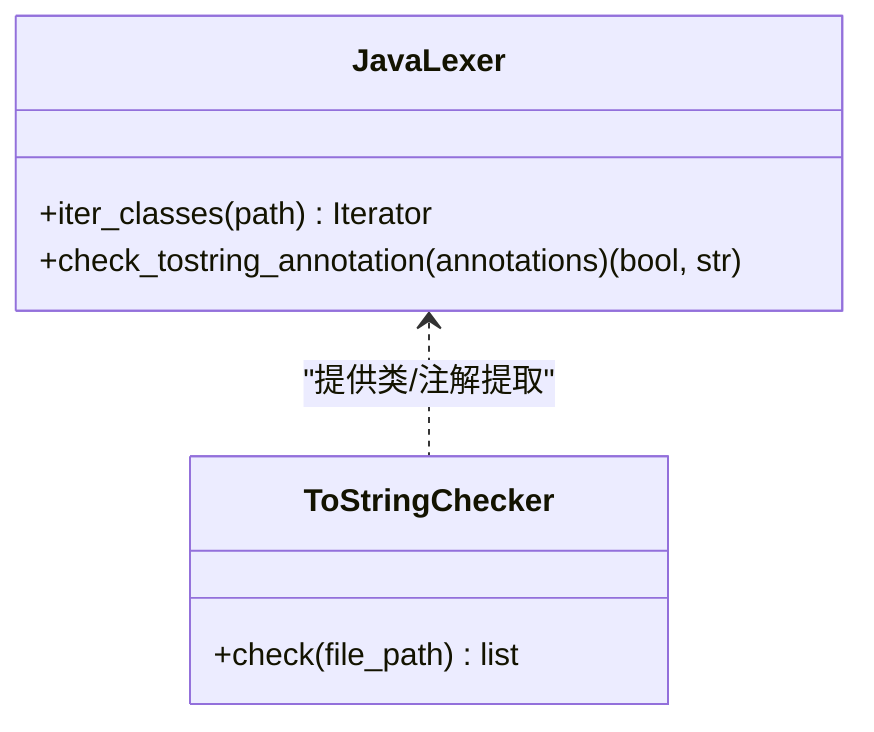
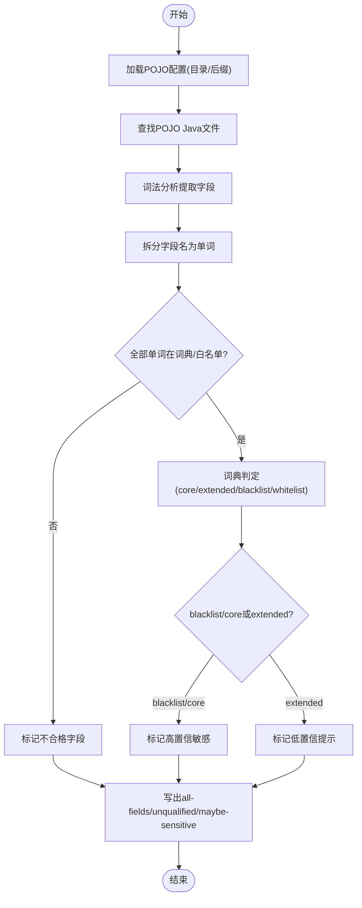
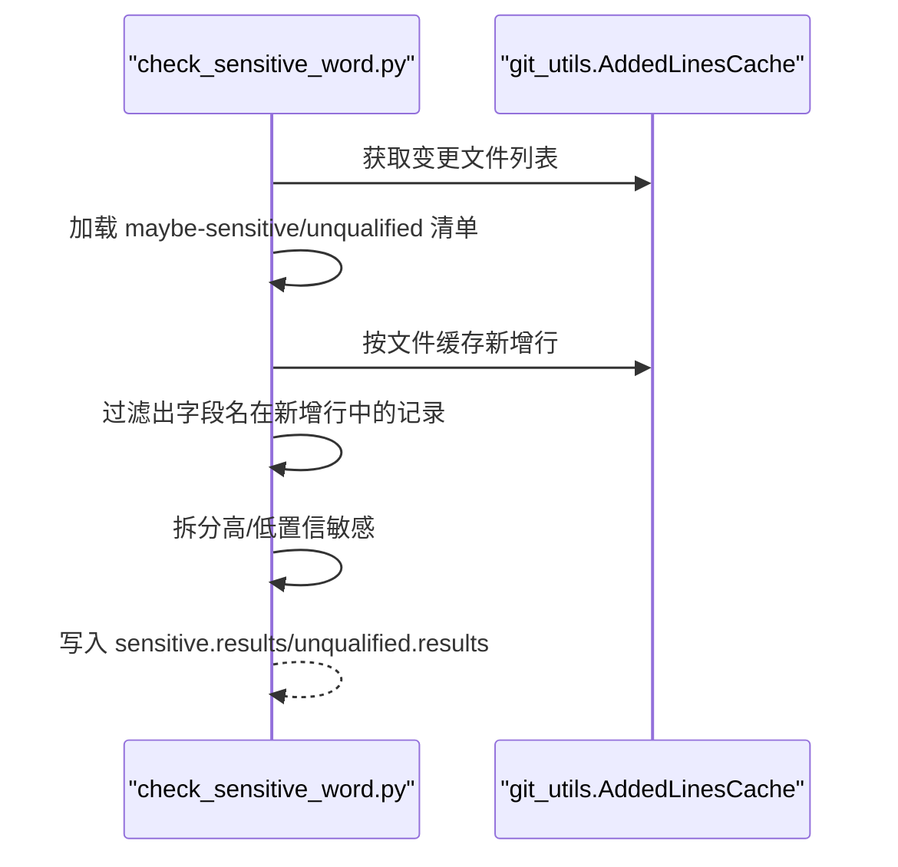
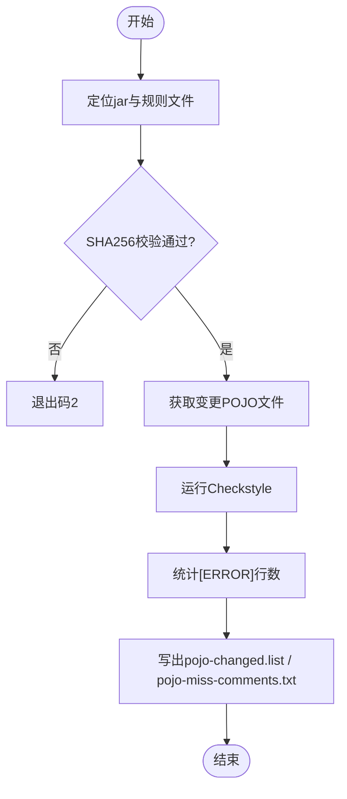
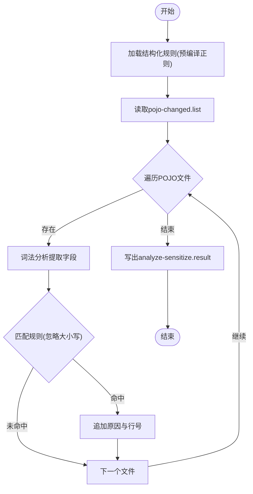
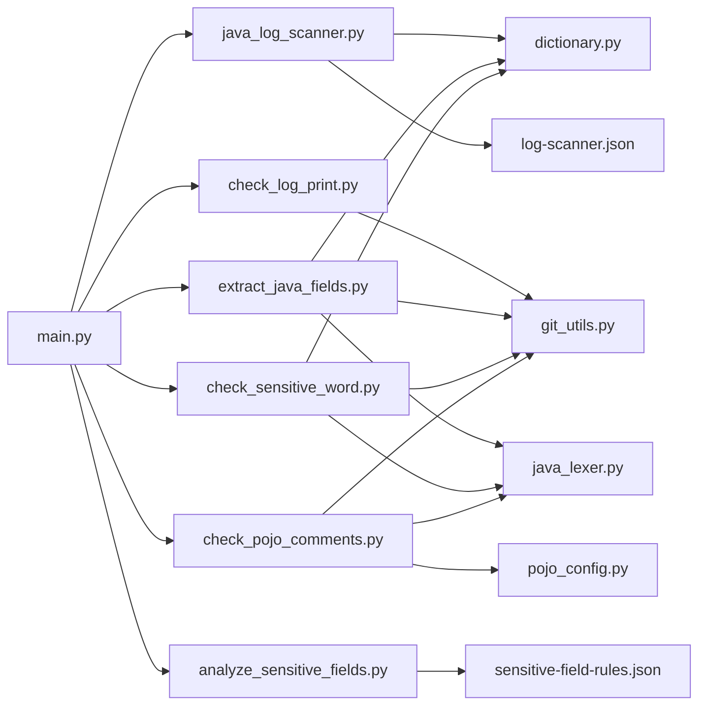

# 敏感信息审查工具

<cite>
**本文引用的文件**
- [README.md](file://sensitive-log-review/README.md)
- [SKILL.md](file://sensitive-log-review/SKILL.md)
- [main.py](file://sensitive-log-review/scripts/main.py)
- [java_log_scanner.py](file://sensitive-log-review/scripts/java_log_scanner.py)
- [check_log_print.py](file://sensitive-log-review/scripts/check_log_print.py)
- [extract_java_fields.py](file://sensitive-log-review/scripts/extract_java_fields.py)
- [check_sensitive_word.py](file://sensitive-log-review/scripts/check_sensitive_word.py)
- [analyze_sensitive_fields.py](file://sensitive-log-review/scripts/analyze_sensitive_fields.py)
- [check_pojo_comments.py](file://sensitive-log-review/scripts/check_pojo_comments.py)
- [dictionary.py](file://sensitive-log-review/scripts/common/dictionary.py)
- [java_lexer.py](file://sensitive-log-review/scripts/common/java_lexer.py)
- [git_utils.py](file://sensitive-log-review/scripts/common/git_utils.py)
- [pojo_config.py](file://sensitive-log-review/scripts/common/pojo_config.py)
- [log-scanner.json](file://sensitive-log-review/scripts/rules/log-scanner.json)
- [sensitive-field-rules.json](file://sensitive-log-review/scripts/rules/sensitive-field-rules.json)
- [pojo.config](file://sensitive-log-review/scripts/rules/pojo.config)
</cite>

## 目录
1. [简介](#简介)
2. [项目结构](#项目结构)
3. [核心组件](#核心组件)
4. [架构总览](#架构总览)
5. [详细组件分析](#详细组件分析)
6. [依赖关系分析](#依赖关系分析)
7. [性能考量](#性能考量)
8. [故障排查指南](#故障排查指南)
9. [结论](#结论)
10. [附录](#附录)

## 简介
本工具面向 Java 项目的“敏感数据不落日志”目标，提供多维度安全检查流水线。基于 JR/T 0171-2020 的敏感数据分类分级标准，通过四链路并行处理模型（日志扫描、字段分析、POJO 注释检查、敏感词检测）实现快速、可配置、可扩展的自动化审查，并生成 HTML 报告与 CI 门禁判定结果。

## 项目结构
- 编排入口：scripts/main.py 负责参数解析、环境准备、四链路并行调度、汇总统计与 HTML 报告生成。
- 检查脚本：
  - 日志输出合规：java_log_scanner.py + check_log_print.py
  - @ToString 注解规范：check_tostring_annotation.py（由 java_lexer 提供类/注解提取能力）
  - 字段命名与敏感性：extract_java_fields.py + check_sensitive_word.py
  - POJO 注释完整性：check_pojo_comments.py（调用 Checkstyle）
  - 深度敏感性分析：analyze_sensitive_fields.py（规则初筛层）
- 公共模块：common/* 提供词典加载、Java 词法分析、Git 封装、POJO 判定等能力。
- 规则与词典：rules/* 与 dictionary/* 提供可配置的规则与分层词典。

**图表来源**
- [main.py:187-297](file://sensitive-log-review/scripts/main.py#L187-L297)
- [java_log_scanner.py:70-103](file://sensitive-log-review/scripts/java_log_scanner.py#L70-L103)
- [check_log_print.py:139-227](file://sensitive-log-review/scripts/check_log_print.py#L139-L227)
- [extract_java_fields.py:52-103](file://sensitive-log-review/scripts/extract_java_fields.py#L52-L103)
- [check_sensitive_word.py:156-243](file://sensitive-log-review/scripts/check_sensitive_word.py#L156-L243)
- [check_pojo_comments.py:183-254](file://sensitive-log-review/scripts/check_pojo_comments.py#L183-L254)
- [analyze_sensitive_fields.py:44-93](file://sensitive-log-review/scripts/analyze_sensitive_fields.py#L44-L93)
- [dictionary.py:80-132](file://sensitive-log-review/scripts/common/dictionary.py#L80-L132)
- [java_lexer.py:180-289](file://sensitive-log-review/scripts/common/java_lexer.py#L180-L289)
- [git_utils.py:57-109](file://sensitive-log-review/scripts/common/git_utils.py#L57-L109)
- [pojo_config.py:27-127](file://sensitive-log-review/scripts/common/pojo_config.py#L27-L127)
- [log-scanner.json:1-7](file://sensitive-log-review/scripts/rules/log-scanner.json#L1-L7)
- [sensitive-field-rules.json:1-45](file://sensitive-log-review/scripts/rules/sensitive-field-rules.json#L1-L45)

**章节来源**
- [README.md:20-53](file://sensitive-log-review/README.md#L20-L53)
- [SKILL.md:70-157](file://sensitive-log-review/SKILL.md#L70-L157)

## 核心组件
- 编排器 main.py：使用线程池并发执行四条链路，汇总各步骤计数项，生成 HTML 报告与门禁判定。
- 日志扫描器：基于正则匹配日志调用、JSON 序列化模式与敏感词，输出合规/违规清单。
- 变更检查器：结合 git diff 新增行过滤，仅对变更内容做门禁判定。
- 字段提取与审计：利用轻量级词法分析器提取字段，进行命名规范与敏感性审计。
- POJO 注释检查：通过 Checkstyle 校验字段文档注释完整性。
- 深度分析：按结构化规则（正则）对字段进行敏感级别判定；AI 语义复核在 Skill 编排层完成（不计入门禁）。

**章节来源**
- [main.py:187-297](file://sensitive-log-review/scripts/main.py#L187-L297)
- [java_log_scanner.py:148-213](file://sensitive-log-review/scripts/java_log_scanner.py#L148-L213)
- [check_log_print.py:58-93](file://sensitive-log-review/scripts/check_log_print.py#L58-L93)
- [extract_java_fields.py:52-81](file://sensitive-log-review/scripts/extract_java_fields.py#L52-L81)
- [check_pojo_comments.py:108-138](file://sensitive-log-review/scripts/check_pojo_comments.py#L108-L138)
- [analyze_sensitive_fields.py:44-93](file://sensitive-log-review/scripts/analyze_sensitive_fields.py#L44-L93)

## 架构总览
四链路并行模型将八个步骤组织为四条独立链路，汇合后统一生成报告与门禁判定。默认仅扫描变更文件，支持全量扫描回退。

**图表来源**
- [main.py:777-786](file://sensitive-log-review/scripts/main.py#L777-L786)
- [main.py:187-297](file://sensitive-log-review/scripts/main.py#L187-L297)
- [README.md:30-53](file://sensitive-log-review/README.md#L30-L53)

## 详细组件分析

### 日志扫描与变更检查（步骤1+2）
- 技术要点：
  - 日志调用识别：基于 logger_names 构建正则，支持多行日志拼接与括号闭合判断。
  - JSON 序列化检测：覆盖 fastjson、Gson、Jackson、Hutool 等常见模式。
  - 敏感词判定：四层优先级（白名单 > 黑名单 > core > extended），区分高置信与低置信提示。
  - 变更过滤：仅保留 git diff 新增行中的命中记录，避免误报历史代码。
- 关键流程：
  - 扫描阶段：逐行读取 Java 源，跳过注释与字符串字面量，提取日志参数并检测违规标签。
  - 变更阶段：匹配清单行到变更文件，再依据新增行内容过滤，区分常规违规与 LOW 提示。

**图表来源**
- [java_log_scanner.py:70-103](file://sensitive-log-review/scripts/java_log_scanner.py#L70-L103)
- [java_log_scanner.py:148-213](file://sensitive-log-review/scripts/java_log_scanner.py#L148-L213)
- [java_log_scanner.py:216-298](file://sensitive-log-review/scripts/java_log_scanner.py#L216-L298)
- [check_log_print.py:58-93](file://sensitive-log-review/scripts/check_log_print.py#L58-L93)
- [check_log_print.py:139-227](file://sensitive-log-review/scripts/check_log_print.py#L139-L227)

**章节来源**
- [java_log_scanner.py:148-213](file://sensitive-log-review/scripts/java_log_scanner.py#L148-L213)
- [check_log_print.py:58-93](file://sensitive-log-review/scripts/check_log_print.py#L58-L93)
- [log-scanner.json:1-7](file://sensitive-log-review/scripts/rules/log-scanner.json#L1-L7)

### @ToString 注解检查（步骤3）
- 技术要点：
  - 类声明迭代：识别 class/interface/enum/record，并提取前置注解。
  - 注解校验：要求 @ToString(of = {...}) 显式控制 toString 输出字段。
- 关键点：
  - 仅对 class 类型进行检查；interface/enum/record 默认跳过或降级为警告。
  - 失败不阻断整体流程，仅产生告警。

**图表来源**
- [java_lexer.py:599-653](file://sensitive-log-review/scripts/common/java_lexer.py#L599-L653)

**章节来源**
- [java_lexer.py:599-653](file://sensitive-log-review/scripts/common/java_lexer.py#L599-L653)

### 字段提取与命名规范审计（步骤4）
- 技术要点：
  - 轻量级词法分析：屏蔽注释与字面量，识别类体字段、record 组件、枚举常量。
  - 命名规范：拆分字段名为单词，对照英文词典与技术缩写白名单判定合格性。
  - 敏感性初判：基于分层词典判定高置信与低置信敏感字段。
- 输出：
  - all-fields.list、unqualified.fields、maybe-sensitive.fields

**图表来源**
- [extract_java_fields.py:52-81](file://sensitive-log-review/scripts/extract_java_fields.py#L52-L81)
- [extract_java_fields.py:84-103](file://sensitive-log-review/scripts/extract_java_fields.py#L84-L103)
- [java_lexer.py:180-289](file://sensitive-log-review/scripts/common/java_lexer.py#L180-L289)
- [pojo_config.py:27-127](file://sensitive-log-review/scripts/common/pojo_config.py#L27-L127)

**章节来源**
- [extract_java_fields.py:52-81](file://sensitive-log-review/scripts/extract_java_fields.py#L52-L81)
- [java_lexer.py:180-289](file://sensitive-log-review/scripts/common/java_lexer.py#L180-L289)

### 敏感词变更检查（步骤5）
- 技术要点：
  - 变更过滤：仅保留字段名出现在 git diff 新增行中的记录。
  - 低置信策略：E 级默认不触发门禁，可通过参数开启。
- 输出：
  - sensitive.results、unqualified.results

**图表来源**
- [check_sensitive_word.py:156-243](file://sensitive-log-review/scripts/check_sensitive_word.py#L156-L243)
- [git_utils.py:85-109](file://sensitive-log-review/scripts/common/git_utils.py#L85-L109)

**章节来源**
- [check_sensitive_word.py:156-243](file://sensitive-log-review/scripts/check_sensitive_word.py#L156-L243)

### POJO 注释检查（步骤6）
- 技术要点：
  - 依赖 Checkstyle 13.7.0 与自定义规则 pojo-field-doc.xml。
  - 校验 jar 完整性（SHA256 基线），防止篡改。
  - 统计 [ERROR] 行数作为注释问题数。
- 输出：
  - pojo-changed.list、pojo-miss-comments.txt

**图表来源**
- [check_pojo_comments.py:108-138](file://sensitive-log-review/scripts/check_pojo_comments.py#L108-L138)
- [check_pojo_comments.py:183-254](file://sensitive-log-review/scripts/check_pojo_comments.py#L183-L254)

**章节来源**
- [check_pojo_comments.py:108-138](file://sensitive-log-review/scripts/check_pojo_comments.py#L108-L138)
- [check_pojo_comments.py:183-254](file://sensitive-log-review/scripts/check_pojo_comments.py#L183-L254)

### 深度敏感性分析（步骤7a/7b）
- 7a 规则初筛：
  - 读取 pojo-changed.list，复用词法分析器提取字段。
  - 对照 rules/sensitive-field-rules.json 的结构化规则（正则），首次命中即止。
  - 输出 analyze-sensitize.result（不含 [LLM] 行）。
- 7b 语义复核（AI 执行体）：
  - 无 Python 脚本，由 AI 在 Skill 编排层执行。
  - 结合字段注释与上下文识别拼音/无意义命名背后的敏感含义。
  - 结果以 [LLM] 前缀追加至 analyze-sensitize.result，不计入门禁统计。

**图表来源**
- [analyze_sensitive_fields.py:44-93](file://sensitive-log-review/scripts/analyze_sensitive_fields.py#L44-L93)
- [analyze_sensitive_fields.py:127-170](file://sensitive-log-review/scripts/analyze_sensitive_fields.py#L127-L170)
- [sensitive-field-rules.json:1-45](file://sensitive-log-review/scripts/rules/sensitive-field-rules.json#L1-L45)

**章节来源**
- [analyze_sensitive_fields.py:44-93](file://sensitive-log-review/scripts/analyze_sensitive_fields.py#L44-L93)
- [SKILL.md:120-152](file://sensitive-log-review/SKILL.md#L120-L152)

## 依赖关系分析
- 编排层依赖：
  - 子脚本：步骤1-7 的具体实现脚本。
  - 公共模块：词典加载、Java 词法分析、Git 封装、POJO 判定。
  - 外部依赖：Checkstyle jar（SHA256 基线保护）、Java Runtime、Git。
- 规则与词典：
  - 规则文件：log-scanner.json、sensitive-field-rules.json、pojo.config。
  - 词典文件：core/extended/blacklist/whitelist、en_US-large.txt、en_US.whitelist。

**图表来源**
- [main.py:187-297](file://sensitive-log-review/scripts/main.py#L187-L297)
- [dictionary.py:80-132](file://sensitive-log-review/scripts/common/dictionary.py#L80-L132)
- [java_lexer.py:180-289](file://sensitive-log-review/scripts/common/java_lexer.py#L180-L289)
- [git_utils.py:57-109](file://sensitive-log-review/scripts/common/git_utils.py#L57-L109)
- [pojo_config.py:27-127](file://sensitive-log-review/scripts/common/pojo_config.py#L27-L127)
- [log-scanner.json:1-7](file://sensitive-log-review/scripts/rules/log-scanner.json#L1-L7)
- [sensitive-field-rules.json:1-45](file://sensitive-log-review/scripts/rules/sensitive-field-rules.json#L1-L45)

**章节来源**
- [main.py:187-297](file://sensitive-log-review/scripts/main.py#L187-L297)
- [dictionary.py:80-132](file://sensitive-log-review/scripts/common/dictionary.py#L80-L132)
- [java_lexer.py:180-289](file://sensitive-log-review/scripts/common/java_lexer.py#L180-L289)
- [git_utils.py:57-109](file://sensitive-log-review/scripts/common/git_utils.py#L57-L109)
- [pojo_config.py:27-127](file://sensitive-log-review/scripts/common/pojo_config.py#L27-L127)

## 性能考量
- 并行执行：四链路使用 ThreadPoolExecutor(max_workers=4) 并发执行，缩短全流程耗时。
- 变更优先：默认 --changed-only 仅扫描相对目标分支的变更文件，显著提升速度。
- 词典缓存：词典文件基于 mtime 缓存，避免重复解析大文件（如 en_US-large.txt）。
- Git 增量：AddedLinesCache 按文件缓存新增行，减少 fork 子进程次数。
- 正则优化：日志调用模式与字段提取正则预编译，降低重复开销。

[本节为通用性能建议，无需特定文件引用]

## 故障排查指南
- 常见问题：
  - 控制台中文乱码：设置 PYTHONIOENCODING=utf-8。
  - 非 git 仓库：确保 -r 指向包含 .git 的仓库目录。
  - 找不到 java：安装 JRE/JDK 并确保 PATH 中可用。
  - 无变更结果：检查 --branch 与 fetch-depth，或使用 --full-scan。
  - 误报/漏报：按词典维护规范调整白名单/黑名单/core/extended。
  - run-id 非法：仅允许字母数字/._-，且不以符号开头，最长 64 字符。
  - jar SHA256 校验失败：重新获取可信 jar 或同步更新基线值。
  - failedFiles 警告：查看 failed-files.list 定位失败文件，必要时启用 --strict-mode。
- 诊断模式：
  - --doctor 逐项检查运行环境（Python/java/git/jar/规则/词典/输出目录），全部通过返回 0，任一失败返回 2。

**章节来源**
- [README.md:361-483](file://sensitive-log-review/README.md#L361-L483)
- [SKILL.md:31-57](file://sensitive-log-review/SKILL.md#L31-L57)

## 结论
本工具通过四链路并行模型与多维度检查（日志、字段、注解、注释、敏感词）构建了高效、可配置、可扩展的敏感信息审查流水线。规则与词典的可插拔设计支持动态扩展，HTML 报告与 CI 门禁集成便于落地实践。建议在团队中推广使用，并结合业务场景持续优化规则与词典。

[本节为总结性内容，无需特定文件引用]

## 附录
- 配置示例：
  - 日志扫描配置：rules/log-scanner.json（logger_names、detect_system_out、detect_print_stack_trace）
  - POJO 判定配置：rules/pojo.config（pojo-dir、pojo-file）
  - 敏感字段规则：rules/sensitive-field-rules.json（category、level、patterns、reason）
- 输出报告格式：
  - 中间产物：log-print-ok.list、log-print-violation.list、miss-tostring-annotation.list、all-fields.list、unqualified.fields、maybe-sensitive.fields、sensitive.results、unqualified.results、pojo-changed.list、pojo-miss-comments.txt、failed-files.list
  - 最终分析结果：analyze-sensitize.result（格式：{file_path}#{field_name}: {reason} (line {line_no})）
  - HTML 报告：sensitive-log-review-report.html（摘要、各维度详情、失败文件区块、建议）

**章节来源**
- [README.md:267-358](file://sensitive-log-review/README.md#L267-L358)
- [SKILL.md:198-264](file://sensitive-log-review/SKILL.md#L198-L264)