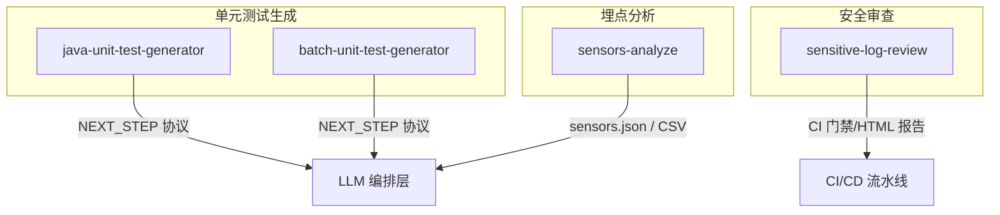
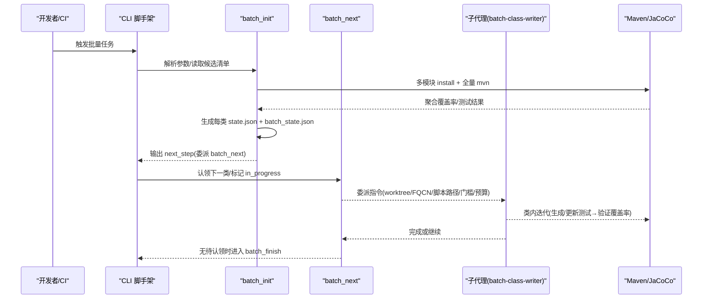
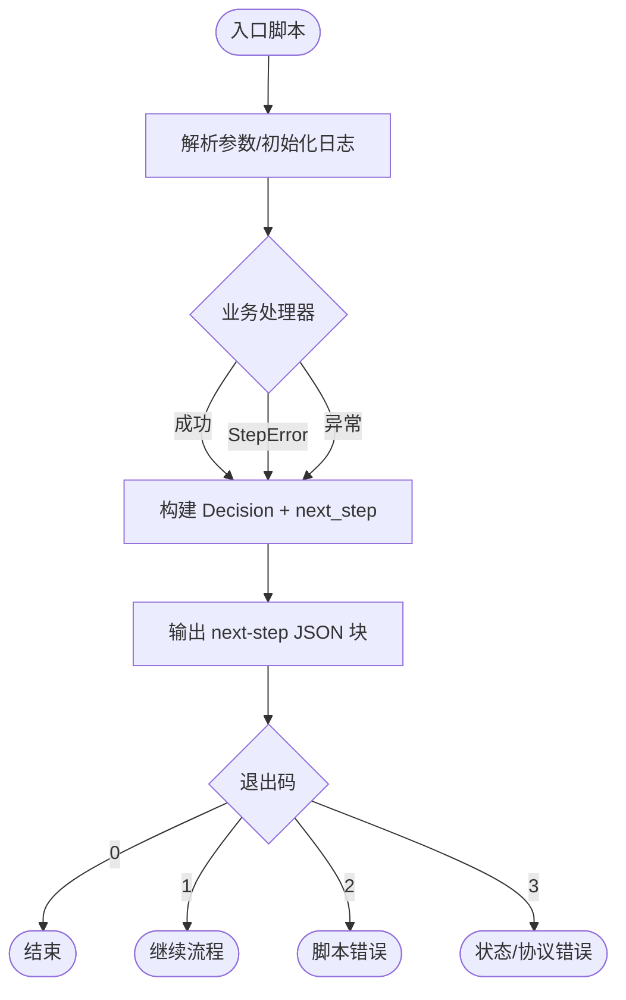
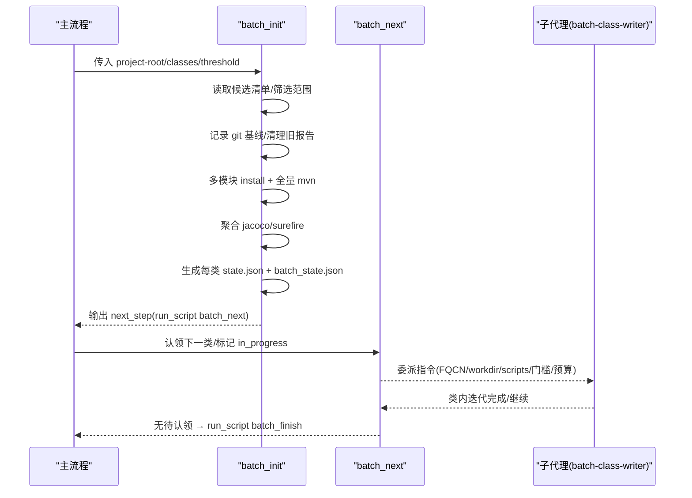
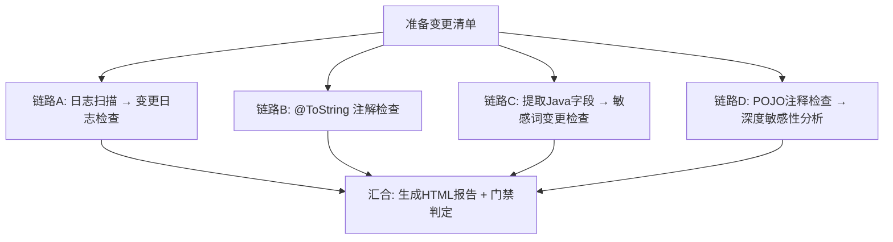
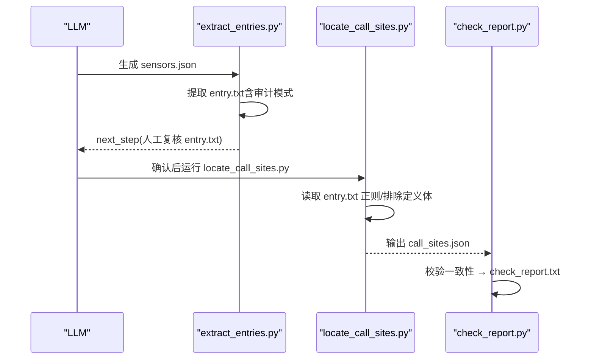
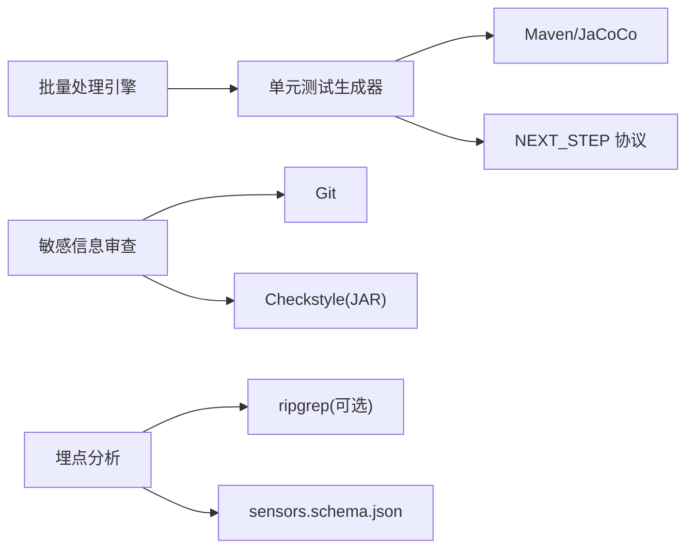

# 核心特性

<cite>
**本文引用的文件**
- [README.md](file://README.md)
- [AGENTS.md](file://AGENTS.md)
- [CLAUDE.md](file://CLAUDE.md)
- [sensitive-log-review/README.md](file://sensitive-log-review/README.md)
- [sensitive-log-review/SKILL.md](file://sensitive-log-review/SKILL.md)
- [java-unit-test-generator/scripts/jaut/cli.py](file://java-unit-test-generator/scripts/jaut/cli.py)
- [batch-unit-test-generator/scripts/batch_init.py](file://batch-unit-test-generator/scripts/batch_init.py)
- [batch-unit-test-generator/scripts/batch_next.py](file://batch-unit-test-generator/scripts/batch_next.py)
- [sensors-analyze/scripts/extract_entries.py](file://sensors-analyze/scripts/extract_entries.py)
- [sensors-analyze/scripts/locate_call_sites.py](file://sensors-analyze/scripts/locate_call_sites.py)
- [sensors-analyze/sensors.schema.json](file://sensors-analyze/sensors.schema.json)
</cite>

## 目录
1. [简介](#简介)
2. [项目结构](#项目结构)
3. [核心组件](#核心组件)
4. [架构总览](#架构总览)
5. [详细组件分析](#详细组件分析)
6. [依赖关系分析](#依赖关系分析)
7. [性能考量](#性能考量)
8. [故障排查指南](#故障排查指南)
9. [结论](#结论)
10. [附录](#附录)

## 简介
本仓库包含四个独立的“技能”（Agent Skills），每个技能可安装到其他项目中独立运行，分别解决以下问题：
- 单元测试生成器：基于覆盖率驱动的增量式测试生成，支持单类与批量处理。
- 敏感信息审查工具：多维度安全检查流水线，覆盖日志扫描、字段分析与 POJO 注释检查等。
- 埋点分析工具：自动发现埋点调用并验证完整性，输出结构化报告。
- 批量处理引擎：在单元测试生成中提供高效并行与断点续跑能力。

这些技能以 Python 脚本为主，遵循统一的协议与退出码契约，便于集成到 CI/CD 流程中。

## 项目结构
- java-unit-test-generator：单类单元测试生成引擎（JUnit5 + Mockito + JaCoCo）。
- batch-unit-test-generator：在同一引擎之上实现批量处理（分支 diff 驱动、按类委派子代理）。
- sensitive-log-review：面向 Java 的敏感信息日志审查流水线，产出 HTML 报告与门禁判定。
- sensors-analyze：埋点审计工具，LLM 与脚本协作，完成从范式识别到调用点定位与校验的全流程。

图表来源
- [CLAUDE.md:36-59](file://CLAUDE.md#L36-L59)
- [AGENTS.md:7-14](file://AGENTS.md#L7-L14)

章节来源
- [AGENTS.md:7-14](file://AGENTS.md#L7-L14)
- [CLAUDE.md:7-14](file://CLAUDE.md#L7-L14)

## 核心组件
- 单元测试生成器（单类）：通过 NEXT_STEP 协议驱动脚本与 LLM 协作，迭代生成测试直至达到覆盖率阈值。
- 单元测试生成器（批量）：在单类引擎基础上，对分支差异中的多个类进行基线构建、认领委派、分组执行与终验。
- 敏感信息审查工具：将八个步骤组织为四条并行链路，汇总生成 HTML 报告与门禁结果。
- 埋点分析工具：五步工作流（LLM 识别范式 → 提取入口候选 → 定位调用点 → LLM 追踪取值 → 校验报告）。

章节来源
- [CLAUDE.md:36-59](file://CLAUDE.md#L36-L59)
- [sensitive-log-review/README.md:20-53](file://sensitive-log-review/README.md#L20-L53)
- [sensors-analyze/CLAUDE.md:11-22](file://sensors-analyze/CLAUDE.md#L11-L22)

## 架构总览
- 统一协议：NEXT_STEP 协议定义状态机与下一步动作；脚本以 JSON 块输出 next_step，配合退出码控制流程。
- 批处理编排：batch_init 负责一次性 install/mvn 聚合覆盖率，生成每类的 state.json；batch_next 认领下一类并委派子代理。
- 安全审查编排：main.py 使用线程池组织四条并行链路，最终汇合生成报告与门禁判定。
- 埋点分析编排：LLM 产出 sensors.json，Python 脚本提取入口正则、定位调用点、校验一致性。

图表来源
- [batch-unit-test-generator/scripts/batch_init.py:62-318](file://batch-unit-test-generator/scripts/batch_init.py#L62-L318)
- [batch-unit-test-generator/scripts/batch_next.py:53-159](file://batch-unit-test-generator/scripts/batch_next.py#L53-L159)
- [CLAUDE.md:38-47](file://CLAUDE.md#L38-L47)

章节来源
- [batch-unit-test-generator/scripts/batch_init.py:62-318](file://batch-unit-test-generator/scripts/batch_init.py#L62-L318)
- [batch-unit-test-generator/scripts/batch_next.py:53-159](file://batch-unit-test-generator/scripts/batch_next.py#L53-L159)
- [CLAUDE.md:38-47](file://CLAUDE.md#L38-L47)

## 详细组件分析

### 单元测试生成器（单类）
- 解决的问题：手工编写测试耗时且覆盖率难以保证；需要自动化、可中断、可恢复的测试生成流程。
- 核心功能：
  - 统一 CLI 脚手架：集中处理参数解析、日志初始化、异常到协议块的转换、next_step 构建与退出码返回。
  - 错误分类：StepError（可预期错误，携带 Decision）、Exception（内部错误，统一转 failed + ask_user）。
  - 协议驱动：脚本输出 next-step JSON 块，指示下一步是 run_script、write_code、ask_user 或 finish。
- 使用场景：对单个 Java 类（可选方法）迭代生成 JUnit5+Mockito 测试，直到达到 JaCoCo 行覆盖率阈值。
- 技术优势：
  - 标准化错误与协议，便于 LLM 编排层稳定接管。
  - 仅允许修改测试代码，保护生产代码与配置。
  - 支持断点续跑与工作区隔离。

图表来源
- [java-unit-test-generator/scripts/jaut/cli.py:95-129](file://java-unit-test-generator/scripts/jaut/cli.py#L95-L129)

章节来源
- [java-unit-test-generator/scripts/jaut/cli.py:1-129](file://java-unit-test-generator/scripts/jaut/cli.py#L1-L129)
- [CLAUDE.md:38-47](file://CLAUDE.md#L38-L47)

### 单元测试生成器（批量）
- 解决的问题：分支变更涉及大量类，逐个生成测试效率低；需要批量基线、认领委派、断点续跑与终验。
- 核心功能：
  - batch_init：一次 install + 一次全量 mvn，聚合 jacoco/surefire，为每个确认类生成 state.json，剔除无待补方法类，排序后生成 batch_state.json。
  - batch_next：读取 batch_state.json，认领下一个 pending/recheck 类，标记 in_progress，输出委派指令给子代理（batch-class-writer），无待认领则进入 batch_finish。
  - 大类拆分：当待补方法数超过阈值时，自动分组以减少单次工作量。
- 使用场景：对分支差异中的多个类进行覆盖率驱动的批量测试生成。
- 技术优势：
  - 减少重复构建成本（install/mvn 仅一次）。
  - 原子写入与文件锁保障并发安全。
  - 支持 reset-claim 复位僵死 in_progress，提升鲁棒性。

图表来源
- [batch-unit-test-generator/scripts/batch_init.py:62-318](file://batch-unit-test-generator/scripts/batch_init.py#L62-L318)
- [batch-unit-test-generator/scripts/batch_next.py:53-159](file://batch-unit-test-generator/scripts/batch_next.py#L53-L159)

章节来源
- [batch-unit-test-generator/scripts/batch_init.py:62-318](file://batch-unit-test-generator/scripts/batch_init.py#L62-L318)
- [batch-unit-test-generator/scripts/batch_next.py:53-159](file://batch-unit-test-generator/scripts/batch_next.py#L53-L159)

### 敏感信息审查工具
- 解决的问题：Java 代码可能将敏感信息输出到日志，需多维度自动化审查以满足合规要求。
- 核心功能：
  - 五大检查维度：日志输出合规、@ToString 注解规范、字段命名规范、敏感字段分析、POJO 字段注释完整性。
  - 并行流水线：main.py 使用线程池组织四条并行链路，最终汇合生成 HTML 报告与门禁判定。
  - 词典与规则：四层优先级词典（白名单 > 黑名单 > 高置信 > 低置信），结构化敏感字段规则（源自 JR/T 0171-2020）。
- 使用场景：PR/MR 合并前检查、安全合规验证、开发阶段实时检查、CI/CD 质量门禁。
- 技术优势：
  - 退出码契约明确（0/1/2），便于 CI 集成。
  - 支持 --changed-only 快速模式与 --full-scan 全量模式。
  - 产物丰富：中间清单、失败文件汇总、HTML 报告。

图表来源
- [sensitive-log-review/README.md:30-53](file://sensitive-log-review/README.md#L30-L53)

章节来源
- [sensitive-log-review/README.md:20-53](file://sensitive-log-review/README.md#L20-L53)
- [sensitive-log-review/SKILL.md:70-157](file://sensitive-log-review/SKILL.md#L70-L157)

### 埋点分析工具
- 解决的问题：代码库中存在多种埋点范式，需自动发现调用点并验证字段完整性。
- 核心功能：
  - 五步工作流：LLM 识别范式并产出 sensors.json → 提取入口函数候选 → 定位调用点 → LLM 追踪取值 → 校验报告。
  - extract_entries.py：从 sensors.json 提取 entry.txt（正则候选），支持审计模式扫描未覆盖函数与 SDK API 调用点。
  - locate_call_sites.py：按 entry.txt 的正则在代码库中定位调用点，排除 wrapper/hook 定义体，输出 call_sites.json。
- 使用场景：跨语言代码库的埋点盘点与完整性校验。
- 技术优势：
  - 严格 schema 约束（sensors.schema.json），确保输入质量。
  - 人工确认门控（entry.txt 需添加 # CONFIRMED），避免误扫。
  - 纯 stdlib 实现，无第三方依赖，便于部署。

图表来源
- [sensors-analyze/CLAUDE.md:11-22](file://sensors-analyze/CLAUDE.md#L11-L22)
- [sensors-analyze/scripts/extract_entries.py:188-303](file://sensors-analyze/scripts/extract_entries.py#L188-L303)
- [sensors-analyze/scripts/locate_call_sites.py:22-45](file://sensors-analyze/scripts/locate_call_sites.py#L22-L45)

章节来源
- [sensors-analyze/CLAUDE.md:11-22](file://sensors-analyze/CLAUDE.md#L11-L22)
- [sensors-analyze/scripts/extract_entries.py:188-303](file://sensors-analyze/scripts/extract_entries.py#L188-L303)
- [sensors-analyze/scripts/locate_call_sites.py:22-45](file://sensors-analyze/scripts/locate_call_sites.py#L22-L45)
- [sensors-analyze/sensors.schema.json:1-262](file://sensors-analyze/sensors.schema.json#L1-L262)

## 依赖关系分析
- 单元测试生成器：
  - 依赖 Maven、JaCoCo、Surefire 进行构建与覆盖率统计。
  - 依赖 NEXT_STEP 协议与模型（models、state、transitions）协调脚本与 LLM。
- 敏感信息审查工具：
  - 依赖 Git（变更清单）、Java Runtime（Checkstyle）、Python 标准库。
  - 依赖规则与词典文件（rules/、dictionary/）进行判定。
- 埋点分析工具：
  - 依赖 ripgrep（可选，回退为纯 Python 扫描）。
  - 依赖 sensors.schema.json 进行输入校验。

图表来源
- [CLAUDE.md:36-59](file://CLAUDE.md#L36-L59)
- [sensitive-log-review/README.md:59-66](file://sensitive-log-review/README.md#L59-L66)
- [sensors-analyze/CLAUDE.md:51-57](file://sensors-analyze/CLAUDE.md#L51-L57)

章节来源
- [CLAUDE.md:36-59](file://CLAUDE.md#L36-L59)
- [sensitive-log-review/README.md:59-66](file://sensitive-log-review/README.md#L59-L66)
- [sensors-analyze/CLAUDE.md:51-57](file://sensors-analyze/CLAUDE.md#L51-L57)

## 性能考量
- 单元测试生成器（批量）：
  - 一次 install + 一次全量 mvn，显著降低重复构建开销。
  - 大类拆分与分组执行，控制单次工作量，提高吞吐。
- 敏感信息审查工具：
  - 默认 --changed-only 仅扫描变更文件，速度快；--full-scan 用于全量审计。
  - 线程池并行四条链路，缩短整体耗时。
- 埋点分析工具：
  - 优先使用 ripgrep 加速搜索，无 rg 时回退纯 Python 扫描。
  - 排除 wrapper/hook 定义体，减少误报与无效扫描。

[本节为通用指导，不直接分析具体文件]

## 故障排查指南
- 单元测试生成器：
  - 若出现状态缺失或参数缺失，会抛出 StepError.state_error，提示补充 --workdir 或 --project-root。
  - 若 Maven 环境缺失或构建失败，会抛出 StepError.exec_error，附带日志文件路径。
- 敏感信息审查工具：
  - 非 git 仓库、规则 JSON 损坏、jar 校验失败等会返回退出码 2，并提供结构化错误码（E001-E007）与修复建议。
  - 可通过 --doctor 进行环境诊断，逐项检查 Python/java/git/jar/规则/词典/输出目录。
- 埋点分析工具：
  - sensors.json 缺少 paradigms 或根类型不符会报错；entry.txt 未添加 # CONFIRMED 无法执行 locate_call_sites.py。
  - 审计模式会输出疑似遗漏函数与未覆盖 SDK API 调用点的日志，需修正 sensors.json 后重新运行。

章节来源
- [java-unit-test-generator/scripts/jaut/cli.py:25-46](file://java-unit-test-generator/scripts/jaut/cli.py#L25-L46)
- [sensitive-log-review/README.md:418-469](file://sensitive-log-review/README.md#L418-L469)
- [sensors-analyze/scripts/extract_entries.py:176-185](file://sensors-analyze/scripts/extract_entries.py#L176-L185)
- [sensors-analyze/scripts/locate_call_sites.py:22-27](file://sensors-analyze/scripts/locate_call_sites.py#L22-L27)

## 结论
本仓库提供的四个技能覆盖了单元测试生成、敏感信息审查、埋点分析与批量处理等关键工程实践。它们以协议化、脚本化与可插拔的方式，适配不同项目与 CI/CD 环境，具备明确的退出码契约、丰富的产物与良好的可扩展性。建议在团队中推广使用，结合各自项目的规则与词典定制，持续提升代码质量与合规水平。

[本节为总结，不直接分析具体文件]

## 附录
- 常用命令参考：
  - 单元测试生成器（批量）：python scripts/batch_init.py --project-root <repo> --classes all --threshold 80
  - 敏感信息审查：python scripts/main.py -r . -b master -o ./review-output
  - 埋点分析：python scripts/extract_entries.py --sensors sensors.json --out entry.txt --audit --root <target>
- 产物说明：
  - 单元测试生成器：state.json、coverage 历史、mvn.log
  - 敏感信息审查：HTML 报告、中间清单、failed-files.list
  - 埋点分析：entry.txt、call_sites.json、sensors.csv、check_report.txt

[本节为参考信息，不直接分析具体文件]