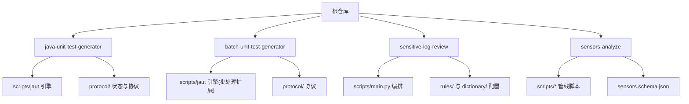
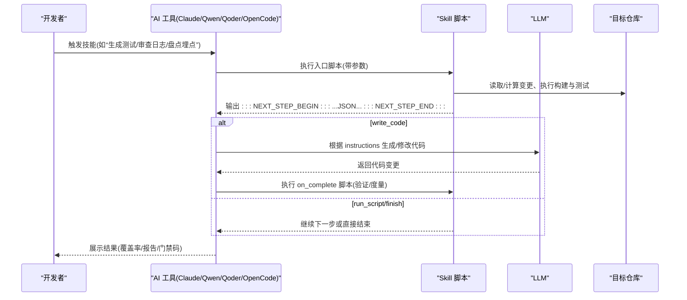
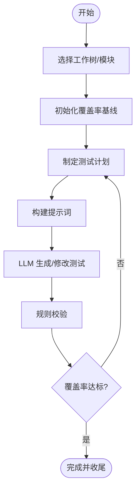
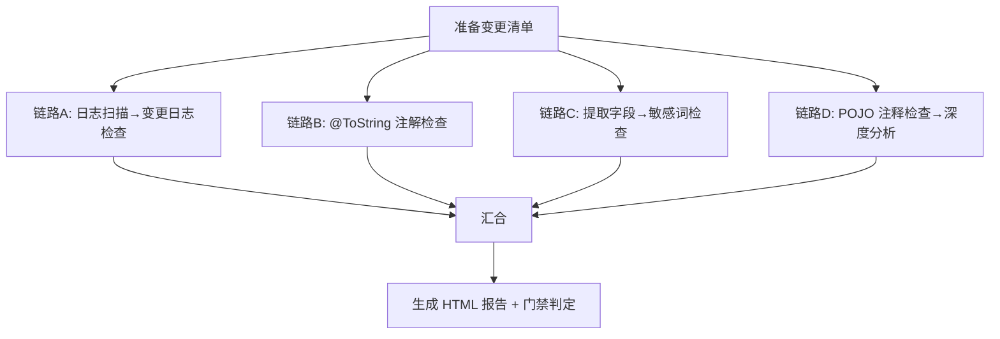
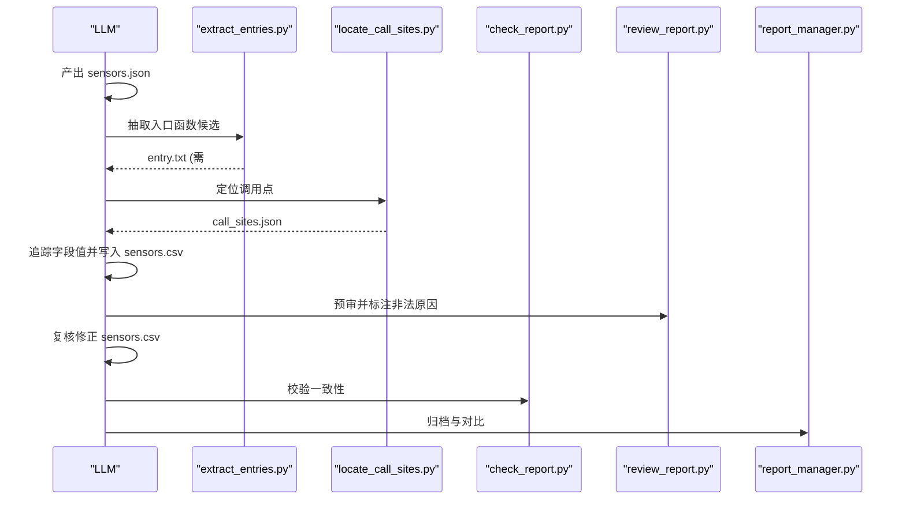
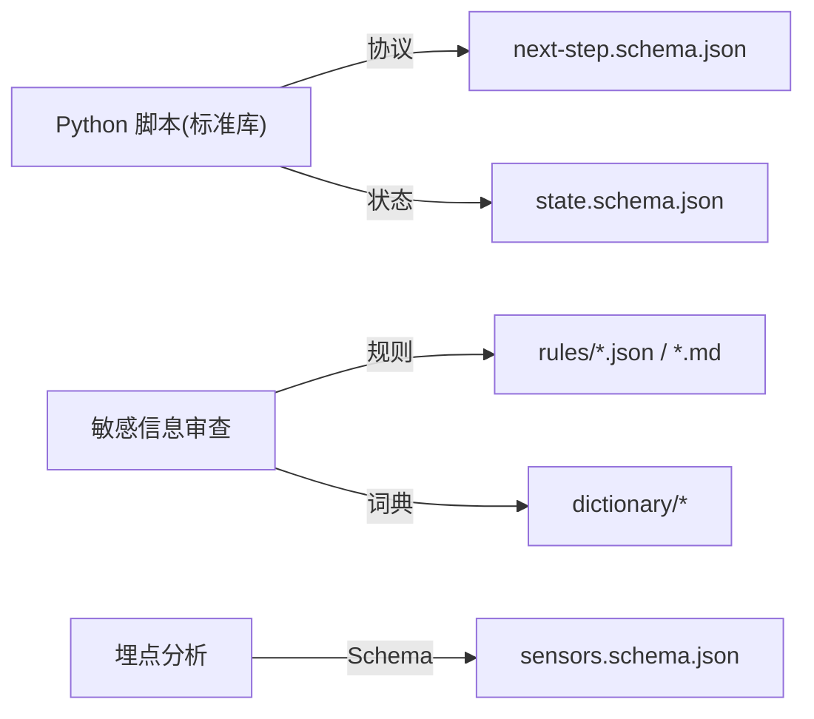

# 项目介绍

<cite>
**本文引用的文件**
- [README.md](file://README.md)
- [CLAUDE.md](file://CLAUDE.md)
- [AGENTS.md](file://AGENTS.md)
- [install.sh](file://install.sh)
- [sensitive-log-review/README.md](file://sensitive-log-review/README.md)
- [sensitive-log-review/SKILL.md](file://sensitive-log-review/SKILL.md)
- [sensors-analyze/CLAUDE.md](file://sensors-analyze/CLAUDE.md)
- [batch-unit-test-generator/protocol/next-step.schema.json](file://batch-unit-test-generator/protocol/next-step.schema.json)
- [java-unit-test-generator/protocol/state.schema.json](file://java-unit-test-generator/protocol/state.schema.json)
</cite>

## 目录
1. [简介](#简介)
2. [项目结构](#项目结构)
3. [核心组件](#核心组件)
4. [架构总览](#架构总览)
5. [详细组件分析](#详细组件分析)
6. [依赖关系分析](#依赖关系分析)
7. [性能与可维护性](#性能与可维护性)
8. [故障排查指南](#故障排查指南)
9. [结论](#结论)
10. [附录](#附录)

## 简介
ping-skills 是一个面向 AI 编程助手的“可插拔技能”集合，为 Claude Code、Qwen、Qoder、OpenCode 等主流工具提供即装即用的工程化能力。它聚焦三大开发痛点：
- 自动化测试生成：基于覆盖率目标持续迭代生成高质量单元测试，支持单类与批量模式。
- 敏感信息审查：对 Java 变更进行日志输出、字段命名、注解与注释等多维度审计，输出 HTML 报告并接入 CI 门禁。
- 埋点分析：盘点与校验业务埋点调用，形成可追溯的 CSV 清单，辅助数据治理与合规审计。

项目的核心价值在于以标准化协议驱动脚本与 LLM 协作，零第三方依赖（运行期仅 Python 标准库），模块化、可插拔、可移植，让不同团队快速将 AI 能力嵌入现有研发流程。

**章节来源**
- [CLAUDE.md:5-14](file://CLAUDE.md#L5-L14)
- [AGENTS.md:5-14](file://AGENTS.md#L5-L14)

## 项目结构
仓库由多个独立 Skill 组成，每个 Skill 自包含说明文档、协议定义、Python 脚本与测试套件，便于单独安装到目标项目中：
- java-unit-test-generator：单类 JUnit5+Mockito 测试生成，按 JaCoCo 行覆盖率阈值迭代。
- batch-unit-test-generator：在分支 diff 上批量生成测试，通过子代理协调多类任务。
- sensitive-log-review：Java 变更敏感信息日志审查流水线，产出 HTML 报告与 CI 门禁码。
- sensors-analyze：埋点盘点与校验，产出 sensors.csv 并支持版本对比与人工复核。

**图表来源**
- [CLAUDE.md:36-59](file://CLAUDE.md#L36-L59)
- [AGENTS.md:5-14](file://AGENTS.md#L5-L14)

**章节来源**
- [CLAUDE.md:5-14](file://CLAUDE.md#L5-L14)
- [AGENTS.md:5-14](file://AGENTS.md#L5-L14)

## 核心组件
- 可插拔安装器：一键将技能复制到目标项目的工具目录，自动剥离无关文件并按目标工具清理元数据。
- 标准化协议通信：脚本间通过 JSON 协议块传递下一步指令与产物，确保 LLM 与脚本稳定协作。
- 模块化架构：每个 Skill 内 scripts/common 提供共享能力；规则与词典集中管理，便于演进与维护。
- 零第三方依赖：运行期仅使用 Python 标准库，降低部署复杂度与环境差异。

**章节来源**
- [install.sh:1-289](file://install.sh#L1-L289)
- [CLAUDE.md:36-59](file://CLAUDE.md#L36-L59)
- [AGENTS.md:16-28](file://AGENTS.md#L16-L28)

## 架构总览
整体采用“脚本驱动 + LLM 参与”的双轨架构：
- 脚本负责环境交互、代码扫描、构建与覆盖率统计、报告生成等确定性任务。
- LLM 负责在约定步骤生成或修改测试代码、语义复核与决策建议。
- 通过 NEXT_STEP 协议与 state.json 状态机，实现断点续跑、重试与预算控制。

**图表来源**
- [batch-unit-test-generator/protocol/next-step.schema.json:1-195](file://batch-unit-test-generator/protocol/next-step.schema.json#L1-L195)
- [java-unit-test-generator/protocol/state.schema.json:1-151](file://java-unit-test-generator/protocol/state.schema.json#L1-L151)
- [CLAUDE.md:36-59](file://CLAUDE.md#L36-L59)

## 详细组件分析

### 自动化测试生成（单类与批量）
- 单类生成：选择工作树 → 初始化覆盖率 → 制定计划 → 构建提示词 → LLM 写测试 → 规则校验 → 覆盖率验证，循环直至达标。
- 批量生成：先计算分支 diff 候选类，再逐个委派给子代理完成上述流程，支持自动继续与升级策略。
- 协议与状态：通过 next-step.schema.json 统一指令格式，state.json 持久化进度、覆盖率轨迹与预算计数，支持断点续跑。

**图表来源**
- [CLAUDE.md:36-59](file://CLAUDE.md#L36-L59)
- [batch-unit-test-generator/protocol/next-step.schema.json:1-195](file://batch-unit-test-generator/protocol/next-step.schema.json#L1-L195)
- [java-unit-test-generator/protocol/state.schema.json:1-151](file://java-unit-test-generator/protocol/state.schema.json#L1-L151)

**章节来源**
- [CLAUDE.md:36-59](file://CLAUDE.md#L36-L59)
- [AGENTS.md:41-45](file://AGENTS.md#L41-L45)

### 敏感信息日志审查
- 五维检查：日志输出合规、@ToString 注解、字段命名、敏感字段分析、POJO 注释完整性。
- 并行流水线：主编排脚本组织四条链路并行执行，最终汇总生成 HTML 报告与门禁判定。
- 词典与规则：分层词典（白名单/黑名单/高置信/低置信）与结构化规则（JR/T 0171-2020 分类）结合，兼顾准确性与可维护性。
- CI 集成：退出码契约明确（0/1/2），支持并行隔离与严格模式。

**图表来源**
- [sensitive-log-review/README.md:30-55](file://sensitive-log-review/README.md#L30-L55)
- [sensitive-log-review/SKILL.md:70-157](file://sensitive-log-review/SKILL.md#L70-L157)

**章节来源**
- [sensitive-log-review/README.md:1-497](file://sensitive-log-review/README.md#L1-L497)
- [sensitive-log-review/SKILL.md:1-288](file://sensitive-log-review/SKILL.md#L1-L288)

### 埋点分析（Sensors Analyze）
- 五步流水线：LLM 识别埋点范式并产出 sensors.json → 脚本抽取入口候选 → 定位调用点 → LLM 追踪字段值 → 脚本校验一致性并归档。
- 约束与质量门：只读目标代码库，CSV 中不允许动态占位符；entry.txt 需人工确认标记后方可继续；支持版本对比与人工复核。
- 输出规范：固定列顺序的 sensors.csv，call_sites.json 记录调用点位置与片段。

**图表来源**
- [sensors-analyze/CLAUDE.md:11-73](file://sensors-analyze/CLAUDE.md#L11-L73)

**章节来源**
- [sensors-analyze/CLAUDE.md:1-73](file://sensors-analyze/CLAUDE.md#L1-L73)

## 依赖关系分析
- 运行时依赖：Python 标准库；测试阶段需要 pytest。
- 外部工具：敏感信息审查依赖 Java Runtime（用于 Checkstyle）；埋点分析可选 ripgrep 但回退纯 Python grep。
- 协议与配置：NEXT_STEP 协议与 state.json 作为跨脚本/跨工具的契约；规则与词典集中管理，避免硬编码。

**图表来源**
- [batch-unit-test-generator/protocol/next-step.schema.json:1-195](file://batch-unit-test-generator/protocol/next-step.schema.json#L1-L195)
- [java-unit-test-generator/protocol/state.schema.json:1-151](file://java-unit-test-generator/protocol/state.schema.json#L1-L151)
- [sensitive-log-review/README.md:267-338](file://sensitive-log-review/README.md#L267-L338)
- [sensors-analyze/CLAUDE.md:53-69](file://sensors-analyze/CLAUDE.md#L53-L69)

**章节来源**
- [AGENTS.md:16-28](file://AGENTS.md#L16-L28)
- [sensitive-log-review/README.md:57-111](file://sensitive-log-review/README.md#L57-L111)
- [sensors-analyze/CLAUDE.md:49-69](file://sensors-analyze/CLAUDE.md#L49-L69)

## 性能与可维护性
- 增量与并行：敏感信息审查默认仅扫描变更文件，并通过多线程并行四条链路；埋点分析支持抽样与并行定位。
- 零依赖设计：脚本不引入第三方包，减少环境差异与安装成本；测试套件仅在开发时使用 pytest。
- 可观测性与可恢复：协议与状态文件保证中断后可恢复；HTML 报告与结构化错误码便于问题定位。
- 可演进性：规则与词典集中管理，版本头与变更流程清晰；双副本 jaut 引擎已识别差异，更新时需同步回归。

[本节为通用指导，不直接分析具体文件]

## 故障排查指南
- 敏感信息审查
  - 控制台中文乱码：设置 PYTHONIOENCODING=utf-8。
  - 非 git 仓库：显式传入 -r 指向仓库根。
  - 找不到 java：安装 JRE/JDK 并确保 PATH。
  - 无变更结果：检查 --branch 与完整历史；必要时使用 --full-scan。
  - 误报/漏报：按白名单/黑名单/核心词/扩展词维护流程调整词典与规则。
  - 门禁失败：查看控制台末尾计数与 HTML 报告，定位具体文件与行号。
  - 环境诊断：使用 --doctor 逐项检查环境与依赖。
- 埋点分析
  - 只读约束：不得修改目标代码库。
  - 动态占位符：CSV 中必须为具体值，无法解析时留空并接受 WARN。
  - 人工确认：entry.txt 需添加 # CONFIRMED 后再执行后续步骤。
- 测试生成
  - 协议冲突优先级：Schema > 规则 > SKILL.md > LLM 判断。
  - 仅允许修改测试文件：禁止改动生产代码与配置文件。
  - 双副本引擎：修改共享逻辑需同时比对两份 jaut 并运行两套单测。

**章节来源**
- [sensitive-log-review/README.md:361-483](file://sensitive-log-review/README.md#L361-L483)
- [sensitive-log-review/SKILL.md:31-57](file://sensitive-log-review/SKILL.md#L31-L57)
- [sensors-analyze/CLAUDE.md:59-73](file://sensors-analyze/CLAUDE.md#L59-L73)
- [CLAUDE.md:36-59](file://CLAUDE.md#L36-L59)
- [AGENTS.md:41-45](file://AGENTS.md#L41-L45)

## 结论
ping-skills 以“标准化协议 + 零依赖脚本 + 模块化技能”的方式，将 AI 能力无缝嵌入现有研发流程，解决自动化测试生成、敏感信息审查与埋点分析等高频痛点。其可插拔设计与清晰的退出码契约，使其易于在 CI 中落地与规模化推广。未来可在以下方向持续演进：
- 进一步收敛双副本 jaut 引擎，提升复用度与一致性。
- 扩展更多语言与框架的技能（如 Spring Boot、React/Vue）。
- 增强可视化与可观测性（覆盖率趋势、埋点覆盖率看板）。
- 完善规则与词典的自动化治理与灰度发布机制。

[本节为总结性内容，不直接分析具体文件]

## 附录
- 安装与使用
  - 一键安装：./install.sh <claude|qwen|qoder|opencode|all> [<skill>[,<skill>...]] [<project-dir>]
  - 运行测试：进入对应 skill 目录后执行 python3 -m pytest tests/
- 关键命令参考
  - 敏感信息审查：python scripts/main.py -r . -b master -o ./review-output
  - 埋点分析：见 sensors-analyze/CLAUDE.md 中的命令段
  - 测试生成：遵循各 skill 的 CLI 帮助与协议指引

**章节来源**
- [CLAUDE.md:16-34](file://CLAUDE.md#L16-L34)
- [AGENTS.md:16-28](file://AGENTS.md#L16-L28)
- [sensitive-log-review/README.md:127-160](file://sensitive-log-review/README.md#L127-L160)
- [sensors-analyze/CLAUDE.md:23-47](file://sensors-analyze/CLAUDE.md#L23-L47)