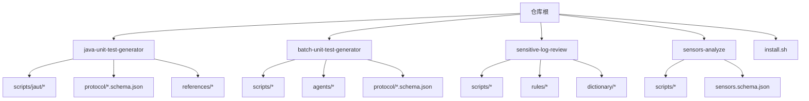
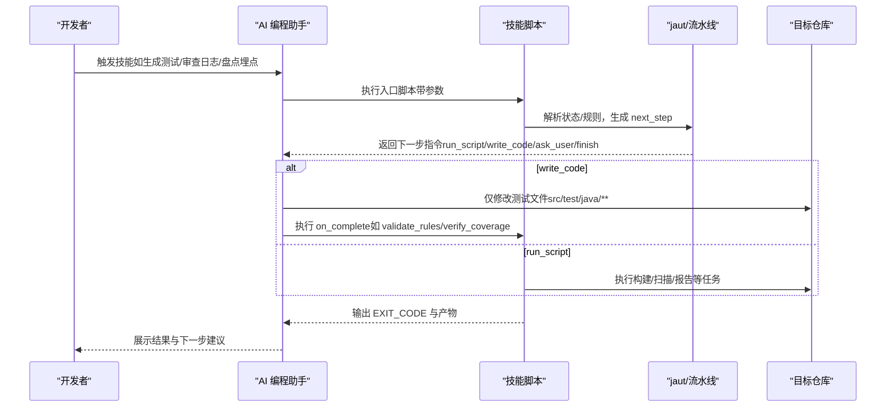
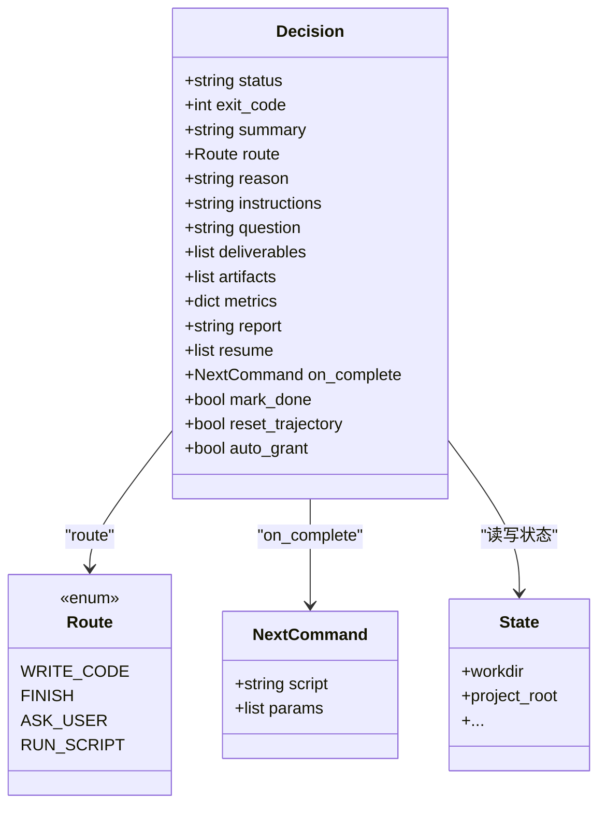
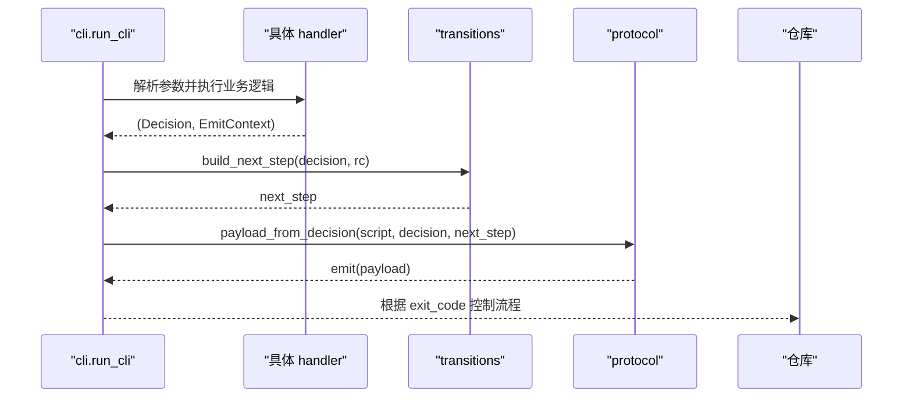
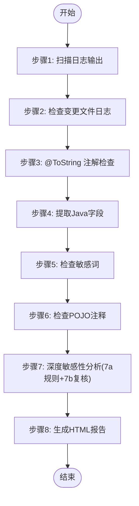
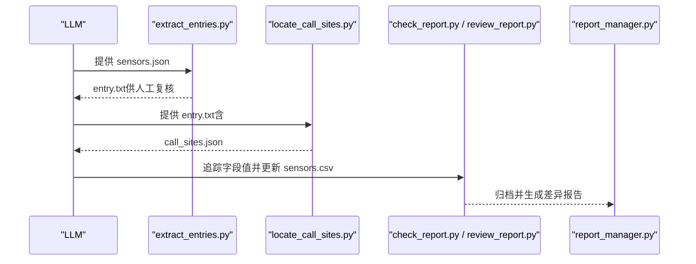
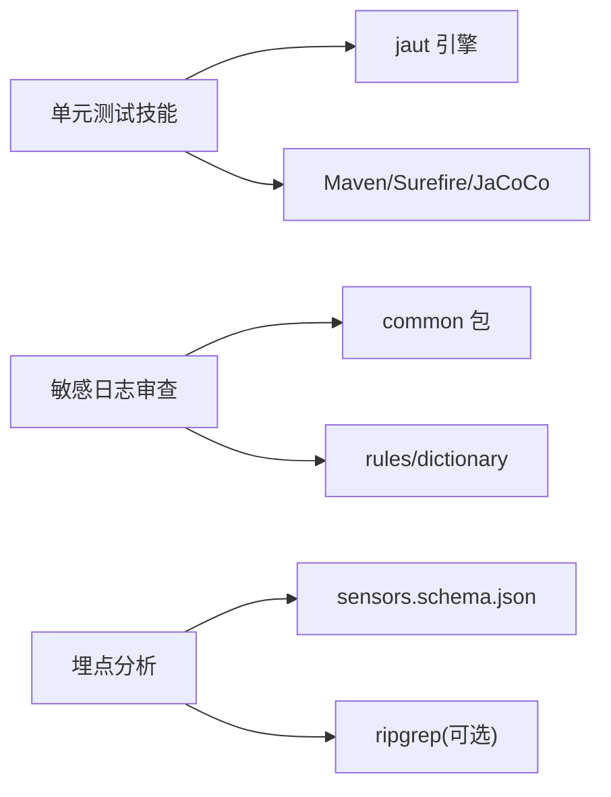

# 项目概述

<cite>
**本文引用的文件**
- [README.md](file://README.md)
- [CLAUDE.md](file://CLAUDE.md)
- [AGENTS.md](file://AGENTS.md)
- [install.sh](file://install.sh)
- [sensitive-log-review/SKILL.md](file://sensitive-log-review/SKILL.md)
- [sensors-analyze/CLAUDE.md](file://sensors-analyze/CLAUDE.md)
- [java-unit-test-generator/scripts/jaut/cli.py](file://java-unit-test-generator/scripts/jaut/cli.py)
- [batch-unit-test-generator/scripts/batch_init.py](file://batch-unit-test-generator/scripts/batch_init.py)
- [sensitive-log-review/scripts/main.py](file://sensitive-log-review/scripts/main.py)
- [sensors-analyze/scripts/extract_entries.py](file://sensors-analyze/scripts/extract_entries.py)
- [java-unit-test-generator/scripts/jaut/transitions.py](file://java-unit-test-generator/scripts/jaut/transitions.py)
- [java-unit-test-generator/scripts/jaut/protocol.py](file://java-unit-test-generator/scripts/jaut/protocol.py)
- [java-unit-test-generator/scripts/jaut/models.py](file://java-unit-test-generator/scripts/jaut/models.py)
</cite>

## 目录
1. [简介](#简介)
2. [项目结构](#项目结构)
3. [核心组件](#核心组件)
4. [架构总览](#架构总览)
5. [详细组件分析](#详细组件分析)
6. [依赖关系分析](#依赖关系分析)
7. [性能考量](#性能考量)
8. [故障排查指南](#故障排查指南)
9. [结论](#结论)
10. [附录：快速开始](#附录快速开始)

## 简介
ping-skills 是一个面向 AI 编程助手（Claude Code、Qwen、Qoder、OpenCode）的可插拔“技能”集合库。它不是单一应用，而是将四个独立技能以“可安装到目标项目的插件”形式交付，每个技能包含工作流说明、协议与规则、驱动脚本和测试套件。其核心价值在于：
- 为 Java 单元测试生成提供“迭代式 + 覆盖率达标”的自动化流程；
- 为敏感信息日志输出提供“多阶段扫描 + 报告 + CI 门禁”的安全合规能力；
- 为埋点实现提供“从代码到 CSV 的盘点与校验”工具链；
- 通过统一的协议与退出码契约，让 LLM 与脚本协同执行，稳定可控。

该仓库采用 Python 3.10+ 作为主要实现语言，结合 Java 生态（Maven、Surefire、JaCoCo、Checkstyle）与 JSON Schema 进行数据契约约束，强调跨平台、无第三方运行时依赖（除测试与外部工具外），并通过清晰的退出码与产物约定对接 CI。

**章节来源**
- [CLAUDE.md:5-14](file://CLAUDE.md#L5-L14)
- [AGENTS.md:5-14](file://AGENTS.md#L5-L14)

## 项目结构
仓库根目录下按“技能”划分模块，每个技能自包含文档、协议、脚本与测试：
- java-unit-test-generator：单类 JUnit5+Mockito 测试生成器（基于 NEXT_STEP 协议与 jaut 引擎）
- batch-unit-test-generator：批量类级测试生成器（在分支 diff 上批量委派子代理）
- sensitive-log-review：敏感信息日志审查（多阶段流水线 + HTML 报告 + CI 门禁）
- sensors-analyze：埋点盘点与校验（LLM + Python 混合流水线，输出 sensors.csv）

此外，根目录提供 install.sh 用于将技能安装到目标项目的 .claude/.qwen/.qoder/.opencode 目录，并自动裁剪无关文件与 SKILL.md 中的 tools 行。

**图表来源**
- [CLAUDE.md:36-59](file://CLAUDE.md#L36-L59)
- [AGENTS.md:5-14](file://AGENTS.md#L5-L14)

**章节来源**
- [AGENTS.md:5-14](file://AGENTS.md#L5-L14)
- [CLAUDE.md:36-59](file://CLAUDE.md#L36-L59)

## 核心组件
- 单元测试生成器（单类/批量）
  - 使用 NEXT_STEP 协议驱动脚本与 LLM 协作，状态持久化在 state.json，仅允许修改 src/test/java/** 下的测试文件；
  - 通过 Maven Surefire 运行测试、JaCoCo 计算覆盖率，直至达到阈值；
  - 批量模式支持分支 diff 候选类筛选、一次性 install/mvn、逐类委派子代理。
- 敏感信息日志审查
  - 六阶段流水线：日志扫描 → 变更日志检查 → @ToString 注解检查 → 字段提取 → 敏感词检查 → POJO 注释检查 → 深度敏感性分析（规则初筛 + LLM 语义复核）→ HTML 报告；
  - 统一退出码契约（0/1/2）与门禁类别，便于 CI 集成。
- 埋点分析
  - LLM 产出 sensors.json（受 schema 约束），Python 脚本提取入口函数、定位调用点、追踪字段值、校验一致性并归档版本差异；
  - 严格约束：只读目标代码库、CSV 中不允许动态占位符、entry.txt 需人工确认标记。

**章节来源**
- [CLAUDE.md:36-59](file://CLAUDE.md#L36-L59)
- [sensitive-log-review/SKILL.md:70-157](file://sensitive-log-review/SKILL.md#L70-L157)
- [sensors-analyze/CLAUDE.md:11-21](file://sensors-analyze/CLAUDE.md#L11-L21)

## 架构总览
整体由“脚本驱动 + LLM 参与”的双轨架构组成：
- 脚本负责环境准备、构建、解析报告、状态管理、协议封装与退出码；
- LLM 在指定步骤写入测试代码或进行语义复核，遵循“Schema > Rules > SKILL.md > 判断”的权威顺序；
- 各技能通过 install.sh 安装到目标项目，保持职责边界清晰、可独立演进。

**图表来源**
- [java-unit-test-generator/scripts/jaut/cli.py:95-128](file://java-unit-test-generator/scripts/jaut/cli.py#L95-L128)
- [java-unit-test-generator/scripts/jaut/transitions.py:39-68](file://java-unit-test-generator/scripts/jaut/transitions.py#L39-L68)
- [java-unit-test-generator/scripts/jaut/protocol.py:28-56](file://java-unit-test-generator/scripts/jaut/protocol.py#L28-L56)

**章节来源**
- [CLAUDE.md:36-59](file://CLAUDE.md#L36-L59)
- [java-unit-test-generator/scripts/jaut/cli.py:95-128](file://java-unit-test-generator/scripts/jaut/cli.py#L95-L128)

## 详细组件分析

### 单元测试生成器（单类与批量）
- 单类生成器
  - CLI 统一脚手架：解析参数、初始化日志、异常转协议块、构建 next_step 并输出退出码；
  - 状态机与路由：Decision -> Route -> transitions.build_next_step -> protocol.emit；
  - 协议负载：包含 protocol_version、script、status、exit_code、summary、artifacts、next_step。
- 批量生成器
  - batch_init 阶段：读取候选清单、记录 git 基线、一次 install、清理旧报告、一次 mvn、聚合 jacoco/surefire、为每个类生成 state.json 并排序；
  - 后续由 batch_next 逐类委派子代理完成写码与验证。

**图表来源**
- [java-unit-test-generator/scripts/jaut/models.py:297-349](file://java-unit-test-generator/scripts/jaut/models.py#L297-L349)
- [java-unit-test-generator/scripts/jaut/transitions.py:39-68](file://java-unit-test-generator/scripts/jaut/transitions.py#L39-L68)

**图表来源**
- [java-unit-test-generator/scripts/jaut/cli.py:95-128](file://java-unit-test-generator/scripts/jaut/cli.py#L95-L128)
- [java-unit-test-generator/scripts/jaut/transitions.py:39-68](file://java-unit-test-generator/scripts/jaut/transitions.py#L39-L68)
- [java-unit-test-generator/scripts/jaut/protocol.py:28-56](file://java-unit-test-generator/scripts/jaut/protocol.py#L28-L56)

**章节来源**
- [java-unit-test-generator/scripts/jaut/cli.py:95-128](file://java-unit-test-generator/scripts/jaut/cli.py#L95-L128)
- [batch-unit-test-generator/scripts/batch_init.py:1-24](file://batch-unit-test-generator/scripts/batch_init.py#L1-L24)
- [batch-unit-test-generator/scripts/batch_init.py:62-200](file://batch-unit-test-generator/scripts/batch_init.py#L62-L200)

### 敏感信息日志审查
- 流水线编排：主脚本 main.py 组织六个阶段并行链路，汇总后生成 HTML 报告；
- 退出码契约：0=通过，1=触发门禁（可按类别配置），2=执行错误；
- 词典与规则：分层词典（白名单/黑名单/核心/扩展）与结构化规则（JSON），支持 JR/T 0171-2020 分类；
- 深度分析：7a 规则初筛（确定性）+ 7b LLM 语义复核（补漏判）。

**图表来源**
- [sensitive-log-review/scripts/main.py:1-22](file://sensitive-log-review/scripts/main.py#L1-L22)
- [sensitive-log-review/SKILL.md:70-157](file://sensitive-log-review/SKILL.md#L70-L157)

**章节来源**
- [sensitive-log-review/SKILL.md:31-57](file://sensitive-log-review/SKILL.md#L31-L57)
- [sensitive-log-review/SKILL.md:70-157](file://sensitive-log-review/SKILL.md#L70-L157)
- [sensitive-log-review/scripts/main.py:1-22](file://sensitive-log-review/scripts/main.py#L1-L22)

### 埋点分析（sensors-analyze）
- 五步工作流：LLM 产出 sensors.json → 提取入口函数 → 定位调用点 → LLM 追踪字段值 → 校验与归档；
- 关键约束：只读目标代码库、CSV 中不允许动态占位符、entry.txt 需要 # CONFIRMED 标记；
- 脚本职责：extract_entries.py 从 sensors.json 提取正则候选，locate_call_sites.py 定位调用点，check_report.py 校验一致性，report_manager.py 归档与对比。

**图表来源**
- [sensors-analyze/CLAUDE.md:11-21](file://sensors-analyze/CLAUDE.md#L11-L21)
- [sensors-analyze/scripts/extract_entries.py:1-20](file://sensors-analyze/scripts/extract_entries.py#L1-L20)

**章节来源**
- [sensors-analyze/CLAUDE.md:11-21](file://sensors-analyze/CLAUDE.md#L11-L21)
- [sensors-analyze/scripts/extract_entries.py:1-20](file://sensors-analyze/scripts/extract_entries.py#L1-L20)

## 依赖关系分析
- 内部依赖
  - 单元测试技能共享 jaut 引擎（已分叉维护），两套副本需同步变更与测试；
  - 敏感日志审查依赖 common 包、规则与词典文件；
  - 埋点分析依赖 utils 与 schema 校验。
- 外部依赖
  - Java Runtime、Maven、Surefire、JaCoCo、Checkstyle；
  - Git 用于获取变更与分支信息；
  - 可选 ripgrep（rg）加速搜索。

**图表来源**
- [CLAUDE.md:49-59](file://CLAUDE.md#L49-L59)
- [sensitive-log-review/SKILL.md:158-196](file://sensitive-log-review/SKILL.md#L158-L196)
- [sensors-analyze/CLAUDE.md:49-51](file://sensors-analyze/CLAUDE.md#L49-L51)

**章节来源**
- [CLAUDE.md:49-59](file://CLAUDE.md#L49-L59)
- [sensitive-log-review/SKILL.md:158-196](file://sensitive-log-review/SKILL.md#L158-L196)
- [sensors-analyze/CLAUDE.md:49-51](file://sensors-analyze/CLAUDE.md#L49-L51)

## 性能考量
- 单元测试生成
  - 批量模式在一次 install 与一次 mvn 内完成多模块聚合，减少重复开销；
  - 覆盖率排除模式与按需测试类收集降低构建时间；
  - 状态持久化避免重复工作，支持断点续跑。
- 敏感日志审查
  - 四链路并行执行，目标全流程 <60s；
  - 失败文件分片记录与汇总，支持严格模式提升 CI 稳定性；
  - 词典分层与优先级减少误报与扫描成本。
- 埋点分析
  - 优先使用 ripgrep 加速 grep，回退纯 Python 扫描保证可移植性；
  - 审计未覆盖入口函数与 SDK API 调用点，提高召回率同时控制日志规模。

[本节为通用性能讨论，不直接分析具体文件]

## 故障排查指南
- 单元测试生成
  - 常见错误：state 缺失、参数缺失、mvn 失败、报告缺失；统一通过 StepError 转为协议块并给出 ask_user 指引；
  - 退出码：0=完成，1=继续（正常流程信号），2=脚本错误，3=状态/协议错误。
- 敏感日志审查
  - 退出码：0=通过，1=触发门禁（按类别），2=执行错误；
  - 诊断模式 --doctor 仅检查环境（Python/Java/Git/JAR/规则/词典/输出目录）；
  - 失败文件汇总至 failed-files.list，strict-mode 下以退出码 2 结束。
- 埋点分析
  - 若 entry.txt 缺少 # CONFIRMED，locate_call_sites.py 不会执行；
  - CSV 中禁止动态占位符，遇到变量需回溯调用链确定具体值；
  - check_report 对空值产生 WARN 而非 FAIL，并在 resolution_report.csv 列出待审项。

**章节来源**
- [java-unit-test-generator/scripts/jaut/cli.py:25-46](file://java-unit-test-generator/scripts/jaut/cli.py#L25-L46)
- [CLAUDE.md:38-47](file://CLAUDE.md#L38-L47)
- [sensitive-log-review/SKILL.md:31-57](file://sensitive-log-review/SKILL.md#L31-L57)
- [sensors-analyze/CLAUDE.md:59-69](file://sensors-analyze/CLAUDE.md#L59-L69)

## 结论
ping-skills 通过“脚本驱动 + LLM 参与”的架构，将单元测试生成、敏感信息审查与埋点盘点三大场景标准化、可插拔化，并以协议与退出码契约确保跨工具链的稳定集成。其设计强调：
- 明确边界：仅修改测试文件或只读目标代码库；
- 可观测性：丰富的中间产物、HTML 报告与日志；
- 可维护性：规则与词典集中管理、Schema 约束数据契约；
- 可扩展性：新增技能可复用协议与安装机制，快速融入现有工作流。

[本节为总结性内容，不直接分析具体文件]

## 附录：快速开始
- 安装技能到目标项目
  - 使用 install.sh 选择目标工具（claude/qwen/qoder/opencode/all）与技能列表，自动复制并裁剪无关文件；
  - 非 qoder/qwen 时会自动移除 SKILL.md 中的 tools 行。
- 运行测试
  - 进入对应技能目录，使用 pytest 运行 tests/ 下的用例；
  - 单个文件或用例可通过 pytest 参数指定。
- 常用命令
  - 敏感日志审查：python scripts/main.py（默认审查相对于 master 的变更），支持 --branch、--full-scan、-o 输出目录、--doctor 环境诊断；
  - 单元测试生成：参考各技能 scripts 入口的 --help 查看参数；
  - 埋点分析：按 CLAUDE.md 的五步工作流依次执行 extract_entries、locate_call_sites、check_report、report_manager。

**章节来源**
- [install.sh:1-289](file://install.sh#L1-L289)
- [CLAUDE.md:16-34](file://CLAUDE.md#L16-L34)
- [sensitive-log-review/SKILL.md:10-29](file://sensitive-log-review/SKILL.md#L10-L29)
- [sensors-analyze/CLAUDE.md:23-47](file://sensors-analyze/CLAUDE.md#L23-L47)